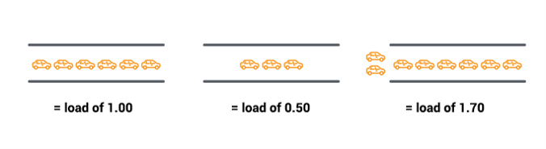
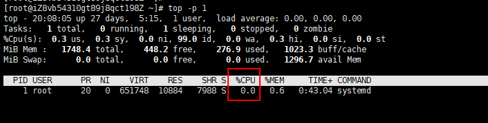
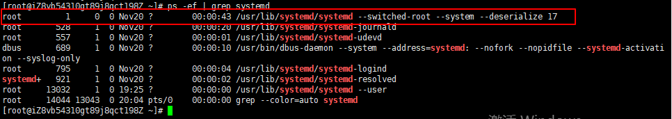

# Linux常用命令：性能命令
本文介绍Linux常用性能统计分析命令，监控进程或者系统性能。主要包括CPU（top、mpstat）、内存（vmstat、free）、I/O（iostat）、网络性能（sar）、系统日志信息（demsg）、查看进程状态（pidstat）。<!--more-->下面简要介绍这些命令的使用方法。

mpstat、iostat、pidstat和sr命令需要安装sysstat软件包，sysstat包含了系统性能监测工具，安装方法如下：
```bash
yum install sysstat # CentOS
sudo apt-get install sysstat # Ubuntu
```
## 负载
CPU负载（cpu load）指的是某个时间点进程对系统产生的压力。表示特定时间间隔内运行队列中的平均进程数，如果一个进程满足以下条件则其就会位于运行队列中:
* 它没有在等待IO操作的结果
* 它没有主动进入等待状态(也就是没有调用'wait')
* 没有被停止(例如：等待终止)

单CPU满负荷运行时cpu_load为1，当多个CPU或多核时，相当于大桥有多个车道，满负荷运行时cpu_load值为CPU数或多核数；CPU负载的计算（以单CPU为例），假设一分钟内执行10个任务代表满负荷，当一分钟给出30个任务时，CPU只能处理10个，剩余20个不能处理，cpu_load=3；

单核CPU
- cpu load = 1，满负载运行
- cpu load = 0.5，半负载运行
- cpu load = 1.7，超负载运行

一般来说，每个CPU内核当前活动进程数不大于3，则系统运行表现良好!
* 如果多核cpu，需要累加
    * 4核cpu<12
### uptime
uptime命令显示的平均负载包括了正在或准备运行在CPU上的进程和阻塞在不可中断睡眠状态(uninterruptible) I/O(通常是磁盘I/O)上的进程。
```bash
[root@server ~]# uptime
 16:54:53 up 29 days,  2:02,  1 user,  load average: 0.03, 0.03, 0.00
[root@server ~]# cat /proc/loadavg
0.03 0.03 0.00 3/166 16903
```
* 显示最近1分钟、5分钟、15分钟系统负载的移动平均值，它们共同展现了负载随时间变动的情况。
* 3：正在运行的进程数，166：总的进程数，16903：最近运行进程的ID。

## ps和top命令
### ps命令
ps命令是Process Status的缩写，用于查看系统进程信息
- -e，-A：显示所有进程，包括其他用户的进程
- -f：显示完整格式
- -l：显示长列表
- -a：所有进程，加上-x参数会显示没有控制终端的进程
- -u：username，显示指定用户的进程，例如ps -u root
- -x：显示当前用户在所有终端下的进程
- -aux：显示所有进程，包括所有用户，分组情况

ps常用用法，通常与grep组合使用

1. 显示dhcpd进程
```bash
ps ax | grep dhcpd | grep -v grep 
```
2. ps -ef
显示所有进程

3. ps -aux
显示所有进程
```bash
ps -aux
```
按照CPU或者内存用量来筛选进程：
```bash
ps -aux --sort -pcpu
# 或
ps -aux --sort -pmem
```
### 终止进程

```shell
# 强制中断正在执行的命令，如，命令长时间没有响应的情况下
Ctrl+C组合键

# kill命令
kill -9 进程ID
# killall命令：终止指定名称的所有进程
killall -9 dhclient
```

### top命令
ps命令列出的是当前进程的快照，top可用于持续监视系统性能，
动态显示进程信息。
* -n 获取多次cpu的执行情况，top -n 4：只更新4次
* -d 间隔时间，top -d 4：每隔4秒更新一次
* -p 获取指定端口进程的数据，top -p 22


每隔1秒检测指定进程的cpu，检测20次
 ```bash
top -d 1 -n 20
 ```

### 示例
打印指定pid进程的cpu信息，间隔时间为1s，打印20次

1. 查看进程的pid：
```bash
ps -ef | grep systemd
```

2. 循环打印
```bash
# 打印一次
top -p 1 -n 1 | grep systemd | awk '{print $10}'
# 循环打印20次
for i in {1..20};do top -p 1 -n 1 | grep systemd | awk '{print $10}';sleep 1s;done

for((i=0;i<20;i++));do top -p 1 -n 1 | grep systemd | awk '{print $10}';sleep 1s;done
```

## dmesg | tail
默认显示最新的10个系统信息，可以查看导致性能问题的错误信息。
### 1. 显示最新的20个系统信息
```bash
[root@centos7 ~]# dmesg | tail -20
[   15.356358] RPC: Registered named UNIX socket transport module.
[   15.356360] RPC: Registered udp transport module.
[   15.356361] RPC: Registered tcp transport module.
[   15.356362] RPC: Registered tcp NFSv4.1 backchannel transport module.
[   15.551529] type=1305 audit(1584428235.986:4): audit_pid=1054 old=0 auid=4294967295 ses=4294967295 subj=system_u:system_r:auditd_t:s0 res=1
[   19.223990] NET: Registered protocol family 40
[   23.857606] ip6_tables: (C) 2000-2006 Netfilter Core Team
[   24.130255] Ebtables v2.0 registered
[   24.366128] Netfilter messages via NETLINK v0.30.
[   24.418582] ip_set: protocol 7
[   24.517273] IPv6: ADDRCONF(NETDEV_UP): ens33: link is not ready
[   24.521156] e1000: ens33 NIC Link is Up 1000 Mbps Full Duplex, Flow Control: None
[   24.524658] IPv6: ADDRCONF(NETDEV_UP): ens33: link is not ready
[   24.524669] IPv6: ADDRCONF(NETDEV_CHANGE): ens33: link becomes ready
[   24.528687] IPv6: ADDRCONF(NETDEV_UP): ens34: link is not ready
[   24.532350] e1000: ens34 NIC Link is Up 1000 Mbps Full Duplex, Flow Control: None
[   24.535760] IPv6: ADDRCONF(NETDEV_UP): ens34: link is not ready
[   24.574912] IPv6: ADDRCONF(NETDEV_UP): ens34: link is not ready
[   25.391535] nf_conntrack version 0.5.0 (16384 buckets, 65536 max)
[   25.525351] IPv6: ADDRCONF(NETDEV_CHANGE): ens34: link becomes ready
[root@centos7 ~]#
```
### 2. 显示开始的20个系统信息
```bash
[root@centos7 ~]# dmesg | head -20
[    0.000000] Initializing cgroup subsys cpuset
[    0.000000] Initializing cgroup subsys cpu
[    0.000000] Initializing cgroup subsys cpuacct
[    0.000000] Linux version 3.10.0-1062.el7.x86_64 (mockbuild@kbuilder.bsys.centos.org) (gcc version 4.8.5 20150623 (Red Hat 4.8.5-36) (GCC) ) #1 SMP Wed Aug 7 18:08:02 UTC 2019
[    0.000000] Command line: BOOT_IMAGE=/vmlinuz-3.10.0-1062.el7.x86_64 root=UUID=d7dc0c9e-a27d-4239-aba4-7c2e51d9fc93 ro crashkernel=auto spectre_v2=retpoline rhgb quiet LANG=en_US.UTF-8
[    0.000000] Disabled fast string operations
[    0.000000] e820: BIOS-provided physical RAM map:
[    0.000000] BIOS-e820: [mem 0x0000000000000000-0x000000000009ebff] usable
[    0.000000] BIOS-e820: [mem 0x000000000009ec00-0x000000000009ffff] reserved
[    0.000000] BIOS-e820: [mem 0x00000000000dc000-0x00000000000fffff] reserved
[    0.000000] BIOS-e820: [mem 0x0000000000100000-0x000000007fedffff] usable
[    0.000000] BIOS-e820: [mem 0x000000007fee0000-0x000000007fefefff] ACPI data
[    0.000000] BIOS-e820: [mem 0x000000007feff000-0x000000007fefffff] ACPI NVS
[    0.000000] BIOS-e820: [mem 0x000000007ff00000-0x000000007fffffff] usable
[    0.000000] BIOS-e820: [mem 0x00000000f0000000-0x00000000f7ffffff] reserved
[    0.000000] BIOS-e820: [mem 0x00000000fec00000-0x00000000fec0ffff] reserved
[    0.000000] BIOS-e820: [mem 0x00000000fee00000-0x00000000fee00fff] reserved
[    0.000000] BIOS-e820: [mem 0x00000000fffe0000-0x00000000ffffffff] reserved
[    0.000000] NX (Execute Disable) protection: active
[    0.000000] SMBIOS 2.7 present.
[root@centos7 ~]#
```

## vmstat 1
全称 virtual memory stat，逐行输出虚拟内存状态统计信息
```bash
[root@centos7 ~]# vmstat
procs -----------memory---------- ---swap-- -----io---- -system-- ------cpu-----
r  b   swpd   free   buff  cache   si   so    bi    bo   in   cs us sy id wa st
1  0      0 1424832   2084 195100    0    0    47     4   45   55  0  0 99  1  0
```
`vmstat 1` ：每隔一秒打印一次
```bash
[root@centos7 ~]#
[root@centos7 ~]# vmstat 1   #1s打印一个
procs -----------memory---------- ---swap-- -----io---- -system-- ------cpu-----
r  b   swpd   free   buff  cache   si   so    bi    bo   in   cs us sy id wa st
1  0      0 1424472   2084 195120    0    0    28     2   30   37  0  0 99  1  0
0  0      0 1424456   2084 195120    0    0     0     0   38   53  0  0 100  0  0
0  0      0 1424456   2084 
```

参数解释：
* r: 运行队列中进程数量
* b: 等待IO的进程数量
* swpd：使用的虚拟内存
* free：可用内存
* buff：用作缓冲的内存大小
* cache：用作缓存的内存大小
* us：用户进程执行时间(user time)
* sy：系统进程执行时间(system time
* id：空闲时间(包括IO等待时间)，中央处理器的空闲时间
* wa：等待IO时间

## free -m
查看linux内存使用情况
```bash
[root@centos7 ~]# free -m
              total        used        free      shared  buff/cache   available
Mem:           1819         199        1471           9         148        1470
Swap:          4095           0        4095
```
* Mem：物理内存  
* totel：总的物理内存 单位为：M    
* used：用掉的内存
* free：空闲的物理内存
* shared：共享内存
* buff/cache：缓存内存

## mpstat -P ALL 1
mpstat是Multiprocessor Statistics的缩写，实时监控CPU性能。
`mpstat -P ALL 1 2`：间隔1s打印报告，共打印2个
* -P ALL：监控所有CPU
* 1：间隔时间1s
* 2：打印次数2次

```bash
[root@centos7 ~]# mpstat
Linux 3.10.0-1062.el7.x86_64 (centos7)  03/18/2020      _x86_64_        (4 CPU)

04:41:47 AM  CPU    %usr   %nice    %sys %iowait    %irq   %soft  %steal  %guest  %gnice   %idle
04:41:47 AM  all    0.66    0.00    1.39    2.65    0.00    0.01    0.00    0.00    0.00   95.28
[root@centos7 ~]#
[root@centos7 ~]# mpstat -P ALL 1
Linux 3.10.0-1062.el7.x86_64 (centos7)  03/18/2020      _x86_64_        (4 CPU)

04:44:11 AM  CPU    %usr   %nice    %sys %iowait    %irq   %soft  %steal  %guest  %gnice   %idle
04:44:11 AM  all    0.39    0.00    0.82    1.54    0.00    0.01    0.00    0.00    0.00   97.24
04:44:11 
[root@centos7 ~]#
```

* %usr：间隔时间段内，用户态的CPU时间（%），不包含 nice值为负进程
* %nice：nice值为负进程的CPU时间（%）
* %sys：核心时间（%）
* %iowait：硬盘IO等待时间（%）
* %irq：硬中断时间（%）
* %soft：软中断时间（%）
* %steal：虚拟机管理器在服务另一个虚拟处理器时虚拟CPU处在非自愿等待下花费时间的百分比
* %guest：运行虚拟处理器时CPU花费时间的百分比	
* %idle：CPU的空闲时间（%）


## pidstat 1
pidstat用于监控全部或指定进程的资源占用情况，和top命令类似，但不覆盖输出，有利于观察数据随时间的变动情况，top会覆盖之前的输出
* `pidstat -p 1 1`：-p 指定进程号，间隔1s打印pid为1的进程
```bash
[root@centos7 ~]# pidstat
Linux 3.10.0-1062.el7.x86_64 (centos7)  03/18/2020      _x86_64_        (4 CPU)


04:52:29 AM   UID       PID    %usr %system  %guest    %CPU   CPU  Command
04:52:29 AM     0         1    0.05    0.19    0.00    0.24     0  systemd
04:52:29 AM     0         2    0.00    0.00    0.00    0.00     3  kthreadd
04:52:29 AM     0         6    0.00    0.00    0.00    0.00     0  ksoftirqd/0
04:52:29 
```
* PID：进程ID
* %usr：进程在用户空间占用cpu的百分比
* %system：进程在内核空间占用cpu的百分比
* %guest：进程在虚拟机占用cpu的百分比
* %CPU：进程占用cpu的百分比，各个CPU上的使用量的总和
* CPU：处理进程的cpu编号
* Command：当前进程对应的命令

## iostat 1
iostat用于显示CPU和块设备（磁盘I/O）相关的统计信息

```bash
[root@centos7 ~]# iostat 1
Linux 3.10.0-1062.el7.x86_64 (centos7)  03/18/2020      _x86_64_        (4 CPU)

avg-cpu:  %user   %nice %system %iowait  %steal   %idle
           0.15    0.00    0.34    0.60    0.00   98.92


Device:            tps    kB_read/s    kB_wrtn/s    kB_read    kB_wrtn
sda               9.46       158.59        15.05     142895      13561
scd0              0.02         1.14         0.00       1028          0
```
avg-cpu：总体cpu使用情况统计信息
linux各种设备文件在/dev目录下可以看到
* tps：每秒进程向磁盘设备下发的IO读、写请求数量
* kB_read/s：每秒从驱动器读入的数据量
* kB_wrtn/s：每秒从驱动器写入的数据量
* kB read：读入数据总量
* kB wrtn：写入数据总量


## sar命令
sar（System ActivityReporter）：系统活动情况报告，
是Linux系统性能分析工具。可以用来分析磁盘I/O、CPU效率、内存使用等，下面介绍它的分析网络性能用法。
### sar -n DEV 1
检查网络流量的工作负载，可用来检查网络流量是否已经达到限额。
```bash
[root@centos7 dev]# sar -n DEV 1
Linux 4.18.0-147.5.1.el8_1.x86_64 (iZ8vb54310gt89j8qct198Z)     12/19/2020      _x86_64_        (1 CPU)

08:08:37 PM     IFACE   rxpck/s   txpck/s    rxkB/s    txkB/s   rxcmp/s   txcmp/s  rxmcst/s   %ifutil
08:08:38 PM      eth0      4.00      2.00      0.23      0.27      0.00      0.00      0.00      0.00
08:08:38 PM        lo      0.00      0.00      0.00      0.00      0.00      0.00      0.00      0.00
08:08:38 PM   docker0      0.00      0.00      0.00      0.00      0.00      0.00      0.00      0.00
```
### sar -n TCP 1
显示TCP连接情况，可用来描述系统负载
```bash
[root@centos7 dev]# sar -n TCP,ETCP 1
Linux 4.18.0-147.5.1.el8_1.x86_64 (iZ8vb54310gt89j8qct198Z)     12/19/2020      _x86_64_        (1 CPU)

08:15:48 PM  active/s passive/s    iseg/s    oseg/s
08:15:49 PM      0.00      0.00      1.00      1.00

08:15:48 PM  atmptf/s  estres/s retrans/s isegerr/s   orsts/s
08:15:49 PM      0.00      0.00      0.00      0.00      0.00
```

- active/s：主动连接数，本地每秒创建的TCP连接数
- passive/s：被动连接数，远程每秒创建的TCP连接数
- retrans/s：每秒TCP重传次数


