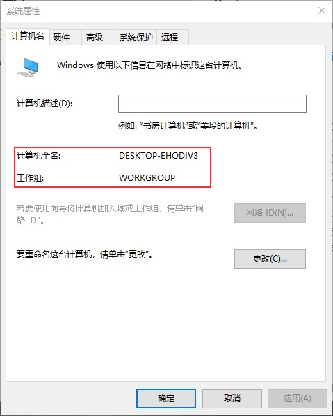
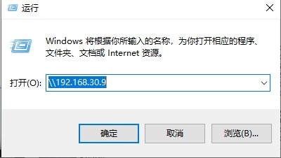
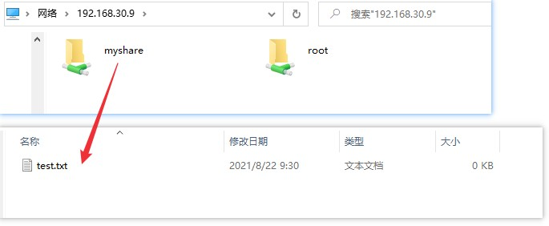

# 使用samba实现linux和windows文件共享
Samba是用于Linux/Unix系统与Windows之间共享文件的软件，本文记录一下Samba的安装及使用方法。

<!--more-->

## samba简介

samba的功能都是通过一个CIFS（Common Internet File System）协议套件来管理的，这个名字是由微软引入的。

Samba是一个开源的CIFS实现，官网地址为 [https://www.samba.org/samba/](https://www.samba.org/samba/)。

SMB (Server Message Block Protocol)协议是一种客户端/服务器通信协议，它主要包括smbd 和 nmbd，提供四种基本服务：

1. 文件、打印服务：由SMB守护进程smbd提供
2. 验证和授权：“共享模式”和“用户模式”
3. 域解析：模拟Windows NT域系统，主要包括广播和点对点两种形式，还有一种是使用NBNS (**N**et**B**IOS **N**ame **S**ervice)服务器，微软称为WINS服务(**W**indows **I**nternet **N**ame **S**ervice)
4. 服务声明(浏览)：声明网络上计算机提供的可浏览服务(文件和打印共享)列表。

前两个服务由smbd实现，后两个由nmbd来实现。


## samba安装

centos7：

```bash
sudo yum install -y samba
sudo yum install -y samba-client
```

ubuntu：

```go
sudo apt update
sudo apt install samba
sudo apt install samba-client
```

smbclient是一个smb服务器的客户端管理程序。

查看安装状态
```bash
$ whereis samba
samba: /usr/lib64/samba /etc/samba /usr/libexec/samba /usr/share/man/man7/samba.7.gz
$ rpm -qa | grep samba
samba-common-4.10.16-15.el7_9.noarch
samba-client-4.10.16-15.el7_9.x86_64
samba-client-libs-4.10.16-15.el7_9.x86_64
samba-common-libs-4.10.16-15.el7_9.x86_64
samba-libs-4.10.16-15.el7_9.x86_64
samba-common-tools-4.10.16-15.el7_9.x86_64
samba-4.10.16-15.el7_9.x86_64
$ smbd --version
Version 4.10.16
```

## samba配置
### 1. 查看windows工作组
通过cmd命令 `net config workstation` 查看工作组：
```bash
C:\Users\10287>net config workstation
计算机名                     \\DESKTOP-EHODIV3
计算机全名                   DESKTOP-EHODIV3
用户名                       Administrator

工作站正运行于
        NetBT_Tcpip_{E484BACB-E20F-47EB-8727-EF799C2C041E} (0A0027000016)

软件版本                     Windows 10 Home China

工作站域                     WORKGROUP
登录域                       DESKTOP-EHODIV3

COM 打开超时 (秒)            0
COM 发送计数 (字节)          16
COM 发送超时 (毫秒)          250
命令成功完成。

```
或者查看系统属性：此电脑 -> 属性 -> 高级系统设置 -> 计算机名 查看工作组


### 2. 关闭防火墙

配置之前先关闭linux防火墙

查看防⽕火墙状态   
```sh
systemctl status firewalld
systemctl status firewalld.service
```

停⽌止firewall  
```sh
systemctl stop firewalld.service
```

禁止firewall开机启动  
```sh
systemctl disable firewalld.service 
```

```go
[root@Server apTest]# systemctl start smb.service
[root@Server apTest]# 
[root@Server apTest]# 
[root@Server apTest]# netstat -antpu| grep smb
tcp        0      0 0.0.0.0:139             0.0.0.0:*               LISTEN      5164/smbd           
tcp        0      0 0.0.0.0:445             0.0.0.0:*               LISTEN      5164/smbd           
tcp6       0      0 :::139                  :::*                    LISTEN      5164/smbd           
tcp6       0      0 :::445                  :::*                    LISTEN      5164/smbd           
[root@Server apTest]# 
```

关闭selinux

vi /etc/selinux/config

注释SELINUX=enforcing，添加SELINUX=disabled

```sh
# This file controls the state of SELinux on the system.
# SELINUX= can take one of these three values:
#     enforcing - SELinux security policy is enforced.
#     permissive - SELinux prints warnings instead of enforcing.
#     disabled - No SELinux policy is loaded.
# SELINUX=enforcing
SELINUX=disabled
# SELINUXTYPE= can take one of three values:
#     targeted - Targeted processes are protected,
#     minimum - Modification of targeted policy. Only selected processes are protected.
#     mls - Multi Level Security protection.
SELINUXTYPE=targeted
```

### 3. 修改配置文件

先创建一个共享目录或者使用已有的目录。

```bash
$ mkdir -p /var/samba/share
$ touch /var/samba/share/test.txt

```

配置读写权限

```bash
chmod -R 777 /var/samba
```

配置smb.conf文件：`vi /etc/samba/smb.conf `

添加的共享名为myshare，这个名称是windows访问时会显示的名称，可以随意设置。

```sh
[global]
        workgroup = WORKGROUP
        security = user

        passdb backend = tdbsam

        printing = cups
        printcap name = cups
        load printers = yes
        cups options = raw

[homes]
        comment = Home Directories
        valid users = %S, %D%w%S
        browseable = No
        read only = No
        inherit acls = Yes

[printers]
        comment = All Printers
        path = /var/tmp
        printable = Yes
        create mask = 0600
        browseable = No

[print$]
        comment = Printer Drivers
        path = /var/lib/samba/drivers
        write list = @printadmin root
        force group = @printadmin
        create mask = 0664
        directory mask = 0775

[myshare]
		comment = my server share dir
		path = /var/samba/share
		public = yes
		writable = yes
		browseable = yes
		guest ok = yes
		guest only = yes
		read only = no
        
        
```

### 4. 配置samba登录用户密码

可以使用`groupadd` 和 `useradd`命令添加用户组，下面我直接使用root用户：
```bash
$ smbpasswd -a root
New SMB password:
Retype new SMB password:
Added user root.

```
新输的密码就是远程登录密码。


### 5. 启动服务

配置文件设置完成后启动samba服务，并设置开机启动

启动 *smb.service* 和 *nmb.service*两个服务

```bash
systemctl start smb.service
systemctl start nmb.service
```

> 重启smb服务命令：`systemctl restart smb.service`


设置开机启动

```bash
systemctl enable smb.service
systemctl enable nmb.service
```

### 6. windows访问共享文件

win + r 输入samba服务器地址，访问samba共享文件


也可以在文件浏览器中输入地址 `\\192.168.30.9` 访问共享文件。

输入用户名密码后就可以访问Linux共享文件了！


可以对myshare中的文件进行读写操作以及文件创建。

## smbclient使用

samba-client是linux中的客户端管理程序，如果要在linux/unix中访问samba文件可以使用smbclient工具。

### 登录samba服务器

```bash
$ smbclient //192.168.30.9/myshare
Enter SAMBA\root's password: 
Try "help" to get a list of possible commands.
smb: \> 
```

或者

```bash
$ smbclient //192.168.30.9/myshare/ -U root%12345678
Try "help" to get a list of possible commands.
smb: \> 
```

登录成功后就可以对共享文件进行访问了：

```bash
smb: \> ls
  .                                   D        0  Sun Aug 22 10:17:09 2021
  ..                                  D        0  Sun Aug 22 09:03:44 2021
  test.txt                            N        0  Sun Aug 22 09:30:59 2021

                60273916 blocks of size 1024. 52785976 blocks available
smb: \> 
```


### 下载

下载文件：

```bash
smb: \> get test.txt /root/samba/test.txt
getting file \test.txt of size 0 as /root/samba/test.txt (0.0 KiloBytes/sec) (average 0.0 KiloBytes/sec)
smb: \> 
```

```sh
$ ll /root/samba/
total 0
-rw-r--r--. 1 root root 0 Aug 22 10:39 test.txt
```

指定日志存放目录

```bash
get test.txt /root/samba/test.txt -l /tmp/smb/smbalog
```

下载目录：

```bash
$ smbclient //192.168.30.9/myshare/ -U root%12345678 -c 'prompt OFF; recurse ON; cd /sambafolder/; lcd /tmp/smb/localfolder/; mget *' -l /tmp/smb/smbalog
```

### 上传

上传文件

```bash
smb: \> put /root/samba/test.txt test.txt
```

上传目录

```bash
$ smbclient //192.168.30.9/myshare/ -U root%12345678 -c 'prompt OFF; recurse ON; cd /sambafolder/; lcd /tmp/smb/localfolder/; mput *' -l /tmp/smb/smbalog
```

更多smbclient使用方法参考：[https://www.samba.org/samba/docs/current/man-html/smbclient.1.html](https://www.samba.org/samba/docs/current/man-html/smbclient.1.html)

**参考文档：**

1. [https://www.liquidweb.com/kb/how-to-install-samba-on-linux-windows/](https://www.liquidweb.com/kb/how-to-install-samba-on-linux-windows/)
2. [https://www.samba.org/samba/docs/SambaIntro.html](https://www.samba.org/samba/docs/SambaIntro.html)


