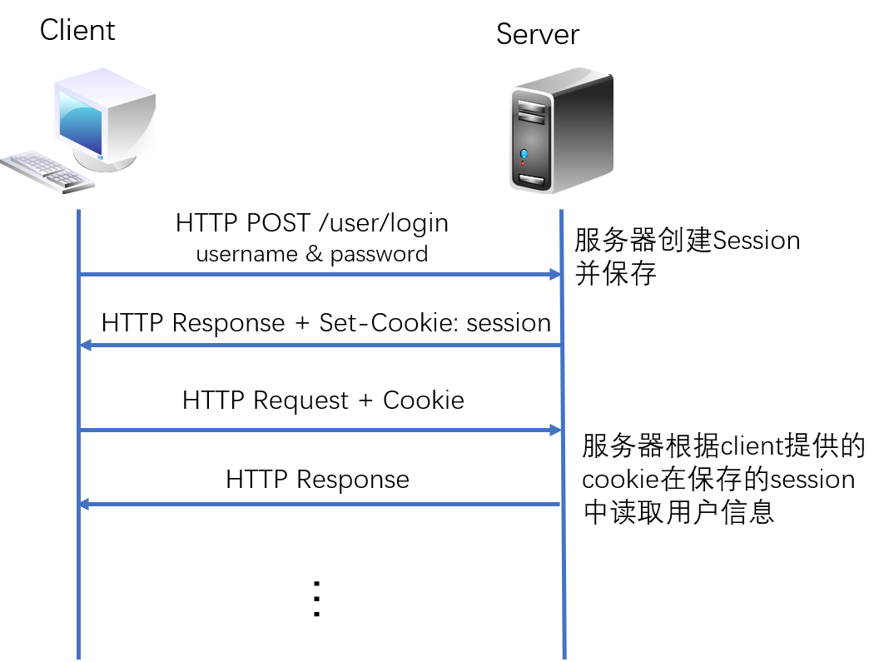
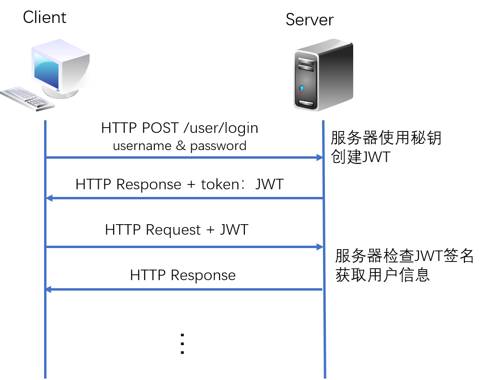
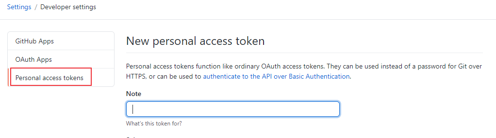

# Session、Cookie和Token介绍
HTTP是一个无状态无连接的协议，无状态指服务器不知道客户端的状态，比如使用用户名密码认证成功后，在下一次的请求中，服务器不知道用户是谁，如果需要后续服务，需要进行重新认证。然而，在某些场景，我们需要保存某些状态，比如在购物网站进行商品购买时，在某个域名下浏览多个网页，选择多个商品，这种情况下需要保存已加入购物车的商品信息，在需要支付时，也要保存用户认证信息。为了实现保存用户登录状态，可以使用session或者token解决HTTP协议的无状态特性。

无连接指客户端与服务器之间的HTTP连接是一种一次性连接，每次连接只处理一个请求。服务器处理完客户端的请求后断开连接，下次请求再重新建立连接。如果网页内容比较复杂，需要请求大量资源的情况下使用无连接的方式会很低效。HTTP/1.0版本新增了 keep-alive 字段，可以让连接保持一段时间。

下面介绍解决HTTP无状态和无连接这两种特性的技术方法。

<!--more-->

## session认证

### session认证过程

session用于记录服务器和客户端之间的会话状态，下面以用户认证为例介绍session连接过程：



* client发送post请求到server端
* server端接收到请求并认证通过后建立一个session，HTTP响应中包含Set-Cookie头部（包括了一个sessionId）
* client再次发送请求时请求头中携带了cookie
* 服务器根据cookie值来验证client信息（根据sessionId与保存的session进行比较来验证用户身份），并对client进行响应。

### cookie与session的区别

* cookie是实现session的其中一种方案，session可以基于 cookie，也可以基于 query参数。
* cookie存储在客户端，客户端（浏览器）接受服务器的Set -Cookie指令，并把 cookie保存到电脑上。
* session存储在服务端，只把关联数据的一个加密串放到 cookie中标记
* 根据他们的存储位置，session相对来说更加安全。

## Token认证

### Token认证过程

Token认证是另外一种常用的身份认证方式，相比session更加安全，比较常用的Token认证方案是JSON Web Token（JWT），是一种基于 JSON 的开放标准（[RFC 7519](https://tools.ietf.org/html/rfc7519)），客户端和服务器之间使用JSON对象进行安全信息传输，信息进行数字签名，可以使用私钥（HMAC算法）或者公钥/私钥对（RSA算法）进行签名。Token认证过程可以简单描述如下：



* client发送post请求到server端
* server端使用秘钥创建JWT并将JWT发送给client
* client本地保存JWT，client在每次请求的请求头中携带JWT
* server端验证JWT并响应

在token认证中，可以凭借认证信息生成 token，也可以通过后台配置token，比如配置github的token：



常用的token认证header使用Bearer 模式：`Authorization: Bearer <token>`，比如Github:
```sh
$ curl -H "Authorization: Bearer TOKEN" https://api.github.com/user
```

### session与token的区别

* token是一个用户请求时附带的请求字段，用于验证身份与权限，不存储在服务器上。
* token 安全性比 Session 要好，因为token每一个请求都有数字签名，Session 仅通过sessionId进行简单认证。
* 大多web应用和移动设备身份验证使用token进行身份认证，android原生系统不支持cookie。

## keep-alive
现在已经大致了解了session和token这两种认证方式，那么HTML 页面加载流程是什么呢？在开头提到过，HTTP是一个无状态无连接的协议，无连接不代表不建立连接，也不是说使用UDP协议（无连接）。HTTP是应用层协议，传输层使用TCP协议，在进行认证之前需要进行TCP连接，也就是三次握手。

HTML 页面加载、解析流程大致如下：

1. 浏览器向服务器发起请求，浏览器先查询本地（浏览器或者本机）DNS缓存，如果没有，向DNS 服务器发起 域名解析请求
2. 浏览器拿到域名对应的IP地址后，建立与服务器的 TCP/IP 连接（3次握手，断开连接进行4次挥手）
3. 浏览器向服务器发送 HTTP / HTTPs 请求，服务器进行后台内部处理，进行HTTP响应，返回状态和浏览器请求的内容。session和token认证过程就在这一步完成。
4. 浏览器接收到HTTP数据包后进行解析
    * 解析HTML页面代码，遇到静态资源（js、css、图片等）则向服务器发起请求。
    * 从上到下进行加载、渲染，下载和渲染同时进行
    * js文件的加载会阻塞HTML内容的加载
    * CSS样式表下载完成之后会跟之前的样式表一起进行解析，会对之前的元素重新渲染

上面的步骤中提到了静态资源的请求，在HTTP/0.9版本中使用**短连接**，发送完 HTTP 的响应之后，服务器就会断开 TCP 连接，遇到需要请求资源时，浏览器会重新建立一个HTTP会话，也就是重复第一步，这就是HTTP的**无连接**特征。为了解决无连接问题，HTTP/1.0版本新增了 keep-alive 字段（长连接，不过默认还是短连接），HTTP/1.1默认开启长连接。

长连接表示在完成HTTP 请求之后，不断开TCP 连接，这样之后发送 HTTP 请求就不需要重新建立 TCP 连接了。在请求头中加入了`Connection: keep-alive` 字段，当然，实现长连接需要客户端和服务端都支持，如果不希望使用长连接，在请求头中加上`Connection: close`。长连接不会永久保持，一般会有一个超时时间，某些服务器还会设置一个最大请求次数，如果超过就断开连接。

短连接适用于网页浏览等数据刷新频度较低的场景。**长连接**多用于操作频繁，点对点的通讯，而且连接数不能太多情况。例如：聊天室，实时游戏等场景，即时通讯（QQ）般使用的都是长连接，但并不是永久连接。


