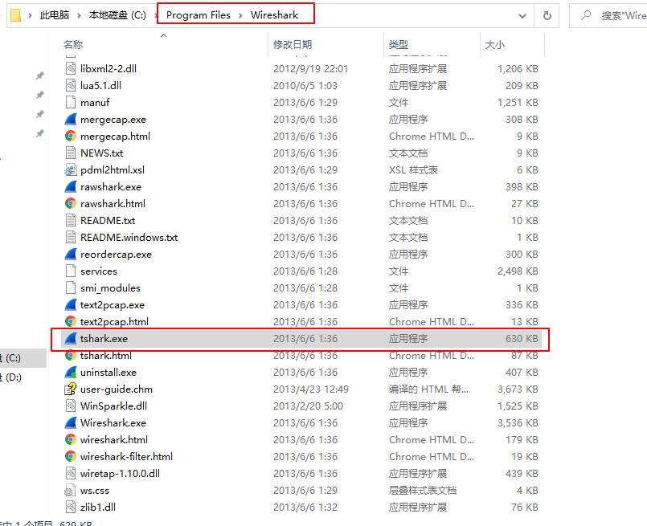
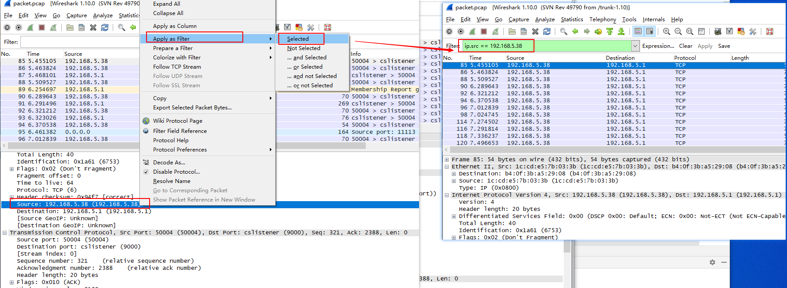
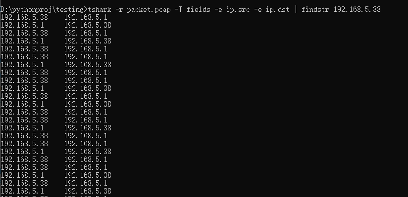

# 使用tshark命令解析tcpdump抓取的数据包

有时候需要在linux系统或者ARM开发板中进行抓包，使用tcpdump抓包更加方便，在这种场景下，一般使用tcpdump进行抓包，然后在Windows中使用wireshark来分析生成的包文件，在自动化分析或者自动化测试中，可以使用tshark来进行包解析。本文介绍使用tcpdump抓取报文后使用tshark进行报文解析。

## 安装
wireshark下载安装
wireshark官网：[https://www.wireshark.org/download.html](https://www.wireshark.org/download.html)

```bash
# linux
yum -y install wireshark
yum -y install tcpdump
```
帮助信息
```bash
$ tcpdump -h
```
查看可用端口：
```bash
$ tcpdump -D
1.ens33
2.ens37
3.veth2424bf4
4.any (Pseudo-device that captures on all interfaces)
5.lo [Loopback]
```
## tcpdump
tcpdump官方文档：[https://www.tcpdump.org/index.html#documentation](https://www.tcpdump.org/index.html#documentation)

### 常用参数
* `-i interface` ：指定抓包接口，`tcpdump -i eth1`
* `-c count`：抓取包个数，`tcpdump -c 5 -i eth0` 仅抓取5个包
* `-w file`：保存
* `-A`：ASCII码形式打印报文
* `-XX`：HEX 和 ASCII形式显示报文

### 抓包
抓取eth1网卡数据包，数据写入文件/tmp/packet.pcap
```shell
tcpdump -i eth1 -w /tmp/packet.pcap  >/dev/null 2>&1 &
```
其中
- \>/dev/null：将标准输出（控制台输出）重定向到/dev/null中，/dev/null代表 linux 的空设备文件。表示不输出内容
- 2>&1：重定向绑定，错误输出（2）和标准输出（1）输出到同一个地方
- \>/dev/null 2>&1的作用就是丢弃标准输出和错误输出，不会输出任何信息到控制台。

也可以只抓取特定协议的报文，比如过滤tcp报文：
```bash
tcpdump -i eth1 tcp
```
抓取指定端口的报文
```bash
tcpdump -i eth1 port 22
```
抓取指定源IP的报文
```bash
tcpdump -i src 192.168.0.1
```
抓取指定目的IP的报文
```bash
tcpdump -i dst 192.168.0.1
```

### 停止抓包
如果没有限制 tcpdump 抓包的数量（-c 参数），tcpdump 会持续抓包。可以通过 Ctrl+C 来停止抓包，或者杀掉tcpdump进程：
```bash
killall -9 tcpdump
```
杀掉tcpdump进程后会停止抓包。

### 读取报文
```bash
$ tcpdump -r packet.pcap
reading from file packet.pcap, link-type EN10MB (Ethernet)
20:47:07.732570 IP 192.168.2.103.53074 > 69.173.159.48.https: Flags [F.], seq 2534329882, ack 3470120544, win 1027, length 0
20:47:08.789990 IP 192.168.2.103.50544 > tm-in-f188.1e100.net.https: Flags [.], seq 708023523:708023524, ack 4093529409, win 1027, length 1
20:47:09.037350 IP tm-in-f188.1e100.net.https > 192.168.2.103.50544: Flags [.], ack 1, win 265, options [nop,nop,sack 1 {0:1}], length 0
20:47:09.195077 IP 192.168.2.103.50920 > 118.178.135.232.https: Flags [P.], seq 1760992480:1760992516, ack 2403978898, win 1023, length 36
20:47:09.222742 IP 118.178.135.232.https > 192.168.2.103.50920: Flags [P.], seq 1:62, ack 36, win 1024, length 61
```

## tshark
抓包完成后对数据包进行解析，下面介绍使用tshark解析数据包。
### tshark工具介绍
tshark参考文档：[https://www.wireshark.org/docs/man-pages/tshark.html](https://www.wireshark.org/docs/man-pages/tshark.html)

如果要在windows命令行窗口使用tshark需要将Wireshark安装路径 C:\Program Files\Wireshark 添加到环境变量。


查看帮助信息：
```bash
$ tshark -h
```
列出可用网卡接口：
```bash
$ tshark -D
1. \Device\NPF_{4B48290B-6C8B-4A93-A942-A7E565B02F09} (Npcap Loopback Adapter)
2. \Device\NPF_{D8F1F103-9733-422C-A521-77C678EEAFFC} (WLAN)
3. \Device\NPF_{AB52B03B-45ED-43C9-B88F-C7499A78AED0} (kc)
4. \Device\NPF_{64EA0097-AE33-49AD-9F42-959017C397FA} (WAN)
5. \Device\NPF_{257F23D0-E615-4656-AB32-5338DB62843C} (以太网 2)
6. \Device\NPF_{B5376652-68BB-45DA-A822-086E401773BB} (本地连接* 10)
```
前面提到过`tcpdump -D`也可以列出网卡信息，功能类似于Linux中的`netstat -i` 、`ifconfig -a`和`ip link`命令查看网卡接口信息。在windows中，除了在网络连接中查看网卡信息以外，也可以在命令行中通过如下命令查看：
- `ipconfig (/all)`
- `wmic nic list brief`


Linux系统和windows系统tshark使用方法一样

### tshark命令抓包
常用参数：
* `-i | --interface <capture interface>` ：指定抓包接口
* `-f <capture filter>`：抓包过滤，BPF(Berkeley Packet Filter)过滤规则，tcpdump和scapy(filter参数)都使用这个过滤规则，参考[Python Scapy 报文构造和解析](https://blog.csdn.net/u010698107/article/details/113825143)。
* `-w <outfile>`：将数据包写入文件
* `-O <protocols>`：打印数据包详细信息
* `-V`：打印数据包详细视图
* `-P`：写入文件过程中，打印数据包简略信息
* `-c <capture packet count>`：设置抓取最大的包个数
* `-a|--autostop <autostop condition>`：duration:5—5秒后停止抓包；files:2—写了2个文件后停止；filesize:100—包大小达到100KB后停止， 

tshark抓包示例：
```bash
$ tshark -i "WLAN" -f "tcp port 80" -w "test.pcap"
$ tshark -i "WLAN" -f "tcp port 80" -w "test.pcap" -P -a duration:10
Capturing on 'WLAN'
15   0.000000 08:ed:ed:3e:9e:f3 -> Broadcast    ARP 60 Who has 192.168.1.1?  Tell 192.168.1.244
  0.001051 fe80::4983:bddb:14e0:f9c4 -> ff02::1:2    DHCPv6 157 Solicit XID: 0xd2726a CID: 00010001272da3902c534a01104e
  0.065122 TendaTec_21:73:e1 -> Broadcast    ARP 60 Who has 192.168.1.1?  Tell 192.168.1.126
省略......
$ capinfos test.pcap
File name:           test.pcap
File type:           Wireshark - pcapng
File encapsulation:  Ethernet
Packet size limit:   file hdr: (not set)
Number of packets:   155
File size:           29 kB
Data size:           23 kB
Capture duration:    9 seconds
Start time:          Sun Apr 25 16:44:23 2021
End time:            Sun Apr 25 16:44:33 2021
Data byte rate:      2595 bytes/s
Data bit rate:       20 kbps
Average packet size: 153.96 bytes
Average packet rate: 16 packets/sec
SHA1:                2b4a555a362301156ff26a7f295b4d609dd97a33
RIPEMD160:           e34a63f4bcfe805d220f73dea78a8f4b63074a80
MD5:                 cc560fd267886a596ed72397a73625e3
Strict time order:   True
```

### tshark解析数据包
常用参数：
* `-r`：指定需要解析的数据包
* `-T`：指定数据包解析输出格式，支持格式见[解码所有数据](#解码所有数据)，这里介绍 `-T fields`，一般与`-e` 选项连用。
* `-e`：指定过滤的字段
* `-E`：可用于指定分隔符：` separator=,`：默认分隔符为缩进（\t）
* `-Y`：过滤指定报文

```shell
tshark [ -r <infile> ]  -T fields [ -e <field> ] -E <field print option> -Y <displaY filter>
tshark -r packet.pcap -T fields -e 解析的字段 -E separator=,
```
需要解析的字段可以通过Wireshark查看：
选择要过滤的内容 -> 右键 -> Apply as Filter -> Selected


例1：过滤具有源IP和目的IP字段的所有报文
```bash
tshark -r packet.pcap -T fields -e ip.src -e ip.dst 
```
例2：过滤源地址为fe80::ca3a:35ff:fe09:efa1的报文，并读取UDP源端口号和IPv6目的地址。
```bash
$ tshark -r packet.pcap -T fields  -E separator=, -Y ipv6.src==fe80::ca3a:35ff:fe09:efa1 -e udp.srcport -e ipv6.dst
,ff02::2
,ff02::2
,ff02::16
546,ff02::1:2
546,ff02::1:2
546,ff02::1:2
546,ff02::1:2
$ 
```
**注意**：`-Y`参数中，多个条件用`||`，`&&`，`and`或者`or`连接，如果使用多个`-Y`参数，只有最后一个生效，下面过滤源地址为fe80::ca3a:35ff:fe09:efa1的DHCPv6 Solicit报文：
```bash
$ tshark -r packet.pcap -T fields  -E separator=, -Y dhcpv6.msgtype==1 -Y ipv6.src==fe80::ca3a:35ff:fe09:efa1 -e udp.srcport -e ipv6.dst
,ff02::2
,ff02::2
,ff02::16
546,ff02::1:2
546,ff02::1:2
546,ff02::1:2
546,ff02::1:2
$ tshark -r packet1.pcap -T fields  -E separator=, -Y "dhcpv6.msgtype==1 and ipv6.src==fe80::ca3a:35ff:fe09:efa1" -e udp.srcport -e ipv6.dst
546,ff02::1:2
546,ff02::1:2
546,ff02::1:2
546,ff02::1:2
```

过滤完成后进行进一步的分析
比如可以使用grep命令进一步提取满足条件的报文
过滤源地址或者目的地址为192.168.5.38的报文
```bash
# linux
tshark -r packet.pcap -T fields -e ip.src -e ip.dst | grep 192.168.5.38 
# windows
tshark -r packet.pcap -T fields -e ip.src -e ip.dst | findstr 192.168.5.38 
```


也可以使用python、Java等高级语言进行进一步的分析，Python示例如下：
```python
result = os.popen("tshark -r packet.pcap -T fields -e ip.src -e ip.dst“)
ret = result.read() # 
for i, value in enumerate(ret.split("\n")):
	# 处理value值
	pass
```
### 解码所有数据
某些字段可能无法使用tshark过滤，这种情况下，可以先将pcap文件解码，tshark支持如下文件格式：
```bash
ek|fields|json|jsonraw|pdml|ps|psml|tabs|text
```
解码成xml和text格式文件：
```bash
tshark -r packet.pcap -V -T pdml > packet.xml
tshark -r packet.pcap -V -T text > packet.txt
```
-  -V：输出数据包详细信息
-  -T pdml：指定数据包解码输出格式为xml格式


xml文档可以使用python的ElementTree工具解析：
```python
try:
    import xml.etree.cElementTree as ET
except ImportError:
    import xml.etree.ElementTree as ET
```

## 问题：windows tshark命令无效
系统：windows10
tshark已加入环境变量中
输入tshark，显示：
```bash
C:\Users\DELL>tshark
The NPF driver isn't running.  You may have trouble capturing or
listing interfaces.
Capturing on '鏈湴杩炴帴* 9'
```

WIreshark安装需要安装WinPcap，查看电脑已经安装了WinPcap。

接下来以管理员身份运行命令行串口，输入`net start npf` 启动NPF，出现如下报错信息：
```shell
C:\WINDOWS\system32>net start npf
服务名无效。

请键入 NET HELPMSG 2185 以获得更多的帮助。
```

卸载WinPcap10，下载安装winpcap4.1.3：[https://www.winpcap.org/install/default.htm](https://www.winpcap.org/install/default.htm)

重新输入`net start npf` 启动NPF：
```bash
C:\WINDOWS\system32>net start npf
请求的服务已经启动。

请键入 NET HELPMSG 2182 以获得更多的帮助。
```
启动成功！
tshark命令也可以正常使用了


