# TCP/IP协议架构介绍（四）：应用层
本文介绍应用层相关协议

<!--more-->


数据：**报文**

## FTP
文件传输协议FTP(File Transfer Protocol)：**TCP20**，**21**
FTP协议包括两个组成部分：FTP服务器和FTP客户端
### FTP传输模式
FTP支持两种模式，一种方式叫做Standard (也就是 PORT方式，主动方式)，一种是 Passive(也就是PASV，被动方式)。 
* Standard模式：FTP的客户端发送 PORT 命令到FTP服务器
* Passive模式：FTP的客户端发送 PASV命令到 FTP服务器
* 默认情况下FTP协议使用TCP端口中的 20和21这两个端口，其中20用于传输数据，21用于传输控制信息
* 但是，是否使用20作为传输数据的端口与FTP使用的传输模式有关
* 如果采用主动模式，那么数据传输端口就是20
* 如果采用被动模式，则具体最终使用哪个端口要服务器端和客户端协商决定

**Port**

* FTP **客户端**首先和FTP**服务器**的**TCP 21**端口建立连接，通过这个通道发送命令
* 客户端需要接收数据的时候在这个通道上**发送PORT命令**，PORT命令包含了客户端用什么端口接收数据。
* 在传送数据的时候，**服务器端**通过自己的**TCP 20**端口连接至**客户端**的**指定端口**发送数据。 
* FTP server必须和客户端建立一个**新的连接**用来传送数据


**Passive**

* 在建立控制通道的时候和Standard模式类似，但建立连接后发送的不是Port命令，而是**Pasv命令**

* FTP服务器收到Pasv命令后，随机打开一个**高端端口**（端口号大于1024）并且通知客户端在这个端口上传送数据的请求

* 客户端连接FTP服务器此端口，通过三次握手建立通道，然后FTP服务器将通过这个端口进行数据的传送。  

很多防火墙在设置的时候都是不允许接受外部发起的连接的，所以许多位于防火墙后或内网的FTP服务器不支持PASV模式，因为客户端无法穿过防火墙打开FTP服务器的高端端口；

而许多内网的客户端不能用PORT模式登陆FTP服务器，因为从服务器的TCP 20无法和内部网络的客户端建立一个新的连接，造成无法工作。

### TFTP

TFTP（Trivial File Transfer Protocol,简单文件传输协议）

端口号 **UDP69**

TFTP协议支持三种传输模式：

* netascii：ASCII文本模式

* octet：二进制模式，每字节8位

* mail：现在已经不使用

TFTP协议数据包种类

| opcode | 描述             |
| ------ | ---------------- |
| 1      | 读请求（RRQ）    |
| 2      | 写请求（WRQ）    |
| 3      | 数据（DATA）     |
| 4      | 应答（ACK）      |
| 5      | 错误（ERROR）    |
| 6      | 选项应答（OACK） |

TFTP和FTP一个主要的区别就是它没有交互式，且不进行身份验证。

## SSH

安全外壳协议SSH( secure shell protocal )：**TCP22**
* ftp、pop和telnet在本质上都是不安全的，因为它们在网络上用**明文**传送口令和数据 
* SSH可以有效防止远程管理过程中的信息泄露问题， 提供了基于内容加密服务 
* SSH传输的数据是经过压缩的，所以可以加快传输的速度。
* SSH既可以代替Telnet，又可以为FTP、PoP、甚至为PPP提供一个安全的"通道"

###  口令验证 
[参考网址](https://blog.csdn.net/dreamwbt/article/details/80280557)
（1）客户端向远程主机发起登陆链接请求。
（2）远程主机收到用户的登录连接请求，然后把自己的公钥发给客户端。
（3）客户端收到这个公钥，并使用这个公钥，将登录密码加密后，发送到远程主机。
（4）远程主机用自己的私钥，解密登录密码，并验证该密码与当前要登陆的用户密码是否匹配，匹配就同意用户登录。

缺陷：口令验证，主动权在客户端，真正的远程主机可能会被拦截掉，能会有别的服务器伪装真正的服务器，受到“中间人”的攻击。此时客户端收到的密钥是伪装机的，客户端发送加密后的密码后，会被伪装机通过私钥解密，此时伪装机就获取到了真实远程主机的账密，那么真实远程主机的安全就受到了严重威胁。

### 密钥验证
前提：客户端在本地生成非对称密钥（公钥、私钥）。并且将公钥放到了远程主机的.ssh/authorized_keys文件中。
（1）客户端向远程主机发起登陆连接请求，附带信息
备注：网上对于附带信息，我目前看到两个版本，一个是：ip，用户名；一个是：公钥信息。对于第一种，我是肯定不赞同，客户端物理位置不定，Ip会变，而且公钥信息中根本没有IP，用户名等信息，所以用IP和用户名在远程主机中定位公钥肯定不行；第二版本我比较赞同，但是目前还有待验证。
（2）远程主机根据附带的信息定位到客户端对应的公钥，然后生成一个随机串并用该公钥加密，然后将生成的加密串发送给客户端。
（3）客户端收到远程主机送来的加密串，然后用自己的私钥解密，再将解密后的字符串送给远程主机。
（4）远程主机接收到解密后的字符串，然后跟自己最初生成的字符串作比较，一样则校验成功，允许与客户端建立登陆链接。

与第一种级别相比，第二种级别不需要在网络上传送口令。
第二种级别不仅加密所有传送的数据，而且“中间人”这种攻击方式也是不可能的（因为他没有你的私人密匙）。但是整个登录的过程可能需要10秒  。

## Telnet
远程登录协议Telnet(telecommunication network protocol)：**TCP23**
Telnet 协议是基于网络虚拟终端 NVT(Network Virtual Termina1)的实现
NVT 是虚拟设备，连接双方(客户机和服务器)都必须把它们的物理终端和 NVT 进行相互转换。

### 实现
整个协议软件分为三个模块，各模块的功能如下：
1. 与本地用户的输入/输出模块：处理用户输入/输出；
2. 与远地系统的输入/输出模块：处理与远程系统输入/输出；
3. TELNET 协议模块：实现 TELNET 协议，维护协议状态机。

Telnet远程登录服务分为以下4个过程：
1）本地与远程主机建立连接。该过程实际上是建立一个TCP连接，用户必须知道远程主机的Ip地址或域名；
2）将本地终端上输入的用户名和口令及以后输入的任何命令或字符以NVT（Net Virtual Terminal）格式传送到远程主机。该过程实际上是从本地主机向远程主机发送一个IP数据包；
3）将远程主机输出的NVT格式的数据转化为本地所接受的格式送回本地终端，包括输入命令回显和命令执行结果；
4）最后，本地终端对远程主机进行撤消连接。该过程是撤销一个TCP连接。

telnet 客户机要做两件事：

- 读取用户在键盘上键入的字符，并通过 tcp 连接把他们发送到远程服务器上
- 读取从 tcp 连接上收到的字符，并显示在用户的终端上

Telnet 协议的主体由三个部分组成：
1. 网络虚拟终端（NVT，Network Virtual Terminal）；
2. 操作协商；
3. 协商有限自动机；

### NVT 的组成
网络虚拟终端 NVT 包括两个部分：
* 输出设备：输出远程数据，一般为显示器
* 输入设备：本地数据输入
在网络虚拟终端 NVT 上传输的数据采用 8bit 字节数据，其中 最高位为 0 的字节用于一般数据，最高位为 1 的字节用于 NVT 命令。

操作协商
为了实现对多种终端特性的支持，TELNET协议规定在扩展NVT功能时采用**协商**的机制，只有通信双方通过协商后达成一致的特性才能使用，才能赋予NVT该项特性，这样就可以支持具有不同终端特性的终端设备可以互连，保证他们是工作在他们自己的能力以内。

## RDP

远程桌面协议RDP(Remote Desktop Protocol)
是一个多通道(multi-channel)的协议，windows自带的远程桌面mstsc
端口TCP 3389

## HTTP
超文本传输协议HTTP(HTTPHyper Text Transfer Protocol)：
- HTTP端口号：**TCP 80**
- HTTPS端口号：**TCP 443**

HTTP协议的服务器端实现程序有httpd、nginx等，其客户端的实现程序主要是Web浏览器
应用：WEB端内容获取(门户网站)，在移动互联网的客户端APP

### HTTP请求报文方法

| **方法** |            **意义**             |
| :------: | :-----------------------------: |
|  OPTION  |        请求一些选项信息         |
|   GET    |    请求读取由URL所标志的信息    |
|   HEAD   | 请求读取由URL所标志的信息的首部 |
|   POST   |        给服务器添加信息         |
|   PUT    |    在指明的URL下存储一个文档    |
|  DELETE  |    删除指明的URL所标志的资源    |
|  TRACE   |   用来进行环回测试的请求报文    |
| CONNECT  |         用于代理服务器          |

### 常见状态码

状态码有5个大类，由第一位数字进行区分，每个大类下面还有不同的子类，每种子类的长度都是3位，都代表一个状态码，即一种类型的返回的信息。

- 1xx 表示通知信息，如请求收到了或正在进行处理
- 2xx 表示成功，如接受或知道了
- 3xx 表示重定向，如果要完成请求还必须才去进一步的行动
- 4xx 表示客户的差错
- 5xx 表示服务器的差错


### 工作原理

HTTP是基于客户/服务器模式，且面向连接的。一次HTTP操作称为一个事务，典型的HTTP事务处理过程如下： 

（1）客户与服务器建立连接；**建立连接-**TCP三次握手

（2）客户向服务器提出请求；**发送请求信息**

（3）服务器接受请求，并根据请求返回相应的文件作为应答；**发送响应信息**

（4）客户与服务器关闭连接。**关闭连接**

客户与服务器之间的HTTP连接是一种**一次性连接**，它限制每次连接只处理一个请求，当服务器返回本次请求的应答后便立即关闭连接，下次请求再重新建立连接(可以大大提高服务器的执行效率)。

**HTTP是一种无状态协议**，即服务器不保留与客户交易时的任何状态。这就大大减轻了服务器记忆负担，从而保持较快的响应速度。

HTTP是一种**面向对象**的协议。允许传送任意类型的数据对象。它通过数据类型和长度来标识所传送的数据内容和大小，并允许对数据进行压缩传送。

当用户在一个HTML文档中定义了一个超文本链后，浏览器将通过**TCP/IP协议**与指定的服务器建立连接。

从技术上讲是客户在一个特定的**TCP端口（端口号一般为80）**上打开一个套接字。如果服务器一直在这个周知的端口上倾听连接，则该连接便会建立起来。然后客户通过该连接发送一个包含请求方法的请求块。

HTTP规范定义了7种请求方法，每种请求方法规定了客户和服务器之间不同的信息交换方式，常用的请求方法是**GET和POST**。服务器将根据客户请求完成相应操作，并以应答块形式返回给客户，最后关闭连接。 

HTTP协议是无状态的和Connection: keep-alive的区别

- **无状态是指协议对于事务处理没有记忆能力，服务器不知道客户端是什么状态。HTTP是一个无状态的面向连接的协议，**
- 无状态不代表HTTP不能保持TCP连接，更不能代表HTTP使用的是UDP协议（无连接）。
- 从HTTP/1.1起，默认都开启了Keep-Alive，保持连接特性，简单地说，当一个网页打开完成后，客户端和服务器之间用于传输HTTP数据的TCP连接不会关闭，如果客户端再次访问这个服务器上的网页，会继续使用这一条已经建立的连接。
- Keep-Alive不会永久保持连接，它有一个**保持时间**，可以在不同的服务器软件（如Apache）中设定这个时间。

### HTTP报文
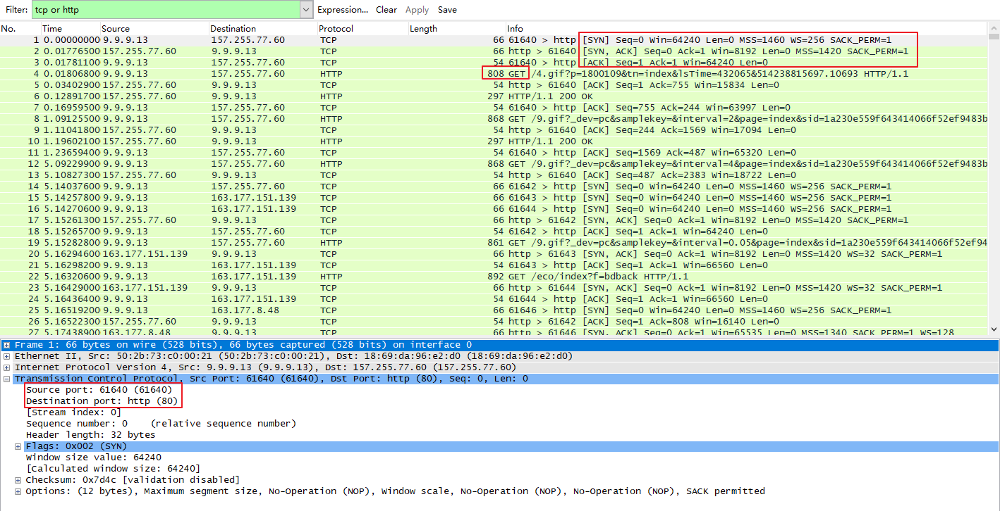
1. TCP三次握手建立连接
[SYN]—seq:(x=0)
[SYN,ACK]—seq:(y=0),ack = x+1 = 1
[ACK]—seq=x+1=1,ack=y+1=1

2. 9.9.9.13 发出HTTP页面和图片请求 No.4
GET

3. 157.255.77.60确认 No.5

4. 157.255.77.60传输数据 No.6
发送状态响应码200 OK
5. 9.9.9.13确认 No.7
.
.
.
6. 关闭连接
tcp.flags.fin==1


HTTP请求报文
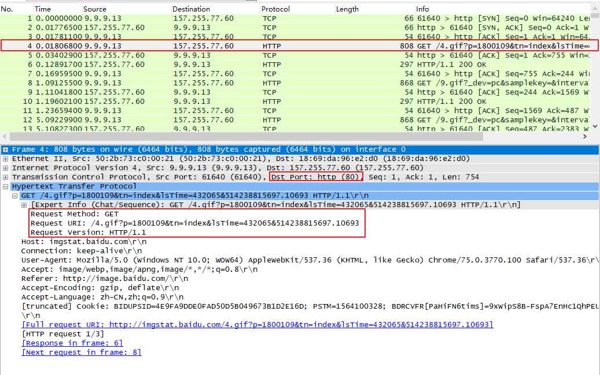

HTTP响应报文
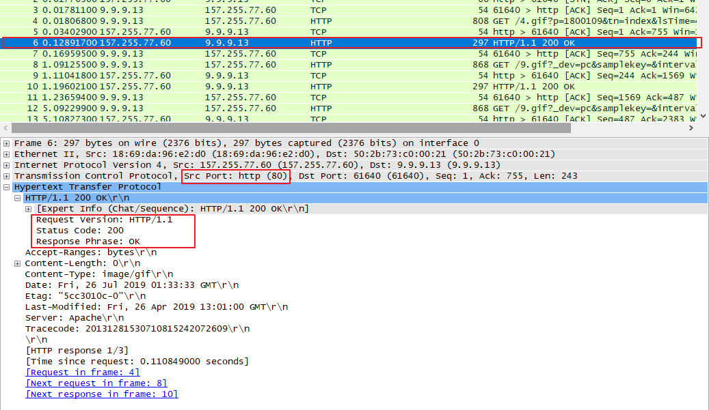

### chrome开发者工具分析网络请求
chrome浏览器打开网页，按`F12` 或者 右键选择`检查`，选择Network，刷新页面或者点击页面元素，可以看到报文交互、资源请求信息：
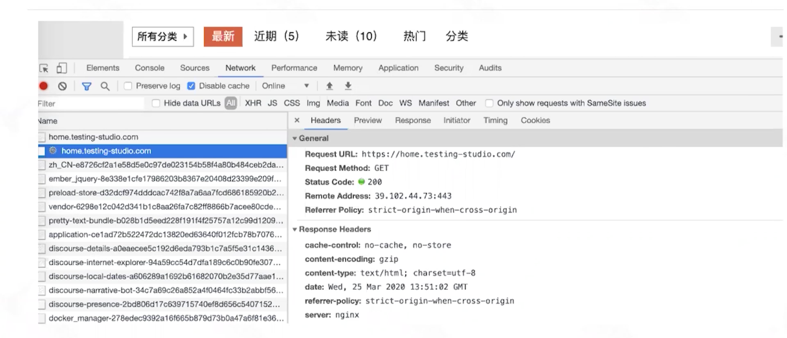


## DNS
域名服务系统DNS（Domain Name System）：**UDP53**，是因特网上作为域名和IP地址相互映射的一个分布式数据库，进行域名解析的服务器

### 域名

顶级域名（top level domain）:
(1) 国家顶级域名
(2) 通用顶级域名
(3) 基础结构域名

阿里云DNS：223.5.5.5，备用，223.6.6.6
老牌DNS：114.114.114.114
谷歌：8.8.8.8
腾讯：119.29.29.29
百度：180.76.76.76

### DNS协议
DNS在区域传输的时候使用TCP协议，其他时候使用UDP协议。

DNS区域传输的时候使用TCP协议：
1. 辅域名服务器会定时（一般3小时）向主域名服务器进行查询以便了解数据是否有变动。如有变动，会执行一次区域传送，进行数据同步。区域传送使用TCP而不是UDP，因为数据同步传送的数据量比一个请求应答的数据量要多得多。
2. TCP是一种可靠连接，保证了数据的准确性。

域名解析时使用UDP协议：
* 客户端向DNS服务器查询域名，一般返回的内容都不超过512字节，用UDP传输即可。不用经过三次握手，这样DNS服务器负载更低，响应更快。
* 理论上说，客户端也可以指定向DNS服务器查询时用TCP，但事实上，很多DNS服务器进行配置的时候，仅支持UDP查询包。

### DNS报文
DNS首部12字节
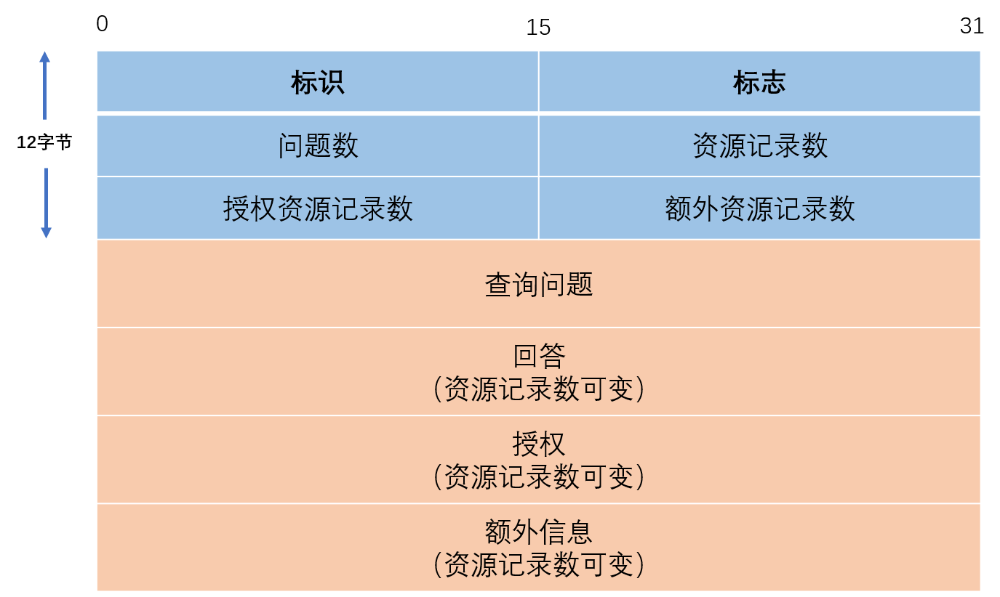

DNS query 查询报文
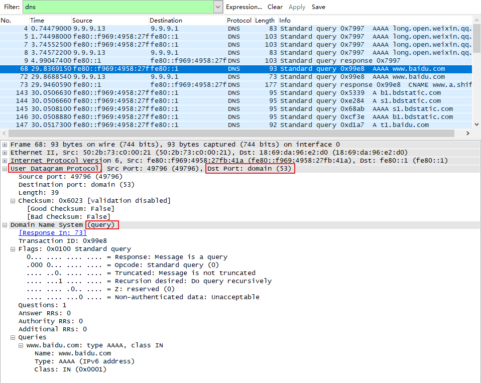

DNS response 响应报文
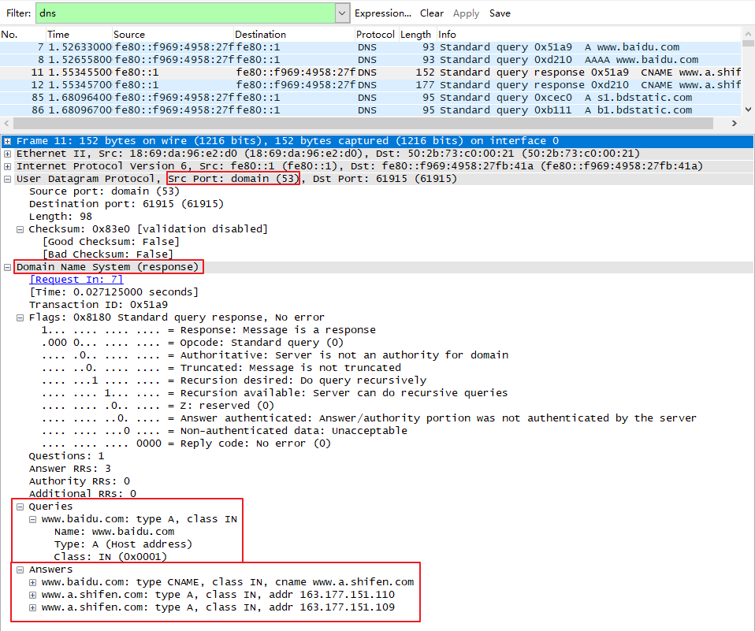

### DDNS
DDNS（Dynamic Domain Name Server，动态域名服务）
将用户的动态IP地址映射到一个固定的域名解析服务上，用户每次连接网络的时候客户端程序就会通过信息传递把该主机的动态IP地址传送给位于服务商主机上的服务器程序，服务器程序负责提供DNS服务并实现动态域名解析。

动态域名解析（Dynamic DNS，简称DDNS）是把互联网域名指向可变IP地址的系统。

- DNS只是提供了域名和IP地址之间的静态对应关系，当IP地址发生变化时，DNS无法动态的更新域名和IP地址之间的对应关系，从而导致访问失败。
- DDNS系统是将用户的动态IP地址映射到一个固定的域名解析服务上，用户每次连接网络时，客户端程序通过信息传递把该主机的动态IP地址传送给位于服务商主机上的服务器程序，实现动态域名解析。
- DDNS用来动态更新DNS服务器上域名和IP地址之间的对应关系，从而保证通过域名访问到正确的IP地址。
- 很多机构都提供了DDNS服务，在后台运行并且每隔数分钟来检查电脑的IP地址，如果IP发生变更，就会向DNS服务器发送更新IP地址的请求。

## DHCP

动态主机配置协议DHCP（Dynamic Host Configuration Protocol）：**UDP67，68**

bootps:67
bootpc:68

### DHCP过程
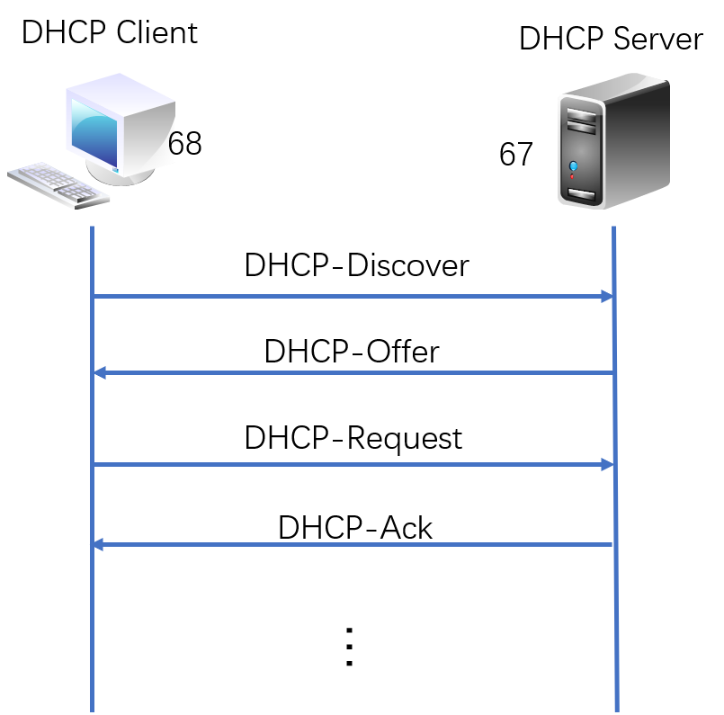

1. **发现阶段**，DHCP Discover，DHCP客户机以**广播**方式发送DHCP discover报文寻找DHCP服务器（向地址255.255.255.255发送广播信息）。

2. **提供阶段**，DHCP Offer，接收到DHCP discover报文的DHCP服务器都会做出响应，向DHCP客户机发送一个包含IP地址和其他信息的Offer报文。

3. **选择阶段**，DHCP Request，DHCP客户机只接受第一个收到的DHCP offer提供的信息，然后它就以广播方式回答一个DHCP request请求信息，该信息中包含向它所选定的DHCP服务器请求IP地址的内容，通知所有的DHCP服务器，他将选择某台DHCP服务器所提供的IP地址。

4. **确认阶段**，DHCP ACK，确认IP地址。当DHCP服务器收到DHCP客户机回答的DHCP request请求信息之后，它便向DHCP客户机发送一个包含它所提供的IP地址和其他设置的DHCP ack确认信息，告诉DHCP客户机可以使用它所提供的IP地址。

5. **重新登录**，DHCP NAK，如果客户机的IP地址已无法再分配给原来的DHCP客户机使用时（比如此IP地址已分配给其它DHCP客户机使用），则DHCP服务器给DHCP客户机回答一个DHCP nack否认信息。当原来的DHCP客户机收到此DHCP nack否认信息后，重新发送DHCP discover发现信息来请求新的IP地址。

6. **更新租约**，DHCP服务器向DHCP客户机出租的IP地址一般都有一个租借期限，期满后DHCP服务器便会收回出租的IP地址。如果DHCP客户机要延长其IP租约，则必须更新其IP租约。DHCP客户机启动时和IP租约期限过一半时，DHCP客户机都会自动向DHCP服务器发送更新其IP租约的信息。通过单播发送DHCP request信息到DHCP服务器

7. **DHCP Release**，当用户不再需要使用分配IP地址时，就会"主动"向DHCP服务器发送Release报文，告知服务器用户不再需要分配IP地址，DHCP服务器会释放被绑定的租约(在数据库中清除某个MAC对某个IP的租约记录，这样，这个IP就可以分配给下一个请求租约的MAC)

8. **DHCP Decline**，DHCP客户端收到DHCP服务器回应的ACK报文后，通过地址冲突检测发现服务器分配的地址冲突或者由于其他原因导致不能使用，则发送Decline报文，通知服务器所分配的IP地址不可用，我们在手工设置静态IP、或者DHCP分配中有时会遇到"检测到IP冲突"的提示就是因为客户端利用ARP机制来在当前内网中确认当前指定的IP是否已经被占用

9. **DHCP Inform**，DHCP客户端如果需要从DHCP服务器端获取更为详细的配置信息，则发送Inform报文向服务器进行请求，服务器收到该报文后，将根据租约进行查找，找到相应的配置信息后，发送ACK报文回应DHCP客户端

#### DHCP中继代理
家庭网络大多都只有一个以太网（无线LAN）的网段，与其连接的主机台数也不会太多。因此，只要有一台DHCP服务器就足以应对IP地址分配的需求，而大多数情况下都由**宽带路由器**充当这个DHCP的角色。相比之下，一个企业或学校等较大规模组织机构的网络环境中，一般会有多个以太网（无线LAN）网段。在这类网络环境中，往往需要将DHCP统一管理。具体方法可以使用DHCP服务器统一进行管理和运维。

只需在每个网段设置一个**DHCP中继代理**即可。**DHCP客户端**会向**DHCP中继代理**发送DHCP请求包，而DHCP中继代理收到这个广播包以后再以**单播形式**发给**DHCP服务器**。

服务器收到该包以后再向DHCP中继代理返回应答，并由DHCP中继代理将此包转发给DHCP客户端。**DHCP包中包含发出请求的主机的MAC地址**。DHCP中继代理正是利用这个MAC地址将包返回给了DHCP客户端。由此，DHCP服务器即使不在同一个链路上也可以实现统一分配和管理IP地址。

#### DHCP报文格式
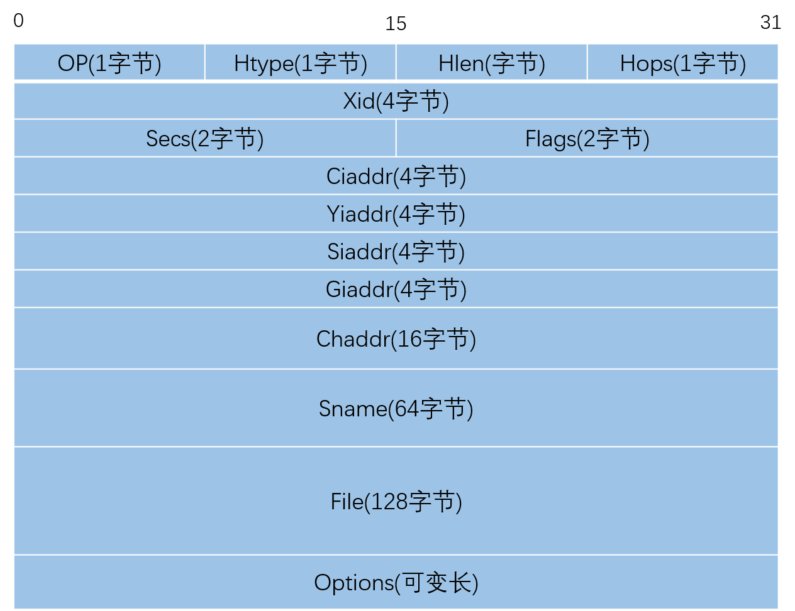

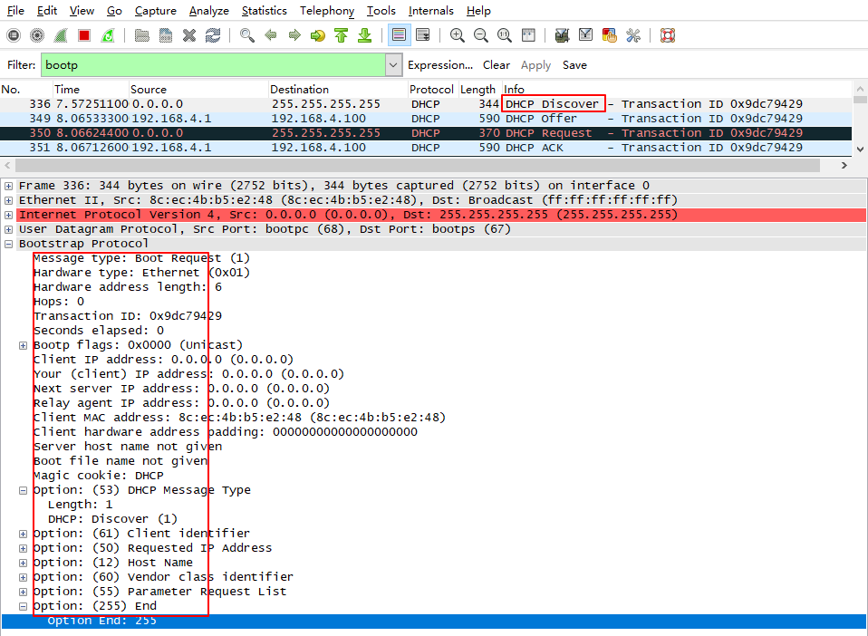

OP：报文的操作类型。分为请求报文和响应报文。

- 1：请求报文，2：应答报文。即client送给server的封包，设为1，反之为2。
- 请求报文：DHCP Discover、DHCP Request、DHCP Release、DHCP Inform和DHCP Decline。
- 应答报文：DHCP Offer、DHCP ACK和DHCP NAK。

Htype：DHCP客户端的MAC地址类型。MAC地址类型其实是指明网络类型

Htype值为1时表示为最常见的以太网MAC地址类型。

Hlen：DHCP客户端的MAC地址长度。以太网MAC地址长度为6个字节，即以太网时Hlen值为6。

Hops：DHCP报文经过的DHCP中继的数目，默认为0。

- DHCP请求报文每经过一个DHCP中继，该字段就会增加1。
- 没有经过DHCP中继时值为0。(若数据包需经过router传送，每站加1，若在同一网内，为0。)

Xid：客户端通过DHCP Discover报文发起一次IP地址请求时选择的随机数，相当于请求标识。用来标识一次IP地址请求过程。在一次请求中所有报文的Xid都是一样的。

Secs：DHCP客户端从获取到IP地址或者续约过程开始到现在所消耗的时间，以秒为单位。在没有获得IP地址前该字段始终为0。(DHCP客户端开始DHCP请求后所经过的时间。目前尚未使用，固定为0。)

Flags：标志位，只使用第0比特位，是广播应答标识位

- 用来标识DHCP服务器应答报文是采用单播还是广播发送，0表示采用单播发送方式，1表示采用广播发送方式。其余位尚未使用。(即从0-15bits，最左1bit为1时表示server将以广播方式传送封包给client。)

- 【注意】在客户端正式分配了IP地址之前的第一次IP地址请求过程中，所有DHCP报文都是以广播方式发送的，包括客户端发送的DHCP Discover和DHCP Request报文，以及DHCP服务器发送的DHCP Offer、DHCP ACK和DHCP NAK报文。当然，如果是由DHCP中继器转的报文，则都是以单播方式发送的。
- 另外，IP地址续约、IP地址释放的相关报文都是采用单播方式进行发送的。

Ciaddr：DHCP客户端的IP地址。仅在DHCP服务器发送的ACK报文中显示，在其他报文中均显示0，因为在得到DHCP服务器确认前，DHCP客户端是还没有分配到IP地址的。

Yiaddr：DHCP服务器分配给客户端的IP地址。

- 仅在DHCP服务器发送的Offer和ACK报文中显示，其他报文中显示为0。

Siaddr：下一个为DHCP客户端分配IP地址等信息的DHCP服务器IP地址。

- 仅在DHCP Offer、DHCP ACK报文中显示，其他报文中显示为0。(用于bootstrap过程中的IP地址)

Giaddr：DHCP客户端发出请求报文后经过的第一个DHCP中继的IP地址。

- 如果没有经过DHCP中继，则显示为0。(转发代理（网关）IP地址)

Chaddr：DHCP客户端的MAC地址。在每个报文中都会显示对应DHCP客户端的MAC地址。

Sname：为DHCP客户端分配IP地址的DHCP服务器名称（DNS域名格式）。

- 在Offer和ACK报文中显示发送报文的DHCP服务器名称，其他报文显示为0。

File：DHCP服务器为DHCP客户端指定的启动配置文件名称及路径信息。

- 仅在DHCP Offer报文中显示，其他报文中显示为空。

Options：可选项字段，长度可变，格式为"代码+长度+数据"。

#### DHCP报文交互
报文过滤：

pppoed：过滤PPPoE
bootp：过滤DHCP协议

**1、DHCP Release**
如果Client放弃现在使用的IP地址，则它发送DHCP Release单播报文，通知Server, Server将此地址回收以便下次使用

```bash
C:\Users\DELL>ipconfig /release
```
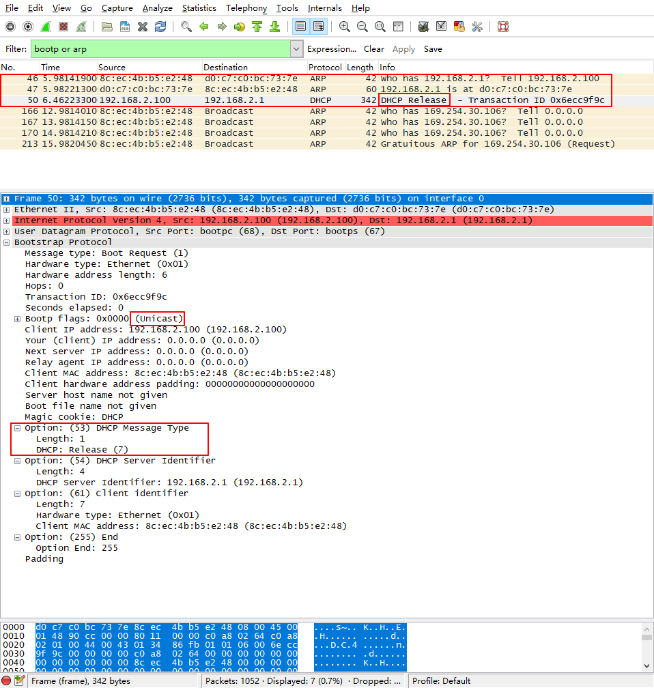

**2、DHCP Discover_offer_request_ack**

Client发送释放报文后，必须不再使用此地址发送其他数据包，并且再使用IP地址前必须重新发送Discover报文

```shell
C:\Users\DELL>ipconfig /renew
```
DHCP Discover
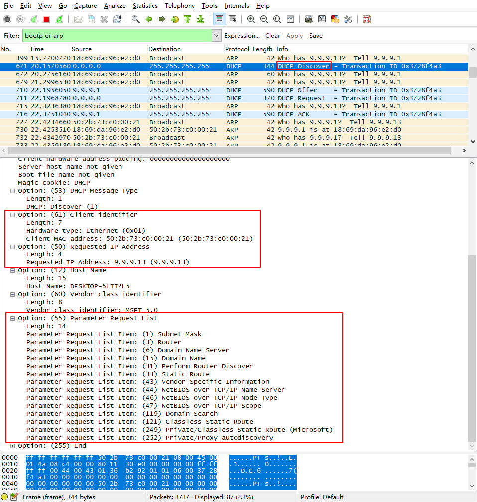

DHCP offer
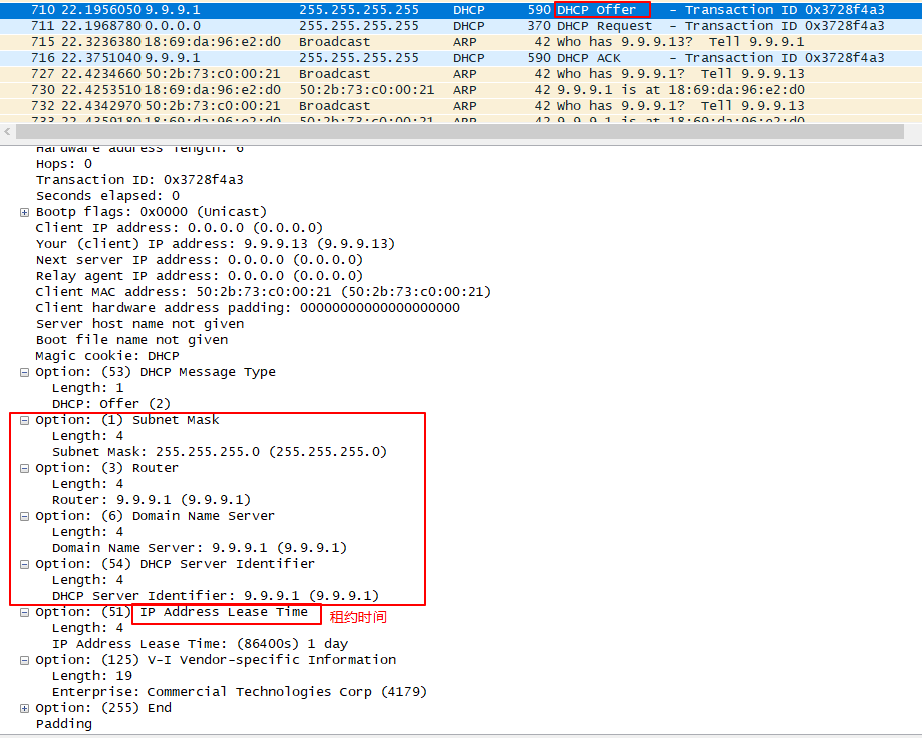

DHCP Request
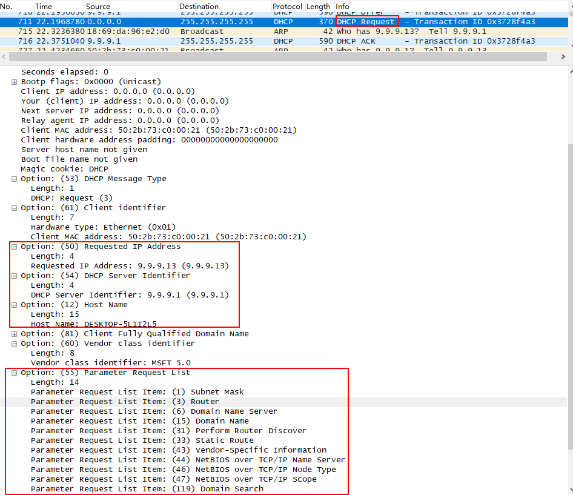

DHCP ACK
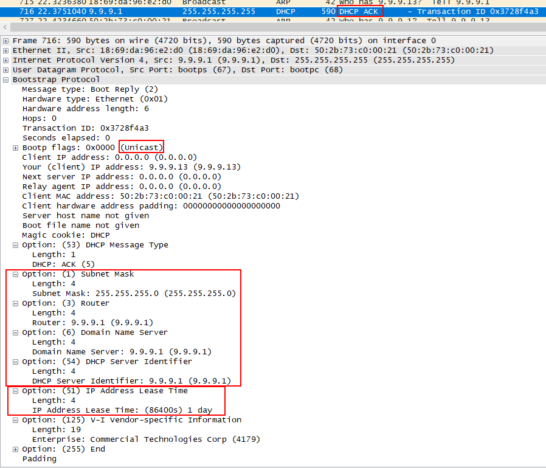

**3、续租及续租失败的情况**
(1) 续租

```shell
C:\Users\DELL>ipconfig /release
C:\Users\DELL>ipconfig /renew
```

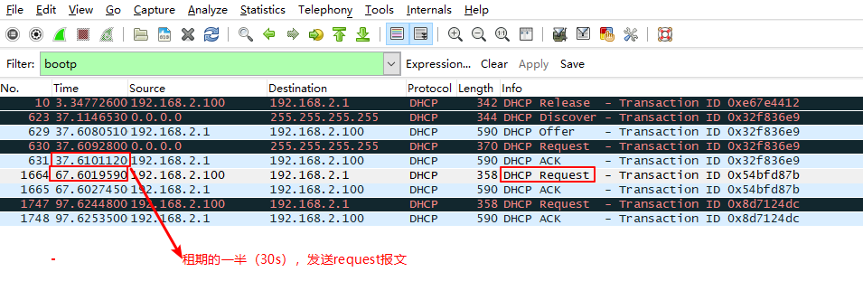
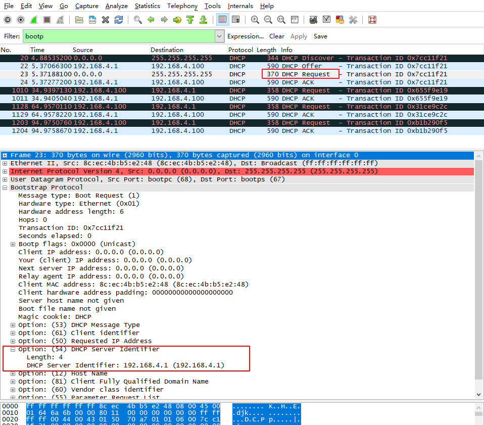
50%-75%-87.5%

* 当Client的地址到达50%的租用期（T1）时，Client进入RENEW状态，使用Request单播报文续约，联系该服务器
* 当Client的地址到87.5%租用期（T2）时，Client进入REBINDING状态，使用Request广播报文续约，联系任意服务器
* 该Request报文中，‘server identifier’必须为空 ，‘ requested IP address’为空， ’ciaddr’字段填充为客户端的IP地址

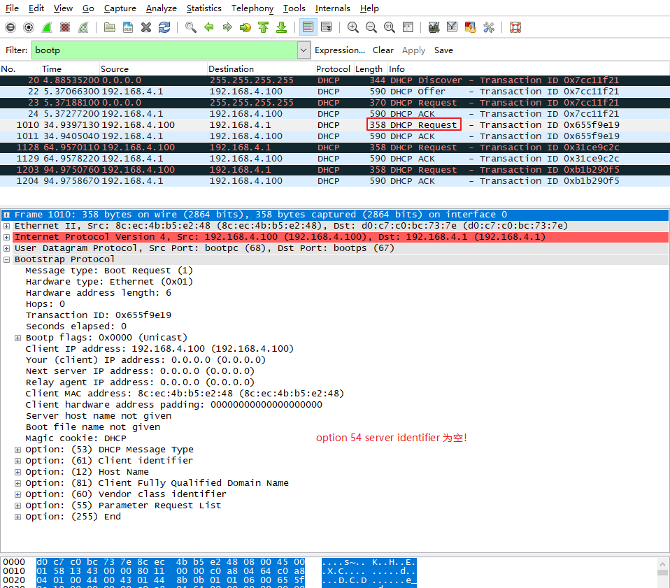

(2) 续租失败

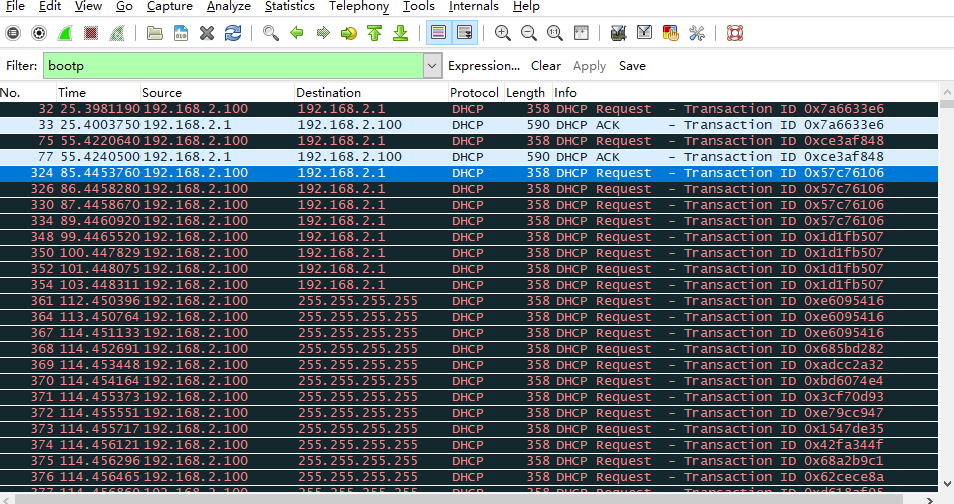

(3) 没有IP地址缓存的情况
```shell
C:\Users\DELL>ipconfig /renew
```


这是因为没有IP地址缓存
下图为有IP地址缓存的情况下，会有option 50这个字段
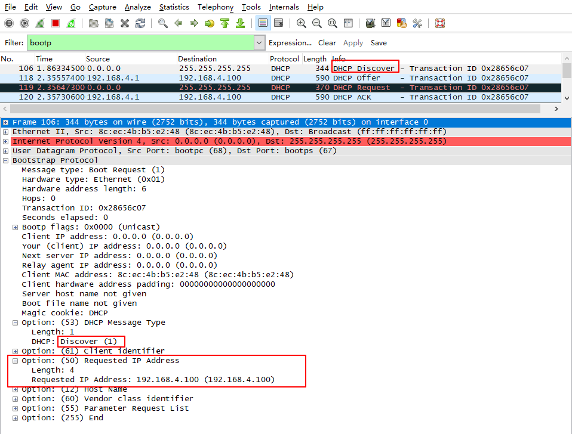


