# TCP/IP协议架构介绍（二）：网络层
网络层负责**寻址**和**路由**，还可以实现拥塞控制、网际互连等功能。数据的单位称为**数据包（packet）-分组**。

分组指IP数据报既可以是一个IP数据报（IP datagram，也可以是IP数据报的一个片（fragment）。**网络层协议**的代表包括：IP、IPX、RIP、OSPF等
<!--more-->

## IP协议
所有的TCP，UDP，IMCP，IGMP的数据都以IP数据格式传输。要注意的是，IP是**不可靠的协议**，这是说，IP协议没有提供一种数据未传达以后的处理机制，这是上层协议（传输层）：TCP或UDP要做的事情。

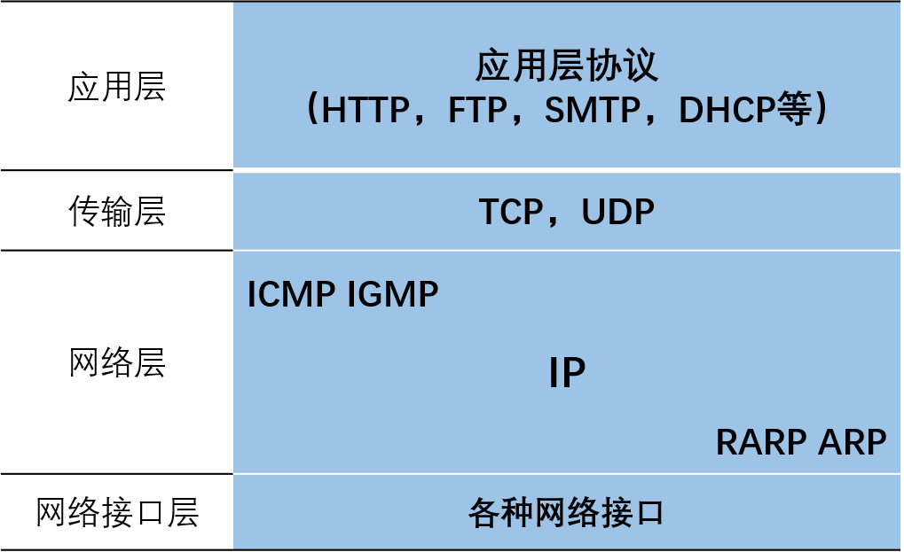

### IP数据报首部

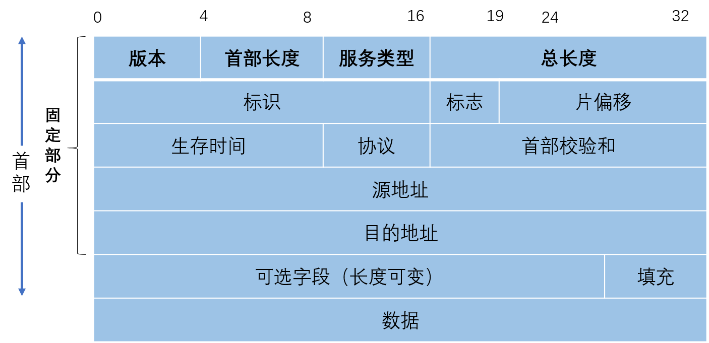

首部和数据报之和的长度，**最大65535**，不能超过MTU（即最大传送单元）   

**版本**：4位，IP协议的版本 

**首部长度**：4位（1个单位表示4个字节）  

**区分服务**：8位，报文的优先级，获得更好的服务（QoS应用）

**总长度**：16位

**标识**：计数器，产生数据报的标识（共有几个数据报）

**标志**：3位，前两位有意义（MF=1，有分片，MF=0，最后一个分片，DF=0，允许分片）

**片偏移**：13位，较长的分组在分片后，某片在原分组中的相对位置，以8个字节为偏移单位

**生存时间**：TTL，数据报在网络中可通过的路由器数的最大值（8位）

**协议**：8位，指出数据报使用何种协议

**首部校验和**：16位，只检查数据报首部，不检查数据部分

### IP地址

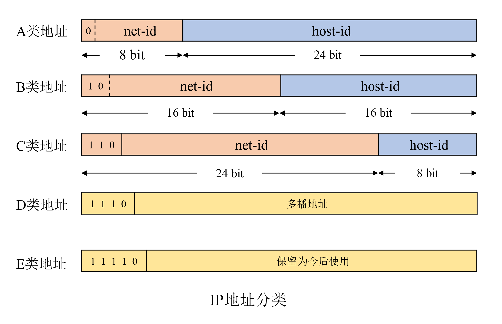

**192\.168.128.10/24**

- 24表示从头数到第几为止属于网络标识（前面24位为网络标识）

  路由器仅根据目的主机所连接的网络号来转发分组（不考虑目的主机号）   

| IP地址 |         地址范围          |          私有地址           |          保留地址           |
| :----: | :-----------------------: | :-------------------------: | :-------------------------: |
|  A类   | 0.0.0.0 ~127.255.255.255  |   10.0.0.0~10.255.255.255   |  127.0.0.0~127.255.255.255  |
|  B类   | 128.0.0.0~191.255.255.255 |  172.16.0.0~172.31.255.255  | 169.254.0.0~169.254.255.255 |
|  C类   | 192.0.0.0~223.255.255.255 | 192.168.0.0~192.168.255.255 |                             |
|  D类   | 224.0.0.0-239.255.255.255 |                             |                             |
|  E类   | 240.0.0.0~255.255.255.255 |                             |                             |

- 私有地址就是在互联网上不使用，而被用在局域网络中的地址 

- **单播地址**：A类，B类和C类地址

- **多播地址**：D类地址

- 224\.0.0.0代表组地址，用在IGMP查询报文中

- 224\. 0.0.1 代表“该子网内的所有主机”，用在IGMP的查询报文

- 224\.0.0.2 代表“该子网内的所有路由器组”

- 224.0.1.1 用作网络时间协议NTP

- 224\.0.0.9 用作RIP-2

- 224\.0.1.2 用作SGI公司的dogfight应用

**广播地址**

- 主机地址全为1的IP地址为广播地址

- 本地广播：在本网络内的广播

- 直接广播：不同网络之间的广播


**特殊IP地址**

| net-id |      host-id       | 源地址使用 | 目的地址使用 |                   说明                   |
| :----: | :----------------: | :--------: | :----------: | :--------------------------------------: |
|   0    |         0          |    可以    |     不可     |          本网络本主机(DHCP协议)          |
|   0    |      host-id       |    可以    |     不可     |        本网络的某个主机(host-id)         |
|  全1   |        全1         |    不可    |     可以     | 广播地址（在本网络广播，即路由器不转发） |
| net-id |        全1         |    不可    |     可以     |  广播地址(对net-id上的所有主机进行广播)  |
|  127   | 非全0或全1的任何数 |    可以    |     可以     |      环回地址：本主机进程之间的通信      |

### 子网划分
从主机号借用若干位作为子网号，两级IP地址变成了三级IP地址：网络号、子网号和主机号

数据报到达路由器后，路由器通过子网掩码来确定子网，将数据转发到子网到达目的主机

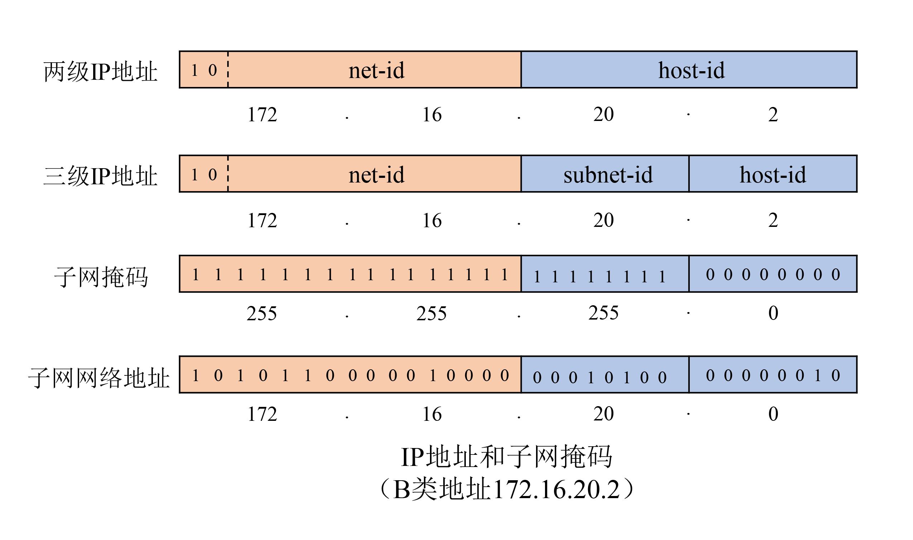

为了便于查找路由表，不划分子网时也使用子网掩码

- A类地址默认子网掩码：255.0.0.0

- B类地址默认子网掩码：255.255.0.0

- C类地址默认子网掩码：255.255.255.0


### 为什么同时需要IP地址和MAC地址？

* 如果只用MAC地址，网桥在学习到MAC地址前，必须向全世界发送包，将会造成巨大的网络流量，并且表格难以维护，超过网桥所能承受的极限。
* 如果只使用IP地址，网络中的路由器会隔断网络，在以太网发送IP包时，“下一个路由器”只能有MAC地址来确定，IP地址无法确定。
* IP地址的作用很重要的一部分就是**屏蔽链路层的差异**，因为它是一个逻辑地址，所以可以适应于多种链路；
* 以太网这种**链路层组网**方式中，要通过mac地址来通信，其实ip协议完全可以运行于串口（通常运行slip或ppp等链路层协议）等其他形式的链路之上，这时并不需要一个mac地址
* 在**局域网**中两台电脑之间传输数据包用MAC地址即可识别
* 而**通过路由器访问互联网** ，传输数据包中的MAC地址就转成路由器的MAC地址。此时就要靠IP来识别，当我要**换了一台路由器**时候，只要我的IP地址不变，要跟我们传输数据的对象只要记住IP地址即可与我们通信，而不需记住我们的mac地址。

## ARP
地址解析协议ARP（Address Resolution Protocol）

ARP 是根据IP地址获取MAC地址的一种协议，  工作在数据链路层与网络层之间  


* IP地址和MAC地址都具有唯一性，只有IP地址具有**层次性**（网段）
* 当主机要发送一个IP包的时候，会首先查一下自己的**ARP高速缓存**（就是一个IP-MAC地址对应表缓存）。
* 如果查询的IP－MAC值对不存在，那么主机就向网络发送一个**ARP协议广播包**，这个广播包里面就有待查询的IP地址
* 收到这份广播的包的所有主机都会**查询自己的IP地址**
* 如果收到广播包的某一个主机发现自己符合条件，那么就准备好一个**包含自己的MAC地址**的ARP包传送给发送ARP广播的主机。

### ARP报文字段

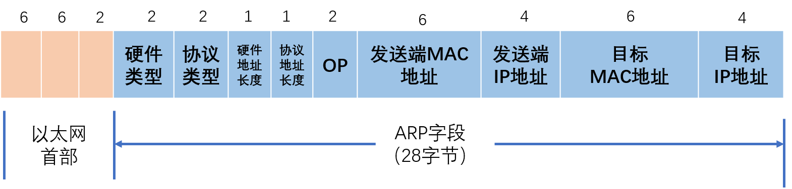

- **以太网帧类型**：0x0806

- **硬件类型**：1表示以太网地址

- **协议类型**：表示要映射的协议地址类型。值为0x0800，表示IP地址

- **硬件地址长度和协议地址长度**分别指出硬件地址和协议地址的长度，以字节为单位。对于以太网上IP地址的ARP请求或应答来说，它们的值分别为6和4。

- **操作字段：**指出四种操作类型，ARP请求（值为1）、ARP应答（值为2）、RARP请求（值为3）和RARP应答（值为4）

以太网目的地址为全1的广播地址，以太网源地址和发送端以太网地址相同。


### ARP请求响应报文

**1 ARP request(ARP请求)**

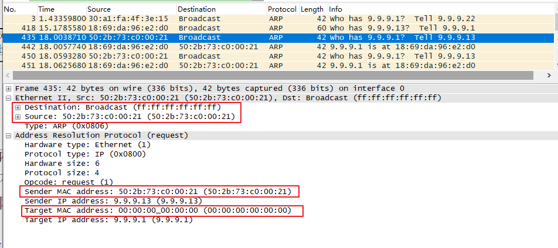

**2 ARP replay(ARP响应)**

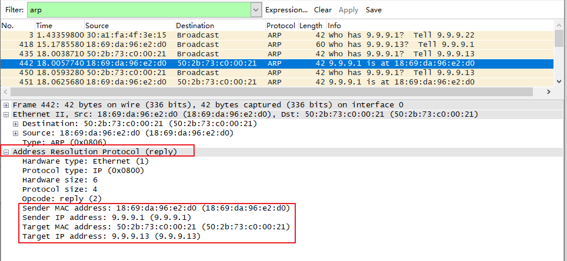

### ARP缓存表

ARP是借助ARP请求与ARP响应两种类型的包确定MAC地址

* 主机A为了获得主机B的MAC地址，起初要通过**广播**发送一个ARP请求包。这个包中包含了想要了解其MAC地址的主机IP地址。
* ARP的请求包会被这同一个链路上所有的主机和路由器解析。如果ARP请求包中的目标IP地址与自己的IP地址一致，那么这个节点就将自己的MAC地址塞入ARP响应包返回给主机A。
* 由此，可以通过ARP从IP地址获得MAC地址，实现链路内的IP通信。
* 如果每发送一个IP数据报都要进行一次ARP请求以确定MAC地址，那将会造成不必要的网络流量，因此，通常的做法是**把获取到的MAC地址缓存一段时间**。
* 即把第一次通过ARP获取到的MAC地址作为IP对MAC的映射关系记忆到一个**ARP缓存表**中，下一次再向这个IP地址发送数据报时不需再重新发送ARP请求，而是直接使用这个缓存表当中的MAC地址进行数据报的发送。
* 每执行一次ARP，其对应的缓存内容都会被清除。高速缓存中每一项的生存时间一般为**20分钟**

## RARP协议

逆地址解析协议PARP（Reverse Address Resolution Protocol）

从MAC地址定位IP地址

* 对于嵌入式设备，会遇到没有任何输入接口或无法通过DHCP动态获取IP地址的情况。需要RARP服务器来注册设备的MAC地址及其IP地址。
* RARP分组的格式与ARP分组基本一致。主要的差别是RARP**请求或应答的帧类型代码为0x8035**，**而且RARP请求的操作代码为3，应答操作代码为4**。
* ARP，RARP请求以广播方式传送，应答一般是单播(unicast)传送的

## ICMP协议 

ICMP协议（Internet Control Message Protocol，网际控制报文协议）

IP协议并不是一个可靠的协议，它不保证数据被送达，那么，自然的，**保证数据送达**的工作应该由其他的模块来完成。其中一个重要的模块就是**ICMP(网络控制报文)协议**。ICMP不是高层协议，而是IP层的协议。当传送IP数据包发生错误。比如主机不可达，路由不可达等等，ICMP协议将会把错误信息封包，然后传送回给主机。给主机一个处理错误的机会

ICMP报文是在IP数据报内部被传输的

```shell
ping www.baidu.com
tracert www.baidu.com  # 侦测主机到目的主机之间所经路由情况
```
Ping发送一个ICMP，回声请求消息给目的地并报告是否收到所希望的ICMP echo （ICMP回声应答）。它是用来检查网络是否通畅或者网络连接速度的命令。
原理：利用网络上机器IP地址的唯一性，给目标IP地址发送一个数据包，再要求对方返回一个同样大小的数据包来确定两台网络机器是否连接相通，时延是多少。

### ICMP报文
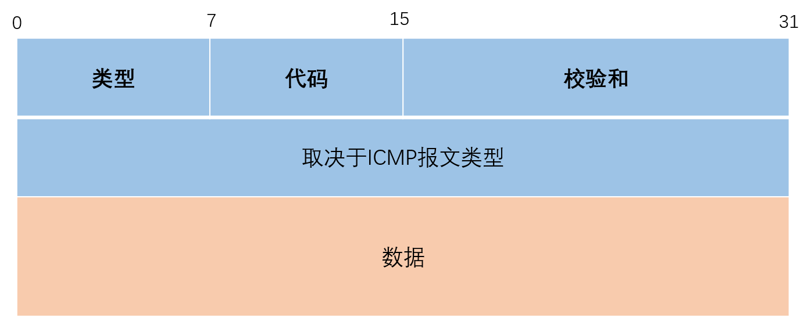

不同类型由报文中的类型字段和代码字段来共同决定

**查询报文**
类型8 代码0：请求回显（ping请求）

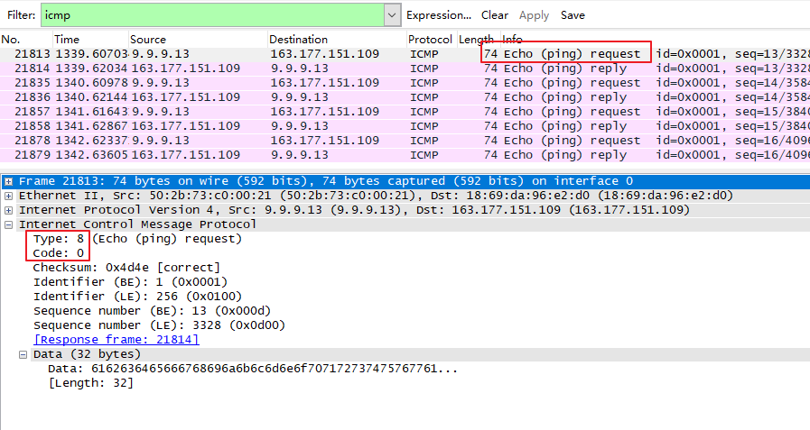

**响应报文**
类型0 代码0：回显应答(Ping应答）
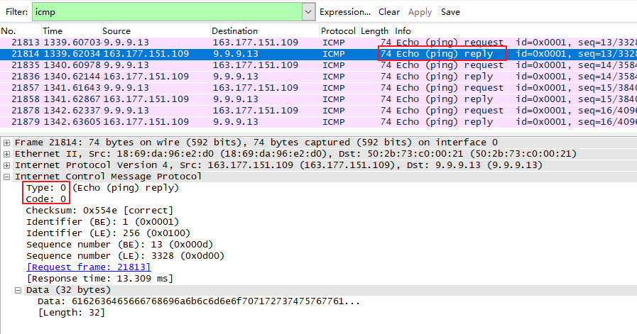

- **0 回送应答（Echo Reply）**
- 3 目标不可达（Destination Unreachable）
- 4 原点抑制（Source Quench）
- 5 重定向或改变路由（Redirect）
- **8 回送请求（Echo Request）**
- 9 路由器公告（Router Advertisement）
- 10 路由器请求（Router Solicitation）
- **11 超时（Time Exceeded）**
- 17 地址子网请求（Address Mask Request）
- 18 地址子网应答（Address Mask Reply）


## IGMP协议 
IGMP协议（Internet Group Management Protocol，网际组管理协议），用于主机与路由器之间交互信息，IGMP有固定的报文长度，没有可选数据

* 所有要加入组播组的主机和所有连接到有组播主机的子网中的路由器都需支持IGMP协议
* IGMP消息不能被路由器转发，只限制在本地网络内
* IGMP报文的TTL值始终为1

### IGMP版本
* IGMP的版本目前有V1/V2/V3三种
   RFC 1112 -- IGMPv1
   RFC 2236 -- IGMPv2
   RFC 3376 -- IGMPv3

|                    |      IGMPv1      |      IGMPv2      |      IGMPv3      |
| ------------------ | :--------------: | :--------------: | :--------------: |
| **查询器选举**     | 依靠上层路由协议 |     自己选举     |     自己选举     |
| **成员离开方式**   |     默默离开     | 主动发出离开报文 | 主动发出离开报文 |
| **特定组查询**     |      不支持      |       支持       |       支持       |
| **指定源、组加入** |      不支持      |      不支持      |       支持       |


### 多播路由器

**加入一个多播组**
一个主机通过组地址和接口来识别一个多播组。主机必须保留一个表，此表中包含所有至少含有一个进程的多播组以及多播组中的进程数量。

多播路由器使用IGMP报文来记录与该路由器相连网络中组成员的变化情况。使用规则如下：
1)  当第一个进程**加入一个组**时，**主机就发送一个IGMP报告**。如果一个主机的多个进程加入同一组，只发送一个IGMP报告。这个报告被发送到进程加入组所在的同一接口上。

2) 进程**离开一个组**时，主机**不发送IGMP报告**，即便是组中的最后一个进程离开。主机知道在确定的组中已不再有组成员后，在随后收到的IGMP查询中就不再发送报告报文。

3) **多播路由器定时发送IGMP查询**来了解是否还有任何主机包含有属于多播组的进程。多播路由器必须向每个接口发送一个IGMP查询。因为路由器希望主机对它加入的每个多播组均发回一个报告，因此**IGMP查询报文中的组地址被设置为0**。

4) **主机通过发送IGMP报告来响应一个IGMP查询**，对每个至少还包含一个进程的组均要发回IGMP报告。

使用这些查询和报告报文，多播路由器对每个接口保持一个表，表中记录接口上至少还包含一个主机的多播组。当路由器收到要转发的多播数据报时，它只将该数据报转发到（使用相应的多播链路层地址）还拥有属于那个组主机的接口上。

### IGMP 报文

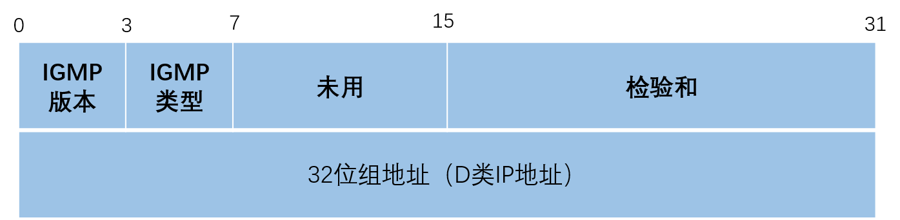

- IGMP**类型为1**说明是由多播路由器发出的查询报文，**为2**说明是主机发出的报告报文。
- 检验和的计算和ICMP协议相同。
- 组地址为D类IP地址。在查询报文中组地址设置为0，在报告报文中组地址为要参加的组地址。

IGMPv1的查询与响应过程如下：

* IGMP查询器周期性地向共享网段内所有主机以**组播方式**（目的地址为224.0.0.1）发送“成员关系**查询**”报文（组地址为0）。
* 网络内所有主机都接收到该查询消息，如果某主机对任意组播组G感兴趣，则发送“成员关系**报告**”报文（其中携带组播组G的地址）来宣告自己将加入该组播组。
*  经过查询/响应过程后，IGMP路由器了解到本网络内存在组播组G对应的接收者，生成（\*，G）组播转发表项并依此作为组播信息的转发依据。（*表示组播组成员，G表示某个组播组）。


## OSPF

OSPF(Open Shortest Path First开放式最短路径优先）  

* 是一个内部网关协议(Interior Gateway Protocol，简称IGP）   

* 是目前广泛使用的一种**动态路由协议**，属于链路状态路由协议，运作于自治系统内部    

* 著名的迪克斯加算法被用来计算最短路径树

* OSPF支持负载均衡和基于服务类型的选路

* 也支持多种路由形式，如特定主机路由和子网路由等。   

## RIP   

**RIP(Routing Information Protocol, 路由信息协议）**

* 是一种内部网关协议（IGP），是一种**动态路由选择协议**，用于自治系统 (autonomous system,AS）   内的路由信息的传递

* RIP协议基于距离矢量算法（DistanceVectorAlgorithms）


