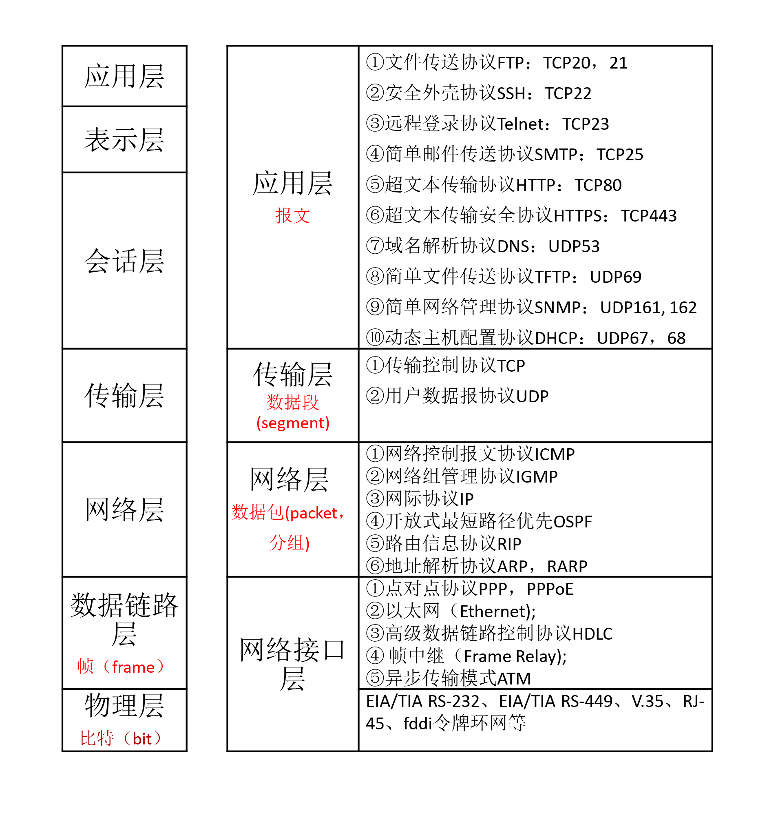
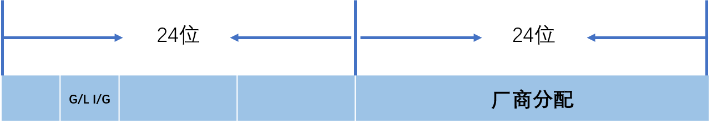
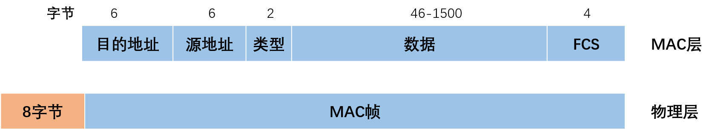
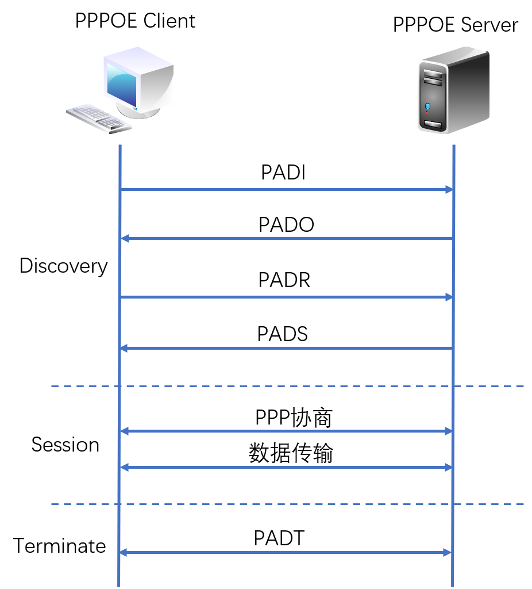
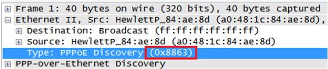
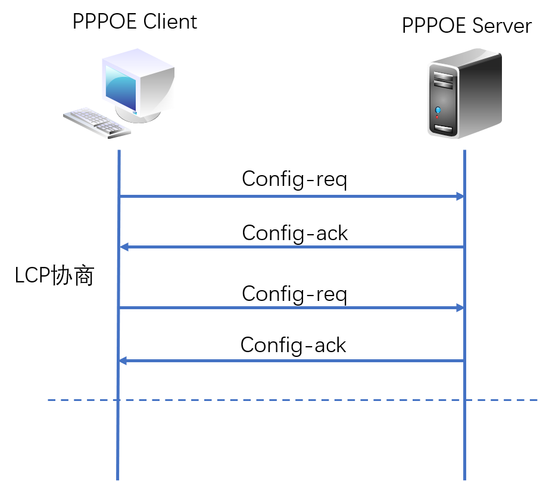

# TCP/IP协议架构介绍（一）：网络接口层

TCP/IP协议架构是通信协议的统称，常被称为**TCP/IP协议族**，包括两个核心协议：**TCP（传输控制协议）**和**IP（网际协议）**，TCP/IP协议的开发始于20世纪60年代后期，早于OSI参考模型，由于TCP/IP模型更加简洁易用，目前大多采用TCP/IP模型。一共包括4层：应用层、传输层、网络层和网络接口层。

<!--more-->

OSI模型与TCP/IP模型：

## 物理层

负责0、1 比特流（0/1序列）与电压的高低之间的转换

数据的单位称为**比特（bit）**

属于物理层定义的典型规范代表包括：EIA/TIA RS-232、EIA/TIA RS-449、V.35、RJ-45、fddi令牌环网等
OSI采纳了各种现成的协议，其中有RS-232、RS-449、X.21、V.35、ISDN、以及FDDI、IEEE802.3、IEEE802.4、和IEEE802.5的物理层协议

## 数据链路层

负责物理层面上的互联的、节点间的通信传输（例如一个以太网项链的2个节点之间的通信）；

该层的作用包括：物理地址寻址、数据的成帧、流量控制、数据的检错、重发等。在这一层，数据的单位称为**帧（frame）**

* **封装成帧**: 把网络层数据报加头和尾，封装成帧,帧头中包括源**MAC地址**和目的MAC地址。

* **透明传输**：零比特填充、转义字符。

* **可靠传输**：在出错率很低的链路上很少用，但是无线链路WLAN会保证可靠传输。

* **差错检测(**CRC)：接收者检测错误,如果发现差错，丢弃该帧。

### 主要协议
①点对点协议PPP（Point to Point Protocol）
②以太网（Ethernet)
③高级数据链路控制协议HDLC(High-Level Data Link Control)
④ 帧中继（Frame Relay)
⑤异步传输模式ATM(Asynchronous Transfer Mode)

### MAC地址
MAC(Medium/Media Access Control)地址，媒体访问控制,或称为物理地址、硬件地址，48位

MAC地址

- 组织唯一标识符（OUI）由IEEE（电气和电子工程师协会）分配给厂商
- I/G（Individual/Group）位，如果I/G=0，则是某台设备的MAC地址，即**单播地址**；如果I/G=1，则是**多播地址**（组播+广播=多播）。
- G/L（Global/Local，也称为U/L位，其中U表示Universal）位，如果G/L=0，则是全局管理地址，由IEEE分配；如果G/L=1，则是本地管理地址，是网络管理员为了加强自己对网络管理而指定的地址。

MAC帧

>IP地址负责表示计算机的网络层地址，网络层设备（如路由器）根据IP地址来进行操作；
>MAC地址负责表示计算机的数据链路层地址
>IP和MAC地址这种映射关系由**ARP**（Address Resolution Protocol，地址解析协议）协议完成。

### PPPoE 协议

基于以太网的点对点通讯协议PPPOE(Point to Point Protocol over Ethernet)

* 单纯的以太网没有验证功能，也没有建立和断开连接的处理，因此无法按时计费。
* 如果采用PPPoE管理以太网连接，就可以利用PPP的验证等功能使各家ISP可以有效地管理终端用户的使用。
* 分成发现阶段(Discorvery)和PPP会话阶段（Session）

报文的以太网类型:
* 当值为0x8863时表示Discovery阶段或Terminate阶段。
* 当值为0x8864时表示Session阶段。

**PPPoE拨号过程**

#### PPPoE Discovery发现阶段
1. 用户主机用**广播**的方式发出**PADI **(PPPOE Active Discovery Initiatio) 包，准备去获得所有可连接的接入设备（获得其MAC地址）；
2. **PPPoE服务器**收到PADI包后，返回**PADO** (PPPOE Active Discovery Offer) 作为回应；
3. 用户主机从收到的多个PADO包中，根据其名称类型名或者服务名，**选择一个合适的接入设备**，然后发送**PADR** (PPPOE Active Discovery Request) 包，<u>另外如果一个用户主机在发出PADI后在规定时间内没有收到PADO，则会重发PADI,并且加倍等待时间</u>；
4. **PPPoE服务器**收到PADR包后，返回**PADS **(PPPOE Active Discovery Session-confirmation) 包，其中包含了一个**唯一session ID**，双方进入PPP会话阶段。

| code | 报文 |                                            |                   |
| ---- | ---- | ------------------------------------------ | ----------------- |
| 0x09 | PADI | PPPoE Active Discovery Initiation          | PPPoE发现初始报文 |
| 0x07 | PADO | PPPoE Active Discovery Offer               | PPPoE发现提供报文                  |
| 0x19 | PADR | PPPoE Active Discovery Request             | PPPoE发现请求报文                  |
| 0x65 | PADS | PPPoE Active Discovery Sessionconfirmation |  PPPoE发现会话确认报文               |
| 0xa7 | PADT | PPPoE Active Discovery Terminate           | PPPoE发现终止报文                  |

Discovery阶段：以太网帧的ETHER_TYPE域都设置为 **0x8863**

#### PPPoE Session 会话阶段
**1 LCP协商阶段（Link Control Protocol）**
链路协商

* LCP用于建立、拆除和监控PPP数据链路
* 还用于链路层参数的协商，如MRU、验证方式

协商双方互相发送一个**LCP Config-Request报文**，确认收到的Config-Request报文中的协商选项，根据这些选项的支持与接受情况，做出适当的**回应**。若**两端都回应了Config-ACK**，则标志LCP链路建立成功，否则会继续发送Request报文，直到对端回应了ACK报文为止。

**2 认证阶段**

会话双方通过**LCP协商好的认证方法**进行认证，如果认证通过了，才可以进行下面的网络层的协商。认证过程在链路协商结束后就进行。

* **PAP**（Password Authentication Protocol，口令认证协议）

  PAP为两次握手协议，它通过用户名及口令来对用户进行验证。

* **CHAP**（Challenge Handshake Authentication Protocol，质询握手认证协议）

  CHAP为三次握手协议。只在网络上传输用户名，并不传输用户口令，因此它的安全性要比PAP高。

  Md5算法
  
  

**3 NCP协商阶段**

**网络层协商：IPCP、BCP、IPv6CP等**

* 协商PPP报文的网络层参数，如IP地址，DNS Server IP等。
* PPPoE用户主要通过**IPCP**来获取访问网络的IP地址或IP地址段，网关，DNS等。
* 用户和接入设备对IP服务阶段的一些要求进行多次协商，以决定双方都能够接收的约定。如：IP业务阶段使用的IP压缩协议等。
* 双方的协议是通过报文中包含的**Option项**进行协商的，每一个Option都是一个需要协商的问题。最后双方都需要对方答复Configure_Ack的同意报文。

* IPCP的协商过程是基于**PPP状态机**进行协商的。
* 经过双方协商，通过配置请求、配置确认、配置否认等包文交换配置信息，**最终由initial (或closed)状态变为Opened状态**。
* IPCP状态变为Opened的条件必须是**发送方和接收方都发送和接收过确认报文**。
* IPCP协商过程中，协商报文可包含多个选项，即参数。
* 各个选项的拒绝或否认都不能影响IPCP的UP，IPCP可以无选项协商，**无选项协商也同样能够UP**。选项有**IP Address、网关、掩码**等，其中IP Address是最重要的一个选项，有些厂家的实现必须这个选项得到确认，大多数厂家的实现允许这个选项为空。

#### PPPoE Terminate阶段

* PPP通信双方可以使用**PPP协议自身**来结束PPPoE会话
* 当无法使用PPP协议结束会话时可以使用**PADT**（PPPoE Active Discovery Terminate）报文。
* 进入PPPoE Session阶段后，PPPoE Client和PPPoE Server**都可以通过发送PADT报文的方式来结束PPPoE连接**。
* PADT数据包可以在会话建立以后的任意时刻单播发送。在发送或接收到PADT后，就不允许再使用该会话发送PPP流量了。

