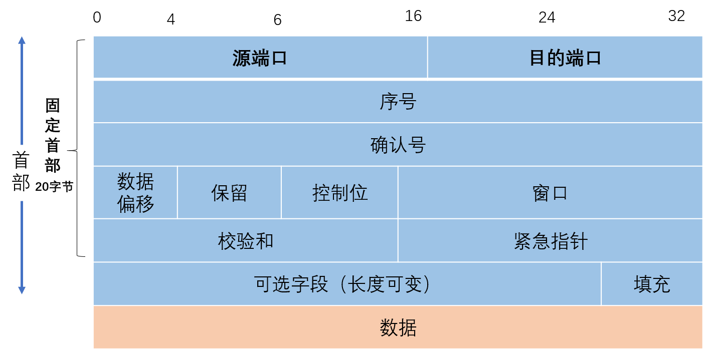
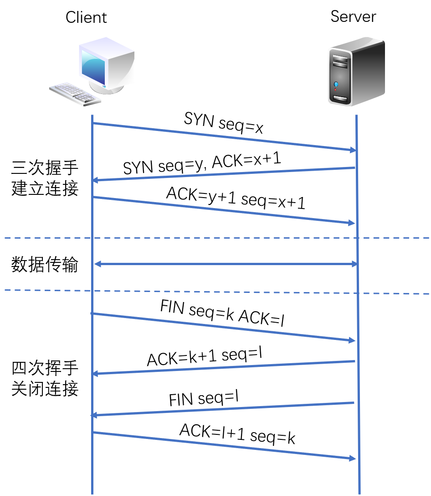
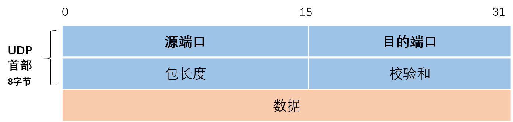

# TCP/IP协议架构介绍（三）：传输层
传输层主要为两台主机上的应用程序提供端到端的通信。

<!--more-->

## 传输层简介

* 传输层是唯一负责总体的**数据传输**和**数据控制**的一层；

* 数据的单位称为**数据段（segment）**

* TCP报文段（**TCP segment**）
* UDP数据报（**User Datagram**）

主要功能：

①为**端到端**连接提供传输服务

②这种传输服务分为可靠和不可靠的,其中**TCP**是典型的可靠传输，而**UDP**则是不可靠传输

③为端到端连接提供**流量控制**，**差错控制**，**服务质量**(Quality of Service,**QoS**)等管理服务

包括的协议如下：

TCP：传输控制协议，传输效率低，可靠性强

UDP：用户数据报协议，适用于传输可靠性要求不高，数据量小的数据（比如QQ：采用的通信协议以UDP为主，辅以TCP协议）

DCCP、SCTP、RTP、RSVP、PPTP等协议

### 端口号

* **MAC地址**用来识别同一链路中不同的计算机，**IP地址**用来识别TCP/IP网络中互连的主机和路由器

* 传输层中也有这种类似于地址的概念，那就是**端口号**。

* 端口号用来识别同一台计算机中不同的应用程序。因此，它也被称为**程序地址**。

* 同一台计算机可以同时运行多个程序：通过端口号来识别正在进行通信的应用程序，并准确的将数据传输

* TCP/IP或者UDP/IP通信中通常采用**5个信息**来识别一个通信，分别是“源IP地址”、“目标IP地址”、“协议号”、“源端口号”、“目标端口号”，也被称为“五元组”，只要其中某一项不同，则被认为是其他通信。

* 端口号的取值范围在0-65535之间，其中0-1023为知名端口号，1024-65535之间的端口为非知名端口不同的传输层协议可以使用相同的端口号

* 数据到达IP层后，会先检查IP首部中的**协议号**，再传给相应协议的模块。如果是TCP则传给TCP模块，如果是UDP则传给UDP模块去做**端口号**的处理，即使是同一个端口号，由于传输协议是各自独立的进行处理，因此相互之间不会受到影响。

## TCP协议和UDP协议  

TCP（Transmission Control Protocol，传输控制协议）

UDP（User Datagram Protocol，用户数据报协议）

### TCP和UDP协议特点

|          |               TCP                |              UDP               |
| :------: | :------------------------------: | :----------------------------: |
|  可靠性  |               可靠               |             不可靠             |
|  连接性  |             面向连接             |             无连接             |
|   报文   |            面向字节流            |            面向报文            |
|   效率   |            传输效率低            |           传输效率高           |
|  双工性  |              全双工              | 一对一、一对多、多对一、多对多 |
| 流量控制 |             滑动窗口             |               无               |
| 拥塞控制 | 慢开始、拥塞避免、快重传、快恢复 |               无               |
| 传输速度 |                慢                |               快               |
|   应用   |   SMTP、Telnet、HTTP、FTP、DNS   |      DNS、TFTP、SNMP、NFS      |

TCP的主要特点是：

1.TCP 是**面向连接**的传输层协议。

2.TCP 提供**可靠交付**的服务。

3.TCP是面向**字节流**

4.**提供**流量控制，拥塞控制

**5.TCP提供**全双工**通信。每一条 TCP 连接只能有两个端点(endpoint)，每一条 TCP连接只能是点对点的（一对一）。**

**6.首部最低**20个字节。

可靠传输：

1. 应答机制：对方收到消息底层会回复

2. 超时重传：给多方发送一个数据，如果一段时间内对方没有接收，会隔一段时间给对方再次发送，如果一直没有回复，会认为对方掉线了

3. 错误校验：如果接收的数据包序号发生了错乱，TCP会自动排序，保证数据的有序性，如果有重复数据包，会删除重复的数据包

4. 流量控制：数据发送在网卡缓存区达到一定上限，对方不会一直发送数据，需要等待对方接收数据，网卡缓存区有空间再发送，保证网卡缓存不会超出

UDP的主要特点是：

1. UDP是**无连接**的，在发送数据之前不需要建立连接，因此减少了靠小和发送数据之前的时延。
2. UDP使用**尽最大努力交付**，不保证可靠交付。
3. UDP是**面向报文**的，发送方的UDP对应用程序交下来的报文，在添加首部后就向下交付给IP层。
4. UDP**没有拥塞控制**，因此网络出现的拥塞不会使源主机的发送速率降低。
5. UDP支持一对一、一对多、多对一和多对多的交互通信。
6. UDP的首部开销小，只有**8个字节**，比TCP的20个字节首部要短。

### TCP报文格式   

**源端口和目的端口：**各占两个字节，分别表示数据包源端口和目的端口，由此可知，端口号的范围是0-65535。

**序号**：四个字节，范围是[0,232-1]，共232(4294967296)个序号。TCP字节流的起始序号必须在连接建立时设置，首部中的序号字段值则指的是本报文段所发送的数据的第一个字节的序号。

**确认号：**四个字节，是期望收到对方下一个报文段的第一个数据字节的序号。若确认号=N，则表示到序号N-1为止的所有数据都已正确收到。

**数据偏移：**占四位，它指出当前TCP报文段的数据起始处距离整个TCP报文段的起始处有多远。

**保留：**占六位，保留为今后使用，当前应置为0。

**控制位：**占六位，包含URG,ACK,PSH,RST,SYN和FIN，分别为TCP连接中需要使用的数据位。

**窗口：**两个字节，窗口值是[0,216-1]之间的整数，窗口指的是发送本报文段一方的接收窗口，作为接收方让发送方设置其发送窗口的依据。

**校验和**：两个字节，检查范围包括首部和数据这两部分。

**紧急指针**：两个字节，只有URG=1时才有意义。

**选项：**长度可变，最长可达40字节，当没有使用选项时，TCP首部长度是**20字节**。

在TCP中，当发送端的数据到达接收端主机时，接收端主机会返回一个已收到消息的通知。这个消息叫做确认应答（ACK）。

### TCP连接的建立和断开过程

 三次握手和四次挥手 

 建立一个TCP连接需要3个报文段，而关闭TCP连接需要4个报文段。     

### UDP报文格式 

**源端口号：**表示发送端端口号，字段长16位。该字段是可选项，有时可能不会设置源端口号。没有源端口号的时候该字段的值为0，可用于不需要返回的通信中。

**目标端口号：**表示接收端端口，字段长度16位。

**包长度：**该字段保存了UDP首部的长度和数据的长度之和，单位为字节。

**校验和：**校验和是为了提供可靠的UDP首部和数据而设计的。需要把首部和数据部分一起都检验

