# 代码评审平台Gerrit安装配置方法介绍
Gerrit是一款开源免费的基于 web 的代码审查工具，是基于 Git 的版本控制系统。在代码入库之前对开发人员的提交进行审阅，检视通过的代码才能提交入库。本文记录如何安装部署gerrit平台。

<!--more-->

## Gerrit简介

Gerrit代码审查工具也是一个Git服务器，使用Git作为底层版本控制系统，当前的版本使用Java开发。

一个典型的Git项目包含一个远程中央仓库，


<center><font size="2">https://gerrit-documentation.storage.googleapis.com/Documentation/3.6.2/intro-how-gerrit-works.html</font></center>

Gerrit在Git中央仓库基础上引入了一个额外的概念:存储修改的暂存区，


<center><font size="2">https://gerrit-documentation.storage.googleapis.com/Documentation/3.6.2/intro-how-gerrit-works.html</font></center>


push的代码更改会被存储到暂存区（Pending changes），其他人评审通过后就可以将更改提交到代码库 (Authoritative Repository)。

下面介绍如何安装部署gerrit。

## 环境准备

本文介绍Linux中gerrit的安装配置方法，Windows安装可参考官方文档：[https://gerrit-documentation.storage.googleapis.com/Documentation/3.7.2/install.html](https://gerrit-documentation.storage.googleapis.com/Documentation/3.7.2/install.html)

### 1. 安装Java

Linux服务器需要先安装好Java环境

```bash
$ yum -y install java-11-openjdk.x86_64
$ java -version
openjdk version "11.0.16" 2022-07-19 LTS
OpenJDK Runtime Environment (Red_Hat-11.0.16.0.8-1.el7_9) (build 11.0.16+8-LTS)
OpenJDK 64-Bit Server VM (Red_Hat-11.0.16.0.8-1.el7_9) (build 11.0.16+8-LTS, mixed mode, sharing)
```

### 2. 安装Git

安装最新版本git

```bash
$ git --version
git version 2.9.5
$ sudo yum -y remove git
$ sudo yum -y install https://packages.endpointdev.com/rhel/7/os/x86_64/endpoint-repo.x86_64.rpm
$ sudo yum install git
$ git --version
git version 2.39.2
```

### 3. 安装nginx

安装nginx用于反向代理。

1、下载nginx安装包`nginx-1.22.1.tar.gz`：[http://nginx.org/en/download.html](http://nginx.org/en/download.html)

2、解压：

```bash
$ tar -xvzf nginx-1.22.1.tar.gz
```
3、安装：

```bash
$ cd nginx-1.22.1
$ pwd
/usr/local/nginx-1.22.1
$ ./configure
$ make
$ make install
```
4、启动nginx：

```bash
$ cd /usr/local/nginx/sbin
$ ./nginx
$ ps -aux | grep nginx | grep -v grep 
root      13581  0.0  0.0  20576   620 ?        Ss   21:56   0:00 nginx: master process ./nginx
nobody    13583  0.0  0.0  23104  1372 ?        S    21:56   0:00 nginx: worker process
$ ./nginx -t
nginx: the configuration file /usr/local/nginx/conf/nginx.conf syntax is ok
nginx: configuration file /usr/local/nginx/conf/nginx.conf test is successful
```

或者使用命令 `systemctl start nginx.service` 启动。

浏览器访问：http://192.168.30.8/

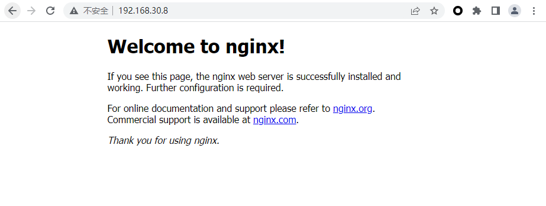

关闭nginx命令：

```bash
$ ./nginx -s stop
$ ./nginx -s quit
```

刷新配置文件：

```bash
$ ./nginx -s reload
```

其中配置文件路径为：`/usr/local/nginx/conf/nginx.conf`

接下来配置nginx开机启动：

在 `/lib/systemd/system/` 目录下创建 `nginx.service` 文件：

```bash
$ vim /lib/systemd/system/nginx.service
```

输入如下内容：[https://www.nginx.com/resources/wiki/start/topics/examples/systemd/](https://www.nginx.com/resources/wiki/start/topics/examples/systemd/)

```ini
[Unit]
Description=The NGINX HTTP and reverse proxy server
After=syslog.target network-online.target remote-fs.target nss-lookup.target
Wants=network-online.target

[Service]
Type=forking
PIDFile=/usr/local/nginx/logs/nginx.pid
ExecStartPre=/usr/local/nginx/sbin/nginx -t
ExecStart=/usr/local/nginx/sbin/nginx
ExecReload=/usr/local/nginx/sbin/nginx -s reload
ExecStop=/usr/local/nginx/sbin/nginx -s quit
PrivateTmp=true

[Install]
WantedBy=multi-user.target
```

加入开机自启动

```bash
$ systemctl enable nginx
Created symlink from /etc/systemd/system/multi-user.target.wants/nginx.service to /usr/lib/systemd/system/nginx.service.
```

其它命令：

```bash
$ systemctl reload nginx.service  # 重新加载nginx配置
$ systemctl start nginx.service　 # 启动nginx服务
$ systemctl stop nginx.service　  # 停止nginx服务
$ systemctl restart nginx.service # 重启nginx服务
$ systemctl status nginx.service  # 查看nginx服务当前状态
$ systemctl disable nginx.service # 停止开机自启动
```

### 4. 安装Apache

安装Apache用于http认证

```bash
$ yum install httpd
```

## Gerrit安装配置

### 1. 下载

gerrit各版本下载地址：[https://www.gerritcodereview.com/releases-readme.html](https://www.gerritcodereview.com/releases-readme.html)

war包下载完成后把它发送到Linux服务器，如果服务器可以联网，也可以直接执行以下命令下载：

```bash
$ wget https://gerrit-releases.storage.googleapis.com/gerrit-3.7.2.war –no-check-certificate
```

### 2. 安装

执行以下命令安装Gerrit：
```bash
$ cd ~/gerrit
$ export GERRIT_SITE=~/gerrit/gerrit_testsite
$ java -jar gerrit*.war init --batch --dev -d $GERRIT_SITE
$ java -jar gerrit*.war init -d $GERRIT_SITE
Using secure store: com.google.gerrit.server.securestore.DefaultSecureStore
[2023-04-02 09:58:38,456] [main] INFO  com.google.gerrit.server.config.GerritServerConfigProvider : No /root/gerrit/gerrit_testsite/etc/gerrit.config; assuming defaults

*** Gerrit Code Review 3.7.2
*** 


*** Git Repositories
*** 

Location of Git repositories   [git]: 

*** JGit Configuration
*** 


*** Index
*** 

Type                           [lucene]: 

*** User Authentication
*** 

Authentication method          [openid/?]: oauth
Git/HTTP authentication        [http/?]: 
Enable signed push support     [y/N]? 

*** Review Labels
*** 

Install Verified label         [y/N]? y

*** Email Delivery
*** 

SMTP server hostname           [localhost]: smtp.163.com
SMTP server port               [(default)]: 
SMTP encryption                [none/?]: 
SMTP username                  [root]: XXXXXXXXX@163.com
XXXXXXXXX@163.com's password   : 
              confirm password : 

*** Container Process
*** 

Run as                         [root]: 
Java runtime                   [/usr/lib/jvm/java-11-openjdk-11.0.16.0.8-1.el7_9.x86_64]: 
Copy gerrit-3.7.2.war to /root/gerrit/gerrit_testsite/bin/gerrit.war [Y/n]? 
Copying gerrit-3.7.2.war to /root/gerrit/gerrit_testsite/bin/gerrit.war

*** SSH Daemon
*** 

Listen on address              [*]: 
Listen on port                 [29418]: 
Generating SSH host key ... rsa... ed25519... ecdsa 256... ecdsa 384... ecdsa 521... done

*** HTTP Daemon
*** 

Behind reverse proxy           [y/N]? 
Use SSL (https://)             [y/N]? y
Listen on address              [*]: 127.0.0.1
Listen on port                 [8443]: 8081
Canonical URL                  [https://127.0.0.1:8081/]: http://192.168.30.8:8081
Create new self-signed SSL certificate [Y/n]? 
Certificate server name        [192.168.30.8:8081]: 
Certificate expires in (days)  [365]: 36500

*** Cache
*** 


*** Plugins
*** 

Installing plugins.
Install plugin codemirror-editor version v3.7.2 [y/N]? y
Installed codemirror-editor v3.7.2
Install plugin commit-message-length-validator version v3.7.2 [y/N]? y
Installed commit-message-length-validator v3.7.2
Install plugin delete-project version v3.7.2 [y/N]? y
Installed delete-project v3.7.2
Install plugin download-commands version v3.7.2 [y/N]? y
Installed download-commands v3.7.2
Install plugin gitiles version v3.7.2 [y/N]? y
Installed gitiles v3.7.2
Install plugin hooks version v3.7.2 [y/N]? y
Installed hooks v3.7.2
Install plugin plugin-manager version v3.7.2 [y/N]? y
Installed plugin-manager v3.7.2
Install plugin replication version v3.7.2 [y/N]? y
Installed replication v3.7.2
Install plugin reviewnotes version v3.7.2 [y/N]? y
Installed reviewnotes v3.7.2
Install plugin singleusergroup version v3.7.2 [y/N]? y
Installed singleusergroup v3.7.2
Install plugin webhooks version v3.7.2 [y/N]? y
Installed webhooks v3.7.2
Initializing plugins.

============================================================================
Welcome to the Gerrit community

Find more information on the homepage: https://www.gerritcodereview.com
Discuss Gerrit on the mailing list: https://groups.google.com/g/repo-discuss
============================================================================
Initialized /root/gerrit/gerrit_testsite
$  
```

其中 `~/gerrit` 是我的gerrit安装路径，出现 `Starting Gerrit Code Review: OK` 表示启动成功。

gerrit配置文件路径为：`/root/gerrit/gerrit_testsite/etc/gerrit.config`，我的gerrit.config文件内容如下：

```ini
[gerrit]
        basePath = git
        canonicalWebUrl = http://192.168.30.8:8081
        serverId = 737ce77e-a02f-4e6e-ab7b-daff97faf5da
[container]
        javaOptions = "-Dflogger.backend_factory=com.google.common.flogger.backend.log4j.Log4jBackendFactory#getInstance"
        javaOptions = "-Dflogger.logging_context=com.google.gerrit.server.logging.LoggingContext#getInstance"
        user = root
        javaHome = /usr/lib/jvm/java-11-openjdk-11.0.16.0.8-1.el7_9.x86_64
[index]
        type = lucene
[auth]
        type = http
        gitBasicAuthPolicy = HTTP
[receive]
        enableSignedPush = false
[sendemail]
        smtpServer = smtp.163.com
        smtpUser = XXXXXXXXX@163.com
        smtpServerPort = 25
        from = XXXXXXXXX@163.com
[sshd]
        listenAddress = *:29418
[httpd]
        listenUrl = http://192.168.30.8:8081/
[cache]
        directory = cache
```

停止命令：

```bash
$ /root/gerrit/gerrit_testsite/bin/gerrit.sh stop
Stopping Gerrit Code Review: OK
```

启动命令：

```bash
$ /root/gerrit/gerrit_testsite/bin/gerrit.sh start
Starting Gerrit Code Review: OK
```

重启命令：

```bash
$ /root/gerrit/gerrit_testsite/bin/gerrit.sh restart
Stopping Gerrit Code Review: OK
Starting Gerrit Code Review: OK
```

设置开机自动启动gerrit：

```bash
$ sudo ln -snf /root/gerrit/gerrit_testsite/bin/gerrit.sh  /etc/init.d/gerrit.sh
```

修改文件 `/etc/init.d/gerrit.sh` 设置gerrit安装路径`GERRIT_SITE`:

```sh
###################################################
## No GERRIT_SITE yet? We're out of luck!
###################################################
if test -z "$GERRIT_SITE" ; then
    GERRIT_SITE="/root/gerrit/gerrit_testsite"
fi
```

然后执行：

```bash
$ chkconfig --add gerrit.sh
$ chkconfig gerrit.sh on
```

### 3. nginx反向代理

编辑nginx配置文件`vim /usr/local/nginx/conf/nginx.conf`，添加如下内容：

```ini\
server {
        listen       80;
        server_name  localhost;
        index index.html index.htm index.php;
        access_log  /usr/local/nginx/logs/gerrit.access.log;
        error_log  /usr/local/nginx/logs/gerrit.error.log;
        allow   all;
        deny    all;
        auth_basic "Welcomme to Gerrit Code Review Site!"; 
        auth_basic_user_file /root/gerrit/gerrit_testsite/etc/gerrit.password; 
        location / {
                proxy_pass http://localhost:8081;
       }
}   
```

`auth_basic_user_file` 是用来保存gerrit用户名密码的文件。

重新加载配置：

```bash
$ systemctl reload nginx.service
```

### 4. 创建用户名密码

使用 htpasswd 命令创建用户名密码：

```bash
$ touch /root/gerrit/gerrit_testsite/etc/gerrit.password
$ htpasswd -c /root/gerrit/gerrit_testsite/etc/gerrit.password admin
New password:
Re-type new password:
Adding password for user admin
```

### 5. 启动

重启nginx:

```bash
$ systemctl reload nginx.service
$ systemctl restart nginx.service
```

重启gerrit：

```bash
$ /root/gerrit/gerrit_testsite/bin/gerrit.sh restart
```

启动成功后，浏览器访问gerrit：http://192.168.30.8/，其中192.168.30.8是我的服务器IP地址。

页面会弹出登录页面，输入创建的管理员用户名密码进行登录。

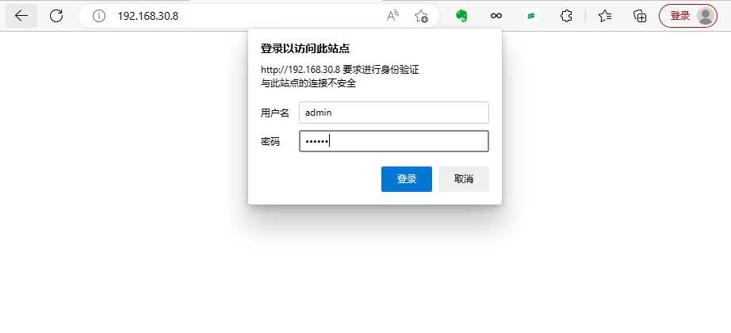

认证成功后会跳转到gerrit页面

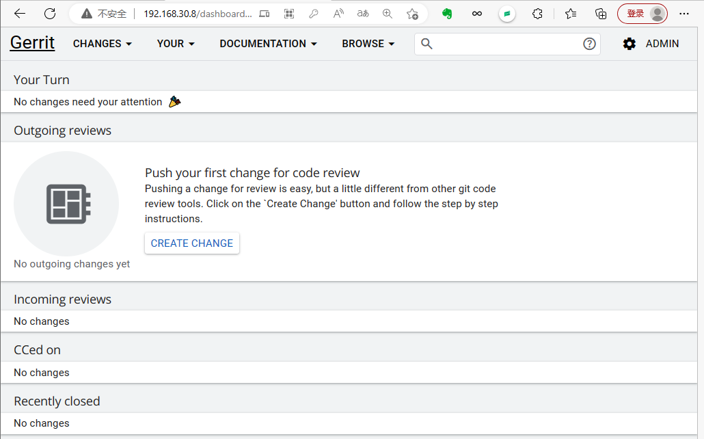

### 6. 邮箱配置

登录成功后，进入'Settings' > 'Email Addresses' 配置邮箱。

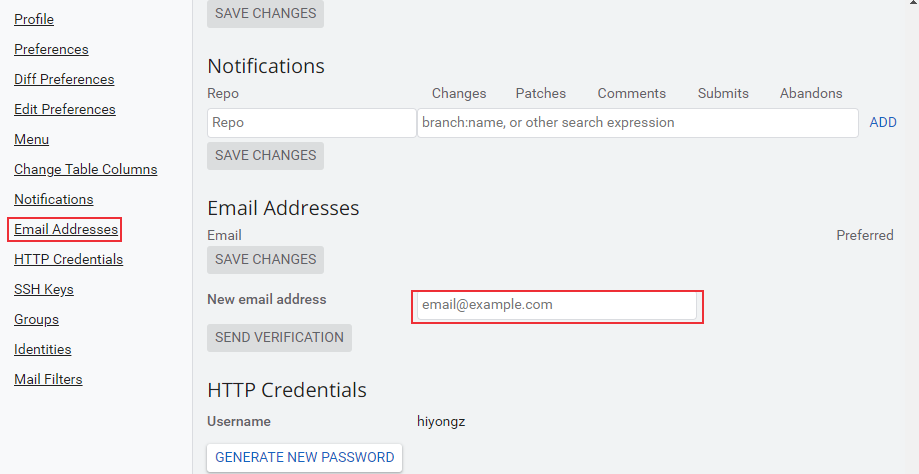

点击 ‘Send verification’ 后设置的邮箱会收到一封认证邮件

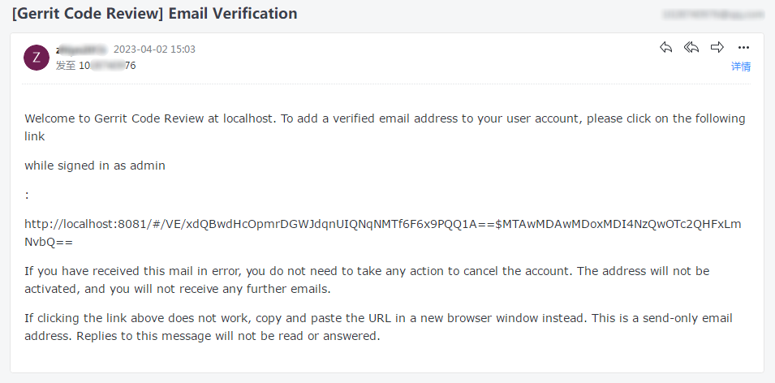

访问邮件中的链接（将localhost:8081改为主机地址192.168.30.8）[http://192.168.30.8/#/VE/xdQBwdHcOpmrDGWJdqnUIQNqNMTf6F6x9PQQ1A==$MTAwMDAwMDoxMDI4NzQwOTc2QHFxLmNvbQ==](http://192.168.30.8:8081/#/VE/xdQBwdHcOpmrDGWJdqnUIQNqNMTf6F6x9PQQ1A==$MTAwMDAwMDoxMDI4NzQwOTc2QHFxLmNvbQ==) 即可认证成功。

## 用户创建

和前面介绍的创建管理员账户一样，使用htpasswd 命令创建普通用户：

```bash
$ htpasswd -b /root/gerrit/gerrit_testsite/etc/gerrit.password gerrit 123456
Adding password for user gerrit
```

创建成功后使用用户名密码登录gerrit并配置邮箱即可。

## 创建项目仓库

主要有四种创建仓库方式：

1、Web页面进入'Browse' > 'Repositories' > 'CREATE NEW'

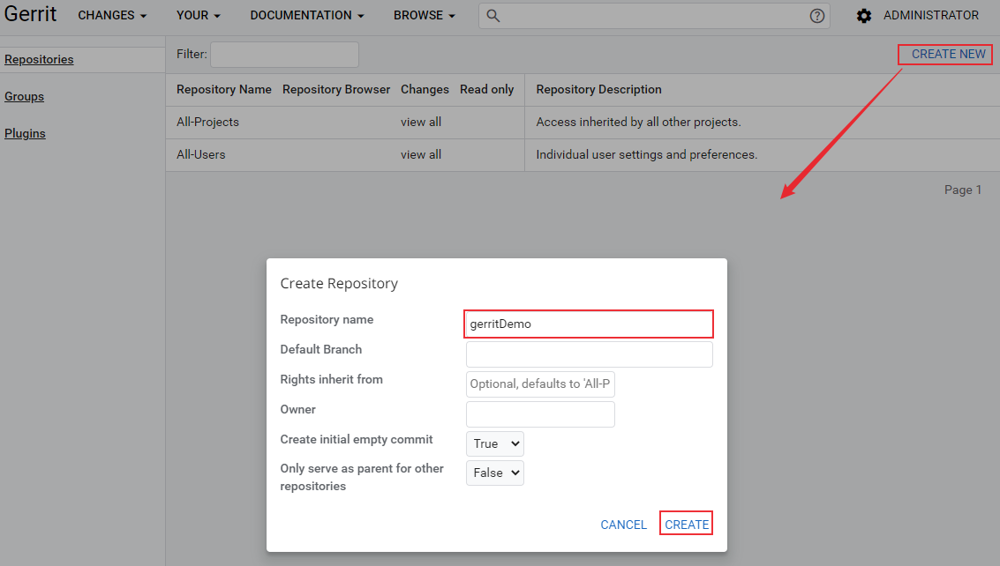

创建完成后进行仓库配置：

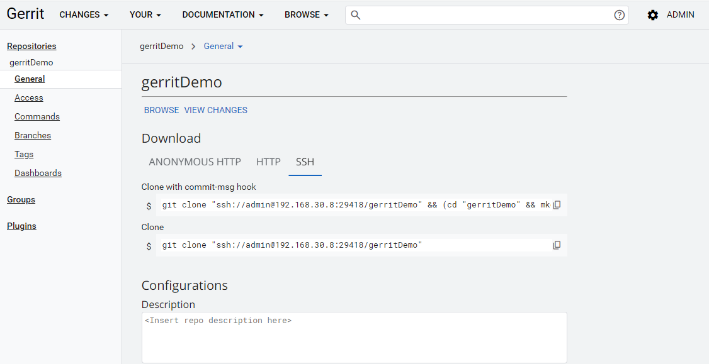


2、通过gerrit REST API创建

请求接口为 `PUT /projects/{project-name}`，请求次数参考[https://gerrit-documentation.storage.googleapis.com/Documentation/3.7.2/rest-api-projects.html#create-project](https://gerrit-documentation.storage.googleapis.com/Documentation/3.7.2/rest-api-projects.html#create-project)

3、通过SSH 命令创建

```
ssh -p <port> <host> gerrit create-project { <NAME> }
```

可用参数选项可参考[https://gerrit-documentation.storage.googleapis.com/Documentation/3.7.2/cmd-create-project.html](https://gerrit-documentation.storage.googleapis.com/Documentation/3.7.2/cmd-create-project.html)

4、也可以直接在gerrit服务器上手动创建

具体可参考[https://gerrit-documentation.storage.googleapis.com/Documentation/3.7.2/project-configuration.html#manual_project_creation](https://gerrit-documentation.storage.googleapis.com/Documentation/3.7.2/project-configuration.html#manual_project_creation)

## Git ssh key配置

开发环境需要安装Git，Windows和Linux系统上Git安装方法可参考[Git简易教程-安装及简单使用](https://blog.csdn.net/u010698107/article/details/111414654)。gerrit支持HTTP和SSH两种方式克隆项目，本文介绍SSH认证方式的配置方法。

### 1. 创建 ssh key

这一步目的是在本地（开发电脑）生成用于认证的公钥和私钥。

由于安全原因，GIT 2.33 及之后的版本禁用了 ssh-rsa 公钥签名算法，可使用ed25519算法来生成秘钥：

```bash
$ ssh-keygen -t ed25519 -C "123456789@qq.com" # 邮件地址是在gerrit平台上配置的邮箱 
```

密码不用设置，回车即可：

```bash
$ ssh-keygen -t ed25519 -C "123456789@qq.com"
Generating public/private ed25519 key pair.
Enter file in which to save the key (/c/Users/10287/.ssh/id_ed25519): 
Enter passphrase (empty for no passphrase):
Enter same passphrase again:
Your identification has been saved in id_ed25519
Your public key has been saved in id_ed25519.pub
The key fingerprint is:
SHA256:Ufs5p/nzaZ7dKQG8un2IRYkClI+Ro4+oT0f/8cCd+VE 123456789@qq.com
The key's randomart image is:
+--[ED25519 256]--+
|    ..o   .      |
|     *   . .     |
|    . * . + .    |
|   . . o o * .   |
|  . +   S . * E  |
| . o o . . = B   |
|. . . . + B = .  |
|.. .   . *.o =..*|
| ..     ..o.o =B+|
+----[SHA256]-----+
```

执行完成后会在 `~/.ssh` 目录下生成id_ed25519（私钥）和 id_ed25519.pub（公钥）这两个秘钥文件。

进入 .ssh 文件夹下，可以看到生成的秘钥文件：

```bash
$ cd ~/.ssh # 进入 .ssh 文件夹下
$ ls
id_ed25519  id_ed25519.pub known_hosts
```

### 2. gerrit添加公钥

访问gerrit，将生成的公钥添加到Gerrit SSH Keys中。

复制公钥：

```bash
$ cat id_ed25519.pub
ssh-ed25519 AAAAC3NzaC1lZDI1NTE5AAAAIPHx9bqXz3Hp9mpz0fC/1IcfkVASqZG6oecab3ItcW8j 123456789@qq.com
```

登录Gerrit，点击Setting，找到SSH Keys，粘贴复制的公钥，然后点击 ‘Add new SSH key’

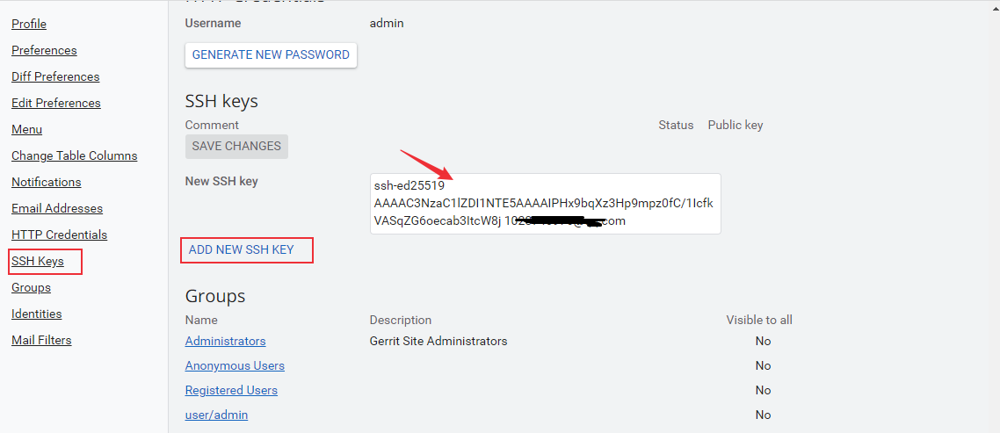


### 3. 生成ppk私钥文件

ppk私钥文件用于使用git GUI 克隆代码时使用的秘钥文件。

进入 `~/.ssh` 目录下，复制前面生成的私钥文件 `id_ed25519` 为后缀为ppk的文件：

```bash
$ cp id_ed25519 id_ed25519.ppk
```

打开PuTTYgen工具，点击【load】，加载复制的id_rsa_gerrit.ppk文件

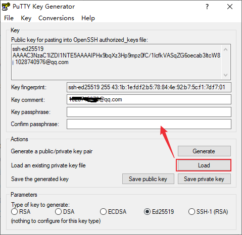

导入成功后，点击【Save private key】保存私钥，可以新创建一个文件或者覆盖原来复制的ppk文件。


### 4. 添加私钥

打开Pageant工具，加载保存的私钥文件。

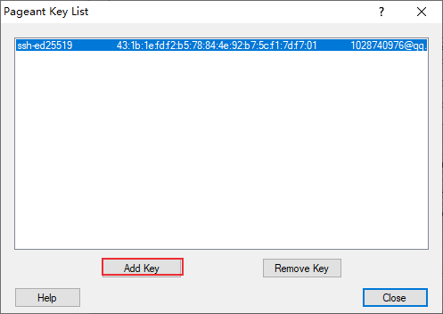

## 拉取项目仓库

公钥和私钥配置完成后，就可以克隆gerrit上的仓库了。登录gerrit，进入要克隆的仓库，选择ssh方式，复制clone命令。

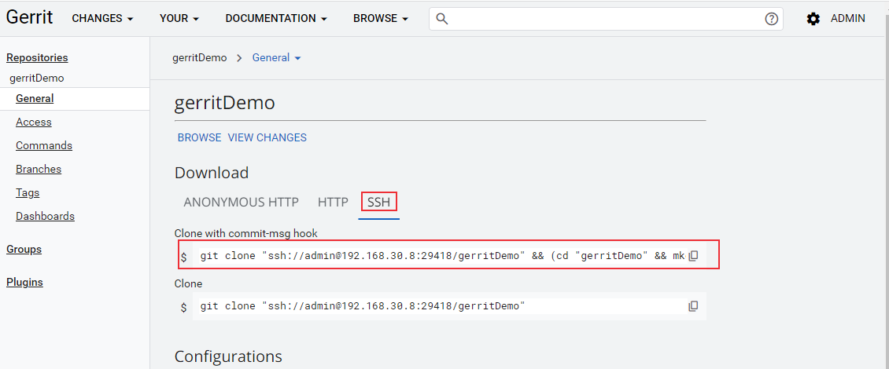


```bash
$ git clone "ssh://admin@192.168.30.8:29418/gerritDemo" && (cd "gerritDemo" && mkdir -p `git rev-parse --git-dir`/hooks/ && curl -Lo `git rev-parse --git-dir`/hooks/commit-msg http://192.168.30.8:8081/tools/hooks/commit-msg && chmod +x `git rev-parse --git-dir`/hooks/commit-msg)
```

上面的clone代码执行完成后，仓库 `/.git/hooks` 目录下面会有一个commit-msg钩子文件。

## 提交代码

提交示例：

```bash
$ echo test > test.txt
$ git status
On branch master
Your branch is up to date with 'origin/master'.

Untracked files:
  (use "git add <file>..." to include in what will be committed)
        test.txt

nothing added to commit but untracked files present (use "git add" to track)
$ git add test.txt
warning: in the working copy of 'test.txt', LF will be replaced by CRLF the next time Git touches it
$ git commit -m "gerrit提交测试"
[master 6e78c4e] gerrit提交测试
 1 file changed, 1 insertion(+)
 create mode 100644 test.txt

$ git push --progress "origin" master:refs/for/master
Enumerating objects: 4, done.
Counting objects: 100% (4/4), done.
Writing objects: 100% (3/3), 303 bytes | 303.00 KiB/s, done.
Total 3 (delta 0), reused 0 (delta 0), pack-reused 0
remote: Processing changes: refs: 1, new: 1, done
remote:
remote: SUCCESS
remote:
remote:   http://192.168.30.8:8081/c/gerritDemo/+/1 gerrit提交测试 [NEW]
remote:
To ssh://192.168.30.8:29418/gerritDemo
 * [new reference]   master -> refs/for/master

```

**注意**：push的远程分支为 `refs/for/master`，如果使用`master`分支会直接push到中央仓库，不会到暂存区。

## 审核代码

push成功后登录gerrit，可以看到刚才的提交

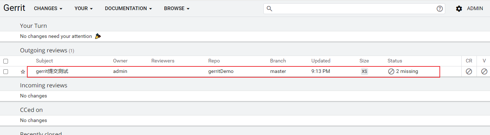

进入此次提交详细页面，可对提交的代码进行评审：

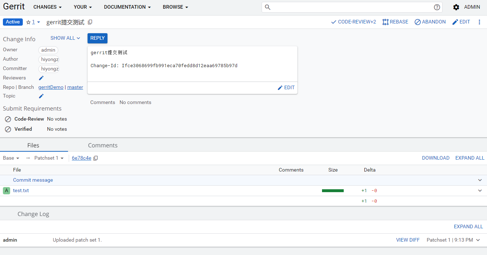

具体操作方法这里不做更多介绍了，可参考官方示例：[https://gerrit-documentation.storage.googleapis.com/Documentation/3.7.2/intro-gerrit-walkthrough.html](https://gerrit-documentation.storage.googleapis.com/Documentation/3.7.2/intro-gerrit-walkthrough.html)


评审通过后，点击SUBMIT提交到主仓库。

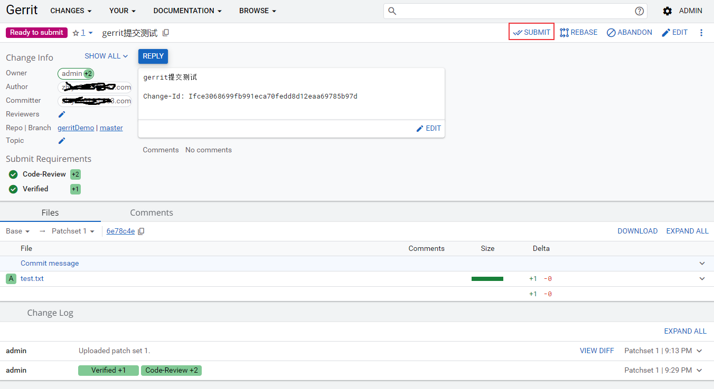

## 参考文档

1. [https://www.gerritcodereview.com/](https://www.gerritcodereview.com/)
2. [Working with Gerrit: An example (storage.googleapis.com)](https://gerrit-documentation.storage.googleapis.com/Documentation/3.6.2/intro-gerrit-walkthrough.html)
3. [How Gerrit Works (storage.googleapis.com)](https://gerrit-documentation.storage.googleapis.com/Documentation/3.6.2/intro-how-gerrit-works.html)
4. [Quickstart for Installing Gerrit on Linux (storage.googleapis.com)](https://gerrit-documentation.storage.googleapis.com/Documentation/3.6.1/linux-quickstart.html)
5. [https://gerrit-documentation.storage.googleapis.com/Documentation/3.7.2/linux-quickstart.html](https://gerrit-documentation.storage.googleapis.com/Documentation/3.7.2/linux-quickstart.html)
6. https://gerrit-documentation.storage.googleapis.com/Documentation/3.7.2/install.html
7. https://gerrit-documentation.storage.googleapis.com/Documentation/3.7.2/project-configuration.html
8. [https://gerrit-documentation.storage.googleapis.com/Documentation/3.7.2/project-configuration.html#manual_project_creation](https://gerrit-documentation.storage.googleapis.com/Documentation/3.7.2/project-configuration.html#manual_project_creation)
9. [https://gerrit-documentation.storage.googleapis.com/Documentation/3.7.2/intro-gerrit-walkthrough.html](https://gerrit-documentation.storage.googleapis.com/Documentation/3.7.2/intro-gerrit-walkthrough.html)
10. [https://zhuanlan.zhihu.com/p/83890573](https://zhuanlan.zhihu.com/p/83890573)
11. [https://gerrit-review.googlesource.com/Documentation/dev-plugins.html#_apitype](https://gerrit-review.googlesource.com/Documentation/dev-plugins.html#_apitype)


