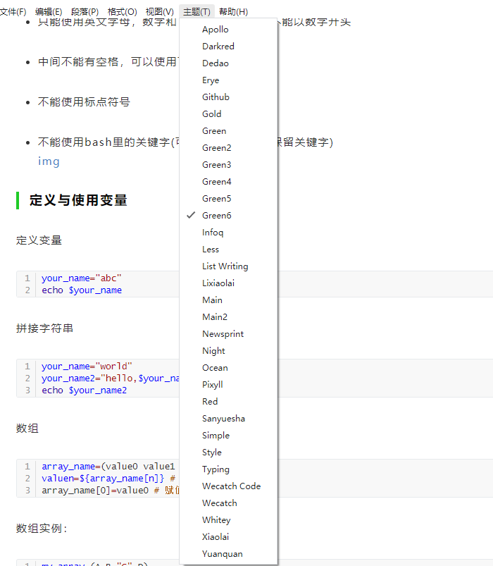
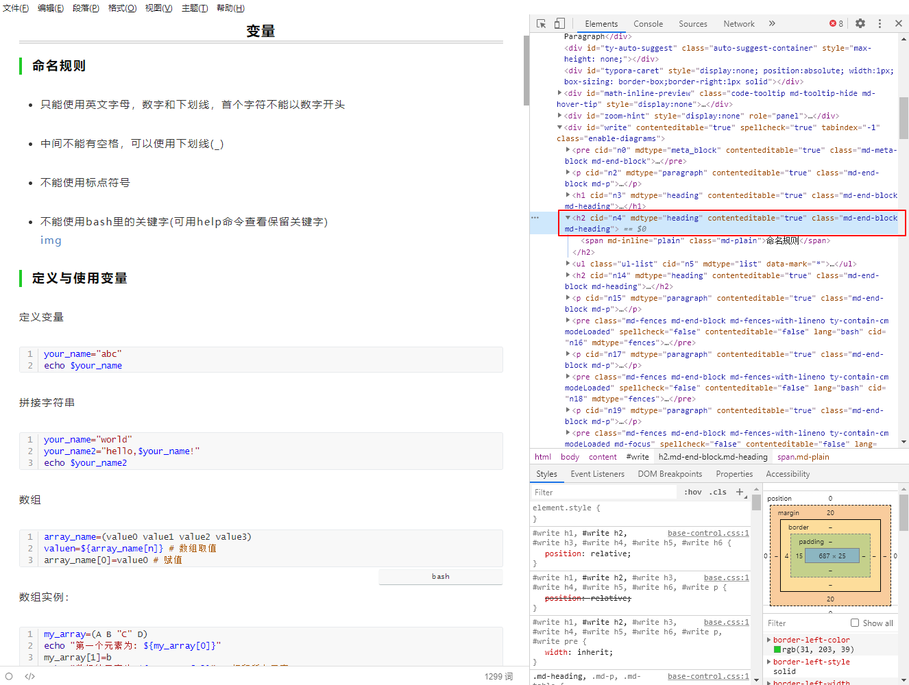
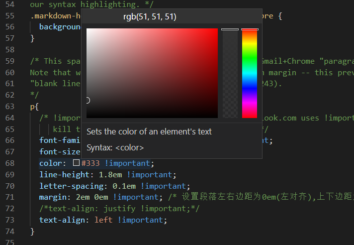
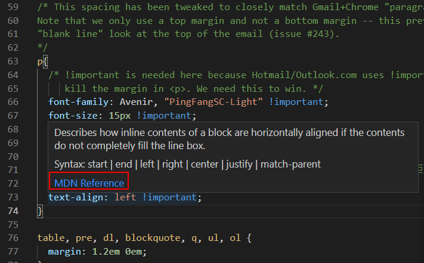

# typora主题配置：公众号一键排版
typora是一个非常易用且免费的markdown编辑器，是我最常用的文档编辑器。它支持实时渲染，不用打开两个窗口（源码窗口和预览窗口），真正实现了沉浸式写作，所谓所见即所得。它的界面简洁，操作简单，非常容易上手，这里就不介绍了。本文主要介绍Typora的主题配置，实现公众号一键排版。
<!--more-->

## 为什么要配置主题
typora支持配置渲染的样式，默认提供了 5 种主题。选择主题的其中一个目的是文章编辑完成后更加方便阅读，好的文章排版能提供不错的阅读体验。其次，通过typora将文章排版后，可以直接复制到公众号上，仅做简单的修改（添加图片）就可以发布了。公众号排版我尝试过网上提供的编辑器，感觉还是比较麻烦，也可能是我没找到正确的使用方法吧，不管怎样最终还是放弃了。使用typora就非常简单，完成文章编辑后，直接选择对应的主题进行自动排版，然后复制到公众号就可以了。

那么最关键的就是主题文件了，下面介绍怎么使用和修改主题文件。

## 主题文件使用
typora的主题文件其实就是CSS文件，了解前端开发的应该都知道，
CSS(Cascading Style Sheets, 层叠样式表) 是一种描述HTML 文档样式的语言，描述如何显示HTML 元素，typora可以根据CSS主题文件将文档渲染为对应样式的HTML文件，Typora 的窗口内容其实就是一个HTML网页。

### 主题文件下载
typora官方提供了多种主题：[https://theme.typora.io/](https://theme.typora.io/)，可以在上面下载喜欢的主题。Github上有个markdown-css项目也提供了一些主题：[http://wecatch.me/markdown-css/](http://wecatch.me/markdown-css/)。

### 导入主题文件
typora点击 文件 -> 偏好设置 -> 外观 -> 主题 -> 打开主题文件夹，会打开主题的存放目录，将你下载的主题文件复制到这个目录下，然后重新启动typora，在菜单栏的【主题】中就可以选择你加入的主题了。



## 主题文件修改
当然，除了下载网上提供的主题文件，也可以手动编写，定制个性化的主题。最省事的方法是在已有主题文件的基础上进行修改，如果对CSS语法不熟悉，可以参考多个主题文件进行修改。

### CSS语法
typora是一个markdown编辑器，主题文件使markdown文本具有一定的样式，也就是通过CSS渲染，因此，每个markdown类型对应了HTML中的元素标签，这样才能实现准确的渲染。

它们的对应关系可参考官方文档：[https://theme.typora.io/doc/zh/Write-Custom-Theme/](https://theme.typora.io/doc/zh/Write-Custom-Theme/)，上面有详细的介绍。比如标题(markdown类型：heading)对应CSS中的`h1~h6`；无序列表对应`ul li`。

CSS属性设置中，比较常见的就是设置字体以及HTML标签的位置、边距等，下面介绍CSS单位和边距属性设置方法。

#### CSS单位

- 1em： 等于当前的字体尺寸。
- 2em： 等于当前字体尺寸的两倍
- 1 pt： 1磅，等于 1/72 英寸
- px：像素 (计算机屏幕上的一个点)

#### CSS margin 属性
设置外边距属性，设置给定元素四个（上下左右）方向的边距。也可以单独设置属性：margin-top，margin-right，margin-bottom，和 margin-left：[https://developer.mozilla.org/zh-CN/docs/Web/CSS/margin](https://developer.mozilla.org/zh-CN/docs/Web/CSS/margin)

```css
/* 所有 4 个外边距都是 2em */
p {
    margin: 2em
}

/* 上下边距2em 左右边距1em */
p {
    margin: 2em 1em
}

/* 上边距3em 左右边距2em 下边距1em*/
p {
    margin: 3em 2em 1em
}

/* 上边距3em 右边距2em 下边距1em 左边距2em*/
p {
    margin: 3em 2em 1em 2em
}
```

### 修改主题文件
先选择一个主题文件，选择你喜欢的主题，然后在它的基础上进行小幅修改。

Typora提供两种主题调试和测试方法：
**一种方法是使用Theme Toolkit**：
在浏览器中进行调试，也就是使用浏览器自带的开发工具进行调试，具体使用方法参考：[https://github.com/typora/typora-theme-toolkit](https://github.com/typora/typora-theme-toolkit)

**第二种方法是直接在Typora中进行调试**：
windows系统中，Typora 点击 文件 -> 偏好设置 -> 通用 -> 高级设置，勾选【开启调试模式】，然后切换到文章，菜单栏点击【视图】，选择【开发者工具】：




这就和浏览器调试一样了，对相应的标签元素进行调整。

得到合适的CSS属性参数后，需要修改CSS文件才能永久生效，可以使用VScode打开CSS文件，它有以下优点：

1. 方便选择颜色（浏览器调试工具也可以）

2. 方便查找CSS属性文档
将鼠标放在标签属性上方就会弹出文档链接，下图点击链接可以打开text-align设置文档。



本文的排版就是使用typora实现的一键排版。


