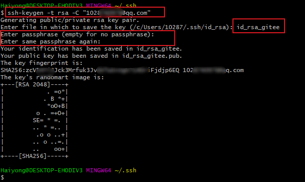
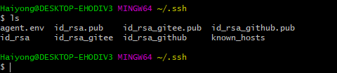
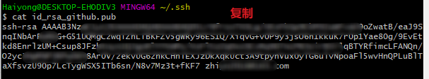
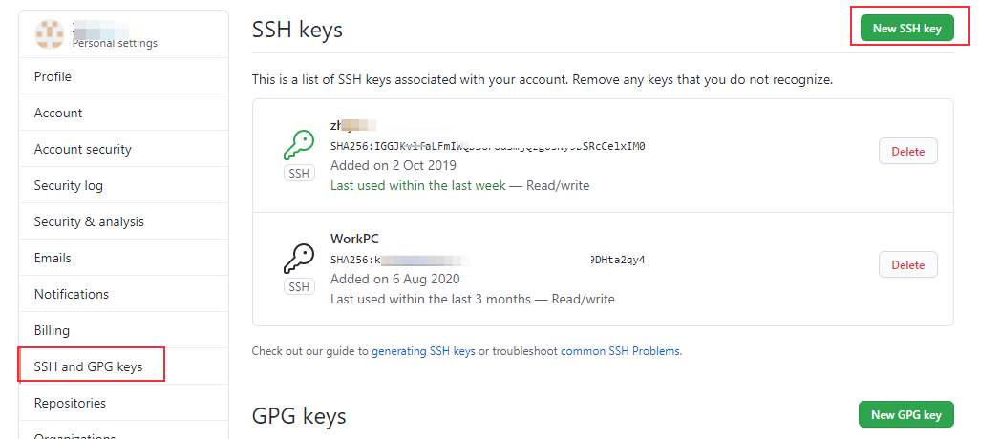
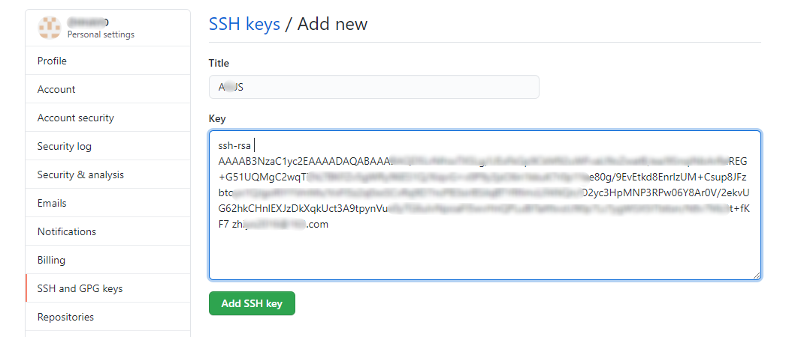
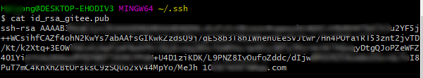
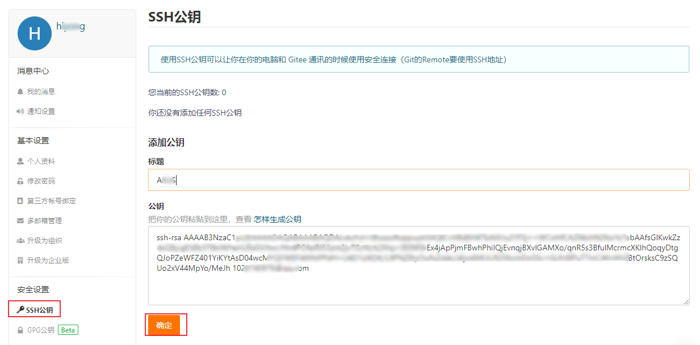
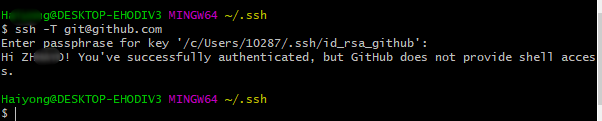
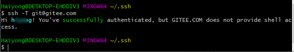

# 同一台电脑配置Gitee、Github 的 Git SSH公钥
为了安全，远程登录上传项目需要通过认证，Git 服务器基本都使用 SSH 公钥进行认证登录，为了减去每次登录需要输入秘钥的麻烦，可以事先配置ssh公钥，SSH 密钥默认存储在 ~/.ssh 目录下。<!--more--> 下面介绍一台电脑上配置 Gitee 和 GithubSSH公钥的方法。

## 1. 清除 git 的全局设置
如果已经配置Git，需要先清除git 的全局设置，如果没有就跳过这一步。
`git config --global --list` 查看是否设置：


删除设置
```sh
git config --global --unset user.name
git config --global --unset user.email
git config --global --unset yser.name
git config --global --unset yser.email
```
## 2. 创建 ssh key
进入 .ssh 文件夹下，生成 key
```sh
cd ~/.ssh # 进入 .ssh 文件夹下
# 生成 key，邮件地址为 Gitee 或者 Github 使用的邮件地址 
ssh-keygen -t rsa -C "xxx@xxx.com"
```
### 配置Github 的 ssh key 
```sh
ssh-keygen -t rsa -C "Github 使用的邮件地址"
```

设置 Github 的 ssh key 为 id_rsa_github


### 配置Gitee 的 ssh key 
```sh
ssh-keygen -t rsa -C "Gitee 使用的邮件地址"
```

设置 Gitee 的 ssh key 为 id_rsa_gitee


完成后会在~/.ssh / 目录下生成以下文件
* id_rsa.github
* id_rsa.github.pub
* id_rsa.gitee
* id_rsa.gitee.pub



## 3. 在 Github 和 Gitee 中添加 public key
进入 .ssh 文件夹下
```sh
cd ~/.ssh
```

### 配置GitHub 的public key
复制 public key
```sh
# 查看 id_rsa_github.pub 文件内容 
cat id_rsa_github.pub
```


点击新增 SHH key


粘贴复制的public key


### 配置Gitee 的public key
复制 public key，新增 SHH key
```sh
# 查看 id_rsa_github.pub 文件内容 
cat id_rsa_gitee.pub
```




## 4. 创建配置文件 解决ssh冲突
在 .ssh 文件夹中创建 config 文件
```sh
cd ~/.ssh 
vim config 
```

添加以下内容以区分两个 ssh key：
```sh
# github
Host github.com
HostName github.com
PreferredAuthentications publickey
IdentityFile ~/.ssh/id_rsa_github

# gitee
Host gitee.com
HostName gitee.com
PreferredAuthentications publickey
IdentityFile ~/.ssh/id_rsa_gitee
```

## 5. 测试连接是否正常
```sh
ssh -T git@github.com
```

查看是否连接成功


```sh
ssh -T git@gitee.com
```
连接成功


