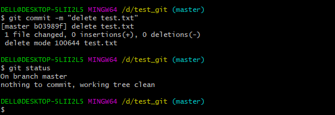

# Git简易教程-安装及简单使用
Git是一种版本控制器，在项目开发中可以用来托管代码，本文介绍Git的简单使用。
<!--more-->

## 一、下载安装Git

### 1. Git下载

地址：https://git-scm.com/download/win


### 2. 安装

检验是否安装成功 电脑桌面或者其他任意文件夹下，点击鼠标右键，如果看到Git GUI和Git Bash则表示安装成功


Git Bash是为了方便你在windows下使用git命令的模拟终端，我们可以在git bash中执行一些shell命令。

### TortoiseGit安装
git GUI客户端有很多种：[https://git-scm.com/downloads/guis/](https://git-scm.com/downloads/guis/)

Windows平台推荐使用TortoiseGit，可以通过图形化界面操作git，下载地址：[https://tortoisegit.org/download/](https://tortoisegit.org/download/)

## 二、Git配置

### 初始化配置

#### 1. 配置用户名和邮箱
```shell
git config --global user.name "username" // 添加用户名，username为你在github上注册的用户名。  
git config --global user.email 123456789@qq.com // github设置的邮箱地址，改成自己的邮箱。 
```
添加局部用户名和邮箱
```shell
git config user.name "username" 
git config user.email "123456789@qq.com"
```

#### 2. 查看是否配置成功
```shell
git config --list 
```


### 初始化新的Git仓库

1. 新建文件目录或者进入已有的文件目录下 可以通过cd的方法进入，或者直接在目录下右键->选择Git Bash Here
2. 创建Git仓库
```shell
git init 
```


执行成功后，当前目录下会生成一个.git的隐藏文件夹，仓库创建完成。


## 三、Git文件管理


查看git帮助信息
```shell
git help
```

### 添加文件

#### 1. 查询状态
```shell
git status 
```


#### 2. 将文件添加到暂存区
```shell
git add test.txt 
```

```shell
git add file //跟踪 -添加到暂存区 
git add file1 file2 file3 
git add folder/* 
git add folder/*.py 
git add folder 

```
添加所有改动文件：
```sh
git add . # 添加所有改变的文档，包括文件内容编辑(modified)以及新文件(new)，不包括被删除（deleted）的文件
git add -u # 添加编辑或者删除的文件，不包括新添加的文件。
git add --all# 或者git add -A，添加所有改变的文件
```

#### 3. 从暂存区提交到本地Git仓库
```shell
git commit -m "add test.txt"
```

```shell
git log //查看提交记录
```
第2步和第3步可以直接使用命令:
```shell
git commit -am "提交注释”
```
### 删除文件

#### 1. 删除文件
```shell
git rm "test.txt"
```


 也可以直接手动删除文件

删除文件夹
```shell
git rm -r foldername/
```
#### 2. 提交到本地Git仓库
```shell
git commit -m "delete test.txt"
```



### Git分支
#### 创建分支
```shell
git branch yourbranch  //创建分支
git checkout yourbranch  //切换分支
git checkout -b yourbranch  //创建并切换到分支
```

#### 合并分支
```shell
git checkout master
git merge yourbranch //合并指定分支yourbranch到当前分支master
```
#### 删除分支
```shell
git branch -d yourbranch //删除本地分支
git push origin -d yourbranch  //删除远程分支
```


### Git远程仓库

可以将本地仓库备份到远程服务器上的git仓库，实现代码共享，下面介绍本地Git仓库和Github 远程仓库的连接。

如果没有GitHub账号需要先注册一个：[https://github.com/](https://github.com/)

本地Git仓库和GitHub仓库之间通信采用SSH协议加密，Git SSH公钥配置方法参考：[同一台电脑配置Gitee、Github 的 Git SSH公钥](https://blog.csdn.net/u010698107/article/details/113485131)。

#### 1. 将本地仓库同步到git远程仓库
```shell
git push 
```

如果是首次push，没有添加远程链接，在github创建新的仓库，然后复制仓库URL链接：
```shell
git remote add origin https://github.com/xxxxx/xxxxx.git  
git push --set-upstream origin master
git push -u origin master 
git remote remove origin //取消远程关联
```
Push新仓库
```shell
git init
git add README.md
git commit -m "first commit"
git branch -M master
git remote add origin git@github.com:ZHHAYO/vuepress-blog.git
git push -u origin master
```
Push存在的仓库
```shell
git remote add origin git@github.com:ZHHAYO/vuepress-blog.git
git branch -M master
git push -u origin master
```

#### 2. 将远程仓库复制到本地

github项目仓库地址复制： 


```shell
git clone 仓库地址
```


下载远程仓库指定分支代码：

```sh
git clone -b 分支名 远程仓库地址
```

将远程仓库克隆到本地后，会生成一个.git的目录


查看.git/config文件


可以看到当前本地分支为master，git branch查看本地分支


关联的远程库为origin，可以通过`git remote`查看


远程库origin所在的位置为 [git@github.com:ZHHAYO/python_notes.git](mailto:git@github.com:ZHHAYO/python_notes.git)


.git\refs\heads\master文件内容为：

7cf7212890aabea789631a02881861dcd08dac46

表示本地仓库最新的commit id

.git\logs文件夹下保存的是.git\refs文件夹下相应文件的变更记录
```shell
.git\logs\HEAD
.git\logs\refs\remotes\origin\HEAD 
.git\logs\refs\heads\master
```
三个文件 内容如下：


#### 3. 本地仓库更新

如果远程仓库更新，可以使用**git pull或者git fetch + git merge**命令，将远程项目更新到本地。 
```shell
git fetch origin master 
git merge origin/master

git pull origin master
```
git pull和git merge的区别参考：https://blog.csdn.net/a19881029/article/details/42245955

#### 4. 查看远程仓库地址
```shell
git remote -v 
```


查看远程仓库和本地仓库之间的关系：

```sh
$ git remote show origin
* remote origin
  Fetch URL: https://github.com/hiyongz/PythonNotes.git
  Push  URL: https://github.com/hiyongz/PythonNotes.git
  HEAD branch: master
  Remote branch:
    master tracked
  Local branch configured for 'git pull':
    master merges with remote master
  Local ref configured for 'git push':
    master pushes to master (up to date)

```

## 四、gitignore文件
在使用Git管理仓库时，可能有些文件不需要进行版本管理，需要忽略的文件可以使用 `.gitignore` 文件来跟踪，该文件一般放在项目仓库的根目录下。

`.gitignore` 使用[glob](https://linux.die.net/man/7/glob)规则来匹配文件路径，开始是在Unix系统中用来匹配文件路径的，使用通配符匹配路径，很多编程语言也实现了glob方法，比如Python的glob模块。下面举几个 `.gitignore` 语法示例：

|             语法             | 说明                                                |
| :--------------------------: | :-------------------------------------------------- |
|             log              | 匹配名称为log的文件和目录，包括目录下的文件及子目录 |
|             log/             | 匹配名称为log的目录，包括目录下的文件及子目录       |
|            **/log            | 匹配名称为log的任何目录                             |
|       **/log/test.log        | 匹配名称为log的目录下的test.log文件                 |
|            *.log             | 匹配后缀为log的所有文件                             |
|          /test.log           | 只匹配根目录下的test.log                            |
|           test.log           | 匹配所有test.log文件                                |
|          test?.log           | 匹配test开头，后面只有一个字符的log文件             |
| test[0-9].log、test[a-z].log | test后为单个数字、字母的log文件                     |

`.gitignore` 文件使用`#` 来注释：

```bash
# ignore all log
*.log
```

## github访问问题

访问github经常不成功， 推荐一个代理工具dev-sidecar，地址为 [https://gitee.com/docmirror/dev-sidecar](https://gitee.com/docmirror/dev-sidecar) 。使用方法参考说明文档。


## 报错信息
### git push报错
```text
OpenSSL SSL_connect: Connection was reset in connection to github.com:443
```
解决：
```sh
$ git config --global --unset http.proxy
```
### git clone报错
报错信息：
```text
$ git clone https://github.com/hiyongz/GoProjects.git
Cloning into 'GoProjects'...
fatal: unable to access 'https://github.com/hiyongz/GoProjects.git/': OpenSSL SSL_connect: Connection was reset in connection to github.com:443
```

解决方案：关闭ssl认证
```sh
$ git config --global http.sslVerify false
```

### token认证

2021.8.14更新：

现在github去除了密码认证方式，通过HTTPS访问GitHub，需要token认证。

```bash
$ git pull
remote: Support for password authentication was removed on August 13, 2021. Please use a personal access token instead.
remote: Please see https://github.blog/2020-12-15-token-authentication-requirements-for-git-operations/ for more information.
fatal: unable to access 'https://github.com/hiyongz/MyBlog.git/': The requested URL returned error: 403

```

个人token创建方法参考：[https://docs.github.com/en/github/authenticating-to-github/keeping-your-account-and-data-secure/creating-a-personal-access-token](https://docs.github.com/en/github/authenticating-to-github/keeping-your-account-and-data-secure/creating-a-personal-access-token)

生成个人token如下：


记得保存一下token！

个人访问token只支持HTTPS，如果你的远程仓库使用SSH，需要[切换为HTTPS](https://docs.github.com/en/get-started/getting-started-with-git/managing-remote-repositories#switching-remote-urls-from-ssh-to-https)。使用 `git remote -v` 命令查看远程项目URL地址。

切换HTTPS命令：

```dh
$ git remote set-url origin https://github.com/USERNAME/REPOSITORY.git
```

查看是否设置凭证
```sh
$ git config credential.helper
manager-core
```
清除凭证管理：
```sh
$ echo url=https://github.com/account | git credential reject
```
account为你的github用户名。

接下来的git操作如果要你输入用户名和密码，其中密码为前面获取的token值。


**参考：**

1. git - 简明指南：[http://rogerdudler.github.io/git-guide/index.zh.html](http://rogerdudler.github.io/git-guide/index.zh.html)
2. 廖雪峰git 教程：[https://www.liaoxuefeng.com/wiki/0013739516305929606dd18361248578c67b8067c8c017b000](https://www.liaoxuefeng.com/wiki/0013739516305929606dd18361248578c67b8067c8c017b000)
3. [Support for password authentication was removed. Please use a personal access token instead](https://stackoverflow.com/questions/68775869/support-for-password-authentication-was-removed-please-use-a-personal-access-to)
2. 清除凭证管理：[https://git-scm.com/docs/gitfaq#http-reset-credentials](https://git-scm.com/docs/gitfaq#http-reset-credentials)


