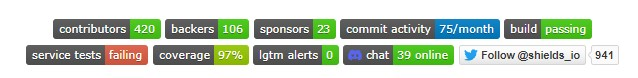
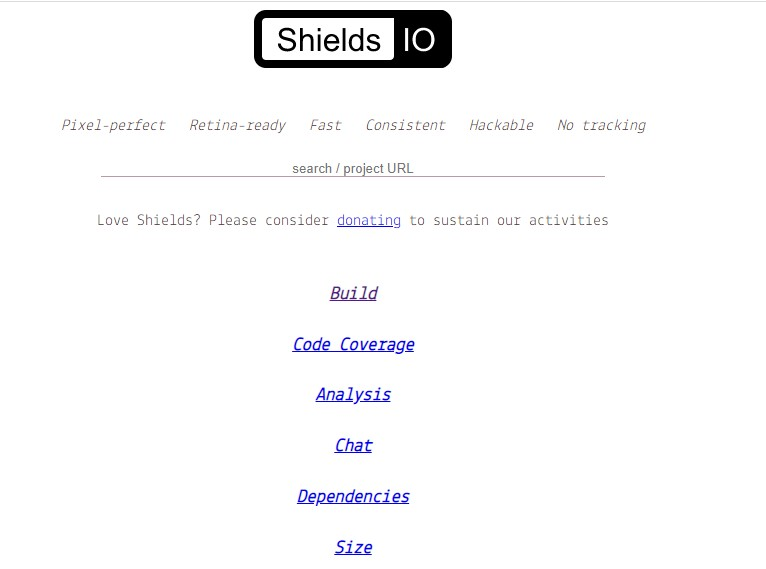
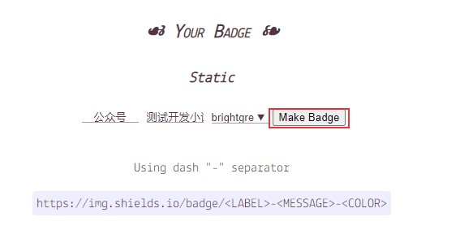
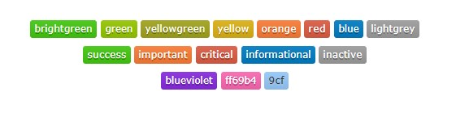

# Github shields徽章配置方法介绍
你可能会注意到很多GitHub项目有很漂亮的徽章，它们可以用来显示项目的进度，版本等信息：



本文介绍shields徽章配置方法。


<!--more-->

## 自定义徽章

shields徽章可用来说明项目状态或者版本等信息，可以访问官网 [https://www.shields.io/](https://www.shields.io/) 制作徽章，


找到Your BADGE 自定义定制徽章，输入标签和信息，点击生成：



然后就可以使用生成的shields链接了。
```html
<a href="docs\img\wechat.png"></a>
```
效果：
<p align="center">
  <a href="docs\img\wechat.png"></a>
</p> 

也可以直接编辑URL：
```bash
https://img.shields.io/badge/<LABEL>-<MESSAGE>-<COLOR>.svg
# 或者
https://img.shields.io/static/v1?label=<LABEL>&message=<MESSAGE>&color=<COLOR>
```
## 参数设置

有以下几种颜色可以选择：

brightgreen、green、yellow、green、yellow、orange、red、blue、lightgrey、success、important、critical、informational、inactive、blueviolet、ff69b4、9cf。



还可以配置style和logo参数
```bash
https://img.shields.io/badge/%E5%85%AC%E4%BC%97%E5%8F%B7-%E6%B5%8B%E8%AF%95%E5%BC%80%E5%8F%91%E5%B0%8F%E8%AE%B0-brightgreen.svg?style=social&logo=telegram
```

<p align="center">
  <a href="docs\img\wechat.png"></a>
</p> 
style样式默认为flat，还可以设置为plastic、flat-square、for-the-badge和social。

logo可以选择Simple Icons：[https://simpleicons.org/](https://simpleicons.org/)上提供的图标，比如微信的图标：

```bash
logo=WeChat
```
<p align="center">
  <a href="docs\img\wechat.png"></a>
  <a href="docs\img\wechat.png"></a>
</p> 
还可以设置其它参数，更多玩法可到 [https://shields.io/](https://shields.io/) 查阅。


## 设置链接

可以给徽章设置一个链接
```bash

```


或者使用HTML语法：
```html
<a href="https://blog.csdn.net/u010698107"></a>
```
<p align="center">
	<a href="https://blog.csdn.net/u010698107"></a>
</p> 


