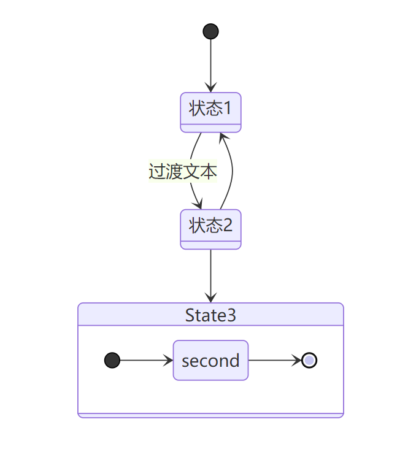

# markdown图表语法Mermaid介绍
Markdown是一种轻量级标记语言，除了编辑文字外，还支持插入图片、表格、公式，它是很流行的一种文档编辑语言，很多博客平台都支持使用Markdown来编辑文章。Markdown还有一个好用的功能是画流程图，基于Mermaid库来渲染流程图，语法比较简洁，本文将介绍Markdown的Mermaid简单使用方法。

<!--more-->

Mermaid 是一个基于 Javascript 的图表绘制工具，可用于创建流程图、时序图、甘特图、类图、状态图、饼图等。

Mermaid集成到了很多 Markdown 编辑器中，本文使用的是Typora编辑器，在代码块中编写Mermaid代码，编程语言名字设置为 `mermaid` 。

接下来介绍Mermaid语法。

## 流程图
### 1. 定义流程图节点及节点名称

```
flowchart LR
    A[Start]
```


### 2. 定义流程图方向

可设置4个方向：

- TD - top-down，从上到下。或者使用TB（top to bottom）
- BT - bottom to top，从下到上
- RL - right to left，从右到左
- LR - left to right，从左到右


```
flowchart TD
    A --> B
```


```
flowchart LR
    A --> B
```


### 3. 节点形状

默认节点形状为长方形，也可以设置为其它形状。

```
flowchart LR
    A(圆角矩形) -.- B([椭圆形]) -.- C((圆形)) -.- D[(圆柱形)]
	E[[subroutine]] -.- F>非对称形状] -.- G{菱形} -.- H{{六角形}}
	I[/平行四边形/] -.- J[\平行四边形\] -.- K[\梯形/] -.- L[/梯形\]
```


### 4. 节点连线


```
flowchart LR    
    A1 -- 箭头和文本 --> B1 --> |箭头和文本| C1 --> D1
    A2 == 加粗直线箭头 ==> B2 ==> C2
    A3 -- 无箭头 --- B3 ---|无箭头| C3 --- D3   
    A4 -. 虚线 .- B4 -.- C4 -. 虚线 .-> D4 -.-> E4
```


### 5. 多节点连接

```
flowchart LR
    A --> B & C--> D
```


```

flowchart TD
    A & B--> C & D
```


或者

```
flowchart TD
    A --> C
    A --> D
    B --> C
    B --> D
```


可通过增加短横线来增加连线长度。
```
flowchart TD
    A[Start] --> B{Is it?}
    B -->|Yes| C[OK]
    C --> D[Rethink]
    D --> B
    B ---->|No| E[End]
```


虚线或粗连线，可增加等号或点来延长连线：

| Length   | 1      | 2       | 3        |
| -------- | ------ | ------- | -------- |
| 连线     | `---`  | `----`  | `-----`  |
| 箭头     | `-->`  | `--->`  | `---->`  |
| 加粗连线 | `===`  | `====`  | `=====`  |
| 加粗箭头 | `==>`  | `===>`  | `====>`  |
| 虚线     | `-.-`  | `-..-`  | `-...-`  |
| 虚线箭头 | `-.->` | `-..->` | `-...->` |

### 6. 其它类型箭头

```
flowchart LR
    A --o B
    B --x C
```


```
flowchart LR
    A o--o B
    B <--> C
    C x--x D
```


### 7. 特殊字符

如果文本中有字符可以用双引号：
```
flowchart LR
    A["括号 (text)"]
```


```
flowchart LR
    A["括号 [text]"]
```


如果文本中要使用双引号或者其它更多特殊字符，可以使用HTML 实体来表示：
```
flowchart LR
    A["引号#quot;"]
```


```
flowchart LR
    A["美元符号#36;"]
```


```
flowchart LR
    A["笑脸#128512;"]
```


更多HTML字符可参考[https://www.w3school.com.cn/charsets/index.asp](https://www.w3school.com.cn/charsets/index.asp)


### 8. 子图
```
flowchart TB
    b2-->a2
    subgraph A [one]
    a1-->a2
    end
    subgraph B [two]
    b1-->b2
    end
```


可以通过设置样式来设置流程图边框，具体设置方法可参考：https://mermaid-js.github.io/mermaid/#/flowchart


## 时序图

举几个时序图的例子：

```
sequenceDiagram
    autonumber
    participant B as Browser
    participant C as Controller
    participant M as Model    
    participant V as View
    B ->> C: Request
    C ->> M: 数据请求
    M ->> C: 返回数据
	C ->> V: 发送数据
	V ->> B: Response
```


```
sequenceDiagram
    autonumber
    participant A
    participant B
    A -> B: 实线
    A --> B: 虚线
    A ->> B: 实线箭头
    A -->> B: 虚线箭头
    A -x B: 实线箭头+十字
    A --x B: 虚线箭头+十字 
	loop
        B->>B
```


## 类图

Mermaid也支持类图，[https://mermaid-js.github.io/mermaid/#/classDiagram](https://mermaid-js.github.io/mermaid/#/classDiagram)：

```
 classDiagram
      Animal <|-- Duck
      Animal <|-- Fish
      Animal <|-- Zebra
      Animal : +int age
      Animal : +String gender
      Animal: +isMammal()
      Animal: +mate()
      class Duck{
          +String beakColor
          +swim()
          +quack()
      }
      class Fish{
          -int sizeInFeet
          -canEat()
      }
      class Zebra{
          +bool is_wild
          +run()
      }
```


## 状态图

Mermaid状态图语法和plantUml一样。

```
stateDiagram-v2
    state "状态1" as State1
    State2 : 状态2    
    [*] --> State1

    State1 --> State2: 过渡文本
    State2 --> State1
    State2 --> State3
    state State3 {
        [*] --> second
        second --> [*]
    }
```



## 甘特图
甘特图例子：

```
gantt
    title 甘特图
    dateFormat  YYYY-MM-DD
    section 项目
    A 项目           :A1, 2022-01-01, 30d
    B 项目     :after A1  , 20d
    section 子任务
    子任务1      :2022-01-12  , 12d
    子任务2      : 24d
```


## 饼图

Mermaid可以用来渲染饼图：

```
pie title 标题
    "Dogs" : 38
    "Cats" : 85
    "Rats" : 15
```


Mermaid除了可以渲染流程图、时序图、甘特图、类图、状态图和饼图外，还可以用来画实体关系图、需求图等，更多语法课参考官方文档：[https://mermaid-js.github.io/mermaid/#/](https://mermaid-js.github.io/mermaid/#/) 。


