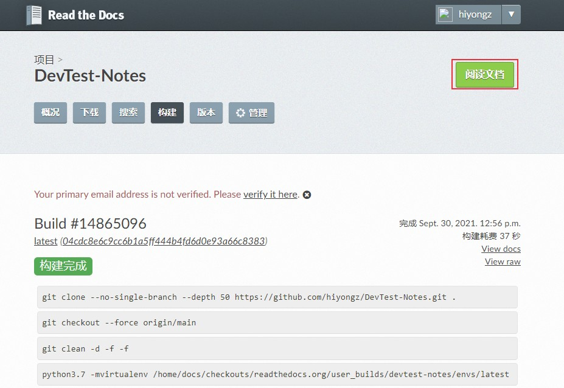

# 电子书创建：Sphinx + Github + ReadTheDocs
我写博客的初衷是为了系统的构建自己的知识体系，目前使用的平台有微信公众号，CSDN，博客园，GitHub Pages和Gitee Pages，他们都各有优缺点，整理的笔记多了之后发现这些平台不是很方便，比如公众号，CSDN和博客园，每次写完文章后，还需要再平台上进行编辑再发布，比较麻烦；GitHub Pages和Gitee Pages虽然可以快速发布，但是在文章系统管理上不是很方便。我希望将笔记整理成类似电子书一样，方便搜索和管理，经过查询资料，发现了ReadTheDocs这个文档管理工具，比较符合我的需求。可以使用 Sphinx 生成文档，GitHub 托管文档，然后导入到 ReadtheDocs进行展示，本文记录一下搭建过程。


<!--more-->

## 准备条件
1、github账号
使用[github](https://github.com/)对文档进行版本管理

2、注册Read the Docs账号
官网地址：[https://readthedocs.org/](https://readthedocs.org/)

3、安装Python
[Sphinx](https://www.sphinx.org.cn/)是一个python工具，用于生成文档，所以需要安装Python环境。

## Sphinx创建文档

Sphinx是一个基于Python的文档生成项目，开始是用来生成 Python 官方文档的工具，更多介绍可参考官网：[https://www.sphinx.org.cn/](https://www.sphinx.org.cn/) 。

### 1. 安装Sphinx

Sphinx的GitHub地址：[https://github.com/sphinx-doc/sphinx](https://github.com/sphinx-doc/sphinx)

pip安装Sphinx

```bash
$ pip install -U sphinx
```
### 2. 创建文档

先将远程github仓库clone到本地，这个仓库是你要托管文档的仓库，如果没有就新建一个。

clone到本地后，在项目根目录创建一个`docs`目录，cd进入docs目录，执行如下命令：
```bash
$ sphinx-quickstart
Welcome to the Sphinx 4.2.0 quickstart utility.

Please enter values for the following settings (just press Enter to
accept a default value, if one is given in brackets).

Selected root path: .

You have two options for placing the build directory for Sphinx output.
Either, you use a directory "_build" within the root path, or you separate
"source" and "build" directories within the root path.
> Separate source and build directories (y/n) [n]: y

The project name will occur in several places in the built documentation.
> Project name: 测试开发小记
> Author name(s): hiyongz
> Project release []: 0.1.0

If the documents are to be written in a language other than English,
you can select a language here by its language code. Sphinx will then
translate text that it generates into that language.

For a list of supported codes, see
https://www.sphinx-doc.org/en/master/usage/configuration.html#confval-language.
> Project language [en]: zh_CN

Creating file D:\pythonproj\devtest\source\conf.py.
Creating file D:\pythonproj\devtest\source\index.rst.
Creating file D:\pythonproj\devtest\Makefile.
Creating file D:\pythonproj\devtest\make.bat.

Finished: An initial directory structure has been created.

You should now populate your master file D:\pythonproj\devtest\source\index.rst and create other documentation
source files. Use the Makefile to build the docs, like so:
   make builder
where "builder" is one of the supported builders, e.g. html, latex or linkcheck.
```
上面的配置可以选择默认，稍后修改生成的conf.py配置文件即可。

设置完成后，目录结构如下：
```bash
│   make.bat
│   Makefile
│
├───build
└───source
    │   conf.py
    │   index.rst
    │
    ├───_static
    └───_templates
```
- build 存放编译后的文件
- source/\_static 存放静态文件
- source/\_templates 存放模板文件
- source/conf.py 项目配置文件，上面的配置可以在这里面修改
- source/index.rst 首页

### 3. 编译

对rst文件进行编译生成HTML及相关静态文件：

```bash
$ make html
Running Sphinx v4.2.0
loading translations [zh_CN]... done
making output directory... done
building [mo]: targets for 0 po files that are out of date
building [html]: targets for 1 source files that are out of date
updating environment: [new config] 1 added, 0 changed, 0 removed
reading sources... [100%] index
looking for now-outdated files... none found
pickling environment... done
checking consistency... done
preparing documents... done
writing output... [100%] index
generating indices... genindex done
writing additional pages... search done
copying static files... done
copying extra files... done
dumping search index in Chinese (code: zh)... done
dumping object inventory... done
build succeeded.

The HTML pages are in build\html.
```
index.rst文件内容会编译到\_build/html目录下。

打开\_build\html\index.html文件，下面是渲染出来的HTML页面：


默认主题不好看，可以配置其它主题。

### 4. 配置主题

安装sphinx Read the Docs主题

```bash
pip install sphinx_rtd_theme
```

更多主题可到官网 [https://sphinx-themes.org/](https://sphinx-themes.org/) 查看。

配置source/conf.py 文件：

```python
import sphinx_rtd_theme
html_theme = "sphinx_rtd_theme"
html_theme_path = [sphinx_rtd_theme.get_html_theme_path()]
```
重新编译：
```bash
$ make html
```
打开\_build\html\index.html文件，可以发现主题配置成功。


### 5. 配置markdown

Sphinx默认使用 reStructuredText 标记语言，由于已经习惯使用markdown进行文档编辑，下面来配置markdown。

**1) 安装recommonmark插件**

```bash
pip install recommonmark
```
**2）安装支持markdown表格的插件**

```bash
pip install sphinx_markdown_tables
```
ReadTheDocs的python环境貌似没有sphinx_markdown_tables，在构建时可能报如下错误：
```bash
ModuleNotFoundError: No module named 'sphinx_markdown_tables'
```
解决方案是在docs目录下新建一个requirements.txt文件，写入如下内容：
```bash
sphinx-markdown-tables==0.0.15
```

**3）配置source/conf.py 文件**

增加：

```python
extensions = ['recommonmark','sphinx_markdown_tables'] 
```
在source目录下创建一个markdown文件，将makdown文件名添加到source/index.rst 中

```python
.. toctree::
   :maxdepth: 2
   :caption: Contents:
   
    windows-shortcuts.md
```
重新编译


**4）提交上传**

`.gitignore`文件添加`docs/build/`目录，不需要上传这个目录。上传：

```bash
git add .
git commit -m "提交说明"
git push -u origin master
```

## 关联Read the Docs
关联Read the Docs，使其可以在线访问文档。

浏览器访问 [https://readthedocs.org/](https://readthedocs.org/)， 点击【我的项目】-> 【Import a Project】：


选择仓库


点击下一步


构建版本


构建完成后，点击阅读文档



构建成功


在线文档地址为[https://devtest-notes.readthedocs.io/](https://devtest-notes.readthedocs.io/)。


参考资料：
1. [https://www.sphinx.org.cn/](https://www.sphinx.org.cn/)
2. [https://readthedocs.org/](https://readthedocs.org/)
3. [https://github.com/readthedocs/readthedocs.org](https://github.com/readthedocs/readthedocs.org)
4. [https://docs.readthedocs.io/en/stable/tutorial/](https://docs.readthedocs.io/en/stable/tutorial/)
5. [https://www.osgeo.cn/sphinx/usage/markdown.html](https://www.osgeo.cn/sphinx/usage/markdown.html)
6. [https://www.sphinx-doc.org/zh_CN/master/usage/configuration.html](https://www.sphinx-doc.org/zh_CN/master/usage/configuration.html)
7. [https://iridescent.ink/HowToMakeDocs/Basic/reST.html](https://iridescent.ink/HowToMakeDocs/Basic/reST.html)


