# Hexo+Github/Gitee 搭建个人博客
如果你有总结整理的习惯，可以考虑搭建一个个人博客，把文章发布在上面，相比于其它平台，个人博客的好处是你可以随便折腾，没有太多限制。搭建个人博客的框架有很多，比如wordpress、Hexo、Vuepress、Jekyll、Django等，Hexo博客简洁高效，配置简单，文章可以使用markdown语法编写，下面介绍 hexo博客搭建步骤。

<!--more-->

## 准备条件
为了节约成本，选择GitHub Pages或者Gitee Pages服务来部署博客，GitHub Pages 是GitHub提供的静态网站部署服务，Gitee Pages是gitee提供的服务，考虑到有时候GitHub有时候无法访问，我的博客是搭建在gitee上的。

如果没有账号，注册一个github或者gitee账号，注册完成后安装git客户端，推荐安装Git for Windows，安装方法可以参考：[Git简易教程-安装及简单使用](https://blog.csdn.net/u010698107/article/details/113485131)

### 1. 配置Git SSH公钥
通过ssh keys将本地的项目与Github/gitee关联起来，配置方法参考：[同一台电脑配置Gitee、Github 的 Git SSH公钥](https://blog.csdn.net/u010698107/article/details/113485131)

### 2. GitHub Pages
在 GitHub 新建一个名称为 {username}.github.io的仓库，username是你的github用户名
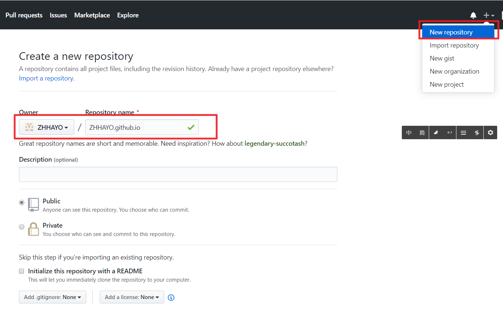
### 3. Gitee Pages
GitHub Pages 和Gitee Pages选一个就好，Gitee和GitHub有点不一样，建一个和你的博客项目名一样仓库：
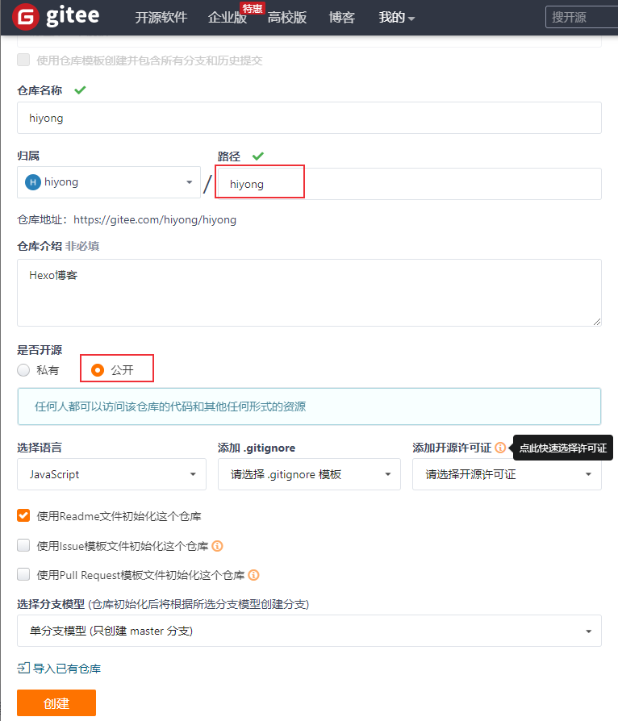

### 4. 安装 Node.js
Node.js安装方法参考[Appium 介绍及环境安装](https://blog.csdn.net/u010698107/article/details/111416347)，命令行窗口中运行`node -v `查看是否安装成功。使用如下命令更新：
```sh
$ npm install npm@latest -g
```
准备工作做好后，下面开始Hexo博客的搭建和部署。

## 安装 Hexo
首先安装 Hexo 的命令行工具，用于快速创建项目、页面、编译、部署 Hexo 博客。
命令如下：
`npm install -g hexo-cli`
安装完成后，查看hexo版本：
```sh
$ hexo version
hexo-cli: 4.2.0
os: Windows_NT 10.0.19041 win32 x64
node: 12.19.0
v8: 7.8.279.23-node.44
uv: 1.39.0
zlib: 1.2.11
brotli: 1.0.9
ares: 1.16.0
modules: 72
nghttp2: 1.41.0
napi: 7
llhttp: 2.1.2
http_parser: 2.9.3
openssl: 1.1.1g
cldr: 37.0
icu: 67.1
tz: 2019c
unicode: 13.0
```
安装成功！

## 初始化项目
### 创建项目
先cd 进入你要创建博客项目的目录下：`hexo init {name}`
name为博客项目名，注意如果使用Gitee Pages部署服务，创建的仓库名和这里初始化的博客项目名相同。
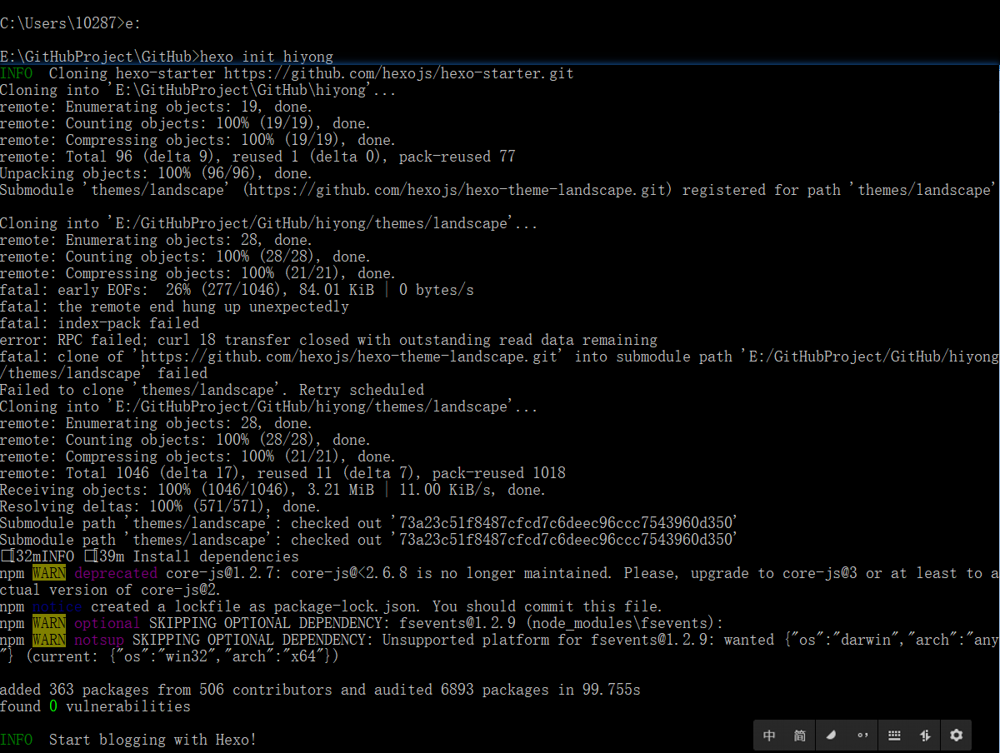


### Hexo 编译
进入新生成的博客目录下，调用 Hexo 的 generate 命令，将 Hexo 博客（Markdown文件，在source\\\_posts目录下，后面会详细介绍）编译生成 HTML 代码：
`hexo generate`
生成的public 文件夹里面包含了 js、css、font 等内容，博客文章在public /posts文件夹下
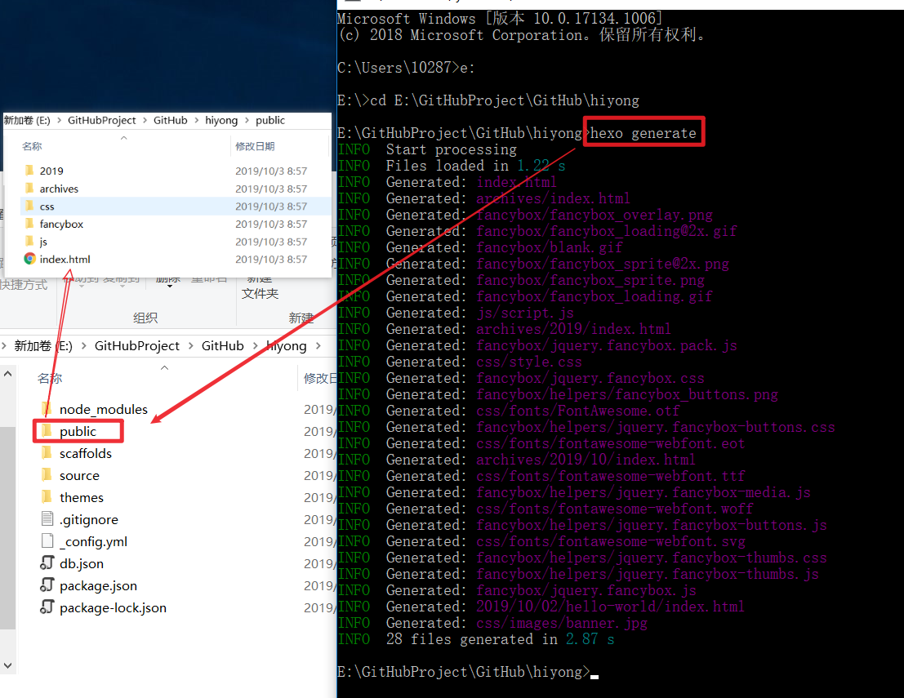

### 本地运行博客
利用 Hexo 提供的 serve 命令在本地运行博客：`hexo serve`

浏览器访问http://localhost:4000，就可以打开博客了，有一篇默认文章：
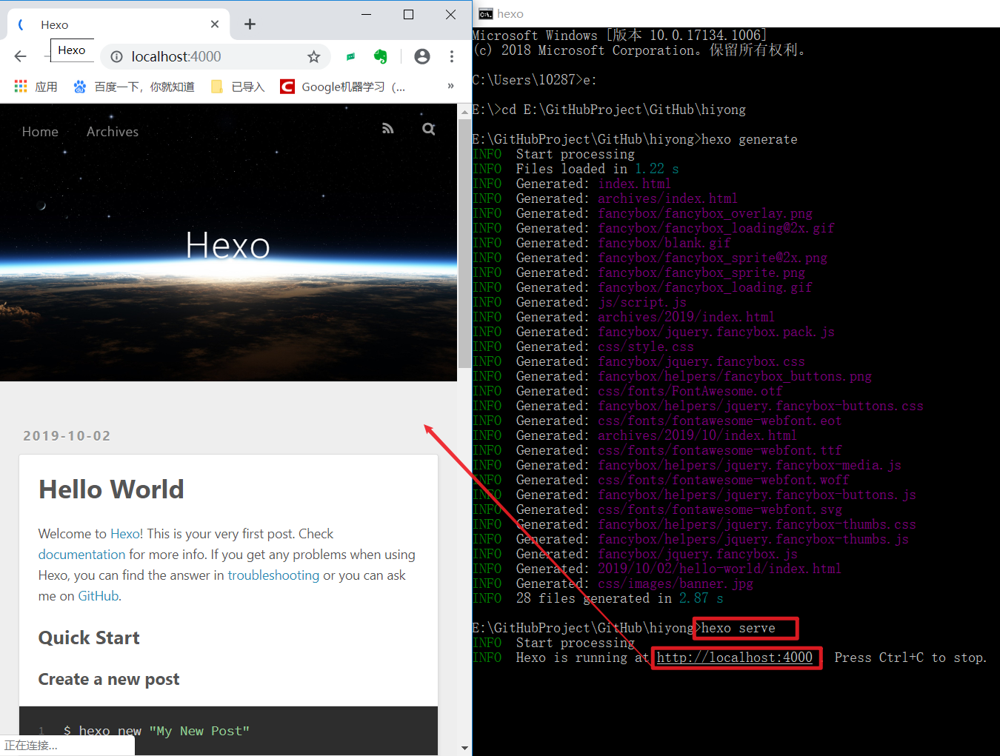

这是博客的默认配置，可以修改配置文件来修改样式，我们先部署到GitHub Pages 上，看看效果。

## 部署
### 配置
将编译好的博客发布到github，需要配置github的项目仓库地址。

打开根目录下的 \_config.yml 文件，找到 Deployment ，修改如下：
```
# Deployment
## Docs: https://hexo.io/docs/deployment.html
deploy:
 type: git
 repo: git@github.com:ZHHAYO/ZHHAYO.github.io.git
 branch: master
```
仓库地址为你在[准备条件](#准备条件)中新建的仓库地址，查看方式如下：
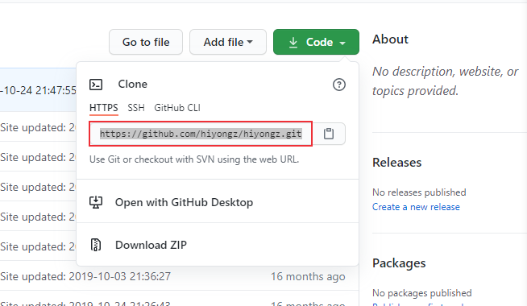

gitee类似：
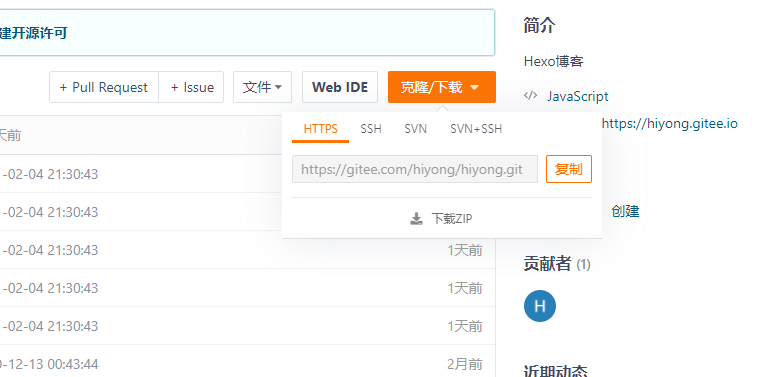

HTTPs或者SSH地址都可以。

**注意冒号后面要加空格**


### 安装hexo-deployer-git插件
支持 Git 的部署插件，用于将blog部署到 GitHub 上面
安装命令：
`npm install hexo-deployer-git --save`
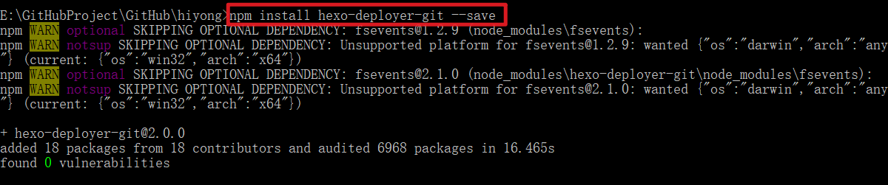

### 部署
部署命令：`hexo deploy`

在 blog 目录下，分别输入如下三条命令：
* hexo clean //清除缓存
* hexo g //生成静态文件
* hexo d //部署

其中 clean 用于清除缓存，g 是 generate 生成网站资源，d 就是 deploy 部署网站。
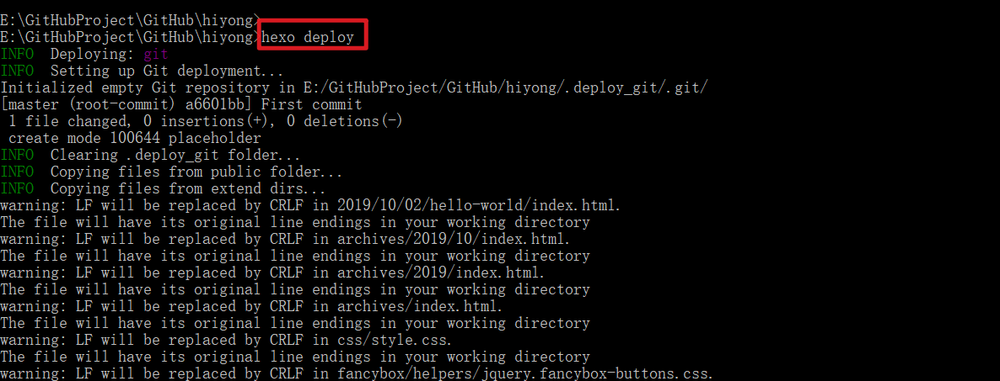

### 启动GitHub Pages
进入GitHub仓库可以看到public里面的内容传到了仓库里面：
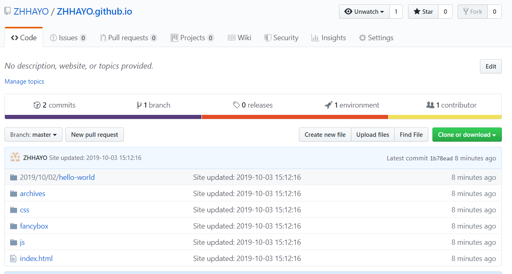

在博客仓库的Settings界面，下拉找到GitHub Pages，生成博客网址
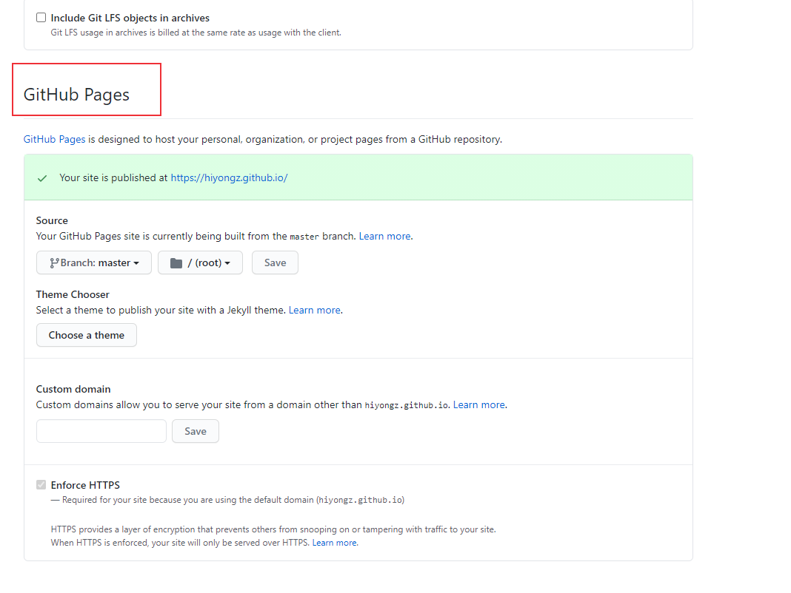

部署成功后就可以通过https://{github用户名}.github.io/ 访问个人博客了

### 启动Gitee Pages
如果部署到Gitee，也可以在博客仓库下看到上传的资源：
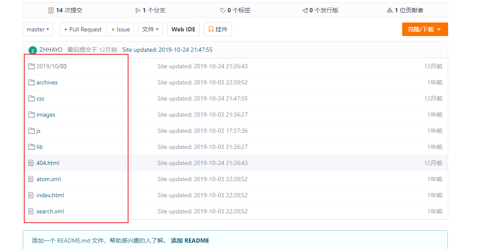

Gitee的启动方式类似：
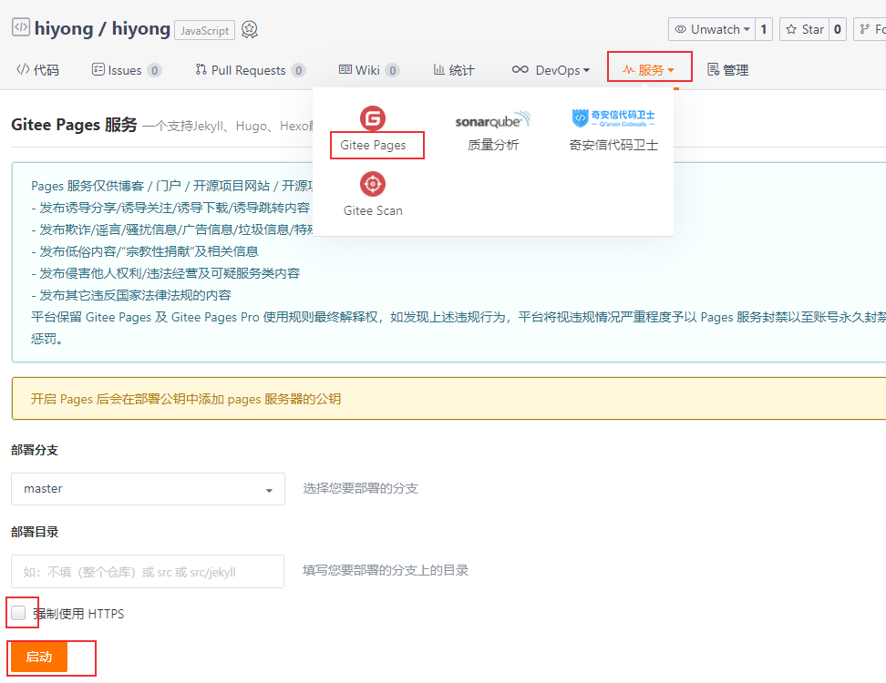
目前就完成了博客的初始构建，下面就进行博客的基本配置，设置主题等

部署完成后，通过https://{gitee用户名}.gitee.io/ 访问个人博客

Hexo的初步部署就完成了，下一篇文章介绍博客文章创建方法和博客主题的简单配置。

**注意：**博客更新到GitHub后，GitHub Pages会自动部署更新后的博客，而Gitee需要手动更新一下。

## 标签页
添加标签页命令：`hexo new page tags`

执行这个命令之后会自动帮我们生成一个 source/tags/index.md 文件：
```md
---
title: tags
date:2019-09-2616:44:17
---
```

然后再在主题的 \_config.yml 文件将这个页面的链接添加到主菜单里面，修改 menu 字段如下：
```yaml
menu:
  home: / || home
  #about: /about/ || user
  tags: /tags/ || tags
  #categories: /categories/ || th
  archives: /archives/ || archive
  #schedule: /schedule/ || calendar
  #sitemap: /sitemap.xml || sitemap
  #commonweal: /404/ || heartbeat
```

## 分类页
添加分类页命令：`hexo new page categories`

同样地，会生成一个 source/categories/index.md 文件。

在主题的 \_config.yml 文件将这个页面的链接添加到主菜单里面，修改 menu 字段如下：
```yaml
menu:
  home: / || home
  #about: /about/ || user
  tags: /tags/ || tags
  categories: /categories/ || th
  archives: /archives/ || archive
  #schedule: /schedule/ || calendar
  #sitemap: /sitemap.xml || sitemap
  #commonweal: /404/ || heartbeat
```

## 创建博客文章
博客最核心部分还是你输出的的文章，Hexo博客文章可以使用Markdown语法编写，下面介绍文章创建方法。参考文档：[https://hexo.io/zh-cn/docs/writing.html](https://hexo.io/zh-cn/docs/writing.html)
### 新建文章
在博客根目录命令行输入
```sh
hexo new [layout] <title>
```
layout指定文章的布局（layout），默认为 post，可以通过修改 \_config.yml 中的 default_layout 参数来指定默认布局。

新建一篇名为「HelloWorld」的文章，在博客目录下打开命令行：`hexo new hello-world`
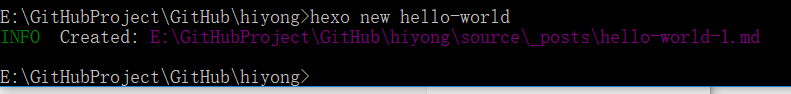

创建的文章会出现在 source/\_posts 文件夹下，是 MarkDown 格式：HelloWorld.md。
使用 MarkDown 编辑HelloWorld.md文件就可以了，markdown 语法参考[http://www.markdown.cn/#inline-html](http://www.markdown.cn/#inline-html)， 文章编辑好后，执行：
```sh
hexo clean //清除缓存
hexo g //生成静态文件
hexo s //本地查看效果 访问 http://localhost:4000
hexo d //部署
```
创建的文章HelloWorld.md会编译到 \public\posts\HelloWorld目录下，编译为html文件。

### 草稿箱
也可以新建draft page，顾名思义就是草稿，在博客执行编译操作时，草稿文章不会编译。

创建方法：
```sh
$ hexo new draft HelloWorld
```
创建的草稿文章会出现在 source/\_drafts 文件夹下，可以通过如下命令在本地查看草稿文章：
```sh
$ hexo server --draft
# 或者
$ hexo s --draft
```
完成草稿文章后，可以通过如下命令发布：
```sh
$ hexo publish HelloWorld
```
草稿HelloWorld会移到\_posts目录里面去。

当然，新建文章和草稿可以采用手动的方式，最对应的目录下新建Markdown文件即可。

### 文章标签、分类
在新建的文章开头编辑文章的题目，作者，日期，标签等。
```text
---
title: test
date: 2020-10-17 17:24:36
author: hiyo
copyright: true
tags:
  - 标签1    
  - 标签2
categories: 分类
---
```
#### 子分类
将该文章放到 Sports/Baseball 这个分类下。
```text
categories:	
	- Sports
	- Baseball 
```
或者：
```text
categories:
	- [Sports,Baseball]
```
#### 多个分类
将文章同时分到两个或者多个不同的类目下
```text
categories:  
  - [Sports]  
  - [Play]
```

```text
categories:  
  - [Sports,Baseball]
  - [Play]
```
### 博客插入图片

介绍三种方法

#### src 链接
外部的 src 链接地址，存放在 CDN 上，或某图床上
#### 本地绝对路径
将图片统一放在 source/images 文件夹中，在博客中使用如下方式引用图片：
```text

```
#### 本地相对路径
将放在文章自己的目录中，配置项目配置文件 \_config.yml ：
```text
post_asset_folder: true
```
执行命令 `$ hexo new post_name`，在 source/\_posts 中会生成文章 post_name.md 和同名文件夹 post_name 。将图片资源放在 post_name 中，文章就可以使用相对路径引用图片资源了。
```text

```
也可以手动创建博客文件和同名文件夹。

## 搜索页
先安装一个插件 hexo-generator-searchdb：`npm install hexo-generator-searchdb --save`
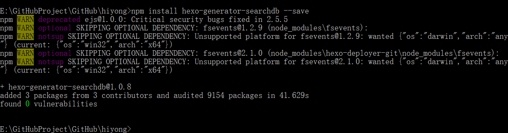

修改**项目**的 \_config.yml 配置文件：
```yaml
search: 
  path: search.xml 
  field: post 
  format: html 
  limit:10000
```

修改**主题**的 \_config.yml 配置文件：
```yaml
local_search:
  enable: true
  # If auto, trigger search by changing input.
  # If manual, trigger search by pressing enter key or search button.
  trigger: auto
  # Show top n results per article, show all results by setting to -1
  top_n_per_article: 5
  # Unescape html strings to the readable one.
  unescape: false
  # Preload the search data when the page loads.
  preload: false
```


