# Hexo个人博客主题配置
本文介绍Hexo博客Next主题配置，博客配置效果：[https://hiyong.gitee.io/](https://hiyong.gitee.io/)。
<!--more-->


## 配置站点信息
修改根目录下的 \_config.yml 文件，找到 Site 区域，配置站点标题 title、副标题 subtitle 、关键字 keywords，语言等内容：
```yaml
\# Site
title: HiYong
subtitle: XXXXXXXXXXXXXXXXXX
description: XXXXXXXXXXXXXXXXXXXXXXXXXXXXXXX
keywords: “技术分享，计算机网络，自动化测试，python，Java，机器学习”
author: HiYo
language: zh-CN
timezone:
```

## 修改主题
Hexo有各种炫酷的主题，可以去 [https://hexo.io/themes/](https://hexo.io/themes/) 查看，选择自己喜欢的主题，个人比较喜欢简洁的，比如Next主题，下面介绍Next主题配置方法。

Next 主题GitHub地址：[https://github.com/theme-next/hexo-theme-next](https://github.com/theme-next/hexo-theme-next)

命令行进入到项目的根目录，执行如下命令，下载到themes/next 文件夹下：
```sh
git clone https://github.com/theme-next/hexo-theme-next.git themes/next
```
或者直接下载

修改**项目**根目录下的\_config.yml 文件，找到 theme 字段，修改为 next 即可，修改如下：
```yaml
theme: next
```

然后本地重新开启服务，访问刷新下页面，就可以看到 next 主题就切换成功了
```sh
hexo clean 
hexo g 
hexo serve
```

## Next主题配置
**主题设置可以参考官方文档**：[https://theme-next.org/docs/](https://theme-next.org/docs/)， 修改 themes/next/\_config.yml 文件

### 样式
Next 主题提供了多种样式，选择Pisces 样式，其它样式
```yaml
# Schemes
scheme: Pisces
# scheme: Muse
# scheme: Mist
# scheme: Pisces
# scheme: Gemini
```
直接刷新页面
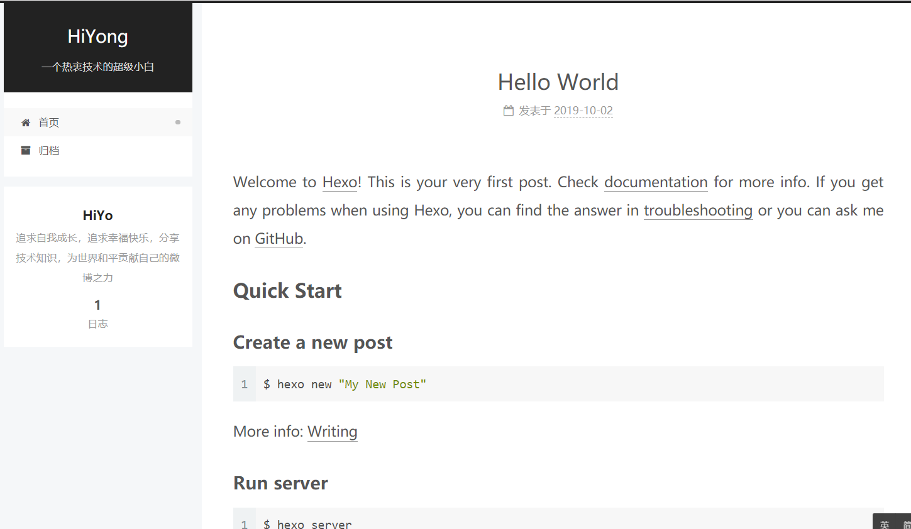

### favicon
Favicon(favorites icon)，是与某个网站或网页相关联的图标，也被称为 website icon（网页图标）、page icon（页面图标）或 url icon（URL 图标）。

favicon 就是站点标签栏的小图标，默认使用的 Hexo 图标，可以自己定制小图标。可以使用[https://realfavicongenerator.net](https://realfavicongenerator.net) 生成各种尺寸的图标，上传你制作好的图片，打包下载各种尺寸和适配不同设备的小图标。

图标下载下来之后把它放在 themes/next/source/images 目录下面。然后在配置文件里面找到 favicon 配置项，把一些相关路径配置进去即可，示例如下：
```yaml
favicon:
  small: /images/logo_favicon-16x16.png
  medium: /images/logo_favicon-32x32.png
  apple_touch_icon: /images/logo_apple-touch-icon.png
  safari_pinned_tab: /images/logo.svg
```
配置完成之后刷新页面，整个页面的标签图标就被更新了。

### avatar
avatar 为站点的头像，显示在作者信息旁边
* 将头像放置到 themes/next/source/images/avatar.png 路径
* 然后在主题 \_config.yml 文件下编辑 avatar 的配置，修改为正确的路径。

```yaml
# Sidebar Avatar
avatar:
  # url: #/images/avatar.gif
  url: /images/logo_android-chrome-192x192-wechat.png
  # If true, the avatar would be dispalyed in circle.
  rounded: false
  # If true, the avatar would be rotated with the cursor.
  rotated: false
```
rounded：是否显示圆形
rotated：是否带有旋转效果

### rss
> 简易信息聚合 (Really Simple Syndication或Richsite summary)是站点用来和其他站点之间共享内容的一种简易方式。

**1. 安装插件hexo-generator-feed**
在项目根目录下运行命令：`npm install hexo-generator-feed --save`

安装完成之后，站点会自动生成 RSS Feed 文件

**2. 编辑项目配置文件**
在项目根目录下的 \_config.yml 文件中添加以下代码
```yaml
feed:
  type: atom
  path: atom.xml
  limit: 20
  hub:
  content:
  content_limit: 140
  content_limit_delim: " "
  order_by: -date
  icon: icon.png
```
将 url 修改为自己博客的域名
```yaml
url: https://hiyong.gitee.io
```

**3. 修改 Next 主题配置文件**
修改Next 主题配置文件\_config.yml：
```yaml
social:
  GitHub: https://github.com/hiyongz/|| fa fa-github  
  # E-Mail: zhiyo2016@163.com/|| envelope
  RSS: /atom.xml || fa fa-rss
```

###  代码块
修改Next 主题配置文件 \_config.yml ，设置代码块样式，比如设置为类似 Mac 的样式：
```yaml
codeblock:
  highlight_theme: normal
  # Add copy button on codeblock
  copy_button:
    enable: true
    # Show text copy result.
    show_result: true
    # Available values: default | flat | mac
    style: mac
```

### 回到页面顶部
修改Next 主题配置文件 \_config.yml 的 back2top 字段：
```yaml
back2top:
  enable: true
  # Back to top in sidebar.
  sidebar: true
  # Scroll percent label in b2t button.
  scrollpercent: true
```

### 阅读进度条
在文章上侧显示阅读进度条，修改Next 主题配置文件 \_config.yml：
```yaml
reading_progress:
  enable: true
  # Available values: top | bottom
  position: top
  color: "#37c6c0"
  height: 2px
```

### GitHub 图标
右上角 GitHub 图标
```yaml
github_banner:
  enable: true
  permalink: https://github.com/hiyongz
  title: Follow me on GitHub
```

### 数学公式
渲染公式，配置如下：
```yaml
math:
  enable: true
  per_page: true

  mathjax:
    enable: true
    # See: https://mhchem.github.io/MathJax-mhchem/
    mhchem: true

  katex:
    enable: false
    # See: https://github.com/KaTeX/KaTeX/tree/master/contrib/copy-tex
    copy_tex: false
```

mathjax 需要安装插件 hexo-renderer-kramed，也可以安装 hexo-renderer-pandoc，命令如下：
```sh
npm un hexo-renderer-marked --save
npm i hexo-renderer-kramed --save
```


## 添加自定义 Page
博客根目录运行：
```sh
hexo new page name //name为新增Page名称
```

执行成功后，在  source 目录会生成了一个 name目录，编辑目录下index.md 文件：

```md
---
title: books
date: 2020-11-22 22:05:40
type: books
comments: false
---
正文：。。。。。
```

编辑主题配置文件 themes/next/\_config.yml：
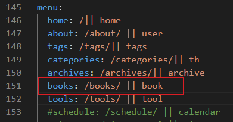

图标名book可以在 [https://fontawesome.dashgame.com/](https://fontawesome.dashgame.com/) 中查找，home、tags、th等图标都是在这个网站上获取的。

编辑 themes/next/languages/zh-CN.yml 文件
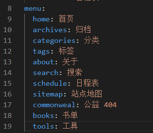

重新编译部署后，刷新页面，配置成功：
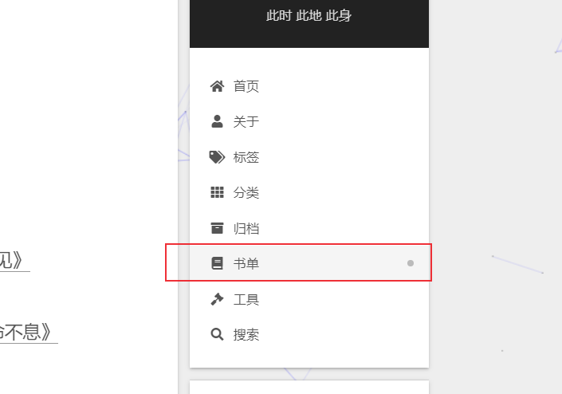

## Valine 评论系统
- Valine 评论系统不需要登录便可以评论
- 支持 MarkDown 语法
- 无后端实现，快速高效

### 1. 注册 LeanCloud

[https://leancloud.cn/dashboard/login.html#/signin](https://leancloud.cn/dashboard/login.html#/signin)

### 2. 创建应用

访问控制台，创建应用，选择开发版，创建好之后就生成了 App ID 和 App Key

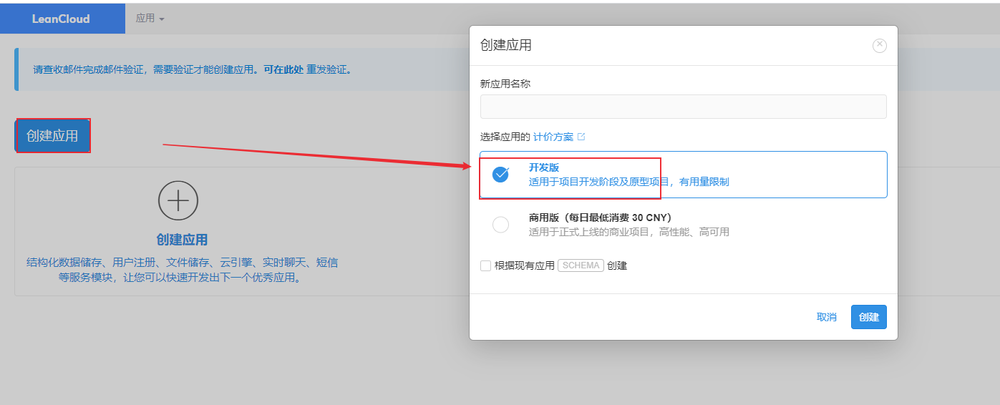

创建完成后，打开应用，点击存储，创建 Counter 和 Comment 两个 Classes：

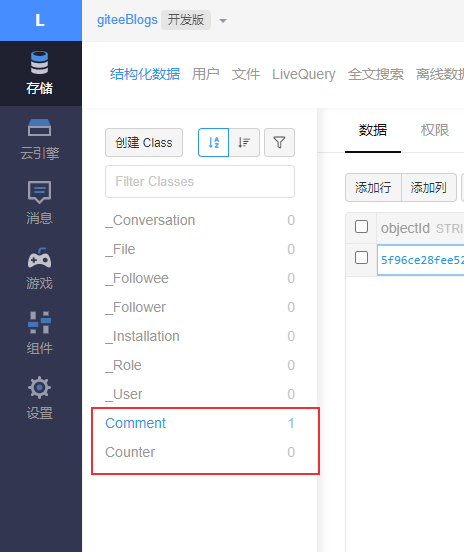

点击设置 -> 安全中心 -> 在服务开关，打开数据存储，在 Web 安全域名输入框填写博客的域名地址：

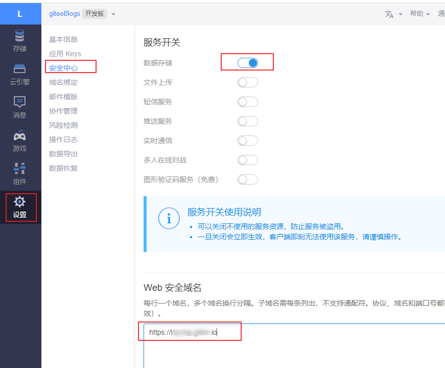

### 3. 设置 Next 主题配置文件

在主题的配置文件中，修改 valine 配置
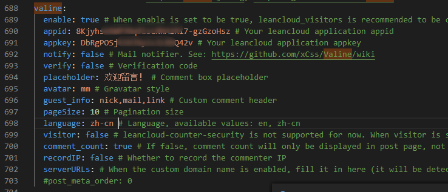

修改 valine.min.js 的 cdn 文件地址，到 [https://www.jsdelivr.com/package/npm/valine](https://www.jsdelivr.com/package/npm/valine) 这个地址查看最新版本的Valine，

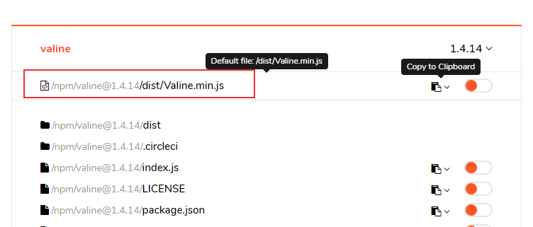

复制最新cdn地址，修改主题配置文件\_config.yml 。
```yaml
valine: https://cdn.jsdelivr.net/npm/valine@1.4.14/dist/Valine.min.js
```
## 文章末尾添加公众号订阅
### 1. 准备公众号二维码图片
将二维码图片放到\source\uploads目录下
### 2. 修改主题文件
找到 themes\next\layout\_macro\post.swig 文件，在 footer前面添加以下代码：
```html
<div id="wechat_subscriber" style="display: block; padding: 10px 0; margin: 20px auto; width: 100%; text-align: center;">
    
    <div>关注微信公众号，及时接收最新技术文章！</div>
</div>
```

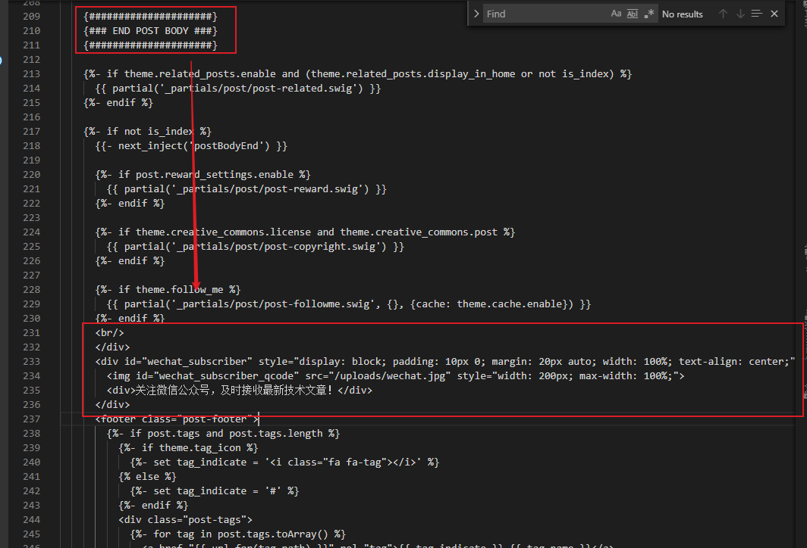

修改主题配置文件\_config.yml ，添加如下代码：
```yaml
# Wechat Subscriber
wechat_subscriber: 
 enable: true
 qcode: /uploads/wechat.jpg
 description: "欢迎您扫一扫上面的微信公众号，订阅我的博客！"
```

## 文章底部版权声明
### 1. my-copyright.swig
在目录 themes/next/layout/\_macro/ 下添加 my-copyright.swig ，内容如下：
```html

<div class="my-post-copyright">
  <script src="//cdn.bootcss.com/clipboard.js/1.5.10/clipboard.min.js"></script>
  
  <!-- JS库 sweetalert 可修改路径 -->
  <script type="text/javascript" src="http://jslibs.wuxubj.cn/sweetalert_mini/jquery-1.7.1.min.js"></script>
  <script src="http://jslibs.wuxubj.cn/sweetalert_mini/sweetalert.min.js"></script>
  <link rel="stylesheet" type="text/css" href="http://jslibs.wuxubj.cn/sweetalert_mini/sweetalert.mini.css">

  <p><span>本文标题:</span>{{ page.title }}</a></p>
  <p><span>文章作者:</span>{{ theme.author }}</a></p>
  <p><span>文章链接:</span><a href="{{ url_for(page.path) }}" title="{{ page.title }}">{{ page.permalink }}</a>
    <span class="copy-path"  title="点击复制文章链接"><i class="fa fa-clipboard" data-clipboard-text="{{ page.permalink }}"  aria-label="复制成功！"></i></span>
  </p>
  <p><span>许可协议:</span>本博客文章除特别声明外，均采用<a rel="license" href="https://creativecommons.org/licenses/by-nc-nd/4.0/" target="_blank" title="Attribution-NonCommercial-NoDerivatives 4.0 International (CC BY-NC-ND 4.0)">CC BY-NC-ND 4.0</a> 许可协议。转载请保留原文链接及作者。</p>  
</div>
<script> 
    var clipboard = new Clipboard('.fa-clipboard');
    clipboard.on('success', $(function(){
      $(".fa-clipboard").click(function(){
        swal({   
          title: "",   
          text: '复制成功',   
          html: false,
          timer: 500,   
          showConfirmButton: false
        });
      });
    }));  
</script>

```

### 2. my-post-copyright.styl
在目录 themes/next/source/css/\_common/components/post/ 下添加 my-post-copyright.styl，内容如下:
```html
.my-post-copyright {
  //width: 85%;
  //max-width: 45em;
  //margin: 2.8em auto 0;
  padding: 0.5em 1.0em;
  border: 1px solid #d3d3d3;
  border-left: 3px solid #ff1700;
  font-size: 0.93rem;
  line-height: 1.6em;
  word-break: break-all;
  background: rgba(255,255,255,0.4);
}
.my-post-copyright p{margin:0;}
.my-post-copyright span {
  display: inline-block;
  width: 5.2em;
  color: #333333; // title color
  font-weight: bold;
}
.my-post-copyright .raw {
  margin-left: 1em;
  width: 5em;
}
.my-post-copyright a {
  color: #808080;
  border-bottom:0;
}
.my-post-copyright a:hover {
  color: #0593d3; // link color
  text-decoration: underline;
}
.my-post-copyright:hover .fa-clipboard {
  color: #000;
}
.my-post-copyright .post-url:hover {
  font-weight: normal;
}
.my-post-copyright .copy-path {
  margin-left: 1em;
  width: 1em;
  +mobile(){display:none;}
}
.my-post-copyright .copy-path:hover {
  color: #808080;
  cursor: pointer;
}
```
### 3. post.swig
修改 themes/next/layout/\_macro/post.swig，在前面添加公众号的位置上面添加：
```html
<div>
    
    	
    
</div>
```
### 4. post.styl 文件
打开 themes/next/source/css/\_common/components/post/post.styl 文件，在最后一行增加代码：
```html
@import 'my-post-copyright'
```

### 5. 修改主题配置文件
```yaml
post_copyright:
  enable: true
  license: CC BY-NC-ND 4.0
  license_url: https://creativecommons.org/licenses/by-nc-nd/4.0/deed.zh
```
## 字数统计、阅读时间统计
安装 hexo-wordcount 插件
```sh
npm i hexo-wordcount --save
npm install hexo-symbols-count-time --save
```
在主题配置文件 \_config.yml 中打开 wordcount 统计功能
```yaml
post_wordcount:
  item_text: true
  wordcount: true # 单篇 字数统计
  min2read: true # 单篇 阅读时长
  totalcount: false # 网站 字数统计
  separated_meta: true


symbols_count_time:
  separated_meta: true     # 是否另起一行（true的话不和发表时间等同一行）
  item_text_post: true     # 首页文章统计数量前是否显示文字描述（本文字数、阅读时长）
  item_text_total: false   # 页面底部统计数量前是否显示文字描述（站点总字数、站点阅读时长）
  awl: 4                   # Average Word Length
  wpm: 275                 # Words Per Minute（每分钟阅读词数）
  suffix: mins.
```

## 博客加密

安装hexo-blog-encrypt插件：

```sh
$ npm install --save hexo-blog-encrypt
```

github地址：[https://github.com/D0n9X1n/hexo-blog-encrypt/blob/master/ReadMe.zh.md](https://github.com/D0n9X1n/hexo-blog-encrypt/blob/master/ReadMe.zh.md)

## hexo d 部署失败问题

hexo d 部署失败问题：
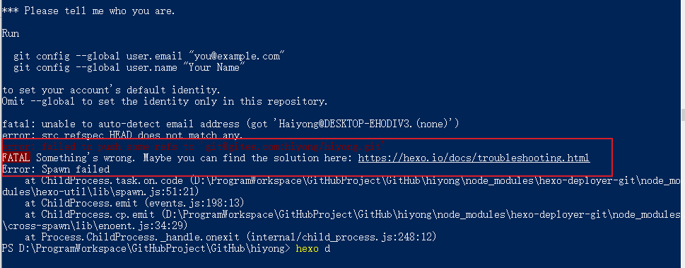
原因是没有配置git仓库同户名和邮箱地址，因为我电脑上配置了github和gitee，所以删除了全局的同户名和邮箱地址。

解决方案是添加本地用户名和邮箱：
```sh
git config user.name "github或者gitee用户名"
git config user.email "github或者gitee采用的邮箱"
```
注意前提是已经配置了SSH公钥，如果没有配置可参考[同一台电脑配置Gitee、Github 的 Git SSH公钥](https://blog.csdn.net/u010698107/article/details/113485131)


