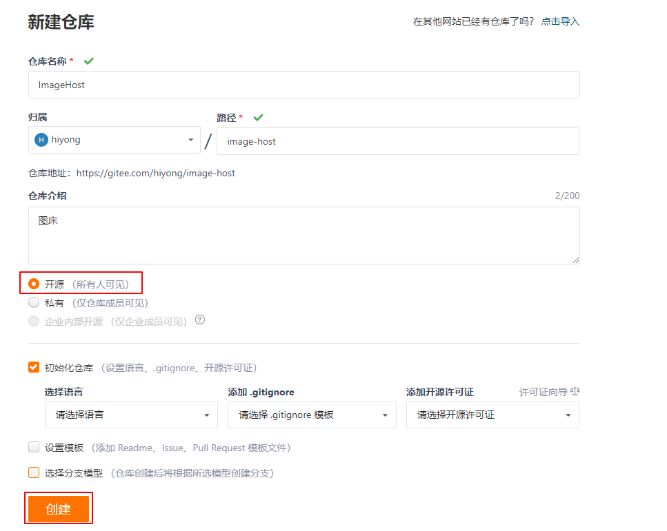
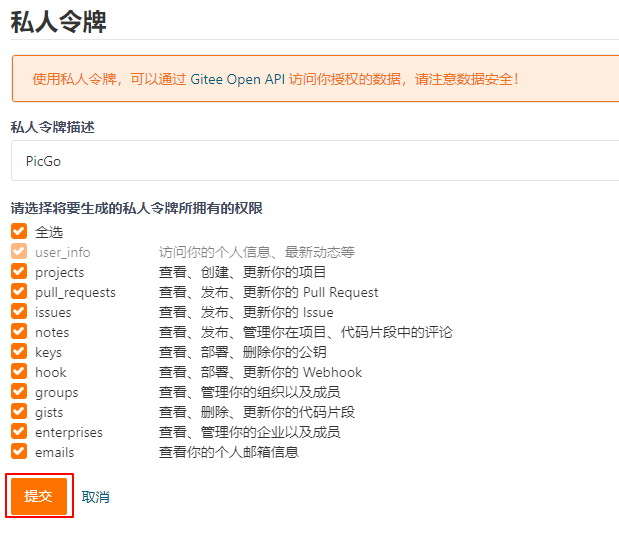
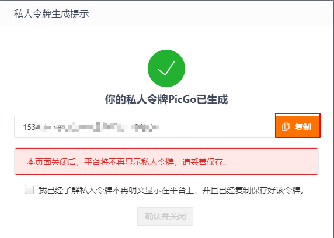
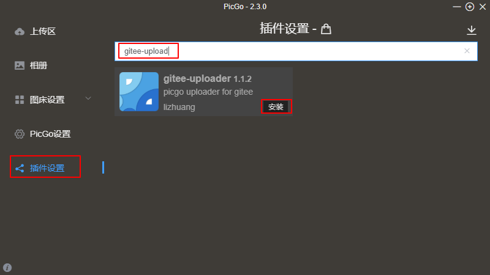
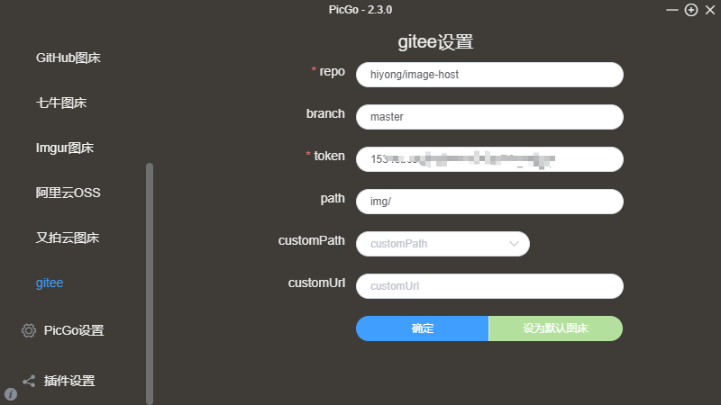
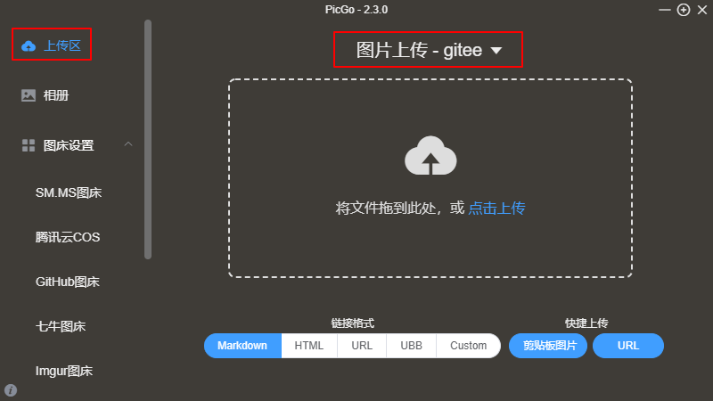
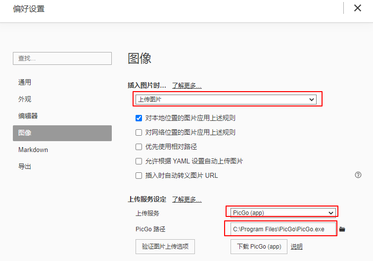

# Typora集成免费图床：PicGo + Gitee
我主要使用Typora来记笔记，它是一款非常好用的MarkDown编辑器，Typora在0.9.84版本之后支持使用PicGo上传图像，本文介绍使用Gitee和PicGo搭建免费图床。
<!--more-->

## 前言
图床（image host）主要用于存放图片，上传图片到图床后，可以通过图片外链对图片进行访问。

Gitee是国内的代码托管工具，也可以用它来存储图片。也可以使用github来存储图片，由于访问速度太慢，或者有时候根本无法访问，所以我使用了Gitee来存储图片。

PicGo是 一个用于快速上传图片并获取图片 URL 链接的工具，支持多种图床。

## 环境准备
**1、安装Typora**

官网地址：[https://typora.io/](https://typora.io/)

Typora主题配置方法可参考[typora主题配置：公众号一键排版](https://blog.csdn.net/u010698107/article/details/117059599)

**2、安装 node.js**

下载地址：[https://nodejs.org/en/download/](https://nodejs.org/en/download/)

检查是否安装成功：
```bash
$ node -v
v14.17.3
```

**2、安装PicGo**

PicGo项目地址：[https://github.com/Molunerfinn/PicGo](https://github.com/Molunerfinn/PicGo)

下载：[https://github.com/Molunerfinn/PicGo/releases](https://github.com/Molunerfinn/PicGo/releases)

我的是windows10系统，下载PicGo-Setup-2.3.0-x64.exe文件安装

> 可能会下载很慢，可以使用下面的链接下载：
> 链接：https://pan.baidu.com/s/1cDC8lDKtfoQBHzboyzgQ2Q 
> 提取码：waw2 

**3、注册Gitee**

注册一个Gitee账号，地址：[https://gitee.com/](https://gitee.com/)

## 配置
### Gitee创建图床仓库

**1、新建仓库**



**2、创建私人令牌**

设置 -> 私人令牌，添加一个新令牌



提交后会提示你输入密码，然后会生成一个token，复制一下token，下面配置PicGo要用到它。


### 配置 PicGo

**1、安装 gitee-upload 插件**



安装完成后重启 PicGo

**2、配置 gitee**

设置仓库地址，粘贴生成的token


**3、上传图片**

点击【上传区】，选择Gitee，上传图片。


上传成功的图片可以在相册中查看，可以在相册中复制图片的URL，如果删除相册中的图片，图床上的图片也会删除。

### 配置 Typora
目的是实现在typora插入图片时自动上传图片到图床，并生成对应的图片链接，Typora 0.9.84及之后的版本都支持PicGo上传。

点击【文件】 -> 【偏好设置】-> 【图像】



设置完成后，在文章中插入图片会自动上传到Gitee，并自动替换为对应的URL地址。

配置过程不是很复杂，如果你不想折腾，也可以使用博客园的相册来存储图片或者手动上传到Gitee。当然，使用PicGo上传图片会非常方便。


