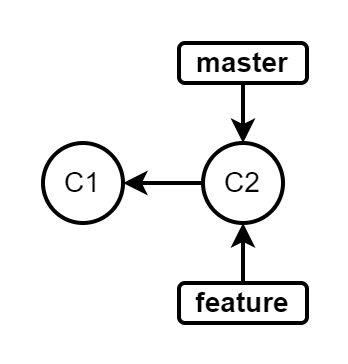
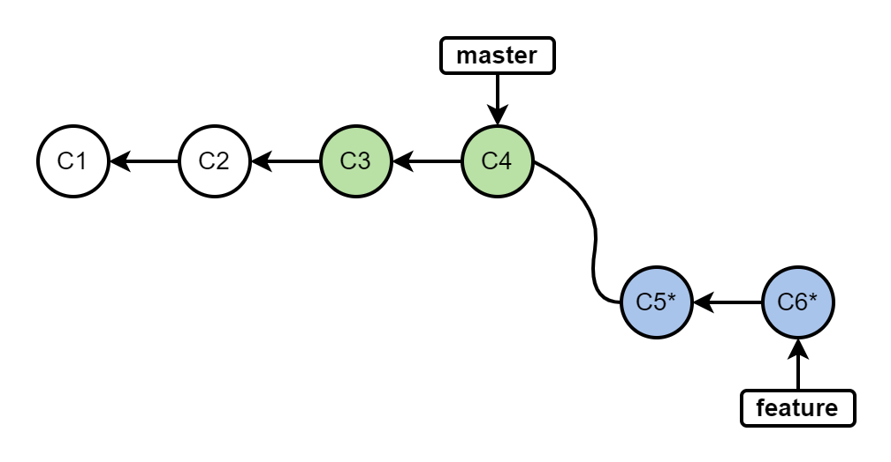

# git merge 和 git rebase 的区别
Git版本控制中，`git rebase` 和 `git merge` 这两个命令都可以用来集成从一个分支和另一个分支的更改。它们是两种不同的合并方法，本文将介绍它们的差异。

<!--more-->

`git rebase` 和 `git merge` 主要差异是什么？最近ChatGPT大火，请它来回答一下：

> Git merge 将两个分支中的所有提交都合并到一起，并创建一个新的合并提交，保留了历史记录。这导致了 Git 历史记录中出现多个分支合并点的情况，从而使历史记录更加复杂。
>
> Git rebase 是将一个分支的提交序列“拉直”，并且将其与另一个分支合并。这意味着，提交历史看起来好像是一条直线，没有分叉，因此整个提交历史看起来更加整洁，历史记录保持相对简单。
>
> 总的来说，Git rebase 可以提供更整洁的提交历史，但它需要更多的注意力和精细的操作，因为它可能导致原有的提交变得不可用。Git merge 则是更为保守的合并方法，它更简单，但历史记录更加复杂。因此，选择哪种方法取决于团队和项目的需求和偏好。

不得不说这技术太强大了，回答的太准确了。

下面举例说明一下这两个命令的区别，从 `master` 拉一个叫`feature`的分支出来，



在 `feature` 分支进行了两次提交，此时其它人也进行了两次提交，并且合并到了 `master` 分支，


此时是无法push到远程仓库的，需要进行分支合并，下面来演示`git rebase` 和 `git merge` 这两个命令的差异。

**1、`git merge` 操作**

执行：

```bash
$ git checkout feature
$ git pull origin master  # 相当于git fetch origin master + git merge origin/master feature
```

`git merge`命令会在`feature`分支创建一个新的“合并的提交”(merge commit)，现有的分支不会以任何方式改变。


这意味着每次合并上游（upstream）更改时，`feature`分支将有一个多余的合并提交。如果`master`分支更新频繁，这可能会导致`feature`分支历史记录有大量的合并提交记录。

**2、`git rebase` 操作**

```bash
$ git checkout feature
$ git pull --rebase origin master # 相当于git fetch origin master + git rebase master
```

此命令将整个 `feature` 分支移动到 `master` 分支的顶端，有效地将所有新提交合并到`master` 分支中。和`git merge`不同的是，`git rebase`通过为原始分支中的每个提交创建全新的提交来重写历史记录。



`rebase`的主要好处就是历史记录更清晰，没有不必要的合并提交，没有任何分叉。

参考文档：

1. https://www.atlassian.com/git/tutorials/merging-vs-rebasing
1. https://www.yiibai.com/git/git_rebase.html


