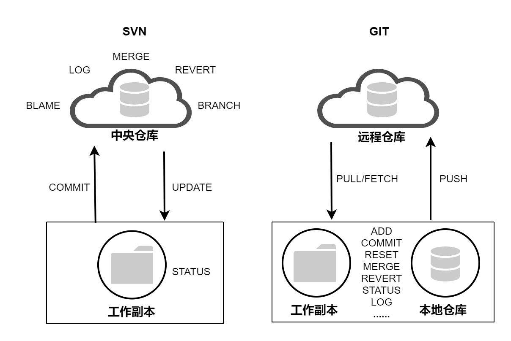
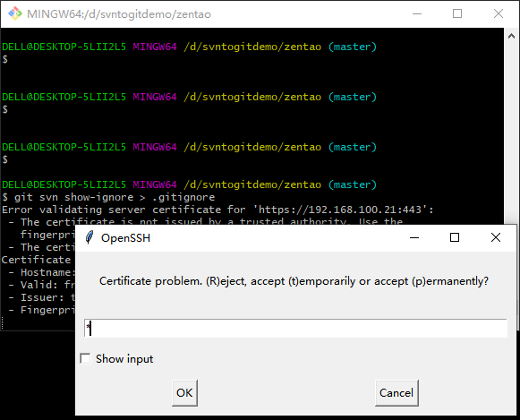

# SVN项目迁移到Git方法
本文记录如何将SVN项目迁移到Git，并保留提交日志信息。

<!--more-->

## Git和SVN差异

Git是一个开源的分布式版本控制系统，由Linux之父Linus Torvalds于2005年开发，而SVN是一个集中式的版本控制系统。



Git和SVN的主要区别如下表：

| Git                                       | SVN                                     |
| ----------------------------------------- | --------------------------------------- |
| Git是分布式的                             | SVN是集中式的                           |
| Git支持离线操作,有本地的版本控制          | SVN必须联网操作，只有服务器上的版本控制 |
| 上传下载速度快                            | 上传下载速度慢                          |
| Git功能多，命令较多，有更多的概念和命令。 | 与git相比，SVN操作更简单。              |
| 开启分支方便、速度快                      | svn的分支是一个目录，拉分支较慢         |


以上是它们的主要差异，下面介绍如何将已有的SVN仓库迁移到空的Git仓库，另外，本文Git服务器使用Gerrit搭建。

## 环境准备

### Git安装、配置


Git安装配置方法可参考[Git简易教程-安装及简单使用](https://blog.csdn.net/u010698107/article/details/111414654) 。

## 项目迁移

### 1. 将源SVN库转换到Git本地仓库

使用git-svn将源Subversion库转换为本地Git存储库。

```bash
$ git svn clone https://192.168.100.21/svn/zentao
```


如果SVN项目有忽略文件，执行如下命令转换SVN:ignore属性为 `.gitignore`文件。

```bash
cd c:\mytempdir
git svn show-ignore > .gitignore
git add .gitignore
git commit -m 'Convert svn:ignore properties to .gitignore.'
```



如果clone完成后，SVN仓库还有更新，可执行以下命令同步SVN更新：

```bash
$ git svn rebase
```


### 2. 添加Git远程库地址

```bash
$ git remote add origin "ssh://admin@192.168.100.22:29418/zentaopms"

$ git remote show origin
* remote origin
  Fetch URL: ssh://admin@192.168.100.22:29418/zentaopms
  Push  URL: ssh://admin@192.168.100.22:29418/zentaopms
  HEAD branch: master
  Remote branch:
    master tracked
  Local ref configured for 'git push':
    master pushes to master (up to date)
```

### 3. 推送代码到Git

```bash
$ git push origin master:master --force
Enumerating objects: 2324, done.
Counting objects: 100% (2324/2324), done.
Delta compression using up to 4 threads
Compressing objects: 100% (2307/2307), done.
Writing objects: 100% (2324/2324), 3.50 MiB | 1.25 MiB/s, done.
Total 2324 (delta 691), reused 0 (delta 0), pack-reused 0
remote: Resolving deltas: 100% (691/691)
remote: Processing changes: refs: 1, done
To ssh://admin@192.168.100.22:29418/zentaopms
 + eef598e...07c6319 master -> master (forced update)

```


## 常见错误

推送代码报如下错误：

```bash
$ git push origin master:master --force
Enumerating objects: 2324, done.
Counting objects: 100% (2324/2324), done.
Delta compression using up to 4 threads
Compressing objects: 100% (2307/2307), done.
Writing objects: 100% (2324/2324), 3.50 MiB | 1.32 MiB/s, done.
Total 2324 (delta 692), reused 0 (delta 0), pack-reused 0
remote: Resolving deltas: 100% (692/692)
remote: Processing changes: refs: 1, done
To ssh://admin@192.168.100.22:29418/zentaopms
 ! [remote rejected] master -> master (failed to lock)
error: failed to push some refs to 'ssh://admin@192.168.100.22:29418/zentaopms'

```

原因是当前用户没有push权限，到gerrit添加push 权限即可。

## 参考文档

1. [https://www.atlassian.com/git/tutorials/migrating-overview](https://www.atlassian.com/git/tutorials/migrating-overview)
2. [https://learn.microsoft.com/en-us/azure/devops/repos/git/perform-migration-from-svn-to-git?view=azure-devops](https://learn.microsoft.com/en-us/azure/devops/repos/git/perform-migration-from-svn-to-git?view=azure-devops)
3. [https://www.gitkraken.com/blog/migrating-git-svn](https://www.gitkraken.com/blog/migrating-git-svn)
