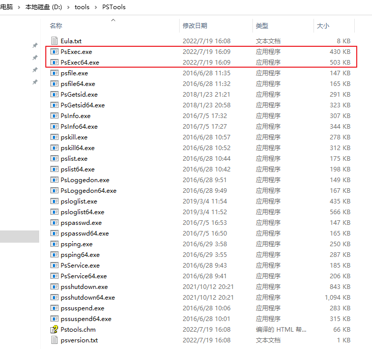

# Windows远程执行进程工具psexec和wmiexec介绍


在自动化测试或者自动化工具开发中，通常需要向其它电脑或者服务器发送指令，比如Windows发送命令到Linux服务器开启某个服务进程，或者读取状态信息，我们可以使用ssh协议实现。

如果Windows主机需要发送命令到局域网内的其它Windows电脑要如何实现呢？在网络安全中称为横向移动的内网渗透方法可实现远程执行命令，横向移动工具有很多，本文介绍psexec和wmiexec这两个工具如何实现远程执行进程。

<!--more-->

## PsExec

PsExec是 Windows 资源工具包PsTools中提供的一个远程执行进程的工具，使用服务控制管理器（SCM）远程启动一个服务，并通过服务进程进行远程管理。可用于在其他windows系统上执行进程，并提供交互式控制。

> 我使用PsExec没有成功启动远程电脑进程，推荐使用后面介绍的psexec.py脚本。

PsTools下载地址：[https://learn.microsoft.com/zh-cn/sysinternals/downloads/psexec](https://learn.microsoft.com/zh-cn/sysinternals/downloads/psexec)



使用前需要先退出目标电脑的杀毒软件，并关闭防火墙。

命令格式：

```bash
$ psexec \\hostIp -u [username] -p [password] cmd
```


## psexec.py

psexec.py是 Python [impacket](https://github.com/fortra/impacket) 包提供的远程执行脚本。

安装命令：

```bash
$ python3 -m pip install impacket
```

安装完成后，可在python安装路径下的Scripts目录中找到psexec.py脚本。

命令格式：

```bash
Python psexec.py <username>:"<password>"@<IP address> cmd
```


示例：

1、进⼊半交互式shell

```bash
python psexec.py Administrator:admin@192.168.0.93
Impacket v0.10.0 - Copyright 2022 SecureAuth Corporation

[*] Requesting shares on 192.168.0.93.....
[*] Found writable share ADMIN$
[*] Uploading file BIlvtqil.exe
[*] Opening SVCManager on 192.168.0.93.....
[*] Creating service BVDe on 192.168.0.93.....
[*] Starting service BVDe.....
[!] Press help for extra shell commands
[-] Decoding error detected, consider running chcp.com at the target,
map the result with https://docs.python.org/3/library/codecs.html#standard-encodings
and then execute smbexec.py again with -codec and the corresponding codec
Microsoft Windows [�汾 6.1.7601]

[-] Decoding error detected, consider running chcp.com at the target,
map the result with https://docs.python.org/3/library/codecs.html#standard-encodings
and then execute smbexec.py again with -codec and the corresponding codec
��Ȩ���� (c) 2009 Microsoft Corporation����������Ȩ����


C:\Windows\system32>

```

2、执行脚本

编写一个Python脚本demo.py：

```python
print("hello world")
```

放到远程电脑的D盘根目录下，然后在本地电脑打开cmd窗口执行:`python psexec.py Administrator:admin@192.168.0.93 "python D:/demo.py"`

```bash
python psexec.py Administrator:admin@192.168.0.93 "python D:/demo.py"
Impacket v0.10.0 - Copyright 2022 SecureAuth Corporation

[*] Requesting shares on 192.168.0.93.....
[*] Found writable share ADMIN$
[*] Uploading file pnZHQfBI.exe
[*] Opening SVCManager on 192.168.0.93.....
[*] Creating service SFff on 192.168.0.93.....
[*] Starting service SFff.....
[!] Press help for extra shell commands
hello world
[*] Process python D:/demo.py finished with ErrorCode: 0, ReturnCode: 0
[*] Opening SVCManager on 192.168.0.93.....
[*] Stopping service SFff.....
[*] Removing service SFff.....
[*] Removing file pnZHQfBI.exe.....
[-] Error performing the uninstallation, cleaning up
```

其它示例：

```bash
## 获取远程电脑主机名
python psexec.py Administrator:admin@192.168.0.93 "hostname" 
## 启动远程电脑的IxiaEndpoint服务
python psexec.py Administrator:admin@192.168.0.93 "net start IxiaEndpoint"
```

3、使用Python`subprocess`库来读取进程返回结果

```python
import subprocess

command = 'python D:/attrobot3/Scripts/psexec.py Administrator:admin@192.168.0.93 "python D:/demo.py"'
p = subprocess.Popen(command, shell=True, stdout=subprocess.PIPE).stdout
print(p.read().decode('utf-8'))
```

## wmiexec.py

Wmiexec也是一种横向移动工具，它利用了Windows Management Instrumentation (WMI) 接口来远程管理Windows系统。WMI是一个Windows操作系统提供的系统管理工具，它提供了一套API接口，可以对本地和远程Windows系统进行管理。如查看进程列表、执行命令、上传和下载文件等。

在使用Wmiexec之前，需要先在目标Windows系统上启用WMI服务，并且确保防火墙不会阻止WMI的通信。

wmiexec.py也来自于impacket工具包，支持的参数可执行 `python wmiexec.py` 命令查看，下面介绍几种用法。

1、进⼊半交互式shell

```bash
$ python wmiexec.py Administrator:admin@192.168.0.93
Impacket v0.10.0 - Copyright 2022 SecureAuth Corporation

[*] SMBv2.1 dialect used
[!] Launching semi-interactive shell - Careful what you execute
[!] Press help for extra shell commands
C:\>
```

2、执行脚本

```bash
$ python wmiexec.py Administrator:admin@192.168.168.93 "python D:/demo.py"
Impacket v0.10.0 - Copyright 2022 SecureAuth Corporation

[*] SMBv2.1 dialect used
hello world
```

## Psexec和Wmiexec之间的差异

以下内容采用ChatGPT生成：

> Wmiexec和Psexec是用于在Windows系统上执行命令和脚本的工具，它们各自的特点如下：
>
> Wmiexec的特点：
>
> - 使用WMI接口远程连接到Windows系统，可以执行更高级别的管理操作，如注册表操作和事件订阅等。
> - 可以编写自定义WMI脚本来扩展其功能。
> - 使用WMI接口时，对防火墙没有太大的依赖。
>
> Psexec的特点：
>
> - 使用服务控制管理器（SCM）远程启动一个服务，并通过服务进程进行远程管理。
> - 支持Windows NT及以上版本的操作系统。
> - 执行速度较快，比Wmiexec更快。
> - 可以隐藏服务进程的图标和窗口。
>
> 总的来说，Wmiexec适用于基于WMI的管理和远程控制，可以进行更高级别的操作，但执行速度较慢。Psexec则适合用于执行命令和脚本等任务，执行速度快，但不能进行高级别的操作。选择哪种工具取决于具体的使用场景和需求。


## 参考文档

1. impacket包：[https://github.com/fortra/impacket](https://github.com/fortra/impacket)
2. PsTools下载地址：[https://learn.microsoft.com/zh-cn/sysinternals/downloads/psexec](https://learn.microsoft.com/zh-cn/sysinternals/downloads/psexec)
2. PowerShell远程: [https://www.anyviewer.com/how-to/remotely-run-programs-on-another-computer-2578.html](https://www.anyviewer.com/how-to/remotely-run-programs-on-another-computer-2578.html)


