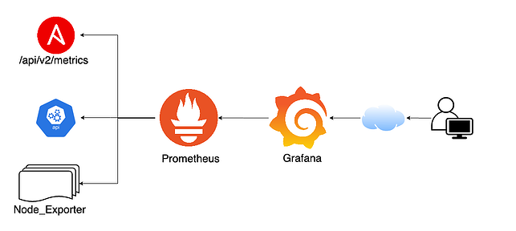
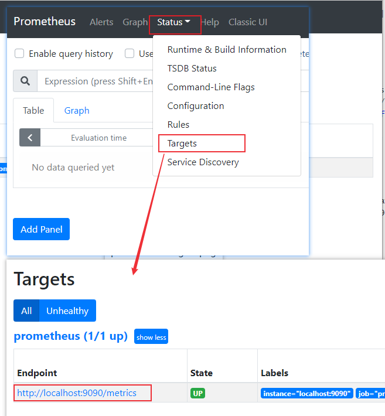
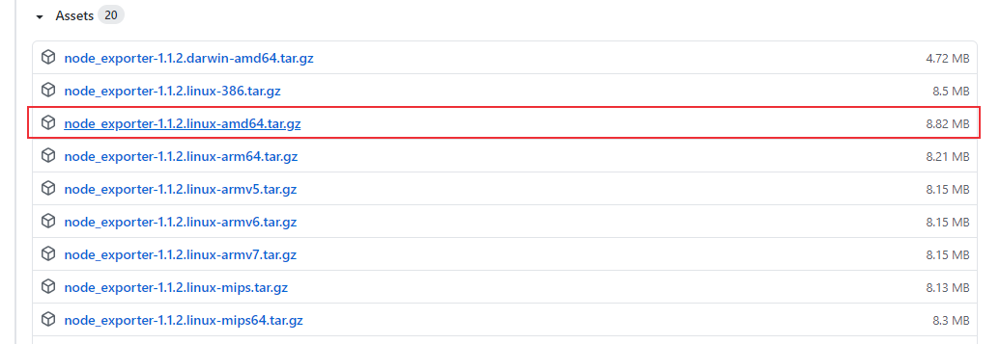
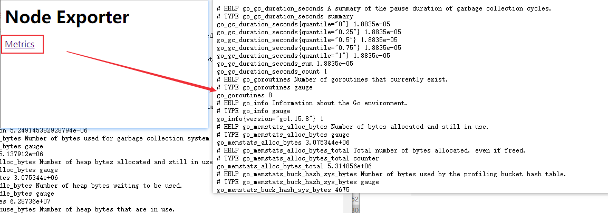
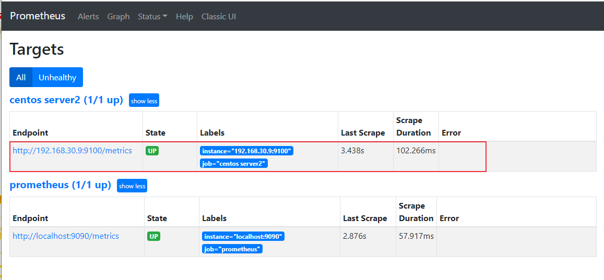
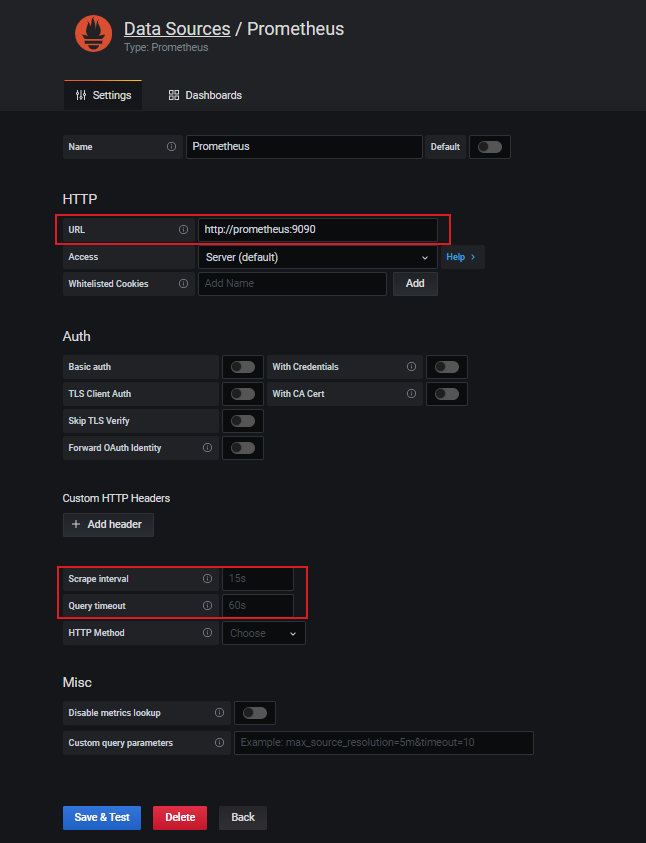
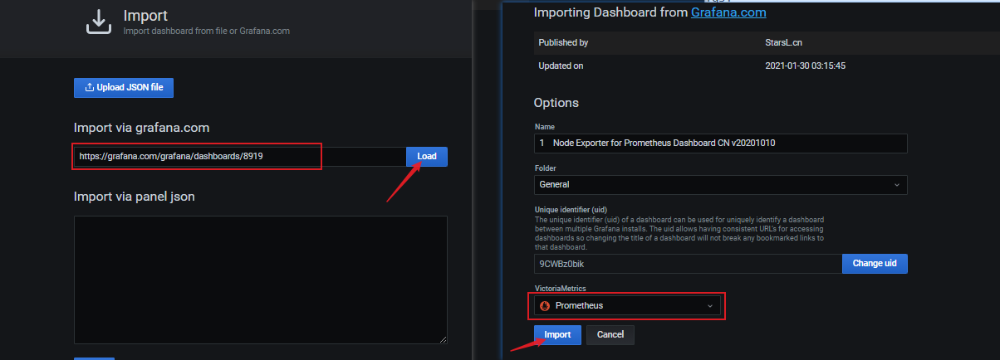
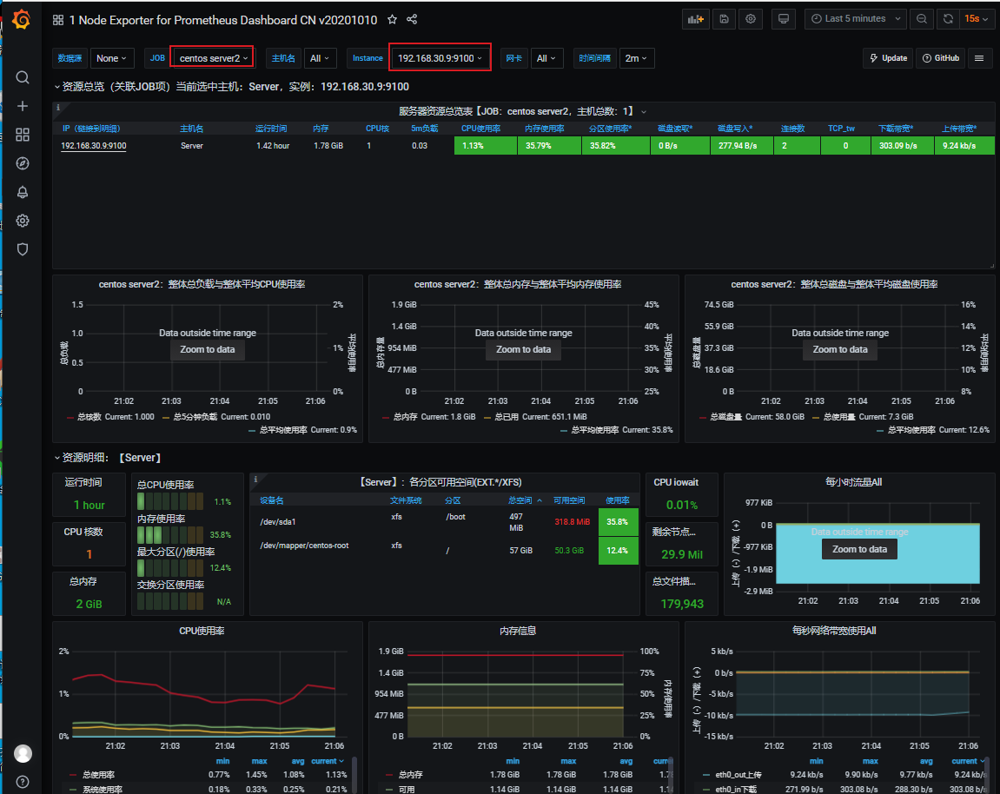

# 系统性能监控：Prometheus + Grafana 监控服务器性能
Prometheus 是一个开源的服务监控系统和时间序列数据库，是一款开源系统监控和警报工具，在测试领域中，我们可以使用Promethues来监控压力测试时服务端的性能。

<!--more-->

## Prometheus简介
[Prometheus](https://prometheus.io/)使用Go语言开发，是最初在SoundCloud上构建的开源系统监控和警报工具，在2016年加入了Cloud Native Computing Foundation（CNCF）基金会，是继Kubernetes之后该基金会的第二个托管项目。

### 主要特性

- 多维数据模型，由指标名称和键值对标识的时间序列数据度量

- PromQL查询语言

- 不依赖分布式存储；单个服务器节点是自治的

- 通过HTTP使用pull模式收集时间序列数据

- 支持通过中间网关推送时间序列数据

- 通过服务发现或静态配置发现目标对象

- 支持多种图形和仪表盘

### 组成
Prometheus由多个组件组成：
- **Prometheus主服务器**：用于抓取并存储时间序列数据
- **客户端库**：用于检测应用程序代码
- **推送网关**：支持短生命周期
- **各种exporter**：HAProxy，StatsD，Graphite等服务收集服务器性能数据
- **警告管理器**
- **各种支持工具**

架构


## Prometheus + Grafana 监控系统性能
主要用到了Prometheus，node exporter和Grafana，Prometheus和node exporter收集保存服务器性能数据，Grafana用于图形化展示数据。

<center><font size="2">图片来源：https://www.ansible.com/blog/red-hat-ansible-tower-monitoring-using-prometheus-node-exporter-grafana</font></center>

### docker安装Prometheus
docker hub地址：[https://registry.hub.docker.com/r/prom/prometheus](https://registry.hub.docker.com/r/prom/prometheus)

docker安装：
```sh
$ docker pull prom/prometheus
```

### 配置prometheus.yml文件
参考：[https://github.com/prometheus/prometheus/blob/main/documentation/examples/prometheus.yml](https://github.com/prometheus/prometheus/blob/main/documentation/examples/prometheus.yml)

新建/root/prometheus/prometheus.yml文件：
```yml
# my global config
global:
  scrape_interval:     15s # Set the scrape interval to every 15 seconds. Default is every 1 minute.
  evaluation_interval: 15s # Evaluate rules every 15 seconds. The default is every 1 minute.
  # scrape_timeout is set to the global default (10s).

# Alertmanager configuration
alerting:
  alertmanagers:
  - static_configs:
    - targets:
      # - alertmanager:9093

# Load rules once and periodically evaluate them according to the global 'evaluation_interval'.
rule_files:
  # - "first_rules.yml"
  # - "second_rules.yml"

# A scrape configuration containing exactly one endpoint to scrape:
# Here it's Prometheus itself.
scrape_configs:
  # The job name is added as a label `job=<job_name>` to any timeseries scraped from this config.
  - job_name: 'prometheus'

    # metrics_path defaults to '/metrics'
    # scheme defaults to 'http'.

    static_configs:
    - targets: ['localhost:9090']
```


### 启动prometheus
我们要用Grafana展示prometheus监控数据，先启动Grafana，Grafana安装配置方法可参考：[JMeter性能监控系统：Jmeter + InfluxDB + Grafana](https://blog.csdn.net/u010698107/article/details/114295568)

启动命令：
```sh
$ docker run -d -p 3000:3000 --name=grafana --network=grafana grafana/grafana:latest
```

启动prometheus：
```sh
$ docker run -d --name prometheus --network grafana -p 9090:9090 -v /root/prometheus/prometheus.yml:/etc/prometheus/prometheus.yml prom/prometheus:latest --config.file=/etc/prometheus/prometheus.yml
```
启动后使用`docker ps`查看是否启动成功
```sh
[root@server prometheus]# docker ps
CONTAINER ID   IMAGE                    COMMAND                  CREATED              STATUS              PORTS                    NAMES
0587156618c5   prom/prometheus:latest   "/bin/prometheus --c…"   About a minute ago   Up About a minute   0.0.0.0:9090->9090/tcp   prometheus
[root@server prometheus]# 
```

浏览器访问：[http://192.168.30.8:9090/](http://192.168.30.8:9090/)
其中192.168.30.8是我的服务器主机ip地址


metrics为本地主机的数据，访问http://192.168.30.8:9090/metrics 可以查看采集的数据。

### 安装启动node exporter
node exporter用于收集系统数据，下面介绍它的使用方法。

node exporter github地址：[https://github.com/prometheus/node_exporter](https://github.com/prometheus/node_exporter)

下载node_exporter-1.1.2.linux-amd64.tar.gz，安装到另一台Linux系统上

```sh
[root@Server2 exporter]# tar -xvzf node_exporter-1.1.2.linux-amd64.tar.gz
node_exporter-1.1.2.linux-amd64/
node_exporter-1.1.2.linux-amd64/LICENSE
node_exporter-1.1.2.linux-amd64/NOTICE
node_exporter-1.1.2.linux-amd64/node_exporter
[root@Server2 exporter]# cd node_exporter-1.1.2.linux-amd64/
[root@Server2 node_exporter-1.1.2.linux-amd64]# ls
LICENSE  node_exporter  NOTICE
[root@Server2 node_exporter-1.1.2.linux-amd64]# 
```
运行node exporter，端口号为9100（默认）：
```sh
[root@Server2 node_exporter-1.1.2.linux-amd64]# nohup ./node_exporter --web.listen-address=":9100" &
```

启动后，浏览器输入[http://192.168.30.9:9100/](http://192.168.30.9:9100/) 访问Node Exporter采集的数据，192.168.30.9为安装node exporter服务器的IP地址。


这时候在Prometheus是看不到这个节点的，因为没有建立连接，接下来配置prometheus.yml文件
### 配置Prometheus
配置前面创建的prometheus.yml文件(启动prometheus的那个服务器)，在scrape_configs下添加：

```yml
scrape_configs:
  - job_name: 'prometheus'
    static_configs:
    - targets: ['localhost:9090']

  - job_name: 'centos server2'
    static_configs:
    - targets: ['192.168.30.9:9100']

```

重启Prometheus：
```sh
$ docker restart prometheus
prometheus
```
重启成功后，刷新Prometheus页面，发现上线成功


### 配置Grafana
点击Configuration -> Data Sources -> Add data source 选择Prometheus
然后配置URL：http://prometheus:9090
修改抓取时间，查询超时时间等参数，设置完成后点击Save & Test


接下来配置Dashboard，在[https://grafana.com/grafana/dashboards](https://grafana.com/grafana/dashboards) 中搜索选择别人开发好的面板，推荐[https://grafana.com/grafana/dashboards/8919](https://grafana.com/grafana/dashboards/8919)

点击Dashboards -> Manage -> Import，输入选择的dashboard地址，点击load，选择prometheus数据源，配置完成后点击Import。

监控界面显示：


## 小结
Prometheus提供了各种exporter，用于收集各种数据库、系统、中间件等性能数据，可参考[https://prometheus.io/docs/instrumenting/exporters/](https://prometheus.io/docs/instrumenting/exporters/) 查看所有官方或者第三方提供的exporter。


