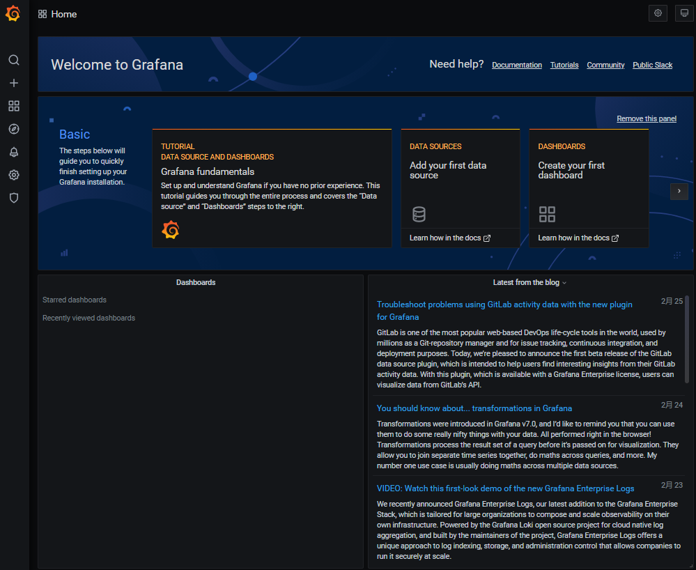
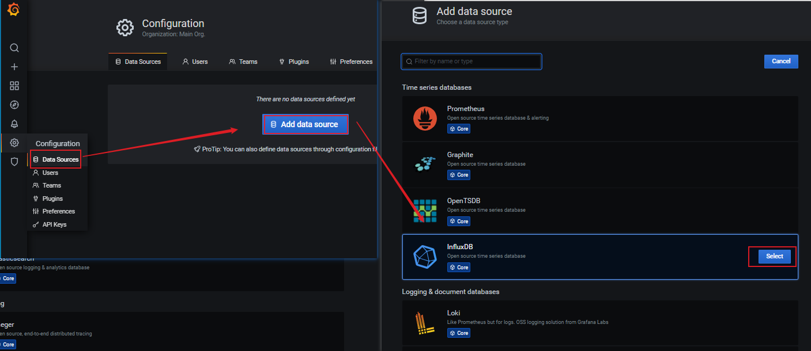
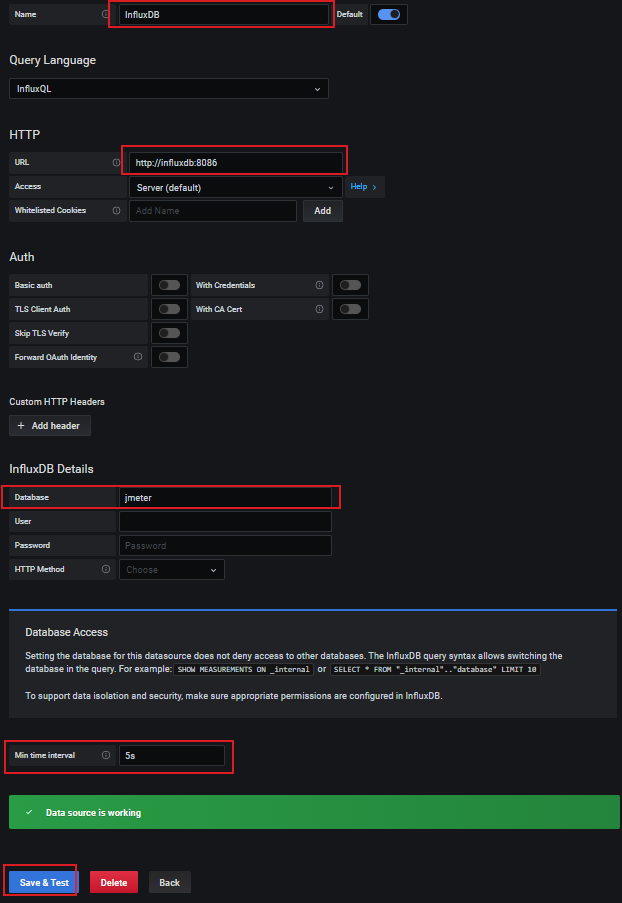
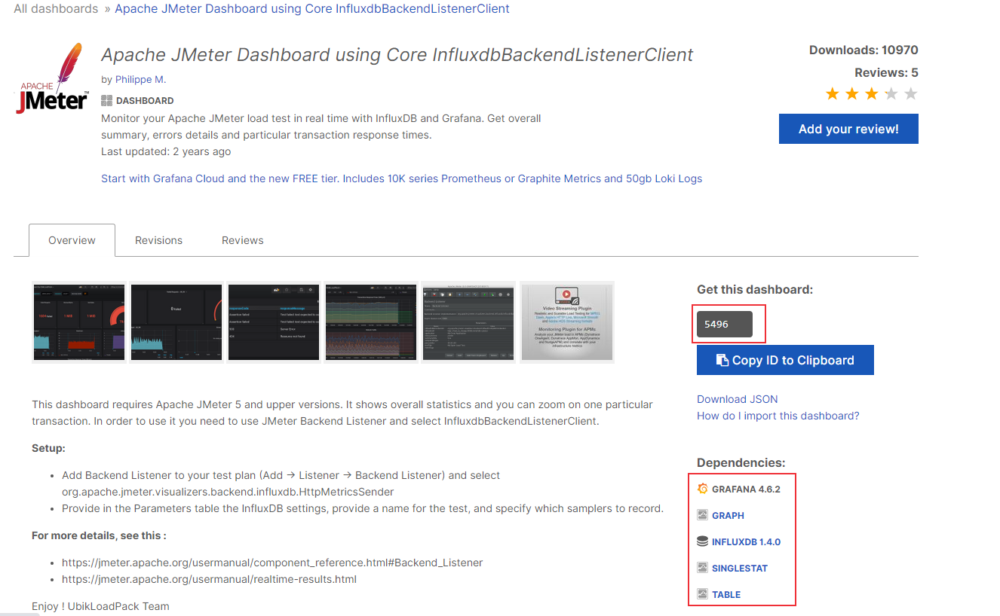
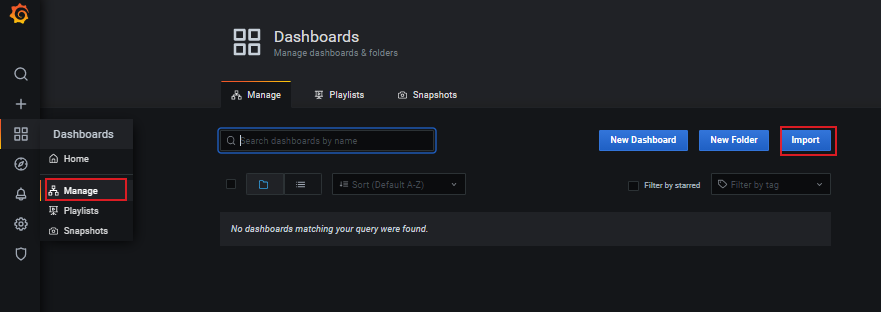
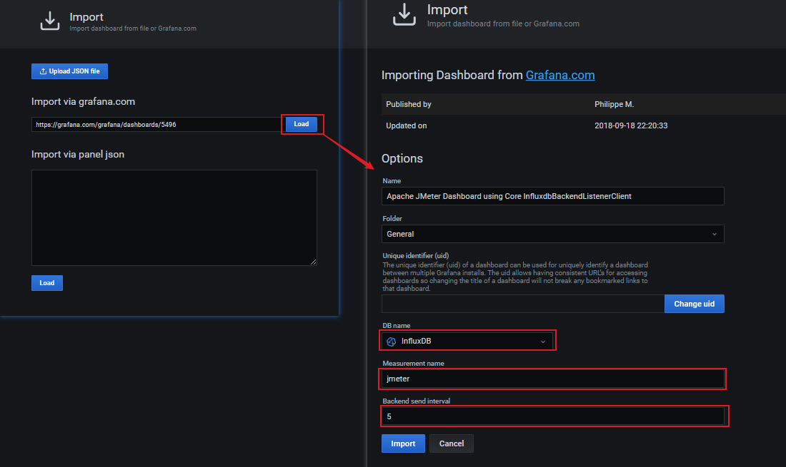
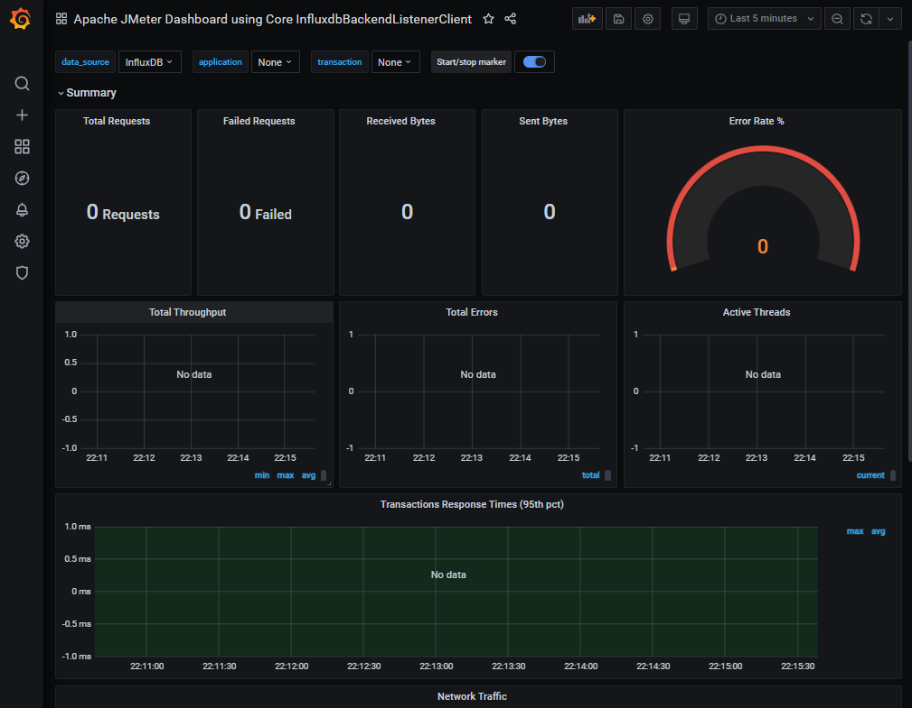
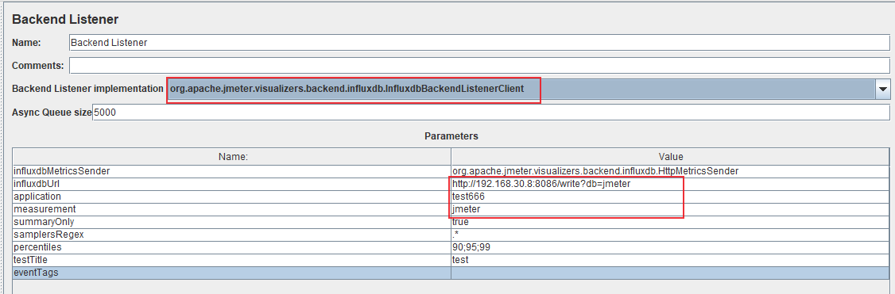
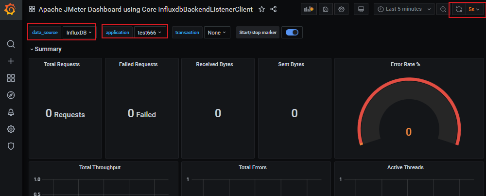
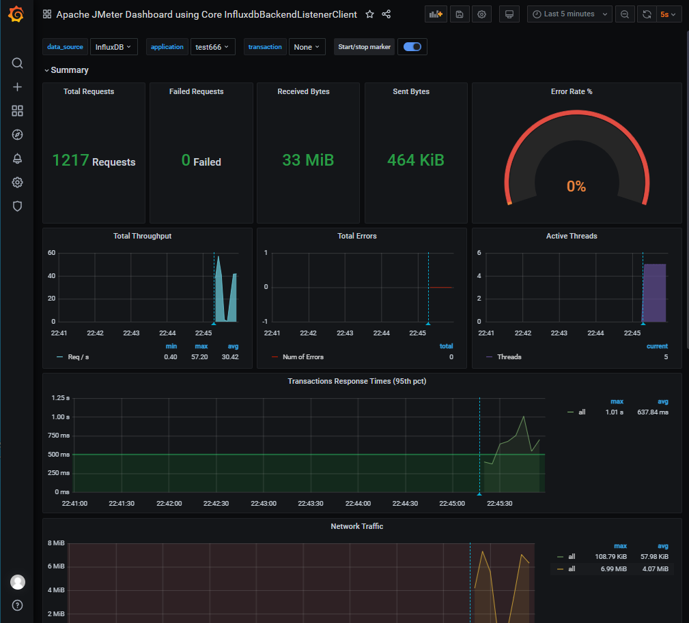

# JMeter性能监控系统：Jmeter + InfluxDB + Grafana
JMeter性能测试完成后，可以查看性能报告（参考[JMeter性能测试：JMeter多用户并发模拟及压测结果分析](https://blog.csdn.net/u010698107/article/details/113824731)），如果想查看实时的性能，可以搭建一个性能监控平台。本文介绍如何搭建JMeter性能测试的性能监控系统。

<!--more-->
## 性能监控系统
JMeter性能测试报告呈现的数据是某个时间段内的平均值，而性能监控平台可以**实时**的查看性能数据，而且有非常友好的图形界面。
### JMeter性能监控平台组成
* JMeter：性能测试工具，产生压测数据。官网地址：[https://jmeter.apache.org/](https://jmeter.apache.org/)
* InfluxDB：一种开源分布式时序数据库，使用Go语言开发，广泛应用于处理和分析资源监控数据，用于存储压测数据。官网地址：[https://grafana.com/](https://grafana.com/)
* Grafana：开源的度量分析与可视化工具，有非常漂亮的图表展示功能、齐全的度量仪表盘和图形编辑器，支持不用种类的数据源（比如InfluxDB和Prometheus），用于将存储于 InfluxDB中的数据以图表的形式展示出来。官网地址：[https://grafana.com/](https://grafana.com/)


### JMeter安装
参考：[JMeter性能测试：JMeter安装及脚本录制回放](https://blog.csdn.net/u010698107/article/details/113824981)

### InfluxDB安装
GitHub仓库地址：[https://github.com/influxdata/influxdb](https://github.com/influxdata/influxdb)
下载地址：[https://portal.influxdata.com/downloads/](https://portal.influxdata.com/downloads/)
参考文档：[https://docs.influxdata.com/influxdb/v2.0/get-started/](https://docs.influxdata.com/influxdb/v2.0/get-started/)

docker安装：[https://hub.docker.com/\_/influxdb](https://hub.docker.com/_/influxdb)
拉取influxDB镜像：
```sh
$ docker pull influxdb
```
### Grafana安装
官方文档：[https://grafana.com/docs/grafana/latest/](https://grafana.com/docs/grafana/latest/)

Grafana dockerhub地址：[https://hub.docker.com/r/grafana/grafana](https://hub.docker.com/r/grafana/grafana)
拉取镜像：
```sh
$ docker pull grafana/grafana
```
查看镜像是否安装成功：
```sh
[root@server ~]# docker images | egrep 'grafana|influxdb' 
grafana/grafana              latest            13afb861111c   6 weeks ago     187MB
influxdb                     latest            0454d5d215cc   6 weeks ago     307MB
[root@server ~]# 
```

## 性能监控平台部署
### 部署 InfluxDB
**1. 新建容器网络**

```sh
$ docker network create grafana
```
**2. 运行容器**
```sh
[root@server ~]# docker run -d -p 8086:8086 --name=influxdb --network=grafana -v ${PWD}/influxdb/:/var/lib/influxdb/ influxdb:latest
aa079b4c24cfc95735613dc642c7d60064cf6c6e6c37ab561721de5825368c90
```
**3. 创建数据库**
第一种方式 : HTTP请求方式
```sh
$ curl -i -XPOST http://localhost:8086/query --data-urlencode "q=CREATE DATABASE jmeter"
```
第二种方式：进入 influxdb容器终端创建

```sh
[root@server ~]# docker exec -it influxdb influx
Connected to http://localhost:8086 version 1.8.3
InfluxDB shell version: 1.8.3
> show databases;
name: databases
name
----
_internal
> create database jmeter;
> 
> show databases;
name: databases
name
----
_internal
jmeter
> exit
[root@server ~]# 
```

### 部署 Grafana
**1. 运行容器**
```sh
[root@server ~]# docker run -d -p 3000:3000 --name=grafana --network=grafana grafana/grafana:latest
4a329f916f3182a5a742d921d1ed438ba837f57ab3955a45ff34c8e45ce236c5
[root@server ~]# docker ps
CONTAINER ID   IMAGE                    COMMAND                  CREATED          STATUS          PORTS                    NAMES
4a329f916f31   grafana/grafana:latest   "/run.sh"                37 seconds ago   Up 32 seconds   0.0.0.0:3000->3000/tcp   grafana
aa079b4c24cf   influxdb:latest          "/entrypoint.sh infl…"   19 minutes ago   Up 19 minutes   0.0.0.0:8086->8086/tcp   influxdb
```

**2. 登录Grafana**
浏览器输入URL：http://192.168.30.8:3000/
其中192.168.30.8为我的服务器地址（部署Grafana的地址），用户名和密码为admin

进入首页


**3. 配置数据源**
点击Configuration -> Data Sources -> Add data source 选择InfluxDB


配置数据源：
1）URL设置为: http://influxdb:8086 ：容器名为influxdb，也可以使用容器的IP地址，查看IP地址方法：
```sh
[root@haiyong ~]# docker exec -it influxdb sh
# cat /etc/hosts
127.0.0.1       localhost
::1     localhost ip6-localhost ip6-loopback
fe00::0 ip6-localnet
ff00::0 ip6-mcastprefix
ff02::1 ip6-allnodes
ff02::2 ip6-allrouters
172.18.0.2      aa079b4c24cf
# exit
[root@haiyong ~]# 
```
或者使用 `docker inspect influxdb` 命令查看

2）Database为 jmeter
3）Min time interval: 5

设置完成后，点击Save&Test，提示数据源设置成功


**4. 选择显示面板**
显示面板可以自己开发，也可以使用其他开发好的面板，在[https://grafana.com/grafana/dashboards](https://grafana.com/grafana/dashboards) 中搜索选择。我使用的是：[https://grafana.com/grafana/dashboards/5496](https://grafana.com/grafana/dashboards/5496)


点击Dashboards -> Manage -> Import

输入jmeter dashboard url，点击load，配置DB name、Measurement name和Backend send interval


点击Import


好了，InfluxDB和Grafana都配置成功了，下面配置JMeter进行压测

## JMeter性能监控
在JMeter创建压测任务，创建方法可参考：[JMeter性能测试：JMeter多用户并发模拟及压测结果分析](https://blog.csdn.net/u010698107/article/details/113824731)

### JMeter配置监听器
添加Backend Listener，Backend Listener的作用是将压测数据传到 InfluxDB中，JMeter支持 InfluxDB和Graphite数据库
Thread Group -> Add -> Listenter -> Backend Listener
Backend Listener应用选择InfluxDB


* 配置influxdbUrl：http://192.168.30.8:8086/write?db=jmeter
* application名设置为test666
* measurement名设置为jmeter
* summaryOnly：如果设置为false，在Grafana面板里面的Errors会显示错误的请求信息

### 配置Grafana
application名和JMeter上设置相同的名称，设置刷新时间为5s


JMeter运行压测


### 查看InfluxDB数据库
压测数据存到了InfluxDB数据库里面，Grafana显示的就是这里面的数据。
```sh
[root@server ~]# docker exec -it influxdb influx

Connected to http://localhost:8086 version 1.8.3
InfluxDB shell version: 1.8.3
> 
> 
> use jmeter;
Using database jmeter
> select * from jmeter limit 3;
name: jmeter
time                application avg count countError endedT hit max maxAT meanAT min minAT pct90.0 pct95.0 pct99.0 rb responseCode responseMessage sb startedT statut transaction
----                ----------- --- ----- ---------- ------ --- --- ----- ------ --- ----- ------- ------- ------- -- ------------ --------------- -- -------- ------ -----------
1614435482883000000 test666                            0              0     0          0                                                                0               internal
1614435483240000000 test666                            0              0     0          0                                                                1               internal
1614435485281000000 test666                            0              0     0          0                                                                1               internal
> 
> select * from events;
name: events
time                application text               title
----                ----------- ----               -----
1614437117192000000 test666     test started       ApacheJMeter
1614437488496000000 test666     test ended         ApacheJMeter
1614437552834000000 test666     test started       ApacheJMeter
1614437566732000000 test666     test ended         ApacheJMeter
1614437586119000000 test666     test started       ApacheJMeter
1614437722290000000 test666     test ended         ApacheJMeter
> 
```


