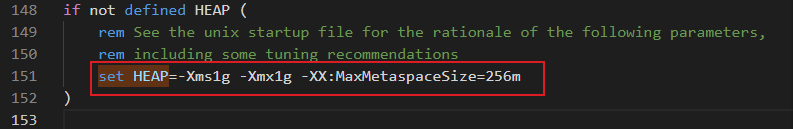
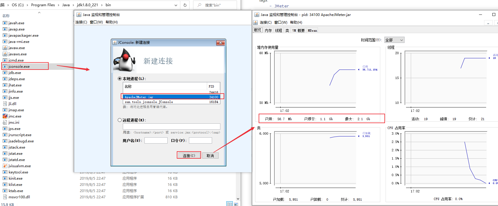
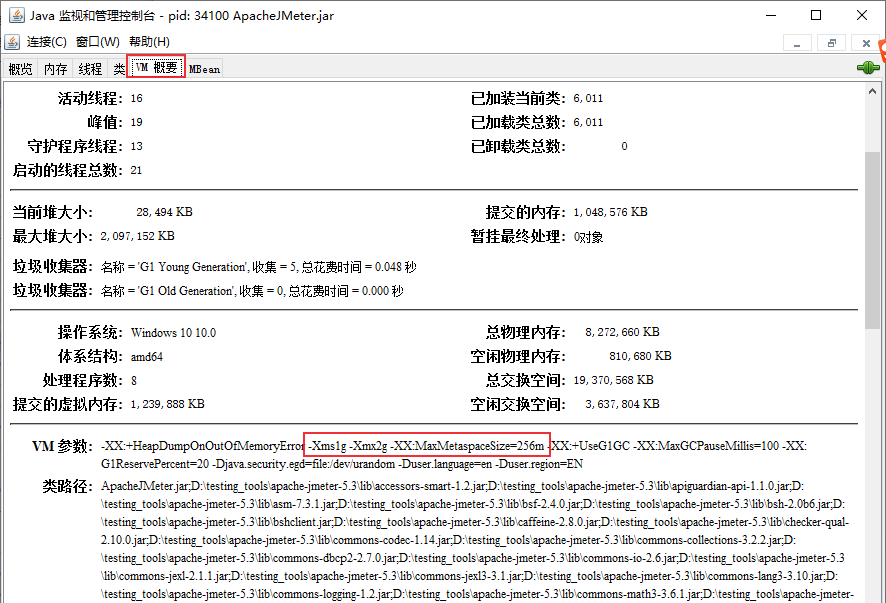
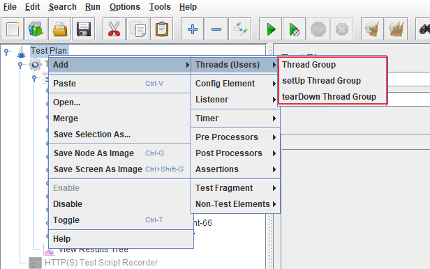
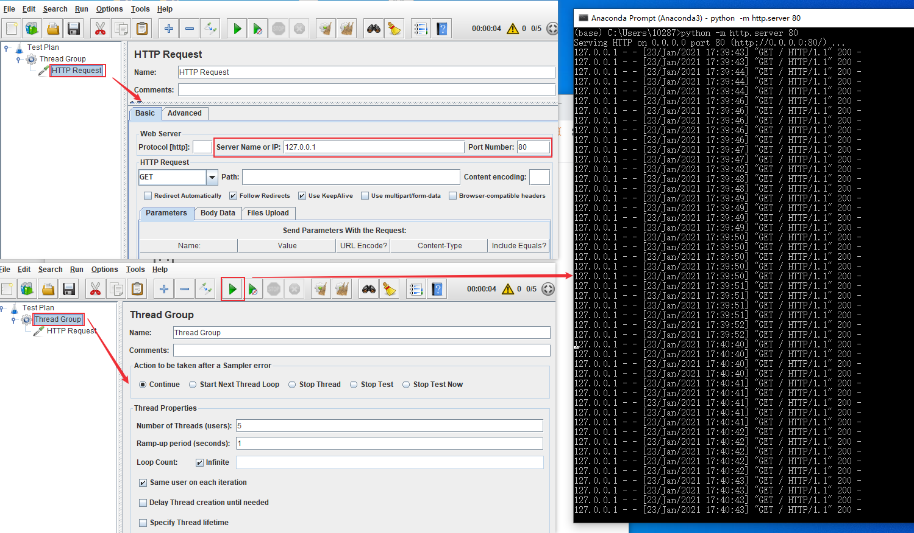
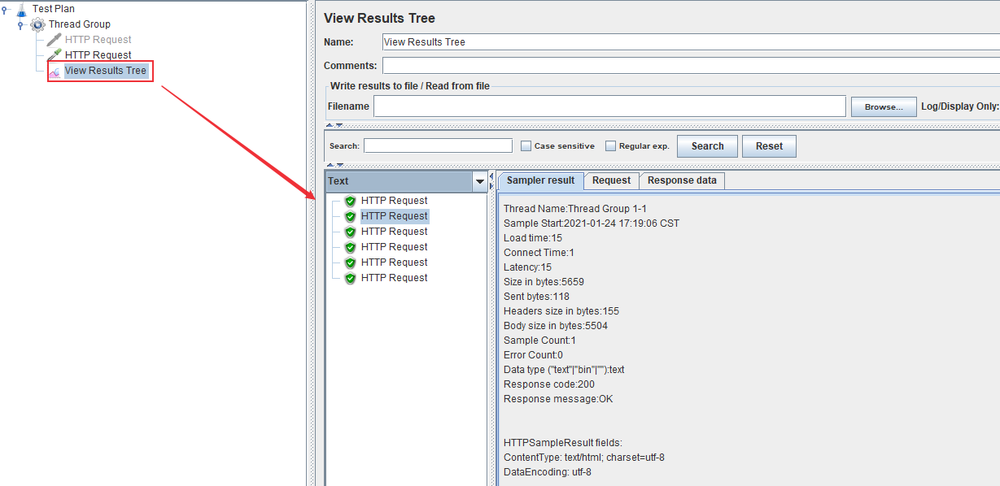
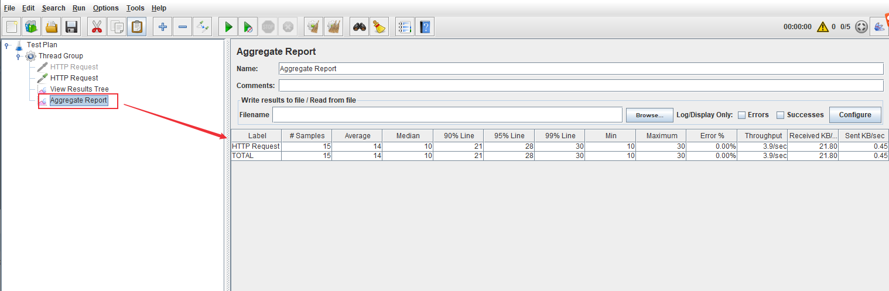
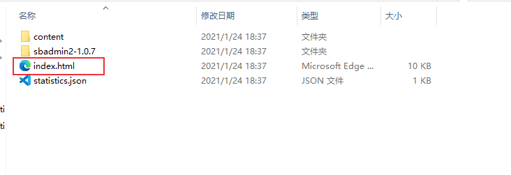
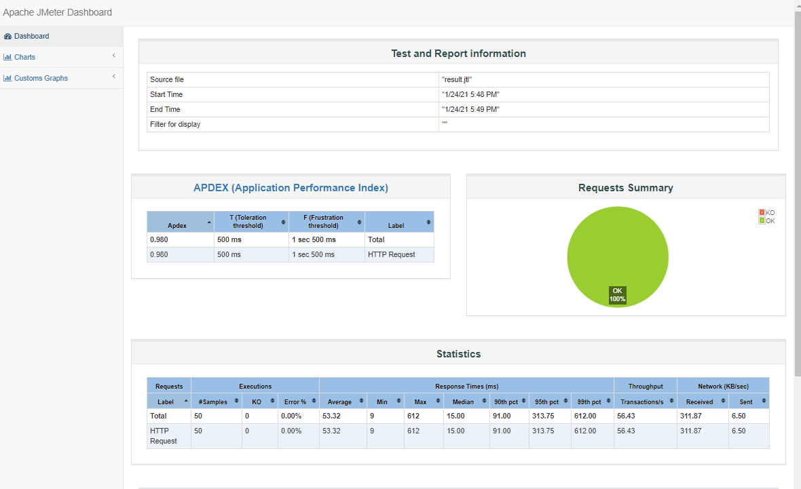

# JMeter性能测试：JMeter多用户并发模拟及压测结果分析
JMeter多用户并发模拟

<!--more-->

## JMeter设置
多用户并发数的多少与计算机内存有关，设置 jmeter.bat (Windows) 或者 jmeter.sh (Linux)：
Windows设置：编辑jmeter.bat文件，设置HEAP


Linux设置：编辑jmeter.sh文件，设置变量，`JVM_ARGS="-Xms1g-Xmx2g"`

以Windows为例，设置`set HEAP=-Xms1g -Xmx2g -XX:MaxMetaspaceSize=256m` ，重新开启JMeter，打开Java监控工具Jconsole：


参数设置生效。

## JMeter线程组
JMeter性能测试任务都是基于线程组的，是性能测试的资源调度池，控制性能测试的运行调度、虚拟用户数(并发数)、执行策略。JMeter线程组主要有三类：
* setUp Thread Group：普通线程组执行之前执行，相当于pytest测试框架的setup方法。
* Thread Group：普通线程
* tearDown Thread Group：普通线程组之后执行。



## JMeter压测实例
首先使用python开启一个http服务:
```sh
(base) C:\Users\10287>python -m http.server 80
Serving HTTP on 0.0.0.0 port 80 (http://0.0.0.0:80/) ...

```

新建线程组，设置线程数，点击运行


### View Results Tree
Thread Group -> Add -> Listenter -> View Results Tree

支持各种测试器：正则表达式、CSS选择器、XPath测试、JSON Tester等

### Aggregate Report
查看Aggregate Report，聚合报告
Thread Group -> Add -> Listenter -> Aggregate Report


参数:
* Average：平均响应时间，所有请求的平均响应时间。
* Median：中位数，50%的用户响应时间不超过这个值。
* 99%line：99%的用户响应时间不超过这个值。
* Error%：异常百分比。(错误请求的数量/请求的总数)
* Throughput：吞吐量，默认情况下每秒完成的请求数。
* Received KB/sec：接收数据。

## 命令行方式执行压测
使用图形界面会消耗部分内存，可以直接使用命令行方式运行。

先保存压测脚本为test_http.jmx，执行如下命令：
`jmeter.bat -n -t test_http.jmx -l test_result.jtl`
```sh
D:\testing_tools\apache-jmeter-5.3\bin>jmeter.bat -n -t D:/ProgramWorkspace/TestingDemo/test_jmeter/test_http.jmx -l result.jtl
Creating summariser <summary>
Created the tree successfully using D:/ProgramWorkspace/TestingDemo/test_jmeter/test_http.jmx
Starting standalone test @ Sun Jan 24 17:48:59 CST 2021 (1611481739136)
Waiting for possible Shutdown/StopTestNow/HeapDump/ThreadDump message on port 4445
summary +     23 in 00:00:01 =   43.6/s Avg:    35 Min:    11 Max:    91 Err:     0 (0.00%) Active: 3 Started: 25 Finished: 22
summary +     27 in 00:00:01 =   52.7/s Avg:    68 Min:     9 Max:   612 Err:     0 (0.00%) Active: 0 Started: 50 Finished: 50
summary =     50 in 00:00:01 =   47.9/s Avg:    53 Min:     9 Max:   612 Err:     0 (0.00%)
Tidying up ...    @ Sun Jan 24 17:49:00 CST 2021 (1611481740529)
... end of run

```

### jtl文件解析
解析命令行方式运行脚本生成的 jtl文件：
```sh
jmeter.bat -g result.jtl -e -o D:/resultReport
```


打开index.html文件，可以查看性能报告：



