# JMeter性能测试：JMeter安装及脚本录制回放
<!--more-->

## 性能测试基本概念
### 为什么要做性能测试?
* 模拟真实的用户场景，提前发现并修复问题。
* 最小化成本：新服务上线不知道部署多少台服务器。
* 评估应用系统性能，给运维做系统容量规划提供依据、给开发提供应用调优参考。

### 什么是性能测试?
性能测试模拟多个用户的操作对服务器硬件性能的影响，用于检查软件和硬件的响应速度、稳定性、可靠性和资源使用等情况。常见性能指标包括：
* TPS(Transaction per Second)：每秒事物处理能力
* RT(Response Time)：响应时间
* 延迟
* 吞吐量
* 并发用户数
* ......

负载测试是一种性能测试，检查系统在固定时间段内为大量并发虚拟用户提供服务下的运行情况。压力测试通过在极端负载下测试系统的上限。
## 常见性能测试工具
常见的性能测试工具如下，其中JMeter 是应用最广泛的。

* Apache JMeter：开源免费，使用Java语言开发，有很多第三方插件，具有脚本录制功能，[https://jmeter.apache.org/](https://jmeter.apache.org/)
* apache bench: ab工具是apache HTTP服务器性能测试工具，[http://httpd.apache.org/docs/2.4/programs/ab.html](http://httpd.apache.org/docs/2.4/programs/ab.html)
* LoadRunner：收费，使用C语言开发。
* Locust：开源免费，使用Python语言开发。[https://www.locust.io/](https://www.locust.io/)
* nGrinder：Naver公司基于 Grinder开发的性能测试平台。 Grinder是一个能运行 jython(在JVM上运行的 Python)、 groovy编写测试脚本的应用程序。免费软件，使用Java语言开发。

## JMeter
Apache JMeter开源免费，使用Java开发，可用于测试Web性能，也可以测试数据库性能（通过JDBC）。 支持插件开发扩展功能，可以二次开发定制协议，支持录制、回放方式获取测试脚本，下面介绍JMeter压测脚本的录制与编写。

### JMeter安装-windows
1. 安装Java jdk
下载地址：[https://www.oracle.com/java/technologies/javase/javase-jdk8-downloads.html](https://www.oracle.com/java/technologies/javase/javase-jdk8-downloads.html)
加入环境变量，具体安装过程参考：**App自动化测试 | Appium 介绍及环境安装**
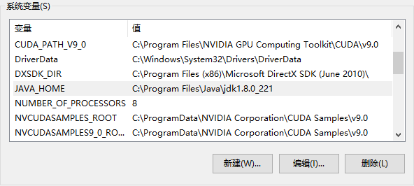

2. JMeter下载安装
下载地址：[https://jmeter.apache.org/download_jmeter.cgi](https://jmeter.apache.org/download_jmeter.cgi)
下载后解压缩，双击打开jmeter.bat批处理文件打开JMeter
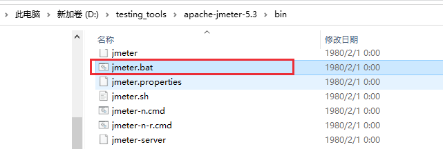

```bash
D:\testing_tools\apache-jmeter-5.3\bin>jmeter -v
    _    ____   _    ____ _   _ _____       _ __  __ _____ _____ _____ ____
   / \  |  _ \ / \  / ___| | | | ____|     | |  \/  | ____|_   _| ____|  _ \
  / _ \ | |_) / _ \| |   | |_| |  _|    _  | | |\/| |  _|   | | |  _| | |_) |
 / ___ \|  __/ ___ \ |___|  _  | |___  | |_| | |  | | |___  | | | |___|  _ <
/_/   \_\_| /_/   \_\____|_| |_|_____|  \___/|_|  |_|_____| |_| |_____|_| \_\ 5.3

Copyright (c) 1999-2020 The Apache Software Foundation

```

### JMeter插件安装
下载 jmeter-plugins.org：[https://jmeter-plugins.org/install/Install/](https://jmeter-plugins.org/install/Install/)
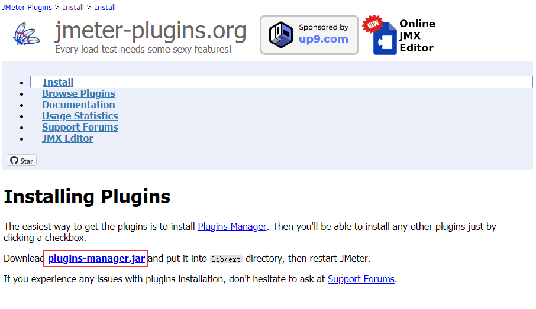

将jmeter-plugins-manager-1.6.jar 文件放到JMeter lib/ext目录下，重新打开JMeter，在Options中可以看到Plugins Manager选项。
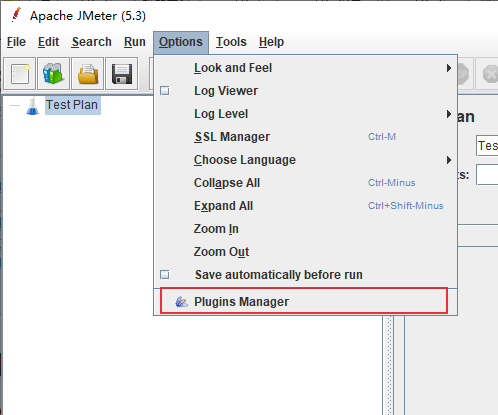
安装可用插件
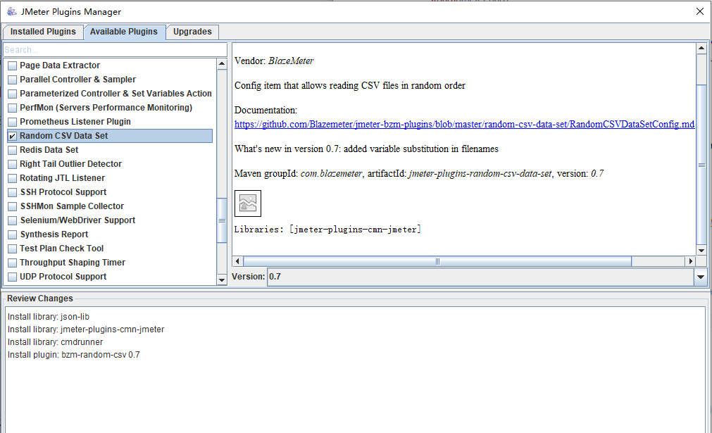


### JMeter脚本录制
添加线程组
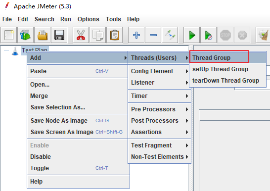
添加Recording Controller
Test Plan -> Thread Group -> Add -> Logic Controller -> Recording Controller
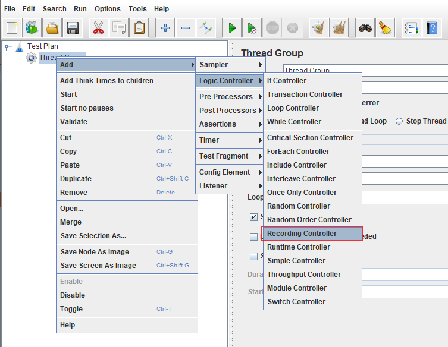
添加HTTp(s) Test Script Recorder （代理服务）
Test Plan -> Add -> Non-Test Elements -> HTTp(s) Test Script Recorder
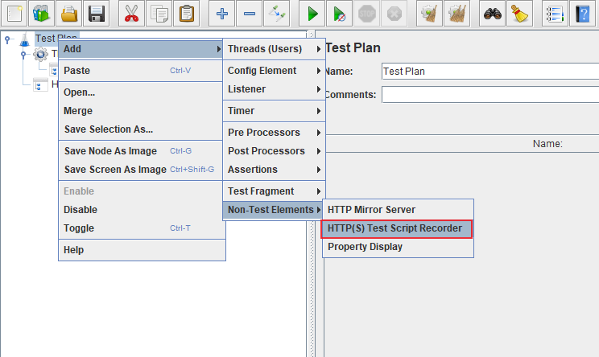


浏览器配置代理
使用SwitchyOmega插件添加JMeter代理
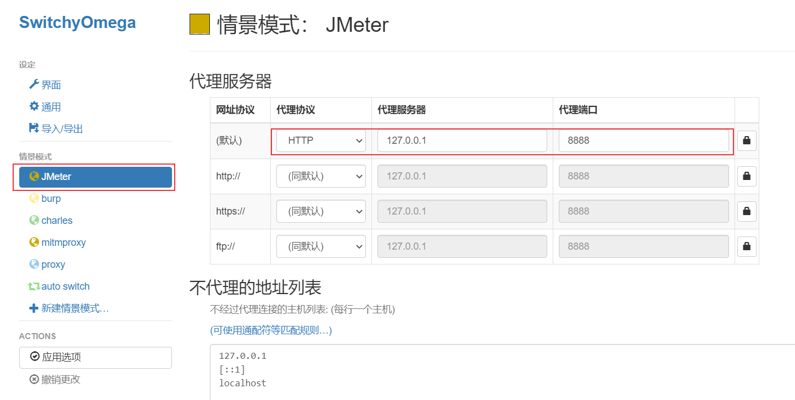

配置HTTp(s) Test Script Recorder，点击Start
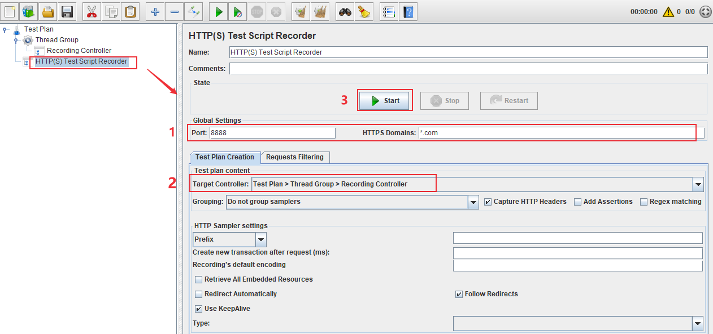
弹出提示框，需要安装证书（HTTPs请求抓取需要证书）
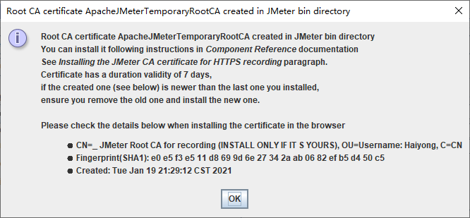
在JMeter目录下会生成两个证书文件，点击证书安装
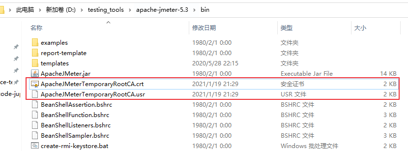
证书安装成功后，浏览器就可以访问百度了。
浏览器刷新百度页面，在JMeter页面可以看到抓取到的请求
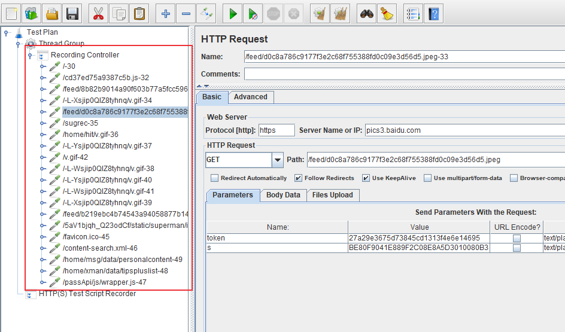
可以看到有各种请求数据，我们可以对这些进行过滤，比如过滤gif、png等文件
选择HTTp(s) Test Script Recorder，点击Requests Filtering，添加过滤条件（包含或者排除），过滤条件使用正则表达式。
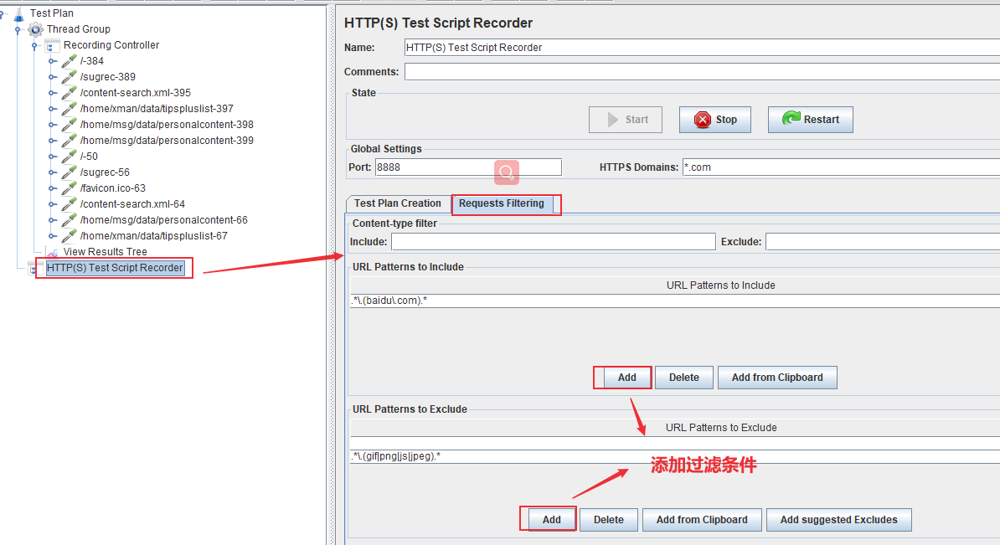

录制完成后，点击停止录制
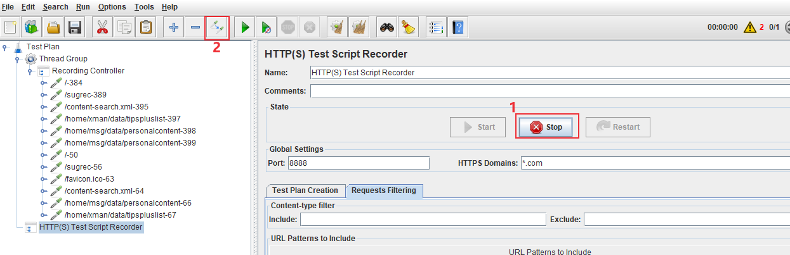

Thread Group -> Add -> Listenter -> View Results Tree
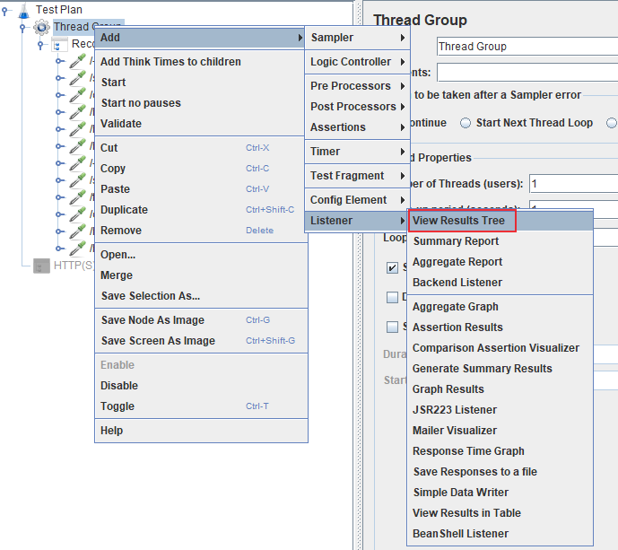
选择View Results Tree，点击运行，可以看到每一步请求的响应结果。
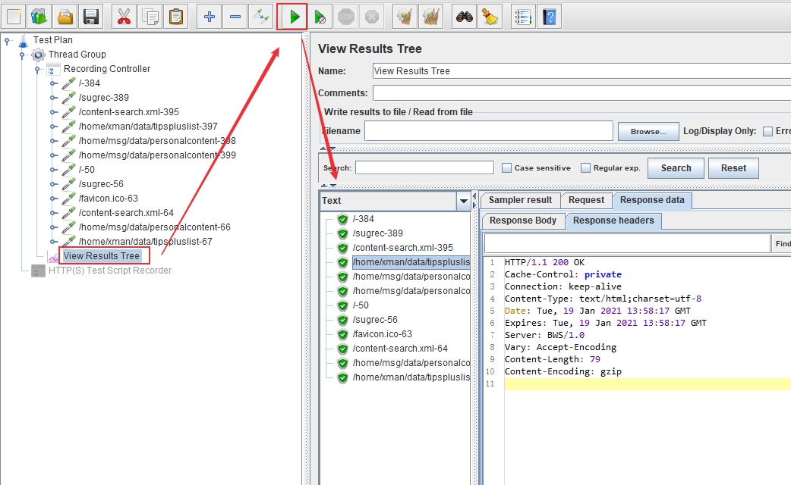

