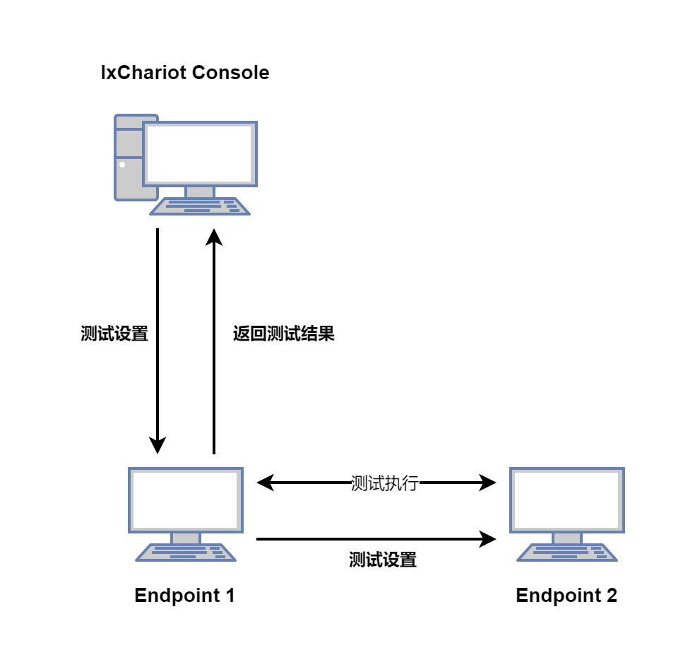
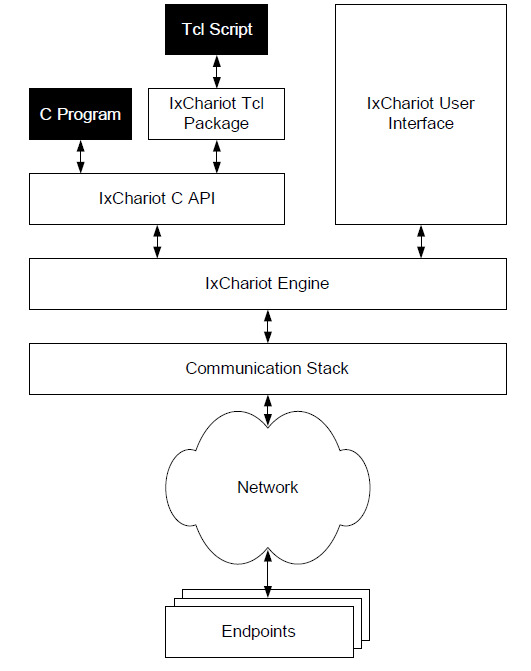
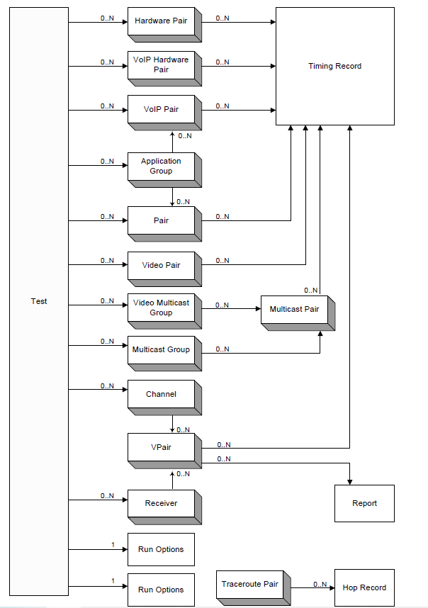
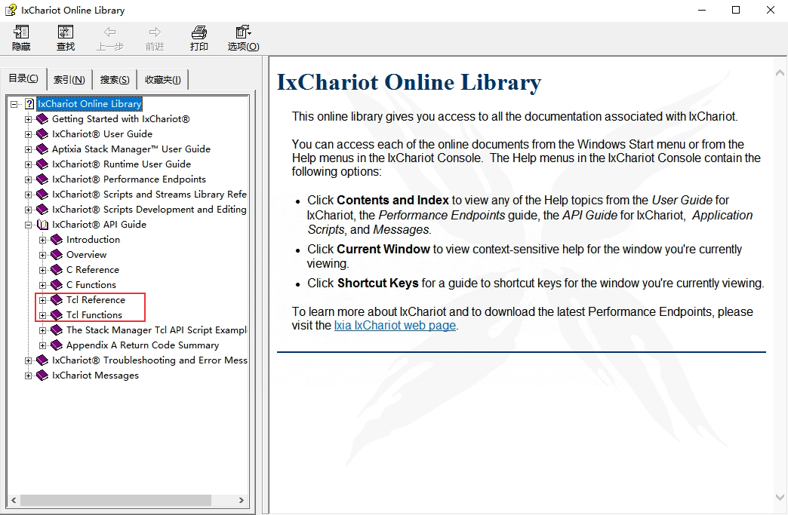

# 性能测试工具 IxChariot：Tcl脚本调用方法介绍
ixChariot是一款功能强大的性能测试软件，可用来测试有线和无线性能，可以模拟真实应用程序流量，并提供关键性能指标，包括吞吐量、丢包、抖动、延迟、MOS等。本文简单介绍如何使用IxChariot Tcl API来实现自动化跑流。

<!--more-->

## IxChariot测试网络

一个基本的IxChariot测试网络主要包括三个部分：

- **IxChariot控制端**：可以安装IxChariot软件的Windows PC
- **Endpoint 1**：接收IxChariot控制端的测试脚本和数据，与`Endpoint 2` 进行跑流测试，并将所有测试结果返回到IxChariot控制端。
- **Endpoint 2**：与`Endpoint 1`通信，接收`Endpoint 1`的测试脚本和数据，并将测试结果返回给`Endpoint 1`。



通常在IxChariot控制端电脑的IxChariot软件配置跑流脚本，在`Endpoint 1` 和 `Endpoint 2` 两个电脑上安装并启动Endpoint。然后就可以在IxChariot控制端运行跑流脚本，测试结果会返回到控制端。

IxChariot软件页面的手动配置这里就不介绍了，下面主要介绍如何使用Chariot API来实现自动化跑流。

## IxChariot API简介

IxChariot API支持使用C语言和Tcl脚本来驱动IxChariot跑流，我们可以通过IxChariot API来创建、执行、保存和提取测试结果。

下图是IxChariot包与IxChariot API、endpoint之间的工作流程。



IxChariot API中的对象是分层的，其包含的分层结构如下图：



以下对象在测试对象中单独实例化，然后添加到测试对象示例中：

**•** pair

**•** hardware pair

**•** VoIP pair

**•** VoIP hardware pair

**•** application group

**•** video pair

**•** multicast group

**•** video multicast group

**•** multicast pair

**•** channel

**•** receiver


IxChariot测试必须至少包含一个 pair 对象：pair，hardware pair, VoIP pair, video pair, multicast group, 或者 video multicast group对象实例。当测试开始执行时，会自动创建时间记录（timing record）对象实例。

IxChariot Tcl包提供的方法可在帮助文档中查看。



## IxChariot环境安装

本文主要介绍IxChariot Tcl API的简单使用，这里介绍Tcl跑流的环境安装步骤。

### 1. 安装IxChariot

在IxChariot控制端电脑（Windows系统）上安装，我使用的是默认安装路径：`C:\Program Files (x86)\Ixia\IxChariot`

### 2. 安装endpoint

安装系统平台对应的endpoint，支持Windows、Linux和macOS系统。

**1、Windows系统安装**

Windows系统双击安装即可。

启动endpoint的cmd命令:

```bash
$ net start IxiaEndpoint
```

停止endpoint进程的cmd命令:
```bash
$ net stop IxiaEndpoint
```

**2、Linux系统安装**

Linux rpm包安装方法：

```bash
$ rpm -ivh pelinux_amd64_95.rpm
```

Linux 源码包安装方法：

```bash
$ cd endpoint
$ tar -xvzf pelinux_amd64_730.tar.gz
$ ./endpoint.install accept_license
```

启动endpoint:

```bash
$ setsid  /usr/local/Ixia/endpoint
```

停止endpoint进程:

```bash
$ /usr/local/Ixia/endpoint –k
```


### 3. 安装Tcl

使用IxChariot Tcl API时，建议在命令行执行Tcl脚本来运行IxChariot：

```bash
$ tclsh myTest.tcl
```

因此需要安装一下Tcl环境，Tcl下载地址：[https://www.tcl.tk/software/tcltk/download.html](https://www.tcl.tk/software/tcltk/download.html)

安装完成后，需要将tcl安装bin目录添加到环境变量。

## IxChariot Tcl API

下面列举一些 IxChariot Tcl 包创建普通 pair 的一些常用方法。

### chrRunOpts

用于定义和获取测试运行选项，比如设置跑流时间：

```tcl
set test [chrTest new]
##设置测试时间值
set runOpts [chrTest getRunOpts $test]
chrRunOpts set $runOpts TEST_END FIXED_DURATION
chrRunOpts set $runOpts TEST_DURATION 30
```

必须将 `TEST_END` 设置为 `FIXED_DURATION`时，`TEST_DURATION` 值才会生效。

### chrPair set

设置pair属性

```tcl
chrPair set pair1 PROTOCOL $pro; # 设置协议
chrPair set pair1 E1_ADDR IP地址; # 设置Endpoint 1 address
chrPair set pair1 E2_ADDR IP地址; # 设置Endpoint 2 address
```

### chrPair useScript

给pair设置测试脚本

```tcl
chrPair useScript pair1 Throughput.scr;
```

### chrPair setScriptVar

设置脚本变量，比如

```tcl
chrPair setScriptVar pair1 file_size $filesize};#发送字节数
chrPair setScriptVar pair1 send_buffer_size $buffersize; # buffer大小
chrPair setScriptVar pair1 send_data_rate $datarate};#发送速率
```

### 读取结果

可以使用 `chrCommonResults get` 和 `chrPairResults get` 方法来读取测试结果。

```tcl
set runingtime [chrCommonResults get pair1 MEAS_TIME; # 运行时间
set throughput [chrPairResults get pair1 THROUGHPUT; # THROUGHPUT结果
```

更多API用法可参考接口文档，下面列举创建pair和VoIPPair的示例。

## Tcl脚本示例

### pair创建实例

```tcl
set e1 "localhost"
set e2 "localhost"
set script "c:/Program Files/Ixia/IxChariot/Scripts/Throughput.scr"
set testFile "c:/Program Files/Ixia/IxChariot/tests/lbtest.tst"
set timeout 60

## （1）加载Chariot包
load ChariotExt
package require ChariotExt

## （2）创建测试对象
set test [chrTest new]
set runOpts [chrTest getRunOpts $test]
chrRunOpts set $runOpts TEST_END FIXED_DURATION
chrRunOpts set $runOpts TEST_DURATION $timeout; #设置测试运行时间
    
## （3）创建pair对象
set pair [chrPair new]

## （4）设置pair属性
chrPair set $pair E1_ADDR $e1 E2_ADDR $e2
chrPair set $pair PROTOCOL TCP; #设置协议

## （5）设置测试脚本
chrPair useScript $pair $script
chrPair setScriptVar $pair file_size 1000000;#发送字节数
chrPair setScriptVar $pair send_buffer_size 1500;#buffer大小
chrPair setScriptVar $pair send_data_rate "20 Mb";#发送速率

## （6）添加pair到测试对象中
chrTest addPair $test $pair

## （7）运行测试
chrTest start $test

## （8）等待测试结束
set $timeout [expr 10 + $timeout]
if {![chrTest isStopped $test $timeout]} {
 puts "ERROR: Test didn’t stop"
 chrTest delete $test force
 return
}

## （9）打印

puts "==========="
puts "Test setup:\n----------"
puts "Number of pairs = [chrTest getPairCount $test]"
puts "E1 address : [chrPair get $pair E1_ADDR]"
puts "E2 address : [chrPair get $pair E2_ADDR]"
## We didn’t set the protocol, but let’s show it anyway.
puts "Protocol : [chrPair get $pair PROTOCOL]"
## We’ll show both the script filename and
## the application script name.
puts "Script filename : [chrPair get $pair SCRIPT_FILENAME]"
puts "Appl script name: [chrPair get $pair APPL_SCRIPT_NAME]"

## （10）读取测试结果: 吞吐量
puts ""
puts "Test results:\n------------"
puts "Number of timing records = \
[chrPair getTimingRecordCount $pair]"

set throughput [chrPairResults get $pair THROUGHPUT]
set avg [format "%.3f" [lindex $throughput 0]]
set min [format "%.3f" [lindex $throughput 1]]
set max [format "%.3f" [lindex $throughput 2]]
puts "Throughput:"
puts " avg $avg min $min max $max"

## （11）保存测试结果
puts "Save the test..."
chrTest save $test $testFile

## （12）清理
chrTest delete $test force

return
```

### VoIPPair创建实例

```tcl
set e1 "localhost"
set e2 "localhost"
set timeout 60

## （1）加载Chariot包
load ChariotExt
package require ChariotExt

## （2）创建测试对象
set test [chrTest new]
set runOpts [chrTest getRunOpts $test]
chrRunOpts set $runOpts TEST_END FIXED_DURATION
chrRunOpts set $runOpts TEST_DURATION $timeout; #设置测试运行时间

## （2）创建voippair对象
set voippair1 [chrVoIPPair new]; # VoIP Pair创建

## （3）设置pair属性
chrPair set $voippair1 E1_ADDR $e1 E2_ADDR $e2
chrPair set $voippair1 QOS_NAME "VoIPQoS";
chrVoIPPair set $voippair1 CODEC "G711u";    

## （4）添加voippair1到测试对象中
chrTest addPair $test $voippair1

## （5）运行测试
chrTest start $test

## （6）等待测试结束
if {![chrTest isStopped $test $timeout]} {
 puts "ERROR: Test didn’t stop in 2 minutes!"
 chrTest delete $test force
 return
}

## （7）读取测试结果
## MOS
set mos [chrPairResults get $voippair1 MOS_ESTIMATE]
set mos_avg [format "%.3f" [lindex $mos 0]]
puts "MOS_avg $mos_avg"        

## 时延
set delay [chrPairResults get $voippair1 END_TO_END_DELAY]
set delay_avg [lindex $delay 0]
set delay_avg [format "%.1f" $delay_avg]
puts "END_TO_END_DELAY $delay_avg"

## 丢包率
set bytes_recv_e2 [chrCommonResults get $voippair1 BYTES_RECV_E2]
## puts ""
## puts "BYTES_RECV_E2: $bytes_recv_e2"
set bytes_sent_e1 [chrCommonResults get $voippair1 BYTES_SENT_E1]
## puts "BYTES_SENT_E1: $bytes_sent_e1"
set bytes_lost_rate [format "%.4f" [expr ($bytes_sent_e1 - $bytes_recv_e2)/$bytes_sent_e1]]
set bytes_lost_rate [expr $bytes_lost_rate*100]
puts "BYTES_LOST_RATE $bytes_lost_rate"

## （11）保存测试结果
puts "Save the test..."
chrTest save $test $testFile

## （12）清理
chrTest delete $test force

return
```

## 其它

### 执行tst文件

可以使用runtst工具来执行创建的tst文件：

```bash
$ cd C:\Program Files (x86)\Ixia\IxChariot
$ runtst.exe -t20 C:\\Users\DELL\\Documents\\IxChariot\\TESTS\\demo.tst d:\\test\\demo.tst
```

### Python执行TCL脚本

除了使用Python的 `os.popen` 或者 `subprocess.Popen` 调用编写好的Tcl脚本执行测试外，也可以使用Python的Tcl库来执行Tcl命令：

```python
from Tkinter import Tcl

tcl = Tcl()
## 加载ChariotExt库
tcl.eval("load ChariotExt")
tcl.eval("package require ChariotExt")
```

注意：

1. 执行此Python脚本的电脑必须安装好IXChariot控制端软件，否则无法加载ChariotExt.dll动态链接库。
2. 如果ChariotExt.dll为32位VC++环境编译，Python也需要32位。


