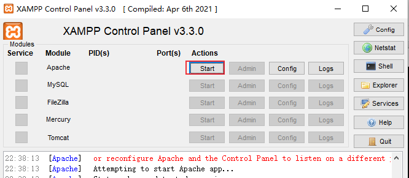
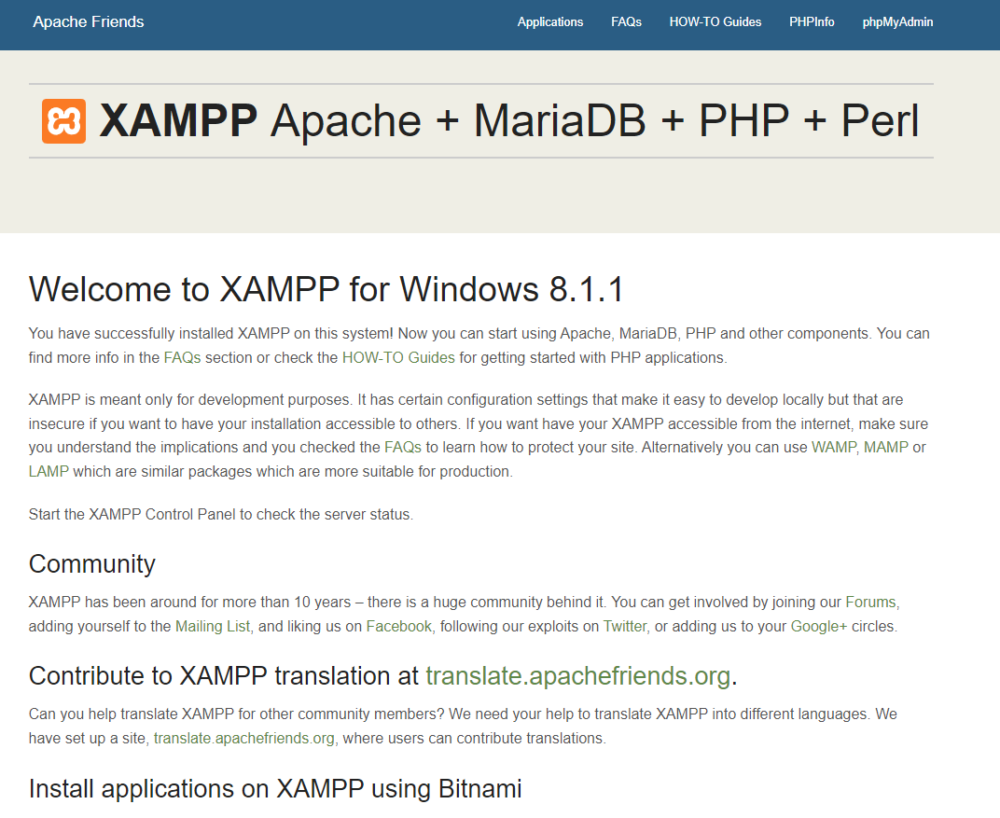
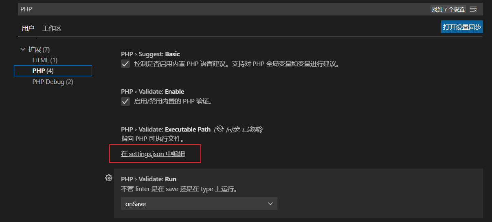
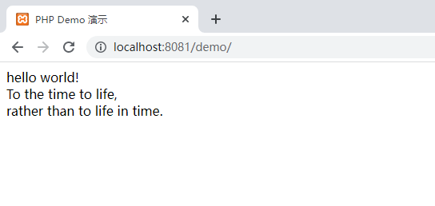

# PHP笔记（一）：开发环境配置
本文记录如何在Windows系统配置简单的PHP开发环境。

<!--more-->

## PHP环境部署

PHP适用于Web应用程序开发，这里介绍使用XAMPP来配置开发环境，它是一个免费的Apache发行版，包含了MariaDB、PHP和Perl。

由于用不到数据库，本文不介绍数据库安装和配置方法。

### 下载安装XAMPP

XAMPP下载地址：

- https://www.apachefriends.org/index.html
- https://www.apachefriends.org/zh_cn/download.html

双击运行目录内的setup_xampp.bat初始化xampp。

将php安装路径`D:\tools\xampp\php` 加入环境变量，测试是否设置成功：
```bash
$ php -v
PHP 8.1.1 (cli) (built: Dec 15 2021 10:31:43) (ZTS Visual C++ 2019 x64)
Copyright (c) The PHP Group
Zend Engine v4.1.1, Copyright (c) Zend Technologies
```

### 配置XAMPP

Apache配置：

修改 `D:\tools\xampp\apache\conf\httpd.conf`：

```bash
Listen 8081
```

修改 `D:\tools\xampp\apache\conf\extra\httpd-ssl.conf`，将443修改为4433：

```bash
Listen 4433
```

启动Apache



访问 http://localhost:8081/dashboard/




## Vscode 配置PHP

### 配置PHP 可执行文件

点击VSCode的 文件-首选项-设置，查找php



点击setting.json，添加以下一行配置：

```bash
"php.validate.executablePath": "D:/tools/xampp/php/php.exe",
```

### 安装插件

1、PHP Intelephense插件：可实现方法跳转。

2、PHP Debug插件：调试

3、GitHub Copilot：基于AI算法进行代码补全，功能非常强大，推荐安装。

## PHP代码示例

在 `D:\tools\xampp\htdocs\` 目录下新建文件夹demo，创建文件index.php，编写代码：

```php
<?php echo 'hello world!' ?>

<!DOCTYPE html>
<html lang="zh-CN">

<head>
    <meta charset="utf-8" />
    <title> PHP Demo <?php echo '演示'; ?></title>
</head>

<body>
    <br />
    <?php echo 'To the time to life, ' ?>
    <br />
    <?php echo 'rather than to life in time.';?>
</body>

</html>
```

浏览器访问： http://localhost:8081/demo/




