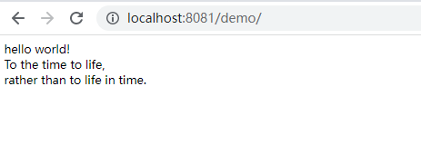

# PHP笔记（二）：字符串处理相关方法


本文记录PHP处理字符串的方法，包括普通字符串处理以及正则表达式处理字符串方法。


更详细PHP语法和函数介绍可参考官方文档：[https://www.php.net/manual/zh/](https://www.php.net/manual/zh/)，本文仅记录了部分我使用到的一些方法。

本文使用的PHP版本为PHP 8.1.1

## PHP基本语法

1、PHP语言标记

```php
<?php //开始
?> //结束
```

2、PHP代码可以嵌入到html代码中

3、使用分号分隔指令，文件末尾的 PHP 代码段结束标记可以不要，结束标志 `?>` 隐含了一个分号。

4、注释

```php
/*
多行注释
*/
//单行注释
```

示例代码：
```php
<?php echo 'hello world!' ?>

<!DOCTYPE html>
<html lang="zh-CN">

<head>
    <meta charset="utf-8" />
    <title> PHP Demo <?php echo '演示'; ?></title>
</head>

<body>
    <br />
    <?php echo 'To the time to life, ' ?>
    <br />
    <?php echo 'rather than to life in time.';
    /*
    多行注释
    */
    //单行注释
    ?>
</body>

</html>
```

浏览器访问地址 http://localhost:8081/demo/




## 字符串处理

PHP提供了很多字符串处理相关函数，这里记录我使用到的部分方法。

### 1. 字符串分割

语法：[explode](https://www.php.net/manual/zh/function.explode.php)(string `$separator`, string `$string`, int `$limit` = **`PHP_INT_MAX`**): array，返回字符串数组

举例：

```php
<?php
$str = 'one,two,three';
print_r(explode(',',$str));
echo "<br/>";

print_r(explode(',',$str,2));
echo "<br/>";

$str1 = 'one
         two
         three';
print_r(explode(PHP_EOL,$str1));
?>
```

结果：

```php
Array ( [0] => one [1] => two [2] => three )
Array ( [0] => one [1] => two,three )
Array ( [0] => one [1] => two [2] => three )
```

### 2. 用字符串连接数组元素

implode支持将数组元素拼接成字符串：[implode](https://www.php.net/manual/zh/function.implode.php)(string `$separator`, array `$array`): string

举例：

```php
<?php
/* implode */
$array = ['one', 'two', 'three'];
print_r(implode(",", $array)); 

?>
```

结果：

```php
one,two,three
```

### 3. 字符串切片

使用 `substr` 方法来返回字符串的子串。

- [substr](https://www.php.net/manual/zh/function.substr.php)(`$string`,  `$offset`, `$length` = **`null`**)

举例：

```php
<?php
/* substr */
$str = 'abcdefgh';
echo substr($str, -2) . "<br />\n";     // gh
echo substr($str, -2, 1) . "<br />\n";  // g
echo substr($str, 0, 1) . "<br />\n";   // a
echo substr($str, 0, -1) . "<br />\n";  // abcdefg
echo substr($str, 2, 3) . "<br />\n";   // cde
echo substr($str, -3, -1) . "<br />\n"; // fg

?>
```


### 4. 字符替换

[str_replace](https://www.php.net/manual/zh/function.str-replace.php)(mixed `$search`, mixed `$replace`, mixed `$subject`, int `&$count` = ?): mixed - 字符替换，区分大小写。

 [str_ireplace()](https://www.php.net/manual/zh/function.str-ireplace.php) - 不区分大小写的替换。

举例：

```php
<?php
/* str_replace */
$str="one,two,three";
print_r(str_replace('t','T',$str,$count));
echo "<br/>";
print_r($count);
echo "<br/>";

/* str_ireplace */
$str="one,two,Three";
print_r(str_ireplace('T','3',$str,$count));
echo "<br/>";

?>
```

结果：

```php
one,Two,Three
2
one,3wo,3hree
```


### 5. 大小写转换

常用大小写转换方法：

- [strtolower](https://www.php.net/manual/zh/function.strtolower.php) - 将字母字符转换为小写。
- [strtoupper](https://www.php.net/manual/zh/function.strtoupper.php) - 将字母字符转换为大写。
- [ucfirst](https://www.php.net/manual/zh/function.ucfirst.php) -  首字母转换为大写。
- [lcfirst](https://www.php.net/manual/zh/function.lcfirst.php) - 首字母转换为小写。
- [ucwords](https://www.php.net/manual/zh/function.ucwords.php)  - 将字符串每个单词的首字符转换成大写。

举例：

```php
<?php
/* strtolower */
$str = 'One,Two,Three';
echo strtolower($str) . "<br />\n";

/* strtoupper */
$str = 'one,two,three';
echo strtoupper($str) . "<br />\n";

/* ucfirst */
$str = 'one,two,three';
echo ucfirst($str) . "<br />\n";

/* lcfirst */
$str = 'One,Two,Three';
echo lcfirst($str) . "<br />\n";

/* ucwords */
$str = 'one,two,three';
echo ucwords($str,',') . "<br />\n";

?>
```

结果：

```php
one,two,three
ONE,TWO,THREE
One,two,three
one,Two,Three
One,Two,Three
```


### 6. 字符ASCII 码相互转换

① 字符转ASCII 码：[ord](https://www.php.net/manual/zh/function.ord.php)(`$string`)

② ASCII 码转字符：

- [chr](https://www.php.net/manual/zh/function.chr.php)(`$ascii`)
- [sprintf](https://www.php.net/manual/zh/function.sprintf.php)("%c", `$ascii`)

举例：

```php
<?php
/* ord */
$str = 'A';
echo "Char: ". $str .", ASCII: " .ord($str) . "<br />\n";

/* chr */
echo "Char: ". chr(ord($str) + 1) . "<br />\n";

/* sprintf */
echo sprintf("Char: %c <br />\n", ord($str) + 2);

?>
```

结果：

```php
Char: A, ASCII: 65
Char: B
Char: C
```

### 7. 将字符串解析成多个变量

[parse_str](https://www.php.net/manual/zh/function.parse-str.php) - 一般用于解析URL中的参数。

举例：

```php
<?php
/* parse_str */
$str = 'one=1&two=2&arr[]=3&arr[]=4';
parse_str($str, $output);

print_r($output);
echo "<br />\n";
print_r($output['arr']);
echo "<br />\n";

?>
```

结果：

```php
Array ( [one] => 1 [two] => 2 [arr] => Array ( [0] => 3 [1] => 4 ) )
Array ( [0] => 3 [1] => 4 )
```

### 8. 字符查询

几种字符串查询方法：

- [substr_count](https://www.php.net/manual/zh/function.substr-count.php)( `$haystack`, `$needle`,  `$offset` = 0,  `$length` = **`null`**) - 计算子串出现的次数
- [strstr](https://www.php.net/manual/zh/function.strstr.php)( `$haystack`, `$needle`,  `$before_needle` = **`false`**) - 查找字符串的首次出现
- [strrchr](https://www.php.net/manual/zh/function.strrchr.php)( `$haystack`, `$needle`) - 查找指定字符在字符串中的最后一次出现
- [strpos](https://www.php.net/manual/zh/function.strpos.php)(`$haystack`,  `$needle`, `$offset` = 0) - 查找字符串首次出现的位置（区分大小写）
- [stripos](https://www.php.net/manual/zh/function.stripos.php)(`$haystack`,  `$needle`, `$offset` = 0) - 查找字符串首次出现的位置（不区分大小写）
- [strrpos](https://www.php.net/manual/zh/function.strrpos.php)(`$haystack`,  `$needle`, `$offset` = 0) - 计算指定字符串在目标字符串中最后一次出现的位置（区分大小写）
- [strripos](https://www.php.net/manual/zh/function.strripos.php)(`$haystack`,  `$needle`, `$offset` = 0) - 计算指定字符串在目标字符串中最后一次出现的位置（不区分大小写）
- [strpbrk](https://www.php.net/manual/zh/function.strpbrk.php)(`$haystack`,  `$char_list`) - 在字符串中查找一组字符的任何一个字符

举例：

```php
<?php
/* substr_count */
$str = 'one,two,three';
echo "substr_count: " . substr_count($str,',') . "<br />\n";

/* strstr */
$str = 'one,two,three';
echo "strstr: " . strstr($str,',') . "<br />\n";
echo "strstr: " . strstr($str,',', true) . "<br />\n";

/* strrchr */
$str = 'one,two,three';
echo "strrchr: " . strrchr($str,',') . "<br />\n";

/* strpos */
$str = 'one,two,Three';
echo "strpos: " . strpos($str,'T') . "<br />\n";

/* stripos */
$str = 'one,two,Three';
echo "stripos: " . stripos($str,'T') . "<br />\n";

/* strrpos */
$str = 'one,two,Three';
echo "strrpos: " . strrpos($str,'t') . "<br />\n";

/* strripos */
$str = 'one,two,Three';
echo "strripos: " . strripos($str,'t') . "<br />\n";

/* strpbrk */
$str = 'one,two,Three';
echo "strpbrk: " . strpbrk($str,'nt') . "<br />\n";

?>
```

结果：

```php
substr_count: 2
strstr: ,two,three
strstr: one
strrchr: ,three
strpos: 8
stripos: 4
strrpos: 4
strripos: 8
strpbrk: ne,two,Three
```

###  9. HTML字符转换

① [htmlspecialchars_decode](https://www.php.net/manual/zh/function.htmlspecialchars-decode.php)(`$string`, `$flags` = ENT_COMPAT | ENT_HTML401) — 将特殊的 HTML 实体转换回普通字符

② [htmlspecialchars](https://www.php.net/manual/zh/function.htmlspecialchars.php) ( `$string`, `$flags` = ENT_COMPAT | ENT_HTML401, `$encoding` = ini_get("default_charset"),   `$double_encode` = **`true`**) - 将特殊字符转换为 HTML 实体

 举例：
```php
<?php
/* htmlspecialchars_decode */
$str = '&quot;http://www.baidu.com&quot;';
echo htmlspecialchars_decode($str) . "<br />\n";

?>
```

结果：
```php
<?php
"http://www.baidu.com"
    
?>
```

### 10. 过滤变量

[filter_var](https://www.php.net/manual/zh/function.filter-var.php) - 使用特定的过滤器过滤一个变量

举例：提取字符串中的数字

```php
<?php

// 方法1
$str = 'one,two,Three,4';
echo "number: " . filter_var($str, FILTER_SANITIZE_NUMBER_INT) . "<br />\n";
// 方法2
preg_match_all('!\d+!', $str, $matches);
echo "<pre>";
print_r($matches);
echo "</pre>";
// 方法3
$str2 = preg_replace('/[^0-9]/', '', $str);
echo "number: " . $str2 . "<br />\n";

?>
```

结果：

```php
number: 4
Array
(
    [0] => Array
        (
            [0] => 4
        )

)
number: 4
```

## 正则表达式处理字符串

### 1. 正则匹配

- [preg_match](https://www.php.net/manual/zh/function.preg-match.php) - 正则表达式匹配
- [preg_match_all](https://www.php.net/manual/zh/function.preg-match-all.php) - 全局正则表达式匹配

举例：

```php
<?php

/* preg_match */
$str = 'http://www.baidu.com/ https://www.qq.com/';
$pattern = '/(https|http):\/\//';
$isMatched = preg_match($pattern, $str, $matches);
echo "<pre>";
print_r($matches);
echo "</pre>";

/* preg_match_all */
$isMatched = preg_match_all($pattern, $str, $matches);
echo "<pre>";
print_r($matches);
echo "</pre>";

$isMatched = preg_match_all($pattern, $str, $matches, PREG_SET_ORDER);
echo "<pre>";
print_r($matches);
echo "</pre>";

$isMatched = preg_match_all($pattern, $str, $matches, PREG_PATTERN_ORDER);
echo "<pre>";
print_r($matches);
echo "</pre>";

$str = '';
$pattern = '/src=\".*?([0-9]+).(.*?)\"/';
preg_match_all($pattern, $str, $diagrams);
echo "<pre>";
print_r($diagrams);
echo "</pre>";

?>
```

结果：

```php
Array
(
    [0] => http://
    [1] => http
)
Array
(
    [0] => Array
        (
            [0] => http://
            [1] => https://
        )

    [1] => Array
        (
            [0] => http
            [1] => https
        )

)
Array
(
    [0] => Array
        (
            [0] => http://
            [1] => http
        )

    [1] => Array
        (
            [0] => https://
            [1] => https
        )

)
Array
(
    [0] => Array
        (
            [0] => http://
            [1] => https://
        )

    [1] => Array
        (
            [0] => http
            [1] => https
        )

)
Array
(
    [0] => Array
        (
            [0] => src="/zentao/file-read-95.png"
            [1] => src="/zentao/file-read-96.png"
        )

    [1] => Array
        (
            [0] => 95
            [1] => 96
        )

    [2] => Array
        (
            [0] => png
            [1] => png
        )

)
```


### 2. 分割字符串

- [preg_split](https://www.php.net/manual/zh/function.preg-split.php)(string `$pattern`,  string `$subject`,  int `$limit` = -1,  int `$flags` = 0): array

举例：

```php
<?php

/* preg_split */
$str = 'http://www.baidu.com/ https://www.qq.com/';
$pattern = '/(https|http):\/\//';
$chars = preg_split($pattern, $str, -1, PREG_SPLIT_NO_EMPTY);
echo "<pre>";
print_r($chars);
echo "</pre>";

$chars = preg_split($pattern, $str, -1, PREG_SPLIT_DELIM_CAPTURE);
echo "<pre>";
print_r($chars);
echo "</pre>";

$chars = preg_split($pattern, $str, -1, PREG_SPLIT_OFFSET_CAPTURE);
echo "<pre>";
print_r($chars);
echo "</pre>";

?>
```

结果：

```php
Array
(
    [0] => www.baidu.com/ 
    [1] => www.qq.com/
)
Array
(
    [0] => 
    [1] => http
    [2] => www.baidu.com/ 
    [3] => https
    [4] => www.qq.com/
)
Array
(
    [0] => Array
        (
            [0] => 
            [1] => 0
        )

    [1] => Array
        (
            [0] => www.baidu.com/ 
            [1] => 7
        )

    [2] => Array
        (
            [0] => www.qq.com/
            [1] => 30
        )

)
```


输出：

```php
Array
(
    [0] => Array
        (
            [0] => src="/zentao/file-read-95.png"
            [1] => src="/zentao/file-read-96.png"
        )

    [1] => Array
        (
            [0] => 95
            [1] => 96
        )

    [2] => Array
        (
            [0] => png
            [1] => png
        )

)
```


### 3. 正则替换

[preg_replace](https://www.php.net/manual/zh/function.preg-replace.php) 可以进行正则表达式的搜索和替换。

举例：

```php
<?php
    
/* preg_replace */
$str = 'http://www.baidu.com/ https://www.qq.com/';
$pattern = '/(https|http):\/\//';
$replacement = '';
$newStr = preg_replace($pattern, $replacement, $str);
echo $newStr . "<br />\n";

?>
```

结果：

```php
www.baidu.com/ www.qq.com/
```


参考资料：

1. 字符串函数：[https://www.php.net/manual/zh/ref.strings.php](https://www.php.net/manual/zh/ref.strings.php)
2. 正则表达式函数：[https://www.php.net/manual/zh/ref.pcre.php](https://www.php.net/manual/zh/ref.pcre.php)
3. PHP官方文档：[https://www.php.net/manual/zh/](https://www.php.net/manual/zh/)

<center><b>--THE END--<b></center>


