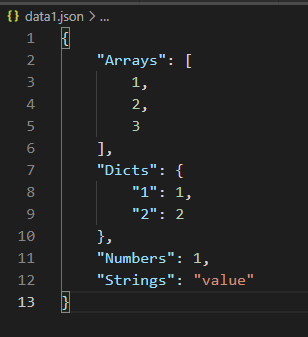

# Python json文件读写
JSON (JavaScript Object Notation)是一个受 JavaScript 的对象字面量语法启发的轻量级数据交换格式，本文介绍Python json库的使用，也就是json的序列化和反序列化方法。

<!--more-->


# json序列化

## dump
写入到文件，将对象转换为json字符串格式，这样更容易存储。


```python
import json
data = {'Numbers':1, 'Strings':"value", 'Arrays':[1,2,3], 'Dicts':{'1':1,'2':2}}
with open("data1.json", "w", encoding="utf-8") as f:
    json.dump(data, f, sort_keys=True, indent=4)
```


## dumps

将对象转换为string，这样更容易传输


```python
data2 = {'Numbers':1, 'Strings':"value", 'Arrays':[1,2,3]}
data = json.dumps(data2, sort_keys=True, indent=4)
print(data)
print(type(data))

```
执行结果：
```python
{
    "Arrays": [
        1,
        2,
        3
    ],
    "Numbers": 1,
    "Strings": "value"
}
<class 'str'>
```


## 将类实例转化成json字符串
也可以将类实例转化成json字符串，需要先将实例转化为可序列化操作的对象。下面介绍3种方案：  
1. 获取实例的`__dict__`成员变量  
2. 使用Python内置函数`vars()`获取`__dict__`  
3. 类继承JSONEncoder，自定义JSONEncoder.default()函数  

```python
class JsonClassSerializable(json.JSONEncoder):
    """JSON serializer for objects"""
    def default(self, obj):
        if isinstance(obj, Person):
            return obj.__dict__
        else:
            return json.JSONEncoder.default(self, obj)    

class Person():
  def __init__(self, name, height):
    self.name = name
    self.height = height
    
p = Person("zhangsan",175)
print(p.__dict__)
data1 = json.dumps(p.__dict__, sort_keys=True, indent=4)
print(data1)
data2 = json.dumps(vars(p), sort_keys=True, indent=4)
print(data2)
data3 = json.dumps(p, default=lambda x: x.__dict__, sort_keys=True, indent=4)
print(data3)
data4 = json.dumps(p, cls=JsonClassSerializable, sort_keys=True, indent=4)
print(data4)
```
执行结果：
```python
{'name': 'zhangsan', 'height': 175}
{
    "height": 175,
    "name": "zhangsan"
}
{
    "height": 175,
    "name": "zhangsan"
}
{
    "height": 175,
    "name": "zhangsan"
}
{
    "height": 175,
    "name": "zhangsan"
}
```


# json反序列化

json反序列化是将json数据或者字符串转化为Python对象，对应load和loads两个方法：
- load：针对文件句柄，用于读取文件  
- loads：针对内存对象，将string转换为对象


## load


```python
with open("data1.json", "r", encoding="utf-8") as f:
    data = json.load(f)
    print(data)
    print(type(data))
    print(type(data['Arrays']))

```
执行结果：
```python
{'Arrays': [1, 2, 3], 'Numbers': 1, 'Objects': {'1': 1, '2': 2}, 'Strings': 'value'}
<class 'dict'>
<class 'list'>
```


## loads


```python
datas = '{"Numbers":1, "Strings":"value", "Arrays":[1,2,3]}'
data = json.loads(datas)
print(data)
print(type(data))

```
执行结果：
```python
{'Numbers': 1, 'Strings': 'value', 'Arrays': [1, 2, 3]}
<class 'dict'>
```


## JSON反序列化类对象


```python
class Person():
    def __init__(self, d):
        self.__dict__ = d
    def introduce(self):
        print(f"My name is {self.name}")

data = '{"name": "zhangsan", "height": 175}' 
p = json.loads(data, object_hook=Person)
print(p)
print(p.name)
print(p.height)
p.introduce()

```
执行结果：
```python
<__main__.Person object at 0x000001FA98439748>
zhangsan
175
My name is zhangsan
```

**文档**

1. https://docs.python.org/zh-cn/3.9/library/json.html


