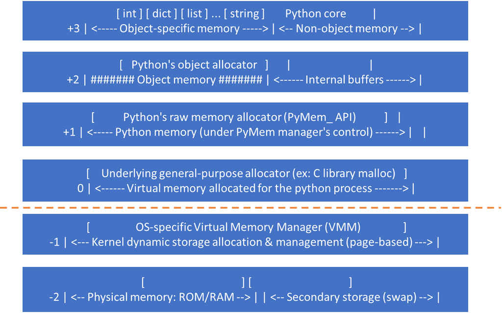

# Python对象及内存管理机制
Python是一门面向对象的编程语言，python中一切皆为对象，对每一个对象分配内存空间，python的内存管理机制主要包括引用计数、垃圾回收和内存池机制。本文简要介绍python对象及内存管理机制。

<!--more-->

## 参数传递

常见的参数传递有**值传递**和**引用传递**

- **值传递**就是拷贝参数的值，然后传递给新变量，这样原变量和新变量之间互相独立，互不影响。
- **引用传递**指把参数的引用传给新的变量，这样原变量和新变量指向同一块内存地址。其中任何一个变量值改变，另外一个变量也会随之改变。

### Python 参数传递

Python 的参数传递是**赋值传递**（pass by assignment），或者叫作**对象的引用传递**（pass by object reference）。在进行参数传递时，新变量与原变量指向相同的对象。下面先来看一下Python中可变和不可变数据类型赋值的例子。

#### 1. 不可变数据类型

整型（int）赋值：

```python
a = 1
print(id(a))
b = a
print(id(b))
a = a + 1
print(id(a))
c = 1
print(id(c))
```

执行结果：

```python
140722100085136
140722100085136
140722100085168
140722100085136
```
其中id()函数用于返回对象的内存地址。

可以看到b，c都指向了相同的对象，而`a = a + 1` 并不是让 a 的值增加 1，而是重新创建并指向了新的值为 2 的对象。最终结果就是a指向了2这个新的对象，b指向1，值不变。

#### 2. 可变数据类型

以列表（list）为例：

```python
l1 = [1, 2, 3]
print(id(l1)) # 

l2 = l1
print(id(l2))

l1.append(4)
print(id(l1))

print(l1)
print(l2)
```

执行结果：

```python
1933202772296
1933202772296
1933202772296
[1, 2, 3, 4]
[1, 2, 3, 4]
```

l1 和 l2 指向相同的对象，由于列表是可变（mutable）数据类型，所以 `l1.append(4) `不会创建新的列表，仍然指向相同的对象。 由于l1 和 l2 指向相同的对象，所以列表变化也会导致l2的值变化。

可变对象（列表，字典，集合等）的改变，会影响所有指向该对象的变量。对于不可变对象（字符串、整型、元组等），所有指向该对象的变量的值总是一样的，也不会改变。

### Python中的'==' 和 'is'
`==` 和 `is`是Python 对象比较中常用的两种方式，`==` 比较对象的值是否相等， `is` 比较对象的身份标识（ID）是否相等，是否是同一个对象，是否指向同一个内存地址。

```python
a = 1
b = a
print(id(a))
print(id(b))
print(a == b)
print(a is b)
```

执行结果：

```py
140722100085136
140722100085136
True
True
```

a和b的值相等，并指向同一个对象。在实际应用中，通常使用`==` 来比较两个变量的值是否相等。`is` 操作符常用来检查一个变量是否为 None：

```python
if a is None:
    print("a is None")
if a is not None:
    print("a is not None")
```

## Python浅拷贝和深度拷贝

前面介绍了Python的赋值（对象的引用传递），那么Python如何解决原始数据在函数传递后不受影响呢，Python提供了浅度拷贝（shallow copy）和深度拷贝（deep copy）两种方式。
- 浅拷贝(copy)：拷贝父对象，不拷贝对象内部的子对象。
- 深拷贝(deepcopy)：完全拷贝了父对象及其子对象。

### 浅拷贝
#### 1. 不可变数据类型

下面对不可变对象整型变量和元组进行浅拷贝：

```python
import copy
a = 1
b = copy.copy(a)
print(id(a))
print(id(b))
print(a == b)
print(a is b)

t1 = (1, 2, 3)
t2 = tuple(t1)
print(id(t1))
print(id(t2))
print(t1 == t2)
print(t1 is t2)
```

执行结果：

```python
50622072
50622072
True
True
55145384
55145384
True
True
```

不可变对象的拷贝和对象的引用传递一样，a、b指向相同的对象，修改其中一个变量的值不会影响另外的变量，会开辟新的空间。

#### 2. 可变数据类型

对可变对象list进行浅拷贝：

```python
import copy
l1 = [1, 2, 3]
l2 = list(l1)
l3 = copy.copy(l1)
l4 = l1[:]
print(id(l1))
print(id(l2))
print(l1 == l2)
print(l1 is l2)
print(id(l3))
print(id(l4))

l1.append(4)
print(id(l1))
print(l1 == l2)
print(l1 is l2)

```

执行结果：

```python
48520904
48523784
True
False
48523848
48521032
48520904
False
False
```

可以看到，对可变对象的浅拷贝会重新分配一块内存，创建一个新的对象，里面的元素是原对象中子对象的引用。改变l1的值不会影响l2，l3，l4的值，它们指向不同的对象。

上面的例子比较简单，下面举一个相对复杂的数据结构：

```python\
import copy
l1 = [[1, 2], (4, 5)]
l2 = copy.copy(l1)
print(id(l1))
print(id(l2))
print(id(l1[0]))
print(id(l2[0]))

l1.append(6)
print(l1)
print(l2)

l1[0].append(3)
print(l1)
print(l2)
```

执行结果：

```python
1918057951816
1918057949448
2680328991496
2680328991496
[[1, 2], (4, 5), 6]
[[1, 2], (4, 5)]
[[1, 2, 3], (4, 5), 6]
[[1, 2, 3], (4, 5)]
```

l2 是 l1 的浅拷贝，它们指向不同的对象，因为浅拷贝里的元素是对原对象元素的引用，因此 l2 中的元素和 l1 指向同一个列表和元组对象（l1[0]和l2[0]指向的是相同的地址）。l1.append(6)不会对 l2 产生任何影响，因为 l2 和 l1 作为整体是两个不同的对象，不共享内存地址。

l1[0].append(3)对 l1 中的第一个列表新增元素 3，因为 l2 是 l1 的浅拷贝，l2 中的第一个元素和 l1 中的第一个元素，共同指向同一个列表，因此 l2 中的第一个列表也会相对应的新增元素 3。

这里提一个小问题：如果对l1中的元组新增元素（`l1[1] += (7, 8)`），会影响l2吗？

到这里我们知道使用浅拷贝可能带来的副作用，要避免它就得使用深度拷贝。

### 深度拷贝

深度拷贝会完整地拷贝一个对象，会重新分配一块内存，创建一个新的对象，并且将原对象中的元素以递归的方式，通过创建新的子对象拷贝到新对象中。因此，新对象和原对象没有任何关联，也就是完全拷贝了父对象及其子对象。

```python
import copy
l1 = [[1, 2], (4, 5)]
l2 = copy.deepcopy(l1)
print(id(l1))
print(id(l2))
l1.append(6)
print(l1)
print(l2)
l1[0].append(3)
print(l1)
print(l2)
```

执行结果：

```python
3026088342280
3026088342472
[[1, 2], (4, 5), 6]
[[1, 2], (4, 5)]
[[1, 2, 3], (4, 5), 6]
[[1, 2], (4, 5)]
```

可以看到，l1 变化不影响l2 ，l1 和 l2 完全独立，没有任何联系。

在进行深度拷贝时，深度拷贝 deepcopy 中会维护一个字典，记录已经拷贝的对象与其 ID。如果字典里已经存储了将要拷贝的对象，则会从字典直接返回。

## Python垃圾回收

Python垃圾回收包括引用计数、标记清除和分代回收

### 引用计数

引用计数是一种垃圾收集机制，当一个python对象被引用时，引用计数加 1，当一个对象的引用为0时，该对象会被当做垃圾回收。

```python
from sys import getrefcount

l1 = [1, 2, 3]
print(getrefcount(l1)) # 查看引用计数
l2 = l1
print(getrefcount(l2))
```

执行结果：

```python
2
3
```

在使用 getrefcount()的时候，变量作为参数传进去，会多一次引用。

del语句会删除对象的一个引用。请看下面的例子

```python
from sys import getrefcount

class TestObjectA():
    def __init__(self):
        print("hello!!!")
    def __del__(self):
        print("bye!!!")

a = TestObjectA()
b = a
c = a
print(getrefcount(c))
del a
print(getrefcount(c))
del b
print(getrefcount(c))
del c
print("666")
```

执行结果：

```python
hello!!!
4
3
2
bye!!!
666
```

方法`__del__` 的作用是当对象被销毁时调用。其中`del a `删除了变量a，但是对象TestObjectA仍然存在，它还被b和c引用，所以不会被回收，引用计数为0时会被回收。上面的例子中，将a，b，c都删除后引用的对象被回收（打印“666”之前）。

另外**重新赋值**也会删除对象的一个引用。


### 标记清除

如果出现了循环引用，引用计数方法就无法回收，导致内存泄漏。先来看下面的例子：

```python
class TestObjectA(dict):
    def __init__(self):
        print("A: hello!!!")
    def __del__(self):
        print("A: bye!!!")

class TestObjectB(dict):
    def __init__(self):
        print("B: hello!!!")
    def __del__(self):
        print("B: bye!!!")
        
a = TestObjectA()
b = TestObjectB()
a['1'] = b
b['1'] = a
del a
del b

print("666")
```

执行结果：

```python
A: hello!!!
B: hello!!!
666
A: bye!!!
B: bye!!!
```

上面的代码存在循环引用，删除a和b之后，它们的引用计数还是1，仍然大于0，不会被回收（打印“666”之后）。

标记清除可解决循环引用问题，从根对象（寄存器和程序栈上的引用）出发，遍历对象，将遍历到的对象打上标记（垃圾检测），然后在内存中清除没有标记的对象（垃圾回收）。上面的例子中，a和b相互引用，如果与其他对象没有引用关系就不会遍历到它，也就不会被标记，所以会被清除。

### 分代回收

如果频繁进行标记清除会影响Python性能，有很多对象，清理了很多次他依然存在，可以认为，这样的对象不需要经常回收，也就是说，对象存在时间越长，越可能不是垃圾。

将回收对象进行分代（一共三代），每代回收的时间间隔不同，其中新创建的对象为0代，如果一个对象能在第0代的垃圾回收过程中存活下来，那么它就被放入到1代中，如果1代里的对象在第1代的垃圾回收过程中存活下来，则会进入到2代。

### gc模块
以下三种情况会启动垃圾回收：
1. 调用`gc.collect()`：强制对所有代执行一次回收
2. 当gc模块的计数器达到阀值的时候。
3. 程序退出的时候

gc 模块函数：
- gc.enable() ：启用自动垃圾回收
- gc.disable()：停用自动垃圾回收
- gc.isenabled()：如果启用了自动回收则返回 True。
- gc.collect(generation=2)：不设置参数会对所有代执行一次回收
- gc.set_threshold(threshold0[, threshold1[, threshold2]])：设置垃圾回收阈值
- gc.get_count()：当前回收计数


**垃圾回收启动的默认阈值**
```
import gc
print(gc.get_threshold()) 
```
输出：
```python
(700, 10, 10)
```

700是垃圾回收启动的阈值，对象分配数量减去释放数量的值大于 700 时，就会开始进行垃圾回收，每10次0代垃圾回收，会导致一次1代回收；而每10次1代的回收，才会有1次的2代回收。可以使用set_threshold()方法重新设置。

## Python内存管理机制：Pymalloc

### Pymalloc

Python实现了一个**内存池(memory pool)机制**，使用Pymalloc对小块内存（小于等于**256kb**）进行申请和释放管理。

当 Python 频繁地创建和销毁一些小的对象时，底层会多次重复调用 malloc 和 free 等函数进行内存分配。这不仅会引入较大的系统开销，而且还可能产生大量的内存碎片。

内存池的概念就是预先在内存中申请一定数量的内存空间，当有有满足条件的内存请求时，就先从内存池中分配内存给这个需求，如果预先申请的内存已经耗尽，Pymalloc allocator 会再申请新的内存（不能超过预先设置的内存池最大容量）。垃圾回收时，回收的内存归还给内存池。这样做最显著的优势就是能够减少内存碎片，提升效率。

如果应用的内存需求大于 pymalloc 设置的阈值，那么解释器再将这个请求交给底层的 C 函数（malloc/realloc/free等）来实现。

### python内存池金字塔
1. 第-1层和-2层：由操作系统操作。
2. 第0层：大内存，若请求分配的内存大于256kb，使用malloc、free 等函数分配、释放内存。
3. 第1层和第2层：由python的接口函数Pymem_Malloc实现，若请求的内存在小于等于256kb时使用该层进行分配。
4. 第3层(最上层）：用户对python对象的直接操作


<center><font size="2">图片来源：https://www.c-sharpcorner.com/article/memory-management-in-python/</font></center>


## 小结
本文主要介绍了Python的参数传递、浅拷贝、深拷贝，垃圾回收和内存池机制。

- Python 中参数的传递既不是值传递，也不是引用传递，而是赋值传递，或者是叫对象的引用传递。需要注意可变对象和不可变对象的区别。比较操作符`==`比较对象间的值是否相等，而`is比较对象是否指向同一个内存地址。

- 浅拷贝中的元素是对原对象中子对象的引用，如果父对象中的元素是可变的，改变它的值也会影响拷贝后的对象。深拷贝则会递归地拷贝原对象中的每一个子对象，是对原对象的完全拷贝。

- Python垃圾回收包括引用计数、标记清除和分代回收三种，可以使用gc模块来进行垃圾回收的配置。为了减少内存碎片，提升效率，Python使用了Pymalloc来管理小于等于256kb的小内存。


