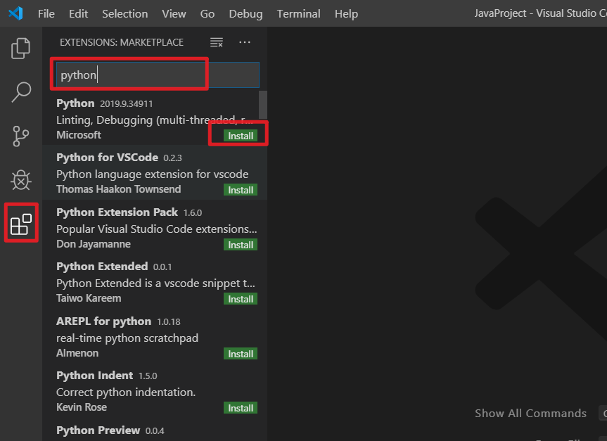
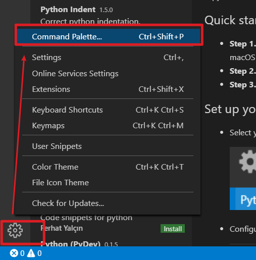
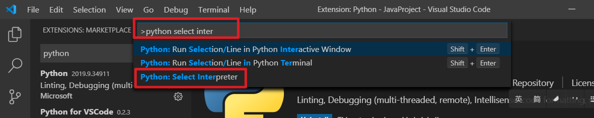
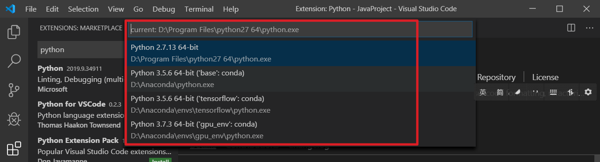
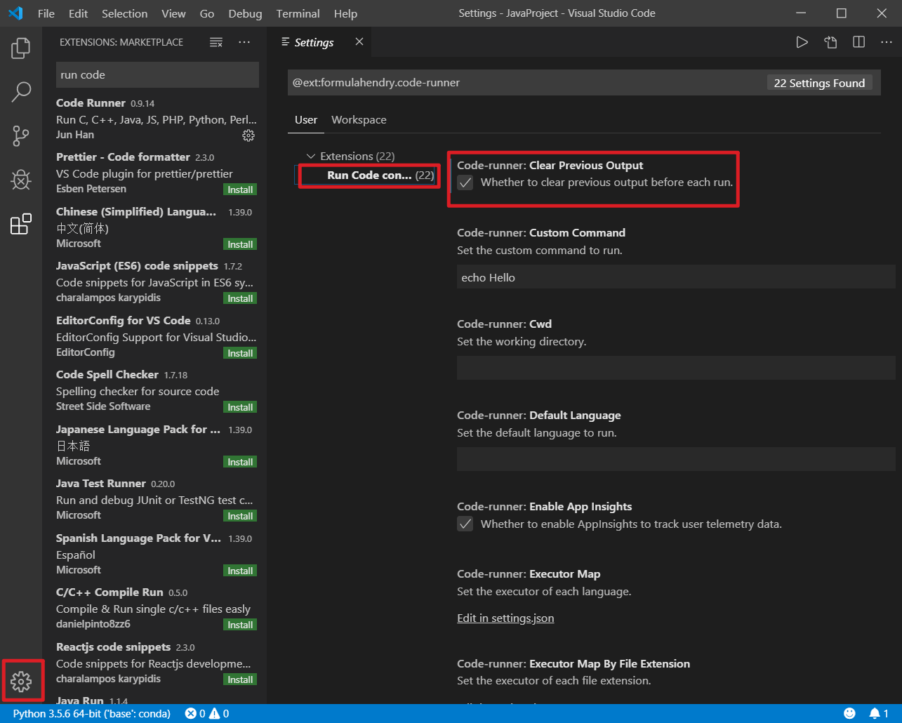
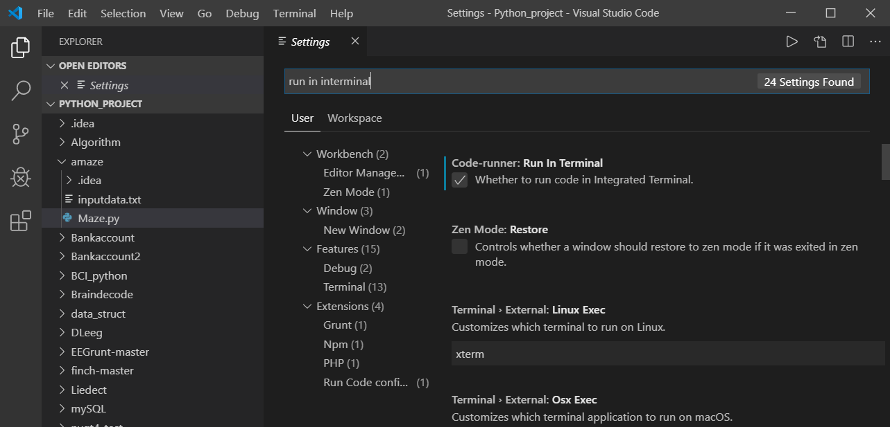
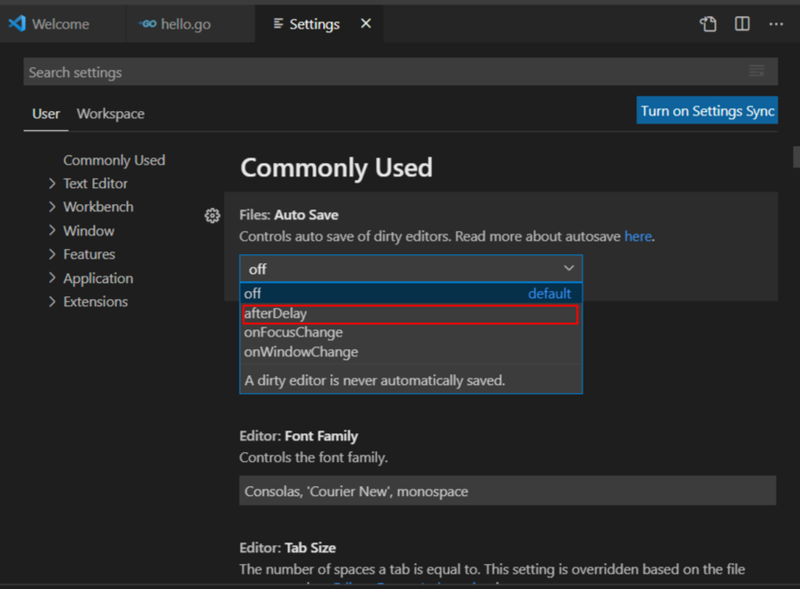
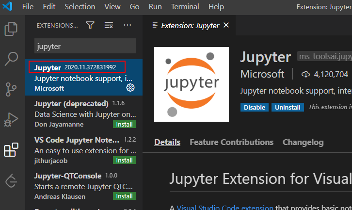
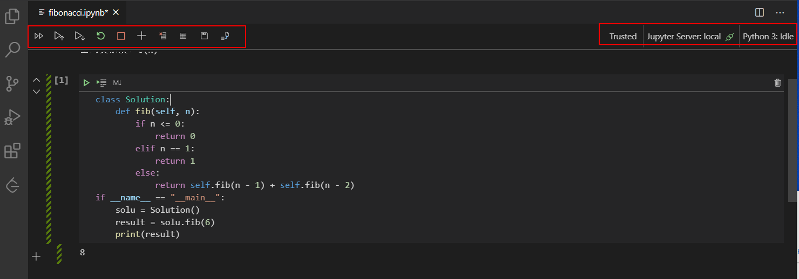

# VSCode + Python环境配置
VSCode Python开发环境配置
<!--more-->
## Visual Studio Code 下载安装
Visual Studio Code下载地址: [https://code.visualstudio.com/Download](https://code.visualstudio.com/Download)

安装Visual Studio Code后，打开Visual Studio Code，安装python：

## 设置 Python 环境
Ctrl+Shift+P

输入\>python select Interpreter

会列出系统所有python解释器，选择对应的解释器：

## 安装code runner插件

### 配置code runner

运行代码方式：
* 键盘快捷键 Ctrl+Alt+N
* 快捷键 Ctrl+Shift+P调出 命令面板, 然后输入 Run Code
* 在编辑区，右键选择 Run Code
* 在左侧的文件管理器，右键选择 Run Code
* 右上角的运行小三角按钮

停止代码运行：
* 键盘快捷键 Ctrl+Alt+M
* 快捷键 Ctrl+Shift+P调出 命令面板, 然后输入 Stop Code Run
* 在Output Channel，右键选择 Stop Code Run


### Run in Terminal
可以把代码放到 VS Code 内置的 Terminal 来运行

选择 文件 -> 首选项 -> 设置，打开VS Code设置页面，找到 Run Code configuration，勾上 Run In Terminal 选项。设置之后，代码就会在 Terminal 中运行了。


## 其它配置
### 配置VSCode自动保存
进入设置界面

### 快捷键
显示所有函数列表
Shift+Ctl+O

向下复制：
设置为Ctl+D
点击File -> Preferences -> Keyboard Shortcuts，找到copy line down，设置为Ctrl+D

## Jupyter Notebook插件
Jupyter Notebook （[https://jupyter.org/](https://jupyter.org/)）
几乎支持所有语言，把代码、输出、解释文档、多媒体资源整合在了一起。 Jupyter Notebook应用广泛，Google的Google Colab平台就是基于 Jupyter Notebook改进的。

Jupyter 主要优点包括：
1. 将代码、文档整合到一起，这样更加方便，提高效率。
2. Cell 的概念，代码可以一块一块的运行，实现交互编程。
3. Jupyter 官方的 [Binder](https://mybinder.readthedocs.io/en/latest/index.html) 、[Google Colab平台](https://colab.research.google.com/notebooks/welcome.ipynb)可以直接运行代码，不需要重新安装依赖。

### 安装

VSCode Jupyter Notebook插件安装：
搜索Jupyter，安装
插件安装成功后，新建\*.ipynb文件：

### 将ipynb文件转换为markdown
将ipynb文件转换为markdown
```bash
jupyter nbconvert --to markdown "文件名.ipynb"
# 批量转换
jupyter nbconvert --to markdown *.ipynb 
```


