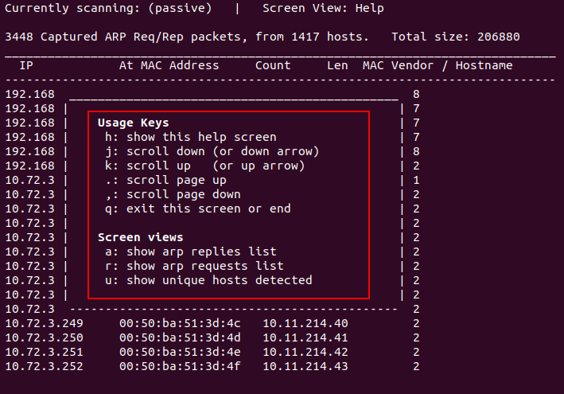

# Netdiscover网络扫描工具
Netdiscover是一种网络扫描工具，通过ARP扫描发现活动主机，可以通过主动和被动两种模式进行ARP扫描。通过主动发送ARP请求检查网络ARP流量，通过自动扫描模式扫描网络地址。本文介绍Netdiscover的安装和使用方法。

<!--more-->
## Netdiscover安装
Kali Linux提供的网络扫描工具
github地址：https://github.com/alexxy/netdiscover

ubuntu:
```sh
$ sudo apt install netdiscover
```
安装完成后查看帮助信息：
```sh
$ netdiscover -h
Netdiscover 0.5.1 [Active/passive ARP reconnaissance tool]
Written by: Jaime Penalba <jpenalbae@gmail.com>

Usage: netdiscover [-i device] [-r range | -l file | -p] [-m file] [-F filter] [-s time] [-c count] [-n node] [-dfPLNS]
  -i device: your network device
  -r range: scan a given range instead of auto scan. 192.168.6.0/24,/16,/8
  -l file: scan the list of ranges contained into the given file
  -p passive mode: do not send anything, only sniff
  -m file: scan a list of known MACs and host names
  -F filter: customize pcap filter expression (default: "arp")
  -s time: time to sleep between each ARP request (milliseconds)
  -c count: number of times to send each ARP request (for nets with packet loss)
  -n node: last source IP octet used for scanning (from 2 to 253)
  -d ignore home config files for autoscan and fast mode
  -f enable fastmode scan, saves a lot of time, recommended for auto
  -P print results in a format suitable for parsing by another program and stop after active scan
  -L similar to -P but continue listening after the active scan is completed
  -N Do not print header. Only valid when -P or -L is enabled.
  -S enable sleep time suppression between each request (hardcore mode)

If -r, -l or -p are not enabled, netdiscover will scan for common LAN addresses
```

## Netdiscover选项

|          选项           | 说明 |
| :---------------------: | :--: |
| -i device |  网络接口    |
| -r range  |  扫描范围，例如192.168.0.0/24，仅支持/8, /16和/24    |
| -l file   |  扫描范围列表文件，每行一个范围    |
|     -p    |  被动模式：不发生任何报文，仅嗅探   |
| -m file   |  扫描已知Mac地址和主机名的列表文件  |
| -F filter |  自定义pcap filter表达式(默认“arp”)  |
| -s time   |  每个ARP请求间的休眠时间(毫秒,默认1ms)  |
| -c count |  发送每个ARP请求的次数，用于丢失数据包的网络，默认1次 |
| -n node   |  扫描最后的源IP，默认为67(x.x.x.67),允许范围为2-253  |
|     -d    |  忽略自动扫描和快速模式的主配置文件,扫描默认的范围和IP  |
|     -f    |  启用快速模式扫描,扫描每个网段的.1、.100 和 .254  |
|     -P    |  产生输出到文件或者其他解析程序，扫描完成后退出，例如：`netdiscover -P -r 192.168.20.0/16 | grep 192.168.20.100`  |
|     -L    |  与-P类似，但在主动扫描后继续捕获ARP包  |
|     -N    |  不打印表头，仅在-P 或者-L启用时有效  |
|     -S    |  已弃用  |


## Netdiscover使用
### 用法
如果未启用被动模式（-p）、扫描列表（-l）或扫描范围（-r）选项，netdiscover将扫描LAN地址（192.168.0.0/16、172.16.0.0/12和10.0.0.0/8）。

扫描结果控制键：
h：显示帮助信息
```sh
$ netdiscover -i ens38 -p
```


q：退出帮助信息界面，或者退出扫描（或者Ctrl+c退出）
j：向下滚动（或者使用下方向箭头）
k：向上滚动（或者使用上方向箭头）
.：向上翻页
,：向下翻页

扫描结果视图：
a：显示ARP响应列表


r：显示ARP请求列表


u：显示检测到的唯一主机


### 使用实例
扫描指定接口：
```sh
$ netdiscover -i ens38
```


快速扫描：
```sh
$ netdiscover -i ens38 -f
```
扫描指定范围：
```sh
$ netdiscover -i ens38 -r 192.168.0.0/16
```


被动扫描，仅嗅探：
```sh
$ netdiscover -i ens38 -r 192.168.0.0/16 -p
```


