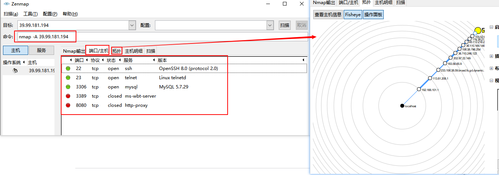

# Nmap扫描工具介绍
Nmap (Network Mapper) 是在渗透测试中常用的扫描工具，可用于扫描网络中的 IP 地址和端口，并检测已安装的应用程序。无论是作为网络安全工具还是黑客工具，Nmap 是一个很强大的工具，在《黑客帝国2》电影中就有出现，用于入侵发电站的能源管理系统。本文将介绍 Nmap 的安装和常用命令。

<!--more-->

## Nmap简介及安装
Nmap官网地址：[https://nmap.org/](https://nmap.org/)
### Nmap 特性

Nmap使用IP数据包来确定网络上有哪些主机可用、提供哪些服务（应用程序名称和版本）、它们运行的操作系统（操作系统版本信息）、使用的数据包过滤/防火墙类型等其它特性。Nmap可以运行在所有主流的操作系统上，比如Linux、Windows和Mac OS等。
- Nmap 支持检查主机是否启动，可用于监视主机或服务正常运行时间等
- 快速识别网络中的设备，包括服务器，路由器，交换机，移动设备等
- 帮助识别系统上运行的服务，包括 web 服务器、 DNS 服务器和其他常见应用程序。Nmap 还可以检测应用程序版本，帮助检测漏洞
- 查找在设备上运行的操作系统详细信息
- 漏洞扫描中，可以使用 Nmap 脚本攻击系统

Nmap提供了以下工具：
- Zenmap 图形界面：可以绘制网络映射图
- Ncat：数据传输、重定向和调试工具
- Ndiff：比较扫描结果
- Nping：数据包生成和响应分析工具

### Nmap安装

#### centos7
Linux系统安装：[https://nmap.org/book/inst-linux.html#inst-rpm](https://nmap.org/book/inst-linux.html#inst-rpm)
```sh
$ rpm -vhU https://nmap.org/dist/nmap-7.91-1.x86_64.rpm
```
也可以先把rpm下载下来后，再安装


```sh
$ rpm -vhU nmap-7.91-1.x86_64.rpm
```
查看nmap版本
```sh
[root@server ~]# nmap -version
Nmap version 7.91 ( https://nmap.org )
Platform: x86_64-redhat-linux-gnu
Compiled with: nmap-liblua-5.3.5 openssl-1.1.1h nmap-libssh2-1.9.0 nmap-libz-1.2.11 nmap-libpcre-7.6 nmap-libpcap-1.9.1 nmap-libdnet-1.12 ipv6
Compiled without:
Available nsock engines: epoll poll select
[root@Client ~]# 
```
#### Windows
1. 下载exe可执行文件，双击安装，不勾选npcap，其它默认
2. 安装npcap，下载地址：[https://nmap.org/npcap/#download](https://nmap.org/npcap/#download)

安装完成后，npcap默认加入了环境变量，不需要手动添加
```sh
D:\software\Nmap>nmap --version
Nmap version 7.91 ( https://nmap.org )
Platform: i686-pc-windows-windows
Compiled with: nmap-liblua-5.3.5 openssl-1.1.1h nmap-libssh2-1.9.0 nmap-libz-1.2.11 nmap-libpcre-7.6 Npcap-1.10 nmap-libdnet-1.12 ipv6
Compiled without:
Available nsock engines: iocp poll select

D:\software\Nmap>
```

其它系统安装方法参考：[https://nmap.org/download.html](https://nmap.org/download.html)

## Nmap命令
查看帮助命令：
```sh
$ nmap -h
```

### 扫描单个主机
```sh
$ nmap 192.168.20.9
Starting Nmap 7.91 ( https://nmap.org ) at 2021-03-05 16:29 CST
Nmap scan report for 192.168.20.9
Host is up (0.00010s latency).
Not shown: 998 closed ports
PORT    STATE SERVICE
22/tcp  open  ssh
111/tcp open  rpcbind
MAC Address: 00:0C:29:BB:0C:02 (VMware)

Nmap done: 1 IP address (1 host up) scanned in 13.15 seconds
```

### 扫描多个主机
同时扫描多个主机，
```sh
$ nmap 192.168.20.9 192.168.20.8
$ nmap 192.168.20.*
$ nmap 192.168.20.8,9,10
$ nmap 192.168.20.8-255
```

### 隐秘扫描(Stealth scan)
通过发送 SYN 数据包并分析响应。如果收到 SYN/ACK，则表示端口已打开，可以进行 TCP 连接。
```sh
$ nmap -sS 39.99.181.194
Starting Nmap 7.91 ( https://nmap.org ) at 2021-03-05 17:15 CST
Nmap scan report for 39.99.181.194
Host is up (0.077s latency).
Not shown: 995 filtered ports
PORT     STATE  SERVICE
22/tcp   open   ssh
23/tcp   closed telnet
3306/tcp open mysql
3389/tcp closed ms-wbt-server
8080/tcp closed http-proxy

Nmap done: 1 IP address (1 host up) scanned in 30.31 seconds

```
### 版本扫描
查找应用程序的版本，确认目标主机使用的应用版本后，可以在[Common vulnerability and Exploits (CVE)](https://cve.mitre.org/)数据库中找到应用特定版本的现有漏洞。然后可以使用 Metasploit 类似的工具来攻击计算机。
```sh
$ nmap -sV 39.99.181.194
Starting Nmap 7.91 ( https://nmap.org ) at 2021-03-05 17:37 CST
Nmap scan report for 39.99.181.194
Host is up (0.066s latency).
Not shown: 995 filtered ports
PORT     STATE  SERVICE       VERSION
22/tcp   open   ssh           OpenSSH 8.0 (protocol 2.0)
23/tcp   closed telnet
3306/tcp open   mysql         MySQL 5.7.29
3389/tcp closed ms-wbt-server
8080/tcp closed http-proxy

Service detection performed. Please report any incorrect results at https://nmap.org/submit/ .
Nmap done: 1 IP address (1 host up) scanned in 13.26 seconds

```

### 操作系统探测
Nmap 还可以使用 TCP/IP 指纹技术提供有关底层操作系统的信息。Nmap 还将尝试在操作系统扫描期间查找系统正常运行时间。

```sh
$ nmap -O 39.99.181.194
Starting Nmap 7.91 ( https://nmap.org ) at 2021-03-05 17:49 CST
Nmap scan report for 39.99.181.194
Host is up (0.061s latency).
Not shown: 998 filtered ports
PORT     STATE  SERVICE
22/tcp   open   ssh
3389/tcp closed ms-wbt-server
Aggressive OS guesses: Linux 5.1 (94%), Linux 3.10 - 4.11 (92%), HP P2000 G3 NAS device (91%), Linux 3.2 - 4.9 (91%), Linux 3.16 - 4.6 (90%), Linux 2.6.32 (90%), Linux 5.0 (90%), Ubiquiti AirOS 5.5.9 (90%), Linux 4.4 (90%), Linux 5.0 - 5.4 (89%)
No exact OS matches for host (test conditions non-ideal).

OS detection performed. Please report any incorrect results at https://nmap.org/submit/ .
Nmap done: 1 IP address (1 host up) scanned in 40.84 seconds
```

激烈扫描模式（-A参数）启用了操作系统检测(-O) 和版本扫描(-sV)，返回系统信息和版本信息。

```sh
$ nmap -A 39.99.181.194
Starting Nmap 7.91 ( https://nmap.org ) at 2021-03-12 14:40 CST
Nmap scan report for 39.99.181.194
Host is up (0.056s latency).
Not shown: 995 filtered ports
PORT     STATE  SERVICE       VERSION
22/tcp   open   ssh           OpenSSH 8.0 (protocol 2.0)
| ssh-hostkey:
|   3072 06:56:59:1d:73:7d:8f:e0:e0:0c:65:fa:75:4b:61:0b (RSA)
|   256 3b:2e:45:69:49:7a:b2:fa:06:42:d2:1f:4a:c8:e6:2a (ECDSA)
|_  256 6b:a5:e5:b7:39:28:1b:03:e0:c1:6b:2b:fb:19:f0:7b (ED25519)
23/tcp   closed telnet
3306/tcp open   mysql         MySQL 5.7.29
| mysql-info:
|   Protocol: 10
|   Version: 5.7.29
|   Thread ID: 35
|   Capabilities flags: 65535
|   Some Capabilities: Support41Auth, Speaks41ProtocolNew, Speaks41ProtocolOld, SwitchToSSLAfterHandshake, IgnoreSigpipes, InteractiveClient, DontAllowDatabaseTableColumn, FoundRows, LongPassword, SupportsTransactions, ODBCClient, ConnectWithDatabase, IgnoreSpaceBeforeParenthesis, LongColumnFlag, SupportsLoadDataLocal, SupportsCompression, SupportsMultipleStatments, SupportsMultipleResults, SupportsAuthPlugins
|   Status: Autocommit
|   Salt: \x1E7aZ5\x07%|\x02+\x01_#\x1B6FX~\x07
|_  Auth Plugin Name: mysql_native_password
| ssl-cert: Subject: commonName=MySQL_Server_5.7.29_Auto_Generated_Server_Certificate
| Not valid before: 2020-06-17T09:36:07
|_Not valid after:  2030-06-15T09:36:07
|_ssl-date: TLS randomness does not represent time
3389/tcp closed ms-wbt-server
8080/tcp closed http-proxy
Aggressive OS guesses: Linux 5.1 (94%), Linux 3.10 - 4.11 (92%), HP P2000 G3 NAS device (91%), Linux 3.2 - 4.9 (91%), Linux 3.16 - 4.6 (90%), Linux 2.6.32 (90%), Linux 2.6.32 - 3.1 (90%), Ubiquiti AirMax NanoStation WAP (Linux 2.6.32) (90%), Linux 3.7 (90%), Linux 4.4 (90%)
No exact OS matches for host (test conditions non-ideal).
Network Distance: 16 hops

TRACEROUTE (using port 3389/tcp)
HOP RTT      ADDRESS
1   1.00 ms  192.168.101.1
2   6.00 ms  120.237.96.81
3   8.00 ms  183.233.126.85
4   8.00 ms  211.136.248.81
5   12.00 ms 221.183.39.157
6   75.00 ms 221.183.37.137
7   ...
8   51.00 ms 111.13.0.173
9   44.00 ms 39.156.0.37
10  52.00 ms 39.156.7.249
11  ... 12
13  54.00 ms 116.251.124.194
14  ... 15
16  61.00 ms 39.99.181.194

OS and Service detection performed. Please report any incorrect results at https://nmap.org/submit/ .
Nmap done: 1 IP address (1 host up) scanned in 23.85 seconds
```
### 端口扫描
使用 `-p` 参数扫描单个端口
```sh
$ nmap -p 3306 39.99.181.194
Starting Nmap 7.91 ( https://nmap.org ) at 2021-03-16 17:35 CST
Nmap scan report for 39.99.181.194
Host is up (0.049s latency).

PORT     STATE SERVICE
3306/tcp open  mysql

Nmap done: 1 IP address (1 host up) scanned in 0.99 seconds
```

指定端口连接类型，比如TCP连接
```sh
$ nmap -p T:3306 39.99.181.194
```
指定端口范围
```sh
$ nmap -p 22-8080 39.99.181.194
Starting Nmap 7.91 ( https://nmap.org ) at 2021-03-16 17:38 CST
Nmap scan report for 39.99.181.194
Host is up (0.052s latency).
Not shown: 8054 filtered ports
PORT     STATE  SERVICE
22/tcp   open   ssh
23/tcp   open   telnet
3306/tcp open   mysql
3389/tcp closed ms-wbt-server
8080/tcp closed http-proxy

Nmap done: 1 IP address (1 host up) scanned in 22.10 seconds
```


```sh
$ nmap --top-ports 10 39.99.181.194
Starting Nmap 7.91 ( https://nmap.org ) at 2021-03-16 17:41 CST
Nmap scan report for 39.99.181.194
Host is up (0.15s latency).

PORT     STATE    SERVICE
21/tcp   filtered ftp
22/tcp   open     ssh
23/tcp   open     telnet
25/tcp   filtered smtp
80/tcp   filtered http
110/tcp  filtered pop3
139/tcp  filtered netbios-ssn
443/tcp  filtered https
445/tcp  filtered microsoft-ds
3389/tcp filtered ms-wbt-server

Nmap done: 1 IP address (1 host up) scanned in 5.29 seconds
```

TCP扫描：
```sh
$ nmap -sT 39.99.181.194
Starting Nmap 7.91 ( https://nmap.org ) at 2021-03-18 16:47 CST
Nmap scan report for 39.99.181.194
Host is up (0.049s latency).
Not shown: 995 filtered ports
PORT     STATE SERVICE
22/tcp   open  ssh
23/tcp   open  telnet
25/tcp   open  smtp
110/tcp  open  pop3
3306/tcp open  mysql

Nmap done: 1 IP address (1 host up) scanned in 49.29 seconds
```
TCP SYN扫描（半开放扫描）：
SYN扫描执行快，每秒钟可以扫描数千个 端口，因为它不完成TCP连接

```sh
$ nmap -sS 39.99.181.194
```

UDP扫描：
UDP扫描一般较慢，DNS，SNMP，和DHCP (端口53，161/162，和67/68)是最常见的三个UDP服务。

```sh
$ nmap -sU 39.99.181.194
Starting Nmap 7.91 ( https://nmap.org ) at 2021-03-18 16:49 CST
Nmap scan report for 39.99.181.194
Host is up (0.052s latency).
All 1000 scanned ports on 39.99.181.194 are open|filtered

Nmap done: 1 IP address (1 host up) scanned in 59.64 seconds
```
> open|filtered表示无法确定端口是开放还是被过滤的

UDP扫描比TCP扫描慢的原因是UDP是无连接的，Nmap无法区分应用过滤数据包的开放端口、数据包被防火墙阻止丢弃的端口或者数据包由于网络拥塞而在传输过程中丢失。而且对于closed端口（ICMP端口无法访问），Nmap无法区分端口被防火墙过滤还是数据包丢失。除非端口返回数据或返回ICMP不可达报文，否则Nmap需要发送多个数据包来消除速率限制或丢失数据包的可能性。

可以通过如下方式提高扫描速度（牺牲扫描精度）
* `--min-rate`参数：`--min-rate 5000`表示每秒发送5000个数据包
* `--max-rtt-timeout`参数：控制nmap等待响应时间，需大于5ms，具体时间可以通过ping命令查看。`--max-rtt-timeout 0.005`：5ms等待时间
* `--max-retries`参数：设置重试次数，`--max-retries 1`重试1次
* `--max-scan-delay`参数：设置扫描间隔，用在主机响应慢的情况下。

```sh
$ nmap -sU --min-rate 5000 39.99.181.194
```


Null扫描 (-sN)：
不设置任何标志位(tcp标志头是0)

```sh
$ nmap -sN 39.99.181.194
```
FIN扫描 (-sF)：
只设置TCP FIN标志位。

```sh
$ nmap -sF 39.99.181.194
```
Xmas扫描 (-sX)：
设置FIN，PSH，和URG标志位

```sh
$ nmap -sX 39.99.181.194
```
TCP ACK扫描：
用于发现防火墙规则，确定它们是有状态的还是无状态的，哪些端口是被过滤的。

```sh
$ nmap -sA 39.99.181.194
Starting Nmap 7.91 ( https://nmap.org ) at 2021-03-18 17:07 CST
Nmap scan report for 39.99.181.194
Host is up (0.053s latency).
Not shown: 995 filtered ports
PORT     STATE      SERVICE
22/tcp   unfiltered ssh
23/tcp   unfiltered telnet
3306/tcp unfiltered mysql
3389/tcp unfiltered ms-wbt-server
8080/tcp unfiltered http-proxy

Nmap done: 1 IP address (1 host up) scanned in 11.24 seconds
```
IP协议扫描：
确定目标机支持哪些IP协议 (TCP，ICMP，IGMP等)

```sh
$ nmap -sO 39.99.181.194
Starting Nmap 7.91 ( https://nmap.org ) at 2021-03-18 17:11 CST
Nmap scan report for 39.99.181.194
Host is up (0.054s latency).
Not shown: 255 open|filtered protocols
PROTOCOL STATE SERVICE
1        open  icmp

Nmap done: 1 IP address (1 host up) scanned in 16.49 seconds
```
PING扫描：检测目标主机是否在线
```sh
$ nmap -sP 39.99.181.194
```

### 读取文件扫描
如果需要扫描的IP地址很多，可以存放在一个文件里面进行扫描

```sh
$ nmap -iL nmap_test.txt
```

### 扫描日志
`-v `参数打印扫描日志

```sh
$ nmap -v -p 3306 39.99.181.194
Starting Nmap 7.91 ( https://nmap.org ) at 2021-03-16 17:51 CST
Initiating Ping Scan at 17:51
Scanning 39.99.181.194 [4 ports]
Completed Ping Scan at 17:51, 0.23s elapsed (1 total hosts)
Initiating Parallel DNS resolution of 1 host. at 17:51
Completed Parallel DNS resolution of 1 host. at 17:51, 0.35s elapsed
Initiating SYN Stealth Scan at 17:51
Scanning 39.99.181.194 [1 port]
Discovered open port 3306/tcp on 39.99.181.194
Completed SYN Stealth Scan at 17:51, 0.05s elapsed (1 total ports)
Nmap scan report for 39.99.181.194
Host is up (0.049s latency).

PORT     STATE SERVICE
3306/tcp open  mysql

Read data files from: D:\software\Nmap
Nmap done: 1 IP address (1 host up) scanned in 1.06 seconds
           Raw packets sent: 5 (196B) | Rcvd: 2 (72B)

D:\software\Nmap>
```

保存到文件，保存格式支持text、xml

```sh
$ nmap -oN output.txt 39.99.181.194
$ nmap -oX output.xml 39.99.181.194
```

或者
```sh
$ nmap -oA output 39.99.181.194
```
生成output,xml、output.nmap、output.gnmap文件

## NSE脚本
NSE(Nmap Scripting Engine)是一个非常强大的渗透工具，它允许用户编写各种网络任务的自动化脚本。脚本基于Lua语言，可以自己编写满足需求的脚本或者修改已有的脚本。目前Nmap集成了600多个脚本，参考：[https://nmap.org/nsedoc/](https://nmap.org/nsedoc/)

语法：
```sh
$ nmap --script <filename>
$ nmap -sC # 使用默认脚本集执行脚本扫描，等价于 --script=default
```
多个脚本使用逗号分隔

### NSE脚本类别

NSE 通过 `-sC` 选项（或` --script`）激活，主要包括以下功能：
* 网络发现：扫描目标主机信息、服务等
* 版本检测：检测应用版本
* 漏洞检测：扫描系统漏洞
* 后门检测
* 攻击、利用漏洞

NSE 脚本主要包括以下14类：
* auth：身份认证
* broadcast：广播，通过在本地网络上广播来发现没有列出的主机
* brute：使用暴力破解来猜测远程服务器的身份认证凭据
* default：默认设置的脚本，使用 -sC 或 -A 选项时默认运行，比如identd-owners、http-auth、ftp-anon。
* discovery：通过查询公共注册中心、支持 snmp 的设备、目录服务等来发现更多关于网络的信息
* dos：测试拒绝服务的漏洞
* exploit：主动利用某些漏洞
* external：将数据发送到第三方数据库或其他网络资源，比如whois-ip通过连接到 whois 服务器获取目标地址
* fuzzer：在每个数据包中发送随机字段，可用于发现软件的缺陷和漏洞
* intrusive：可能会消耗目标主机大量资源，风险太高，可能会导致目标系统崩溃
* malware：测试目标平台是否被恶意软件或后门感染
* safe：安全脚本，不攻击，不使用大量网络带宽或其他资源
* version：版本检测：
* vuln：检查特定的已知漏洞，通常只报告发现的结果

### NSE脚本示例
#### discovery
mysql-info：打印mysql服务器版本，协议，进程ID，密码盐度等信息

```sh
$ nmap -sV --script=mysql-info 39.99.181.194
Nmap scan report for 39.99.181.194
Host is up (0.064s latency).
Not shown: 995 filtered ports
PORT     STATE  SERVICE       VERSION
22/tcp   open   ssh           OpenSSH 8.0 (protocol 2.0)
23/tcp   open   telnet        Linux telnetd
3306/tcp open   mysql         MySQL 5.7.29
| mysql-info:
|   Protocol: 10
|   Version: 5.7.29
|   Thread ID: 33
|   Capabilities flags: 65535
|   Some Capabilities: LongColumnFlag, SupportsLoadDataLocal, Support41Auth, DontAllowDatabaseTableColumn, SupportsTransactions, IgnoreSigpipes, FoundRows, SwitchToSSLAfterHandshake, IgnoreSpaceBeforeParenthesis, ODBCClient, Speaks41ProtocolNew, ConnectWithDatabase, InteractiveClient, Speaks41ProtocolOld, LongPassword, SupportsCompression, SupportsMultipleResults, SupportsAuthPlugins, SupportsMultipleStatments
|   Status: Autocommit
|   Salt:
| =\x06Dq\x17Z|W'\x1F:\x1C)\x07`Bx,D
|_  Auth Plugin Name: mysql_native_password
3389/tcp closed ms-wbt-server
8080/tcp closed http-proxy
Service Info: OS: Linux; CPE: cpe:/o:linux:linux_kernel
```
#### auth
ssh-auth-methods：返回SSH服务器支持的认证方法
```sh
$ nmap --script=ssh-auth-methods 39.99.181.194
Starting Nmap 7.91 ( https://nmap.org ) at 2021-03-18 16:03 ?D1ú±ê×?ê±??
Nmap scan report for 39.99.181.194
Host is up (0.069s latency).
Not shown: 995 filtered ports
PORT     STATE  SERVICE
22/tcp   open   ssh
| ssh-auth-methods:
|   Supported authentication methods:
|     publickey
|     gssapi-keyex
|     gssapi-with-mic
|_    password
23/tcp   open   telnet
3306/tcp open   mysql
3389/tcp closed ms-wbt-server
8080/tcp closed http-proxy

Nmap done: 1 IP address (1 host up) scanned in 60.76 seconds
```
#### brute
暴力破解
对SSH服务进行暴力破解：

```sh
$ nmap -p 22 --script ssh-brute --script-args userdb=users.lst,passdb=pass.lst --script-args ssh-brute.timeout=4s 39.99.181.194
Starting Nmap 7.91 ( https://nmap.org ) at 2021-03-18 16:11 CST
NSE: [ssh-brute] Trying username/password pair: root:root
NSE: [ssh-brute] Trying username/password pair: admin:admin
NSE: [ssh-brute] Trying username/password pair: administrator:administrator
NSE: [ssh-brute] Trying username/password pair: webadmin:webadmin
NSE: [ssh-brute] Trying username/password pair: sysadmin:sysadmin
NSE: [ssh-brute] Trying username/password pair: netadmin:netadmin
NSE: [ssh-brute] Trying username/password pair: guest:guest
NSE: [ssh-brute] Trying username/password pair: user:user
NSE: [ssh-brute] Trying username/password pair: web:web
NSE: [ssh-brute] Trying username/password pair: test:test
......
```
ftp暴力破解
```sh
$ nmap --script ftp-brute -p 21 <host>
```

mysql-enum：获取mysql有效用户
```sh
$ nmap -p 3306 --script=mysql-enum 39.99.181.194
Starting Nmap 7.91 ( https://nmap.org ) at 2021-03-18 16:19 CST
Nmap scan report for 39.99.181.194
Host is up (0.23s latency).

PORT     STATE SERVICE
3306/tcp open  mysql
| mysql-enum:
|   Valid usernames:
|     root:<empty> - Valid credentials
|     netadmin:<empty> - Valid credentials
|     guest:<empty> - Valid credentials
|     test:<empty> - Valid credentials
|     web:<empty> - Valid credentials
|     sysadmin:<empty> - Valid credentials
|     administrator:<empty> - Valid credentials
|     webadmin:<empty> - Valid credentials
|     admin:<empty> - Valid credentials
|     user:<empty> - Valid credentials
|_  Statistics: Performed 10 guesses in 1 seconds, average tps: 10.0

Nmap done: 1 IP address (1 host up) scanned in 9.15 seconds

```

mysql-brute：密码破解
```sh
$ nmap --script=mysql-brute  -p 3306 127.0.0.1
Starting Nmap 7.91 ( https://nmap.org ) at 2021-03-22 16:24 CST
Nmap scan report for localhost (127.0.0.1)
Host is up (0.0010s latency).

PORT     STATE SERVICE
3306/tcp open  mysql
| mysql-brute:
|   Accounts:
|     admin:admin - Valid credentials
|     root:123456 - Valid credentials
|_  Statistics: Performed 40012 guesses in 20 seconds, average tps: 2000.6

Nmap done: 1 IP address (1 host up) scanned in 21.36 seconds
```

## Zenmap可视化
Zenmap是Nmap的图形化界面




## 小结
本文简要介绍了nmap工具的安装、一些常用扫描命令、NSE脚本以及可视化工具Zenmap的演示。nmap是一个强大的渗透测试工具，提供丰富的命令脚本，可以说是网络的“瑞士军刀”，更多用法可以参考Nmap官网网站：[https://nmap.org/](https://nmap.org/) ，上面介绍了Nmap工具的详细信息和更高级的用法。中文文档参考：[https://nmap.org/man/zh/](https://nmap.org/man/zh/)


