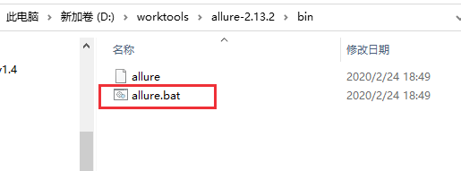
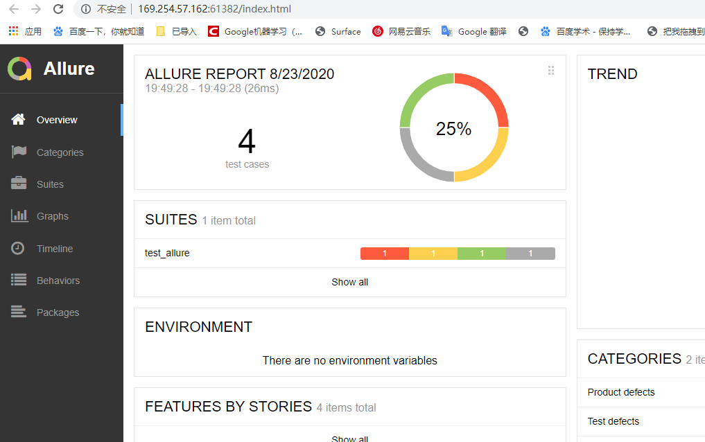
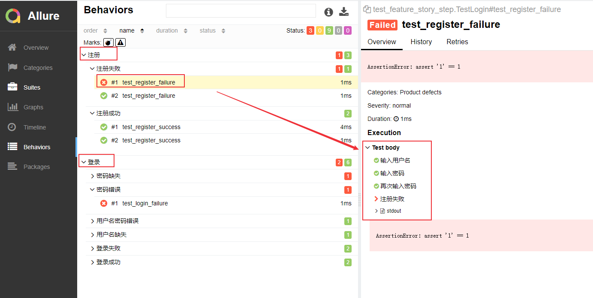
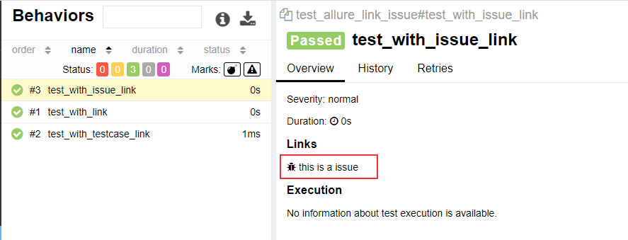
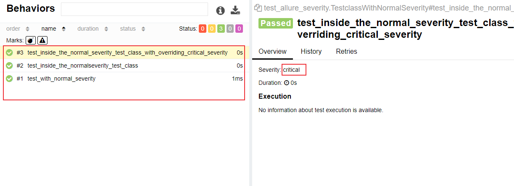
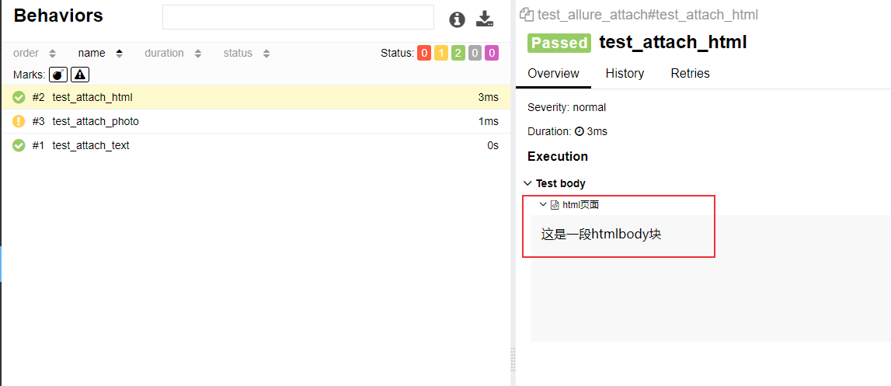
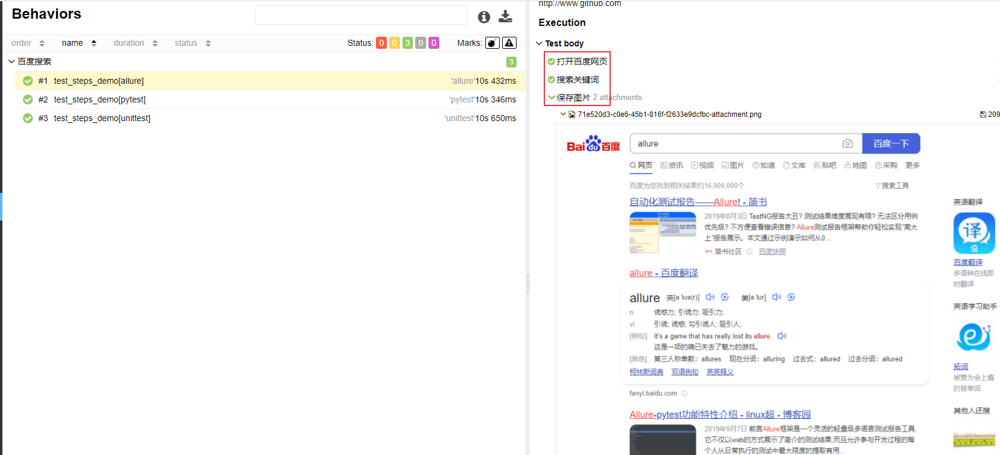

# pytest + allure生成测试报告
Allure 是一款轻量级、支持多语言的开源自动化测试报告生成框架，由Java语言开发，可以集成到 Jenkins。 pytest 测试框架支持Allure 报告生成。

<!--more-->
pytest也可以生成junit格式的xml报告和HTML报告，命令如下：
```shell
pytest test_demo.py --junitxml=report.xml
pytest test_demo.py --html=report.html #需要安装插件：pip install pytest-html
```
Allure 报告更加灵活美观，本文介绍如何使用pytest 生成 allure测试报告
## 环境安装

### 安装allure

1. allure包下载：https://github.com/allure-framework/allure2/releases 
2. 解压 -> 进入bin目录 -> 运行allure.bat, 
3. 把bin目录加入PATH环境变量


allure官网 : [https://qameta.io/allure-report/](https://qameta.io/allure-report/)

allure文档 : https://docs.qameta.io/allure/#

### 安装 allure-pytest插件

```python
pip install allure-pytest
```

## 生成Allure报告

### 运行

```shell
pytest [测试文件] -s -q --alluredir=./result #--alluredir用于指定存储测试结果的路径)
```

### 查看测试报告

方式一：直接打开默认浏览器展示报告

`allure serve ./result/ `

方式二：从结果生成报告

- 生成报告

  `allure generate ./result/ -o ./report/ --clean`  (覆盖路径加--clean)

- 打开报告

  `allure open -h 127.0.0.1 -p 8883 ./report/`

实例代码：https://docs.qameta.io/allure/#_pytest

test_allure.py：

```python
import pytest

def test_success():
    """this test succeeds"""
    assert True

def test_failure():
    """this test fails"""
    assert False

def test_skip():
    """this test is skipped"""
    pytest.skip('for a reason!')

def test_broken():
    raise Exception('oops')
```

### 方法1

执行测试用例:

```shell
pytest test_allure.py --alluredir=./result/1
```


打开报告:

```python
> allure serve ./result/1
Generating report to temp directory...
Report successfully generated to C:\Users\10287\AppData\Local\Temp\6968593833275403330\allure-report
Starting web server...
2020-10-25 20:59:42.368:INFO::main: Logging initialized @4873ms to org.eclipse.jetty.util.log.StdErrLog
Server started at <http://169.254.57.162:60084/>. Press <Ctrl+C> to exit

```



### 方法2

```shell
allure generate ./result/1 -o ./report/1/ --clean
allure open -h 127.0.0.1 -p 8883 ./report/1
```

浏览器访问地址 http://127.0.0.1:8883/ ，会显示跟上图一样的报告。

### 通过nginx 服务查看报告
由于查看报告时都需要执行上面的命令，将报告发给其他人查看就不是很方便，我们可以将报告放到 tomcat 或者 nginx 服务器上，然后通过IP地址来访问。另外，如果你使用的是Jenkins来进行用例执行，可以安装一个allure插件，测试执行完成后，可以在Jenkins上查看allure报告，具体实现可以参考[持续集成：jenkins + pytest + selenium + Git + Allure自动化测试](https://blog.csdn.net/u010698107/article/details/115033183)。

下面介绍使用nginx 服务来查看报告。

在服务器上nginx服务

1、docker安装nginx（docker安装方法可参考[容器技术介绍：Docker简介及安装](https://blog.csdn.net/u010698107/article/details/113820115)）
```bash
docker pull nginx
```

2、启动nginx服务

挂载目录：将你的报告存放目录映射到容器目录/usr/share/nginx/html
```bash
docker run -p 80:80 -d --name=nginx -v /var/pytest/report:/usr/share/nginx/html nginx:latest 
```
allure报告可以通过`allure generate ./result -o ./report`命令生成，将报告放到`/var/pytest/report`目录下。

3、访问服务器IP地址
我的地址是：http://192.168.20.9:80/

这样就可以查看allure报告了，其它人也可以通过访问这个地址（注意要在同一局域网下或者可以通信）来查看报告。


## allure特性—feature, storry, step

可以在报告中添加用例描述信息，比如测试功能，子功能或场景，测试步骤以及测试附加信息：

- @allure.feature(‘功能名称’)：相当于 testsuite
- @allure.story(’子功能名称‘)：对应这个功能或者模块下的不同场景，相当于 testcase
- @allure.step('步骤')：测试过程中的每个步骤，放在具体逻辑方法中
  - allure.step('步骤') 只能以装饰器的形式放在类或者方法上面
  - with allure.step：可以放在测试用例方法里面
- @allure.attach('具体文本信息')
  - 附加信息：数据，文本，图片，视频，网页

测试用例 test_feature_story_step.py：

```python
import pytest
import allure


@allure.feature("登录")
class TestLogin():
    @allure.story("登录成功")
    def test_login_success(self):
        print("登录成功")
        pass

    @allure.story("密码错误")
    def test_login_failure(self):
        with allure.step("输入用户名"):
            print("输入用户名")
        with allure.step("输入密码"):
            print("输入密码")
        print("点击登录")
        with allure.step("登录失败"):
            assert '1' == 1
            print("登录失败")
        pass

    @allure.story("用户名密码错误")
    def test_login_failure_a(self):
        print("用户名或者密码错误，登录失败")
        pass


@allure.feature("注册")
class TestRegister():
    @allure.story("注册成功")
    def test_register_success(self):
        print("测试用例：注册成功")
        pass

    @allure.story("注册失败")
    def test_register_failure(self):
        with allure.step("输入用户名"):
            print("输入用户名")
        with allure.step("输入密码"):
            print("输入密码")
        with allure.step("再次输入密码"):
            print("再次输入密码")
        print("点击注册")
        with allure.step("注册失败"):
            assert 1 + 1 == 2
            print("注册失败")
        pass
```

用例执行、生成报告

```shell
pytest test_feature_story.py --alluredir=./result/2 
allure generate ./result/2 -o ./report/2/ --clean
allure open -h 127.0.0.1 -p 8883 ./report/2
```

报告：



## allure特性—link, issue, testcase

可以在测试报告中添加链接、bug地址、测试用例地址。

关联bug需要在用例执行时添加参数：

- --allure-link-pattern=issue:[bug地址]{}
- 例如：--allure-link-pattern=issue:http://www.bugfree.com/issue/{}


test_allure_link_issue.py：

```python
import allure

@allure.link("http://www.baidu.com", name="baidu link")
def test_with_link():
    pass

@allure.issue("140","this is a issue")
def test_with_issue_link():
    pass

TEST_CASE_LINK = 'https://github.com'
@allure.testcase(TEST_CASE_LINK, 'Test case title')
def test_with_testcase_link():
    pass
```

用例执行:

```shell
pytest test_allure_link_issue.py --allure-link-pattern=issue:http://www.bugfree.com/issue/{} --alluredir=./result/3
allure serve ./result/3
```

报告：



点击 `this is a issue`，页面会跳转到bug页面：http://www.bugfree.com/issue/140

## allure特性—severity
有时候在上线前，由于时间关系，我们只需要把重要模块测试一遍，在这样的场景下我们怎么实现呢？主要有三种方法：

1. 可以使用pytest.mark来标记用例，Pytest测试框架（一）：pytest安装及用例执行 介绍了这种方法。
	```python
	@pytest.mark.webtest # 添加标签 
	@pytest.mark.sec 
	pytest -m "webtest and not sec"
	```
2. 通过 allure.feature, allure.story来实现
      ```shell
	pytest test_feature_story_step.py --allure-features "登录" //只运行登录模块
	pytest test_feature_story_step.py --allure-stories "登录成功" //只运行登录成功子模块
      ​```sss
      ```
```
      
3. 通过 allure.severity按重要性级别来标记，有5种级别：

      - Blocker级别：阻塞

      - Critical级别：严重

      - Normal级别：正常

      - Minor级别：不太重要

      - Trivial级别：不重要


test_allure_severity.py：

​```python
import allure
import pytest

def test_with_no_severity_label():
    pass

@allure.severity(allure.severity_level.TRIVIAL)
def test_with_trivial_severity():
    pass

@allure.severity(allure.severity_level.NORMAL)
def test_with_normal_severity():
    pass

@allure.severity(allure.severity_level.NORMAL)
class TestclassWithNormalSeverity(object):
    def test_inside_the_normalseverity_test_class(self):
        pass

    @allure.severity(allure.severity_level.CRITICAL)
    def test_inside_the_normal_severity_test_class_with_overriding_critical_severity(self):
        pass

```

用例执行:

```shell
pytest test_allure_severity.py --alluredir=./result/4 --allure-severities normal,critical
allure serve ./result/4
```

结果：



## allure.attach()

可以在报告中附加文本、图片以及html网页，用来补充测试步骤或测试结果，比如错误截图或者关键步骤的截图。

test_allure_attach.py：

```python
import allure
import pytest

def test_attach_text():
    allure.attach("纯文本", attachment_type=allure.attachment_type.TEXT)

def test_attach_html():
    allure.attach("<body>这是一段htmlbody块</body>", "html页面", attachment_type=allure.attachment_type.HTML)

def test_attach_photo():
    allure.attach.file("test.jpg", name="图片", attachment_tye=allure.attachment_type.JPG)
```

用例执行:

```shell
pytest test_allure_attach.py --alluredir=./result/5
allure serve ./result/5
```

结果：




## pytest+selenium+allure报告

测试步骤：

1. 打开百度
2. 搜索关键词
3. 搜索结果截图，保存到报告中
4. 退出浏览器

test_allure_baidu.py：

```python
import allure
import pytest
from selenium import webdriver
import time

@allure.testcase("http://www.github.com")
@allure.feature("百度搜索")
@pytest.mark.parametrize('test_data1', ['allure', 'pytest', 'unittest'])
def test_steps_demo(test_data1):
    with allure.step("打开百度网页"):
        driver = webdriver.Chrome("D:/testing_tools/chromedriver85/chromedriver.exe")
        driver.get("http://www.baidu.com")

    with allure.step("搜索关键词"):
        driver.find_element_by_id("kw").send_keys(test_data1)
        time.sleep(2)
        driver.find_element_by_id("su").click()
        time.sleep(2)

    with allure.step("保存图片"):
        driver.save_screenshot("./result/b.png")
        allure.attach.file("./result/b.png", attachment_type=allure.attachment_type.PNG)
        allure.attach('<head></head><body>首页</body>', 'Attach with HTML type', allure.attachment_type.HTML)

    with allure.step("退出浏览器"):
        driver.quit()
```

用例执行:

```shell
pytest test_allure_baidu.py --alluredir=./result/6
allure serve ./result/6
```

结果：




