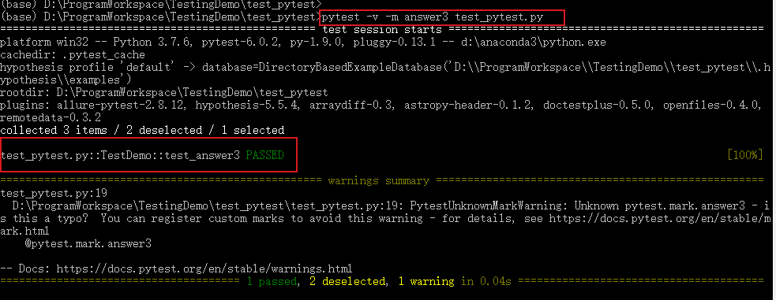
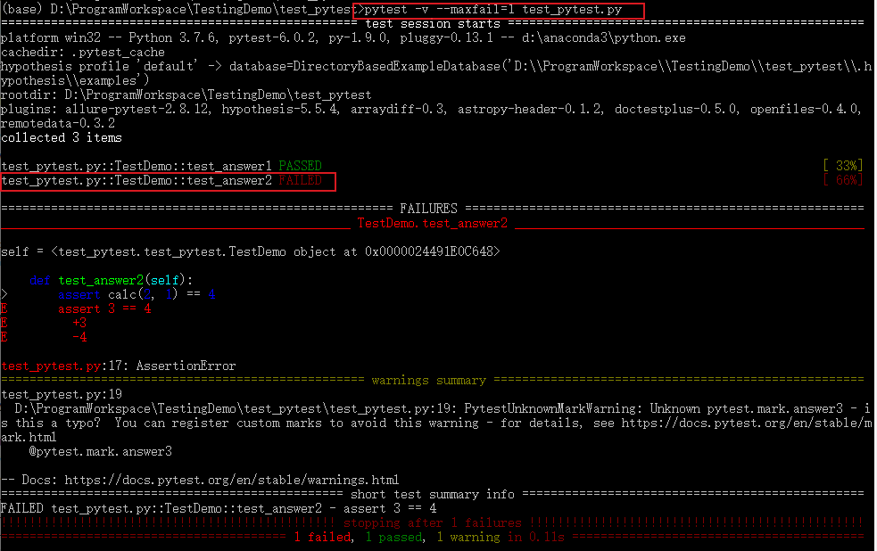

# pytest安装及用例执行
Pytest是基于Python的开源测试框架，语法简单易用，有大量的插件，功能非常多。自动检测测试用例，支持参数化，跳过特定用例，失败重试等功能。

<!--more-->

## 安装

使用pip命令安装：

```python
pip install -U pytest  # 安装
pytest --version # 查看版本
pytest -h # 查看帮助信息
```

```bash
$ pytest --version
pytest 6.2.4
```

## 用例识别
- pytest识别文件名为test\_\*.py或者\*\_test.py的测试文件
- 测试文件中可以在Test\*类中写测试用例（测试用例以test\_\*开头，并且测试类不能有\_\_init\_\_方法）
- 不在Test\*类中的test\_\*用例也可以被识别到。

打印测试目录下匹配到的所有用例：`pytest --collect-only`
```shell
(base) D:\ProgramWorkspace\TestingDemo>pytest --collect-only
============================================== test session starts ==============================================
platform win32 -- Python 3.7.6, pytest-5.3.5, py-1.8.1, pluggy-0.13.1
rootdir: D:\ProgramWorkspace\TestingDemo
plugins: hypothesis-5.5.4, arraydiff-0.3, astropy-header-0.1.2, doctestplus-0.5.0, openfiles-0.4.0, remotedata-0.3
.2
collected 20 items                                                                                               
<Module test_pytest.py>
  <Function test_one>
  <Function test_two>
  <Function test_three>
<Module test_pytest2.py>
  <Class Test_Demo>
      <Function test_one>
      <Function test_two>
      <Function test_three>
<Package D:\ProgramWorkspace\TestingDemo\testing>
  <Module test_calc.py>
    <UnitTestCase TestCalc>
      <TestCaseFunction test_add_1>
      <TestCaseFunction test_add_2>
  <Module test_calc2.py>
    <Class TestCalc>
        <Function test_add[1-2-3]>
        <Function test_add[-1--2--3]>
        <Function test_add[0-1-1]>
        <Function test_add[0--1--1]>
        <Function test_add[0.1-0.2-0.3]>
        <Function test_add[999999-1000000-1999999]>
        <Function test_div[1-2-0.5]>
        <Function test_div[-1--2-0.5]>
        <Function test_div[0-1-0]>
        <Function test_div[1-0-0]>
        <Function test_div[0.1-0.2-0.5]>
        <Function test_add_1>
```

## 常用选项
- `-V, --version`：查看版本信息
- `-h, --help`：查看帮助信息
- `-k EXPRESSION`：运行EXPRESSION匹配到的用例，例如 `pytest -k "add"` 运行文件名包含`add`的用例。
- `-m MARKEXPR`：执行标记的用例
- `-x, --exitfirst`：报错就停止
- `--maxfail=num`：错误数达到num时停止
- `--lf, --last-failed`：仅运行上次执行失败的用例，上一次执行失败的用例记录在.pytest_cache/v/cache/lastfailed文件中
- `--ff, --failed-first`：运行所以用例，但是先运行上一次执行失败的用例
- `-s`：命令行显示输出日志，加上它之后可以显示代码中print打印内容
- `-v, --verbose`：打印详细日志信息
- `-q, --quiet`：打印简略日志信息
- `--collect-only, --co`：仅收集测试用例，不执行

## Pytest用例执行

### 用例执行

一个简单的测试用例test_pytest.py：

```python
import pytest

def calc(a,b):
    return a + b

class TestDemo():
    def test_answer1(self):        
        assert calc(1, 1) == 2

    def test_answer2(self):        
        assert calc(2, 1) == 3
	
  @pytest.mark.answer3        
    def test_answer3(self):        
        assert calc(6, 6) == 12

if __name__=='__main__':
    pytest.main()
```

可以使用如下方式执行某个测试用例

```python
# 执行test_pytest.py所有用例（模块）
pytest test_pytest.py 

# 执行test_pytest.py里的TestDemo类
pytest test_pytest.py::TestDemo 

# 执行test_pytest.py里的TestDemo类的test_answer2方法
pytest test_pytest.py::TestDemo::test_answer2
```
### 打印日志信息

```python
# 打印详细运行日志信息
pytest -v test_pytest.py 
pytest -s test_pytest.py
```


### 跳过某个用例

```python
# 跳过运行某个用例
pytest -v -k "类名 and not方法名" 文件名
pytest -v -k "TestDemo and not test_answer2" test_pytest.py
```


### 运行文件名包含某个关键字的用例
识别包含“add”的用例：`pytest -k "add" --collect-only`

```shell
(base) D:\ProgramWorkspace\TestingDemo>pytest -k "add" --collect-only
============================================== test session starts ==============================================
platform win32 -- Python 3.7.6, pytest-5.3.5, py-1.8.1, pluggy-0.13.1
rootdir: D:\ProgramWorkspace\TestingDemo
plugins: hypothesis-5.5.4, arraydiff-0.3, astropy-header-0.1.2, doctestplus-0.5.0, openfiles-0.4.0, remotedata-0.3
.2
collected 20 items / 11 deselected / 9 selected                                                                  
<Package D:\ProgramWorkspace\TestingDemo\testing>
  <Module test_calc.py>
    <UnitTestCase TestCalc>
      <TestCaseFunction test_add_1>
      <TestCaseFunction test_add_2>
  <Module test_calc2.py>
    <Class TestCalc>
        <Function test_add[1-2-3]>
        <Function test_add[-1--2--3]>
        <Function test_add[0-1-1]>
        <Function test_add[0--1--1]>
        <Function test_add[0.1-0.2-0.3]>
        <Function test_add[999999-1000000-1999999]>
        <Function test_add_1>
```

### 运行某个标记的用例

```python
# 将运行有这个标记的测试用例：@pytest.mark.[标记名]
pytest -m [标记名] 文件名
pytest -m answer3 test_pytest.py
```



### 报错停止

```python
# 一旦运行到报错用例就停止运行
pytest -x 文件名
pytest -x test_pytest.py

# 当报错达到num的时候就停止运行
pytest --maxfail=[num] 文件名
pytest --maxfail=1 test_pytest.py
```



### 失败重新运行

安装 pytest-rerunfailures 插件：

```python
pip install pytest-rerunfailures
```

测试失败后重新运行n次，在重新运行间延迟n秒再运行：

```python
# 重新运行3次
pytest --reruns 3 -v -s test_pytest.py
# 重新运行5次，延迟1s
pytest --reruns 5 --reruns-delay 1 -v test_pytest.py
```


### 重复执行
安装pytest-repeat插件
```python
pip install pytest-repeat
```
重复执行：

```python
# 重新执行3次
pytest -v -s --count=3 test_pytest.py
# 设置重复范围：session, module, class或者function（默认）
pytest -v -s --count=3 --repeat-scope=session test_pytest.py
```
或者在代码中标记：
```python
import pytest

def calc(a,b):
    return a + b

class TestDemo():
  @pytest.mark.repeat(3)
    def test_answer1(self):        
        assert calc(1, 1) == 2

```


### 多条断言

一个方法中有多条断言，通常第一条失败后下面就不执行了，pytest-assume插件可以解决断言失败后继续执行断言的问题。

安装

```python
pip install pytest-assume
```

执行多条断言:

```python
# 写法1
pytest.assume(x == y)
pytest.assume(True)
pytest.assume(False)

# 写法2
with assume: assert calc(2, 1) == 4 
with assume: assert calc(2, 1) == 3 
with assume: assert calc(2, 2) == 3
```

修改测试用例test_pytest.py：

```python
import pytest
from pytest import assume

def calc(a,b):
    return a + b

class TestDemo():
    def test_answer1(self):        
        assert calc(1, 1) == 2

    def test_answer2(self):
  		with assume: assert calc(2, 1) == 4
		with assume: assert calc(2, 1) == 3
		with assume: assert calc(2, 2) == 3
	
	@pytest.mark.answer3        
    def test_answer3(self):        
        assert calc(6, 6) == 12

if __name__=='__main__':
    pytest.main()
```

测试结果：


## pytest.main()

除了在终端执行外，也可以通过pytest.main()来执行，pytest.main() 自动查找当前目录下以test\_开头的文件或者以\_test结尾的py文件。

括号内可传入执行参数，通过[]进行分割，[]内的多个参数通过逗号分割，所有的参数和pytest命令行方式一样：
```python
pytest.main(['-v', 'test_pytest.py']) # 执行test_pytest.py用例
```
或者直接在测试文件最后写如下代码，执行py文件。
```python
if __name__=='__main__':  
    pytest.main()   
    # pytest.main(['-v', 'test_pytest.py'])
```


更多pytest执行方法可参考官方文档：https://docs.pytest.org/en/latest/contents.html#toc