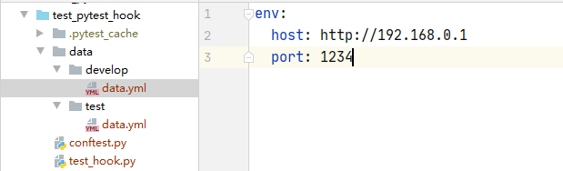

# Pytest插件开发
Pytest测试框架功能非常多，它其实就是由一组插件组成的，具有大量的插件，可以通过插件来扩展、定制功能，能满足大部分的测试需求。本文介绍pytest插件的开发方法，帮助更好的理解pytest测试框架。

<!--more-->

## pytest插件介绍

### pytest的三种插件
pytest插件通过hook函数来实现，pytest主要包括以下三种插件
* 内置插件：pytest内部的\_pytest目录中加载：`\Lib\site-packages\_pytest\hookspec.py`
* 外部插件：pip install 插件，通过setuptools的Entry points机制来发现外部插件，可用插件列表：[https://docs.pytest.org/en/latest/reference/plugin_list.html](https://docs.pytest.org/en/latest/reference/plugin_list.html)
* 本地插件：conftest.py插件，pytest自动模块发现机制，在项目根目录下的conftest文件起到全局作用，在项目下的子目录中的conftest.py文件作用范围只能在该层级及以下目录生效。

他们的加载顺序为：
1. 内置插件
2. 外部插件
3. 本地插件

### pytest的hook函数
hook函数(钩子函数)是程序中预留的函数（相当于暴露了一个钩子），如果我们需要在程序某个步骤执行某个操作，我们就直接重写特定的钩子函数（挂载到钩子上），这样就实现了我们要增加的功能。没有挂载或者注册钩子时，它就是空的，也就是没有执行任何操作。

Pytest 的hook函数可查看`\Lib\site-packages\_pytest\hookspec.py` 文件， Pytest hook函数的执行顺序如下([https://github.com/pytest-dev/pytest/issues/3261](https://github.com/pytest-dev/pytest/issues/3261))：
```sh
root
└── pytest_cmdline_main
    ├── pytest_plugin_registered
    ├── pytest_configure
    │   └── pytest_plugin_registered
    ├── pytest_sessionstart
    │   ├── pytest_plugin_registered
    │   └── pytest_report_header
    ├── pytest_collection
    │   ├── pytest_collectstart
    │   ├── pytest_make_collect_report
    │   │   ├── pytest_collect_file
    │   │   │   └── pytest_pycollect_makemodule
    │   │   └── pytest_pycollect_makeitem
    │   │       └── pytest_generate_tests
    │   │           └── pytest_make_parametrize_id
    │   ├── pytest_collectreport
    │   ├── pytest_itemcollected
    │   ├── pytest_collection_modifyitems
    │   └── pytest_collection_finish
    │       └── pytest_report_collectionfinish
    ├── pytest_runtestloop
    │   └── pytest_runtest_protocol
    │       ├── pytest_runtest_logstart
    │       ├── pytest_runtest_setup
    │       │   └── pytest_fixture_setup
    │       ├── pytest_runtest_makereport
    │       ├── pytest_runtest_logreport
    │       │   └── pytest_report_teststatus
    │       ├── pytest_runtest_call
    │       │   └── pytest_pyfunc_call
    │       ├── pytest_runtest_teardown
    │       │   └── pytest_fixture_post_finalizer
    │       └── pytest_runtest_logfinish
    ├── pytest_sessionfinish
    │   └── pytest_terminal_summary
    └── pytest_unconfigure
```

我们可以对上面的hook函数进行改写，实现某些功能。我在以前的pytest文章中（[Pytest测试框架（三）：pytest fixture 用法](https://blog.csdn.net/u010698107/article/details/111416069)）介绍了fixture 插件的用法，fixture实现的功能其实也对pytest的hook函数进行了改写，比如pytest_generate_tests，pytest_sessionstart等hook函数，大家如果感兴趣可以查看源码：`\Lib\site-packages\_pytest\fixtures.py`


### pluggy插件系统
前面简要介绍了pytest插件，这些插件是怎么管理的呢？pytest的大量插件使用pluggy进行管理，pluggy是pytest使用的一个插件系统，用于pytest插件的管理和钩子调用。也就是说，pluggy使pytest具有了钩子功能，实现主机（主程序）与插件的连接。

## pytest插件：中文编码
先写一个测试用例test_hook.py:
```python
#!/usr/bin/python3
#-*-coding:utf-8-*-
import pytest

@pytest.mark.parametrize("name",["张三","李四"])
def test_name(name):
    print(name)
```
执行：
```sh
$ pytest -vs test_hook.py::test_name
```
结果（只截取部分）：
```sh
test_hook.py::test_name[\u5f20\u4e09] 张三
PASSED
test_hook.py::test_name[\u674e\u56db] 李四
PASSED

```
我们发现用例名字编码格式为Unicode，无法显示中文。

怎么解决呢？我们可以对pytest hook函数pytest_collection_modifyitems()进行重写：
```python
def pytest_collection_modifyitems(
    session: "Session", config: "Config", items: List["Item"]
) -> None:
    """ called after collection has been performed, may filter or re-order
    the items in-place.

    :param _pytest.main.Session session: the pytest session object
    :param _pytest.config.Config config: pytest config object
    :param List[_pytest.nodes.Item] items: list of item objects
    """
```
根据注释我们知道这个hook函数在用例收集完成后进行调用，可对用例进行过滤或者重新排序（修改用例执行顺序的pytest-ordering插件就修改了这个hook函数）

接下来开始修改这个hook函数，对用例名进行解码并反转用例顺序，在测试用例同级目录下新建conftest.py函数，修改代码如下：
```python
#!/usr/bin/python3
#-*-coding:utf-8-*-

from typing import List

def pytest_collection_modifyitems(session, config, items: List):
    for item in items:
        item.name = item.name.encode('utf-8').decode('unicode-escape')
        item._nodeid = item.nodeid.encode('utf-8').decode('unicode-escape')
    items.reverse()
```
items就是收集到的测试用例，可对它进行各种操作。

再次执行：
```sh
$ pytest -vs test_hook.py::test_name
```
结果（只截取部分）：
```sh
test_hook.py::test_name[李四] 李四
PASSED
test_hook.py::test_name[张三] 张三
PASSED
```
解码成功，并且顺序反转了。


## 添加命令行参数
通过改写hook函数pytest_addoption()可以实现添加自定义的命令行参数，几乎每个pytest 插件都会使用这个hook方法。下面在conftest.py中改写pytest_addoption()方法：
```python
# 添加一个命令行参数
def pytest_addoption(parser, pluginmanager):
    mygroup = parser.getgroup("testgroup") #group将下面所有的 optiongroup都展示在这个group下。
    mygroup.addoption("--env", #注册一个命令行选项
        default='test',  # 参数的默认值
        dest = 'env',  # 存储的变量
        help = 'set your run env' #帮助提示参数的描述信息
    )
```

然后我们在命令行中输入`pytest -h`，在打印的帮助信息中，我们可以看到添加的自定义参数：
```text
testgroup:
  --env=ENV             set your run env
```

接下来获取这个参数，在conftest.py中添加如下代码：
```python
@pytest.fixture(scope='session')
def cmdoption(request):
    env = request.config.getoption("--env", default='test')
    if env == "test":
        print("test环境")
        datapath = "data/test/data.yml"
    if env == "develop":
        print("开发环境")
        datapath = "data/develop/data.yml"
    with open(datapath) as f:
        datas = yaml.safe_load(f)

    return env,datas
```

测试数据：


编写测试用例：
```python
def test_env(cmdoption):
    env,datas = cmdoption
    host = datas['env']['host']
    port = datas['env']['port']
    url = str(host) + ":" + str(port)
    print(url)
```
执行测试用例：
```sh
$ pytest -vs test_hook.py::test_env
```
结果（只截取部分）：
```sh
test_hook.py::test_env test环境
http://192.168.11.1:4567
PASSED
```
传递参数：
```sh
$ pytest -vs --env develop test_hook.py::test_env
```
结果（只截取部分）：
```sh
test_hook.py::test_env 开发环境
http://192.168.0.1:1234
PASSED
```
传递成功

## 打包发布
你的Python插件开发完成后，可以对它进行打包发布，方便给别人使用，打包后也可以发布代码到到PyPI上，可参考Python打包文档：[https://packaging.python.org/tutorials/packaging-projects/](https://packaging.python.org/tutorials/packaging-projects/) ，下面介绍Python打包过程。

### 1、创建包文件
```text
pytest-encode/
├── LICENSE
├── README.md
├── setup.py
├── pytest_encode/
│   └── __init__.py
└──tests/
    └── test_encode.py
```
setup.py是一个构建脚本：
```python
import setuptools

setuptools.setup(
    name="pytest-encode", # Replace with your own username
    version="0.0.1",
    author="hiyongz",
    author_email="zhiyo2016@163.com@example.com",
    description="set your encoding",
    long_description="show Chinese for your mark.parametrize().",
    url="https://github.com/pypa/sampleproject",
    project_urls={
        "Bug Tracker": "https://github.com/pypa/sampleproject/issues",
    },
    classifiers=[
        "Programming Language :: Python :: 3",
        "Framework :: Pytest",
        "Topic :: Software Develoment :: Testing",
    ],
    license='MIT License',
    packages=['pytest_encode'],
    keywords=[
        "pytest",
        "py.test",
        "pytest_encode",
    ],
    install_requires=[
        'pytest'
    ],
    python_requires=">=3.6",
    # 入口模块或者入口函数
    entry_points={
        'pytest11':[
            'pytest-encode = pytest_encode'
        ]
    },
       
    zip_safe=False,
)
```
1. 其中依赖包可以通过如下命令生成：
```sh
$ pip freeze >requirements.txt
```
2. entry_points为入口函数，使用pluggy插件中PluginManager类的load_setuptools_entrypoints方法加载，其中pytest11为入口点，这是官方定义的固定入口点，用于发现插件，参考[https://docs.pytest.org/en/latest/how-to/writing_plugins.html](https://docs.pytest.org/en/latest/how-to/writing_plugins.html)

\_\_init\_\_.py：
```python
import logging
from typing import List

import pytest

logging.basicConfig(level=logging.INFO,
                    # 日志格式
                    # 时间、代码所在文件名、代码行号、日志级别名字、日志信息
                    format='%(asctime)s %(filename)s[line:%(lineno)d] %(levelname)s %(message)s',
                    # 打印日志的时间
                    datefmt='%a, %d %b %Y %H:%M:%S',
                    # 日志文件存放的目录（目录必须存在）及日志文件名
                    filename='report.log',
                    # 打开日志文件的方式
                    filemode='w'
                    )
logger = logging.getLogger(__name__)

def pytest_collection_modifyitems(session, config, items: List):
    for item in items:
        item.name = item.name.encode('utf-8').decode('unicode-escape')
        item._nodeid = item.nodeid.encode('utf-8').decode('unicode-escape')

        # 添加login标签
        # pytest -vs -m login test_hook.py
        if 'login' in item.nodeid:
            item.add_marker(pytest.mark.login)
    items.reverse()
```
### 2、打包
打包需要安装两个库：
* wheel：`pip install wheel`
* setuptools：`pip install setuptools`

进入包目录（pytest-encode）下，执行目录：
```sh
$ python setup.py sdist bdist_wheel
```
命令执行完成后，新生成如下文件：
```text
pytest-encode/
├── build/
	├── bdist.win-amd64
    └── lib
		└── pytest_encode
			└── __init__.py
├── dist/
	├── pytest-encode-0.0.1.tar.gz
    └── pytest_encode-0.0.1-py3-none-any.whl		
└──pytest_encode.egg-info/
	├── dependency_links.txt
	├── entry_points.txt
	├── not-zip-safe
	├── PKG-INFO
	├── requires.txt
	├── SOURCES.txt	
    └── test_encode.py
```
pytest-encode-0.0.1.tar.gz为源码包，pytest_encode-0.0.1-py3-none-any.whl可以通过`pip install`命令安装


### 3、测试打包文件
我们新建一个Python虚拟环境，在新的虚拟环境下执行：
```sh
$ pip list
Package    Version
---------- -------
pip        21.0.1
setuptools 54.2.0
```
只安装了两个包，下面安装刚才生成的包文件：
```sh
$ pip install pytest_encode-0.0.1-py3-none-any.whl
```
它会自动安装setup.py中定义的依赖包。

然后在新的虚拟环境中编写测试用例并执行：
```python
import pytest
from pytest_encode import logger

@pytest.mark.parametrize("name",["张三","李四"])
def test_name(name):
    logger.info("测试编码")
    print(name)
```

```sh
$ pytest -vs test_encode.py::test_name
```
结果（只截取部分）：
```sh
test_hook.py::test_name[李四] 李四
PASSED
test_hook.py::test_name[张三] 张三
PASSED
```
解码成功，并且生成了日志文件：
report.log：
```text
Sat, 03 Apr 2021 20:21:45 test_encode.py[line:13] INFO 测试编码
Sat, 03 Apr 2021 20:21:45 test_encode.py[line:13] INFO 测试编码
```
表明安装的包生效了。


### 4、发布包
使用Twine来上传包到PyPI，需要注册一个PyPI账号

然后安装twine:
```sh
$ pip install twine
```
上传：
```sh
$ twine upload --repository test-encode dist/*
```
上传过程中会让你输入前面注册的用户名和密码，上传成功后就可以在PyPI上查看

## 参考资料

1. [https://docs.pytest.org/en/latest/how-to/writing_plugins.html](https://docs.pytest.org/en/latest/how-to/writing_plugins.html)
2. [https://docs.pytest.org/en/stable/reference.html?#hooks](https://docs.pytest.org/en/stable/reference.html?#hooks)
3. [https://docs.pytest.org/en/stable/_modules/_pytest/hookspec.html#pytest_cmdline_parse](https://docs.pytest.org/en/stable/_modules/_pytest/hookspec.html#pytest_cmdline_parse)
4. [https://github.com/pytest-dev/pytest/issues/3261](https://github.com/pytest-dev/pytest/issues/3261)
5. [https://packaging.python.org/tutorials/packaging-projects/](https://packaging.python.org/tutorials/packaging-projects/)
6. pytest-ordering：[https://github.com/ftobia/pytest-ordering](https://github.com/ftobia/pytest-ordering)
7. pluggy：[https://pluggy.readthedocs.io/en/latest/](https://pluggy.readthedocs.io/en/latest/)


