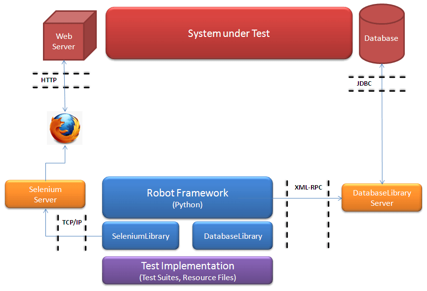
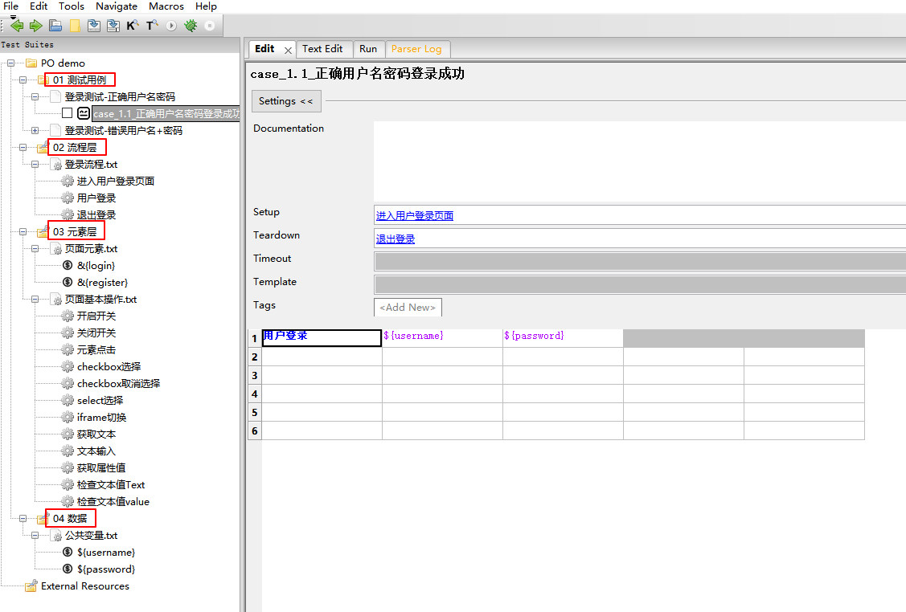
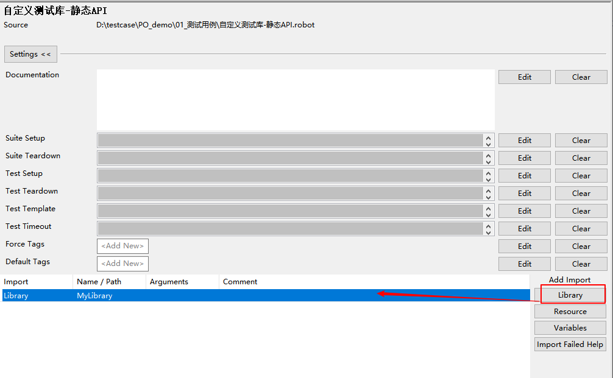
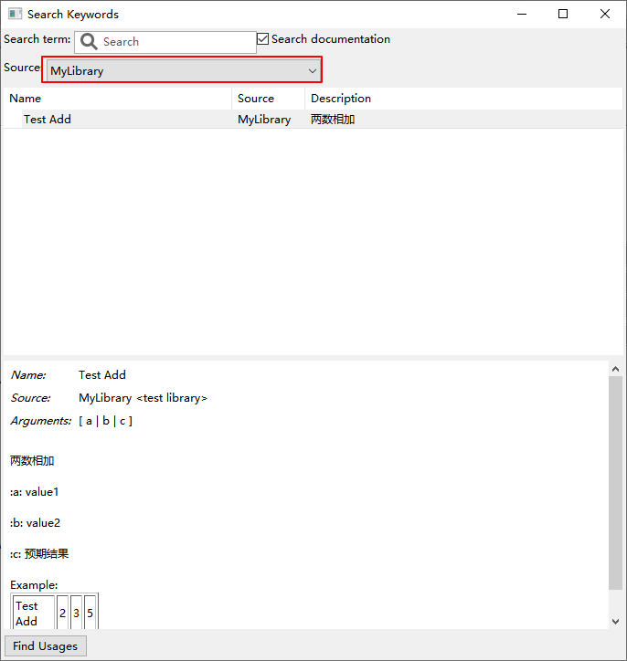
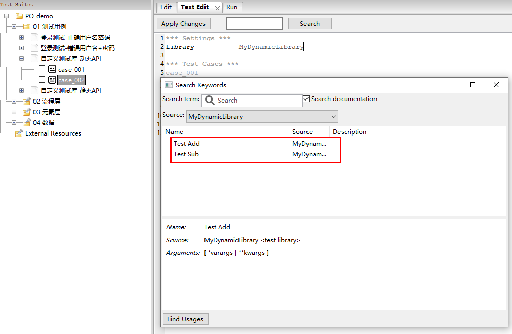
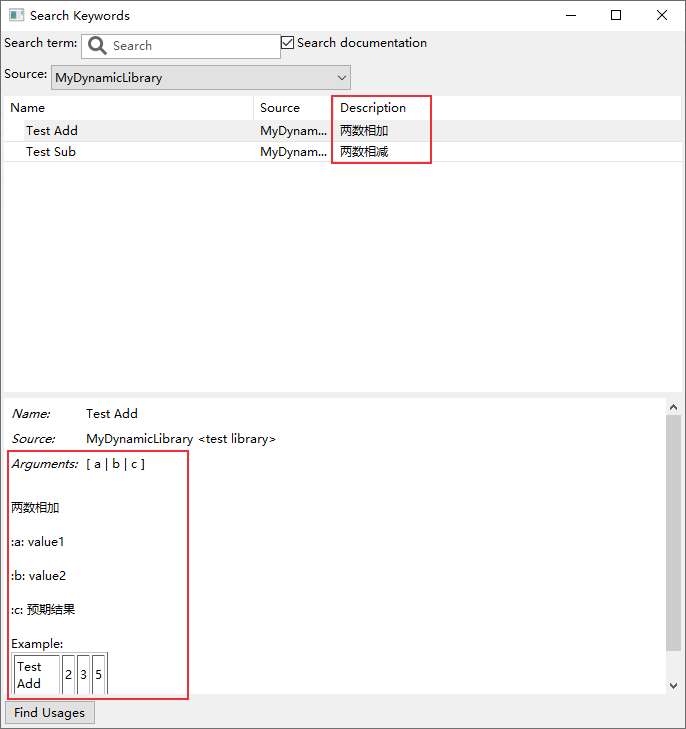
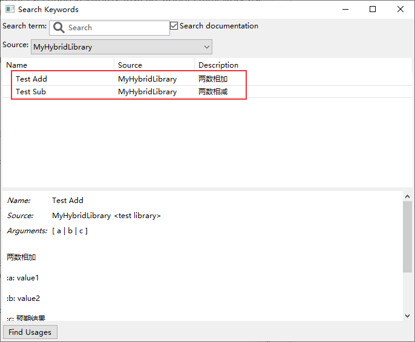
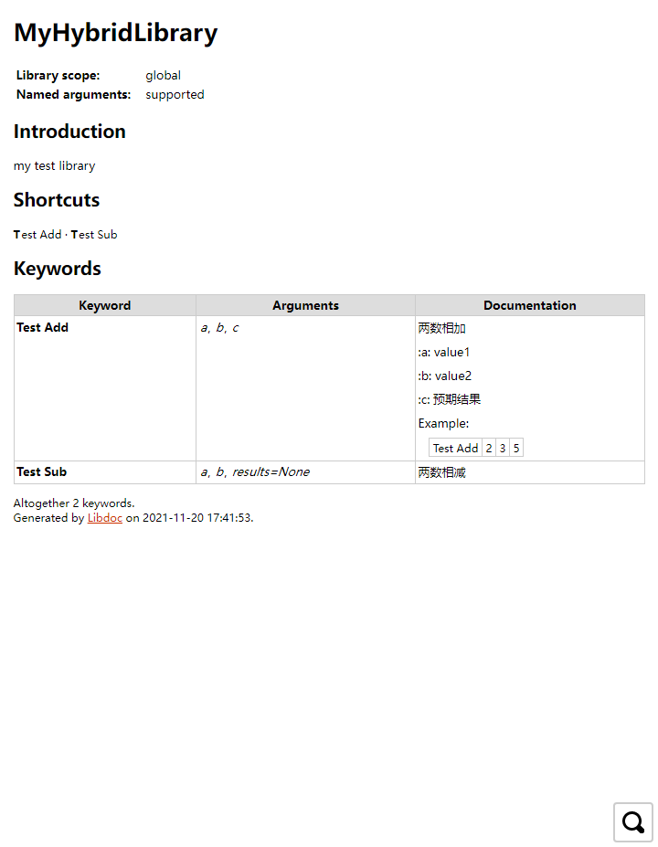

# Robot Framework自定义测试库开发详解
Robot Framework是一个开源自动化测试框架，主要特点是基于关键字驱动，本文介绍自定义测试库及测试库文档创建方法。


## 简介
Robot Framework是用于验收测试(Acceptance Testing)，验收测试驱动开发（Acceptance Test Driven Development, ATDD）和
机器人流程自动化（Robotic Process Automation, RPA）的开源自动化框架，支持数据驱动、关键字驱动和行为驱动（BDD）。它具有简单的纯文本语法，并且可以使用Python或Java实现库的扩展。

Robot Framework核心框架使用Python实现，支持Python 2 和 Python 3，还可以在Jython（JVM），IronPython（.NET）和PyPy上运行。该框架具有丰富的生态，有各种通用库和工具，比如selenium测试库SeleniumLibrary，appium测试库AppiumLibrary等，更多测试库可查看官网[http://robotframework.org](http://robotframework.org) 。

Robot Framework GitHub地址：[https://github.com/robotframework/robotframework](https://github.com/robotframework/robotframework)

RIDE地址：[https://github.com/robotframework/RIDE](https://github.com/robotframework/RIDE)

下图是基于Robot Framework进行web自动化（SeleniumLibrary）测试的架构图，


<center><font size="2">https://blog.codecentric.de/en/2012/04/robot-framework-tutorial-a-complete-example/</font></center>

安装：
```shell
pip install robotframework
pip install robotframework-ride
```
RIDE是使用wxPython库编写的Robot Framework图形界面。


## RF分层思想
一个好的设计模式有助于提高脚本开发速度，且利于维护。使用Robot Framework进行自动化用例开发时可以考虑使用分层的思想，类似于Page Object 设计模式。

顾名思义，“分层” 意思就是把一个过程分为多层，比如下面的例子：实现web UI自动化的登录测试。




一共分为了4层：

- `01_测试用例`：编写测试用例
- `02_流程层`： 封装操作流程关键字
- `03_元素层`：存放页面元素标签以及页面基本操作关键字，比如开关操作，点击，输入等
- `04_数据`：用来存放数据，比如全局变量

使用分层思想，将数据和流程分离开，能够减少一些由需求变更引发的修改，更易于扩展和维护。当然也可以使用其它分层方式，最终目的是让你的项目容易维护。

Robot Framework的测试库已经非常丰富了，如果还是无法满足需求，可以自己开发，下面来介绍如何开发自定义测试库。

## 开发自定义测试库

Robot Framework主要有三种API：静态API、动态API和混合API，下面分别进行介绍。

### 静态API
静态API直接将方法(methods)映射为关键字。关键字接收的参数和方法相同的参数一样。

**1. 编写测试库**

在`~\Lib\site-packages`目录中新建一个包【比如MyLibrary】， 然后在创建的测试库MyLibrary目录下新建MyKeywords类文件(MyKeywords.py)，用来封装要实现的关键字。

```python
class MyKeywords():
    def test_add(self, a, b, c):
        """两数相加

        :a: value1

        :b: value2

        :c: 预期结果

        Example:
        | Test Add | 2 | 3 | 5 |

        """
        if float(a) + float(b) == float(c):
            return True
        else:
            raise RuntimeError("%s + %s != %s"%(a,b,c))
```

接下来在`~\Lib\site-packages\MyLibrary` 目录下新建`version.py` 文件，用于设置自定义测试库MyLibrary的版本信息。

```python
# -*- coding:utf-8 -*-
VERSION = '0.0.1'
```


然后在`__init__.py`文件导入关键字及版本信息。

```python
# -*- coding:utf-8 -*-
from .MyKeywords import MyKeywords
from .version import VERSION
_version_ = VERSION
class MyLibrary(MyKeywords):    
    """    MyLibrary    """    
    ROBOT_LIBRARY_SCOPE = 'GLOBAL'
```

**2. 导入测试库**

创建一个测试套件，然后导入测试库


查询测试库关键字信息（F5）



**3. 编写用例脚本**

```python
*** Settings ***
Library           MyLibrary

*** Test Cases ***
case_001
    ${sum}    Test Add    2    3    5
    Should Be True    ${sum}
```


### 动态API

动态API和静态API的区别在于发现测试库关键字、关键字的参数、说明文档，以及关键字实际执行方式不同。Python版本中，静态API是使用反射的方式获取（python反射介绍可参考[Python反射介绍](https://blog.csdn.net/u010698107/article/details/117600196)），而动态API采用的是指定的方法来动态获取这些信息，主要包括4个方法：get_keyword_names、run_keyword、get_keyword_arguments和get_keyword_documentation 。这些方法其实也使用了Python反射函数来获取测试类属性信息。

使用动态API的好处就是可以更加灵活的编写测试库，动态API说明文档可参考：[http://robotframework.org/robotframework/latest/RobotFrameworkUserGuide.html#dynamic-library-api](http://robotframework.org/robotframework/latest/RobotFrameworkUserGuide.html#dynamic-library-api)

**1. 编写测试库**

和静态API类似，在`~\Lib\site-packages`目录中新建一个包【MyDynamicLibrary】， 然后在创建的测试库MyDynamicLibrary目录下新建MyKeywords类文件(MyKeywords.py)，用来封装要实现的关键字。

```python
from robot.api.deco import keyword
from robot.api import logger

class MyKeywords(object):
    def __init__(self):
        self._cal = Calculate()

    def get_keyword_names(self):
        # 获取当前测试类的所有属性
        attributes = [(name, getattr(self._cal, name)) for name in dir(self._cal)]
        # 过滤没有设置robot_name的属性
        keywords = [(name, value) for name, value in attributes
                    if hasattr(value, 'robot_name')]
        # 返回关键字名称
        return [value.robot_name or name for name, value in keywords]

    def run_keyword(self, name, args, kwargs):
        print("Running keyword '%s' with positional arguments %s and named arguments %s."
              % (name, args, kwargs))
        func = getattr(self._cal, name)
        return func(*args,**kwargs)


class Calculate(object):
    
    def not_keyword(self):
        pass

    @keyword
    def test_sub(self, a, b, results=None):
        """两数相减
        """
        if float(a) - float(b) == float(results):
            return True
        else:
            raise RuntimeError("%s - %s != %s"%(a,b,results))

    @keyword
    def test_add(self, a, b, c):
        """两数相加

        :a: value1

        :b: value2

        :c: 预期结果

        Example:
        | Test Add | 2 | 3 | 5 |

        """
        if float(a) + float(b) == float(c):
            return True
        else:
            raise RuntimeError("%s + %s != %s"%(a,b,c))
```

 `get_keyword_names` 方法实现动态获取关键字名称，此方法没有参数，并且必须返回包含当前测试库实现的关键字列表或数组。代码中使用到了python反射函数 `getattr()` 、 `hasattr` 和 `dir()`。

`run_keyword` 用于执行关键字，包括2个或者3个参数：name, args, kwargs，`name` 为关键字方法名称，通过`get_keyword_names` 获得；`args` 为关键字方法的位置参数，`kwargs`为关键字参数，可以不设置。

 `get_keyword_names` 和 `run_keyword` 是动态库必须要有的方法，如果没有它们就会变成一个静态库。动态API涉及到的主要方法如下表。

| 方法                        | 参数                      | 说明                               |
| :-------------------------- | ------------------------- | :--------------------------------- |
| `get_keyword_names`         |                           | 获取关键字名称                     |
| `run_keyword`               | `name, arguments, kwargs` | 执行关键字                         |
| `get_keyword_arguments`     | `name`                    | 获取关键字参数（可选方法）         |
| `get_keyword_types`         | `name`                    | 返回关键字参数类型信息（可选方法） |
| `get_keyword_tags`          | `name`                    | 返回关键字标签（可选方法）         |
| `get_keyword_documentation` | `name`                    | 返回关键字及测试库文档（可选方法） |
| `get_keyword_source`        | `name`                    | 返回关键字源信息（可选方法）       |

`Calculate`是一个存放关键字的类，这个类可以写在其它模块中。

`__init__.py` 和 `version.py`文件和静态API写法一样。


**2. 导入测试库**

导入测试库MyDynamicLibrary后，查询测试库关键字信息（F5）



从上图可以看到已经获取到了关键字，没有添加 `@keyword` 装饰器的`not_keyword` 关键字没有显示出来。

另外，Description那一列是空白的，Arguments没有显示关键字的真实参数，关键字注释文档也没有显示。这需要`get_keyword_documentation` 和 `get_keyword_arguments` 这两个函数来实现文档和变量显示。将下面代码添加到MyKeywords类中：

```python
def get_keyword_documentation(self, name):
    func = getattr(self._cal, name)
    return func.__doc__

def get_keyword_arguments(self, name):
    func = getattr(self._cal, name)
    func_args = func.__code__.co_varnames
    if func_args[0] == "self":
        func_args = func_args[1:]
        return func_args
```

重启Robot Framework，F5查看测试库关键字信息：



**3. 编写用例脚本**

```python
*** Settings ***
Library           MyDynamicLibrary

*** Test Cases ***
case_001
    ${res}    Test Add    2    3    5
    Should Be True    ${res}

case_002
    ${res}    Test Sub    6    1    results=5
    Should Be True    ${res}
```

执行，日志如下：
```python
Starting test: PO demo.01 测试用例.自定义测试库-动态API.case_001
20211119 18:00:00.980 :  INFO : Running keyword 'test_add' with positional arguments ('2', '3', '5') and named arguments {}.
20211119 18:00:00.980 :  INFO : ${res} = True
Ending test:   PO demo.01 测试用例.自定义测试库-动态API.case_001

Starting test: PO demo.01 测试用例.自定义测试库-动态API.case_002
20211119 18:00:00.982 :  INFO : Running keyword 'test_sub' with positional arguments ('6', '1') and named arguments {'results': '5'}.
20211119 18:00:00.982 :  INFO : ${res} = True
Ending test:   PO demo.01 测试用例.自定义测试库-动态API.case_002
```

动态库也可以借助robotlibcore 库来实现，编写动态API更加简洁。具体使用方法参考：[https://github.com/robotframework/PythonLibCore](https://github.com/robotframework/PythonLibCore)

### 混合API
混合API就是静态API和动态API方式的混合使用。混合API通过使用 `get_keyword_names` 方法获取所有关键字，但是不使用 `run_keyword` 方法执行关键字，执行方式和静态API相同。

在`~\Lib\site-packages`目录中新建一个包【MyHybridLibrary】， MyKeywords.py文件中编写关键字方法，使用 `get_keyword_names` 方法获取关键字，其它写法和静态API类似：

```python
from robot.api.deco import keyword
from robot.api import logger

class MyKeywords(object):
    def get_keyword_names(self):
        # 获取当前测试类的所有属性
        attributes = [(name, getattr(self, name)) for name in dir(self)]
        # 过滤没有设置robot_name的属性
        keywords = [(name, value) for name, value in attributes
                    if hasattr(value, 'robot_name')]
        # 返回关键字名称
        return [value.robot_name or name for name, value in keywords]

    def not_keyword(self):
        pass

    @keyword
    def test_sub(self, a, b, results=None):
        """两数相减
        """
        if float(a) - float(b) == float(results):
            return True
        else:
            raise RuntimeError("%s - %s != %s"%(a,b,results))

    @keyword
    def test_add(self, a, b, c):
        """两数相加

        :a: value1

        :b: value2

        :c: 预期结果

        Example:
        | Test Add | 2 | 3 | 5 |

        """
        if float(a) + float(b) == float(c):
            return True
        else:
            raise RuntimeError("%s + %s != %s"%(a,b,c))
```

`__init__.py` 和 `version.py`文件和静态API写法一样。

导入测试库MyHybridLibrary后，查询测试库关键字信息（F5）



### 导入Python脚本

如果不想创建包，可以直接写py文件，然后导入。

可以将测试库文件放在 `~\Lib\site-packages` 目录下，这样在导入 Library 的时候可以直接写库名称就可以了，如果放在其它地方，需要使用绝对路径或者相对路径。

需要注意的是测试类名称要和文件名一致，比如编写测试库TestLlibrary.py：

```python
class TestLlibrary():
    def __init__(self):
        pass

    def test_sub(self, a, b, results=None):
        """两数相减
        """
        if float(a) - float(b) == float(results):
            return True
        else:
            raise RuntimeError("%s - %s != %s"%(a,b,results))
```

这种方式和静态API的关键字读取、文档显示、关键字执行一样，其实它就是静态API。


## 生成测试库文档

可以将关键字方法的document注释（3个双引号括起来的内容）提取出来生成一个测试库文档。使用Libdoc工具可以很方便生成一份测试库文档，命令格式：

```bash
python -m robot.libdoc -f html MyLibrary MyLibrary.html
```
生成MyHybridLibrary库文档：

```bash
$ python -m robot.libdoc -f html MyHybridLibrary MyHybridLibrary.html
D:\MyHybridLibrary.html
```

MyHybridLibrary.html内容：



这非常方便，不需要另外编辑一份测试文档，更新关键字后，执行上面的命令就可以快速生成。

**参考文档：**

1. [https://robotframework.org/robotframework/latest/RobotFrameworkUserGuide.html](https://robotframework.org/robotframework/latest/RobotFrameworkUserGuide.html)
2. [https://github.com/robotframework/PythonLibCore](https://github.com/robotframework/PythonLibCore)


