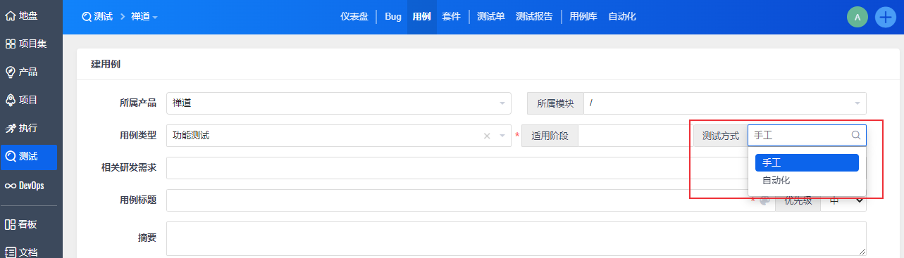
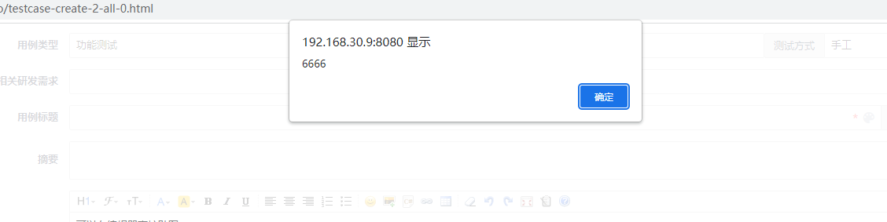
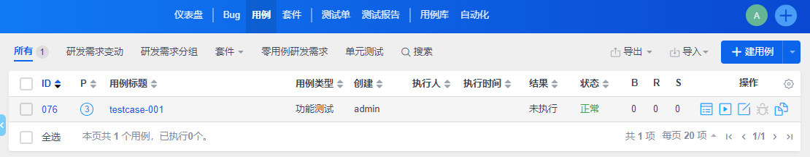
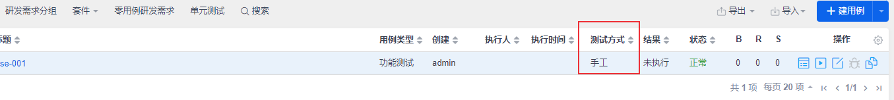
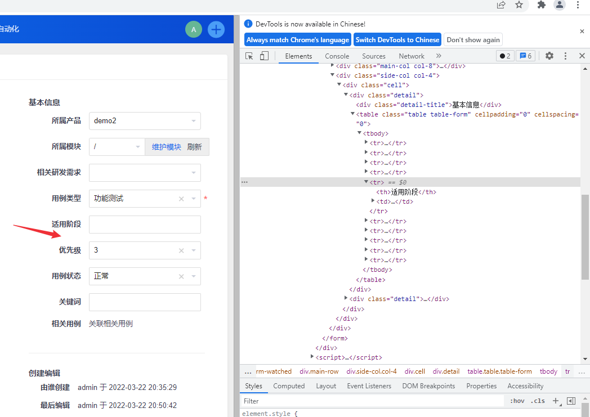
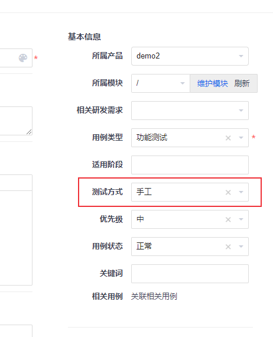

# 禅道二次开发（三）：二次开发实例
对禅道框架有初步的了解后就可以开始进行二次开发了，不需要完全搞懂zentaoPHP框架，可以在开发过程中学习。本文记录一下我进行禅道二次开发的其中一个小功能的实现过程。

<!--more-->

对禅道进行扩展主要在module目录下进行，在需要扩展的模块下对model、control、view方法以及css、js、lang等进行扩展。下面介绍如何在用例模块中新增一个字段，了解禅道是如何进行扩展的。

需求是对测试用例新增字段【测试方式】，选项为手工或者自动化，新建用例页面的效果如下：



下面介绍具体扩展步骤。

## 新建用例页面扩展

对禅道的二次开发一般在对应模块下的 `ext` 目录中进行扩展，不需要对禅道源码进行修改。先来介绍新建用例页面新增【测试方式】字段的步骤。

###  1. 定位扩展模块

第一步需要定位到要扩展页面的模块名和方法名。

点击进入新建用例页面，可以看到URL地址为：`http://192.168.30.9:8080/zentao/testcase-create-1-all-0.html` 。

通过URL地址可以得到如下信息：

- 模块名为testcase
- 方法名为create，可以在`\module\testcase\control.php` 中找到create方法。
- `\module\testcase\model.php` 文件中存放control可以调用的Model方法。
- 对应的view模板文件为 `\module\testcase\view\create.html.php`。
- 后面的`1-all-0`是create方法的参数，这里的1表示产品ID，具体含义需要查看代码。

通过这个URL我们知道要扩展testcase模块下的create方法。

### 2. view 扩展

对 view 方法的扩展有两种方式：覆盖扩展和钩子扩展。

#### 覆盖扩展

覆盖扩展就是对原来的方法进行重写，直接在 `\module\testcase\ext\view` 目录下创建与要扩展方法**同名**的文件 `create.html.php`，复制 `\module\testcase\view` 目录下 `create.html.php` 代码，新增【测试方式】相关前端代码。下面直接给出代码（部分关键代码）：

```html
<td>
  <div class='table-row'>
	<div class='table-col' id='stageBox'>
		<div class='input-group'>
			<span class='input-group-addon w-80px'><?php echo $lang->testcase->stage;?></span>
			<?php echo html::select('stage[]', $lang->testcase->stageList, $stage, "class='form-control chosen' multiple='multiple'");?>
		</div>
	</div>
	<div class='table-col' id='exectypeBox'>
		<div class='input-group'>
			<span class='input-group-addon fix-border'><?php echo $lang->testcase->execType;?></span>
			<?php echo html::select('execType', $lang->testcase->execTypeList, $execType, "class='form-control chosen' ");?>
		</div>
	</div>
   </div>
</td>
```

由于我要将它放在【适用阶段】字段后面，因此对【适用阶段】相关代码也进行了修改。

我们知道，view模板是由于向用户展现数据的，相关数据是通过control方法获取的。通过参考其它字段，【测试方式】字段需要 `$lang->testcase->execType` 、`$lang->testcase->execTypeList` 和 `$execType` 这三个数据。前两个变量需要扩展lang文件，最后一个变量需要扩展control层中的create方法。

**view模板的钩子扩展方法稍后介绍。**

### 3. lang扩展

在 `ext/lang` 目录下创建zh-cn文件夹（其它语言类似），然后在zh-cn目录下创建zh-cn.php文件（任意文件名）：

```php
<?php
$lang->testcase->execType             = '测试方式';

/* Define the execution types. */
$lang->testcase->execTypeList['']            = '';
$lang->testcase->execTypeList['manual']      = '手工';
$lang->testcase->execTypeList['auto']        = '自动化';
```

 

### 4. control方法扩展

接下来扩展 testcase 的control方法里面的 create 方法，在`\module\testcase\ext` 目录下创建一个control目录，然后在`control` 目录下创建create.php文件（注意：**创建的文件名要小写。**），参数和control.php中的create方法一样：

```php
<?php
include '../../control.php';

class myTestcase extends testcase
{
    /**
    * Create a test case.
    * @param        $productID
    * @param string $branch
    * @param int    $moduleID
    * @param string $from
    * @param int    $param
    * @param int    $storyID
    * @param string $extras
    * @access public
    * @return void
    */
    public function create($productID, $branch = '', $moduleID = 0, $from = '', $param = 0, $storyID = 0, $extras = '')
    {
        /* Init vars. */
        $execType    = 'manual'; // 测试方式，manual:手工, auto: 自动的
       
        $this->view->execType        = $execType;        

        parent:: create($productID, $branch = '', $moduleID = 0, $from = '', $param = 0, $storyID = 0, $extras = '');
    }
}

```

新增的两行代码会自动扩展到control.php中的create方法中。也可以复制源码，在源码中修改，如果全部复制过来就不要用parent方法了。

由于新增了一个字段，需要对case表新增一个字段execType：

```sql
ALTER TABLE `zentao`.`zt_case` 
ADD COLUMN `execType` CHAR(30) NOT NULL DEFAULT 'manual' AFTER `lastRunResult`;
```

目前不需要对model方法进行扩展，到这里已经完成了对新建用例页面的扩展。

这里介绍一下model方法扩展方式。

### 5. model方法扩展

在 `\testcase\ext` 目录下创建model目录。然后在`\testcase\ext\model` 目录下进行model方法扩展，主要有3种扩展方式：

- 覆盖扩展：创建*.php文件
- 钩子扩展：创建hook目录，在hook目录下创建 `扩展方法名.扩展名.php` 文件
- class目录：加密使用的方式

#### 覆盖扩展

 model方法扩展直接写要扩展的方法名即可，不用像control方法扩展那样新声明类，在`\testcase\ext\model` 目录下创建test.php:

```php
<?php

/**
 * Create a case.
 *
 * @param int $bugID
 * @access public
 * @return void
 */
function create($bugID)
{
	parent::create($bugID)
}
```

#### 钩子扩展

在`\testcase\ext\model\hook` 目录下创建 `扩展方法名.扩展名.php` ，框架会把扩展方法的所有钩子代码合并到最终的代码中。

在 `\testcase\ext\model\hook\`目录下创建create.test.php文件

```php
<?php
// 直接编写代码逻辑
die("6666");
```

查看效果：创建用例，点击保存




## 用例浏览页面扩展

在创建用例页面新增了【测试方式】字段之后，如果想在用例浏览页面查看每条用例的测试方式，需要对browse页面进行扩展。



具体步骤不介绍了，思路和新建用例页面扩展一样。效果如下图：



## 用例编辑页面扩展

用例编辑页面也要添加【测试方式】字段，这里介绍一下view方法的钩子扩展方式。

### view方法钩子扩展

将【测试方式】字段放到【适用阶段】后面：



文件命名方式：`方法名.扩展名.html.hook.php`，钩子的内容会追加到主干对应view文件末尾。在`\module\testcase\ext\view` 目录下创建 `create.test.html.hook.php` 文件：

```php
<?php 
// 测试方式
$html   = '<tr>';
$html  .= '<th>';
$html  .= $lang->testcase->execType;
$html  .= '</th>';
$html  .= '<td>';
$html  .= html::select('execType', (array)$lang->testcase->execTypeList, $case->execType, "class='form-control chosen' "); 
$html  .= '</td>';
$html  .= '</tr>';
?>

<script>
    var item1 = $('div.side-col table tbody tr')[4];    
    $('#dataform').find( item1 ).after(<?php echo json_encode($html); ?>);
</script>
```

效果：



### js/css/lang/config 扩展

有时候需要对js、css、lang和config文件进行扩展，前面介绍了对lang的扩展。js 和 css 扩展方法和lang一样。

- 在 `ext/js` 目录下创建和方法名同名的目录create，进入create目录，创建test.js文件

- 在 `ext/css` 目录下创建和方法名同名的目录create，进入create目录，创建test.css文件

config扩展是在`ext/config` 目录下创建php文件即可。

关于禅道二次开发相关笔记就写到这里了，文章仅介绍了禅道扩展的一个简单示例，更多用法可以阅读源码，欢迎交流讨论。

参考资料：
1. https://www.zentao.net/publicclass/80237.html
2. https://www.zentao.net/book/zentaopmshelp/225.html

