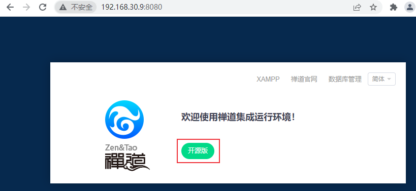
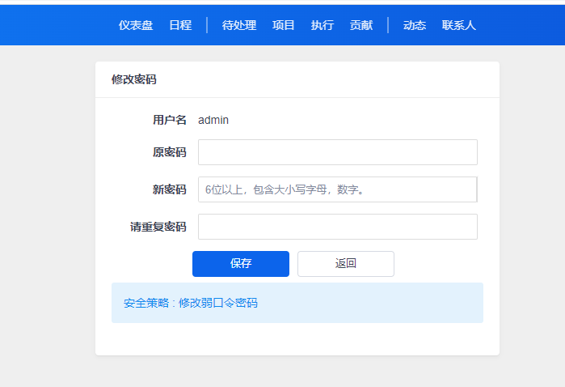
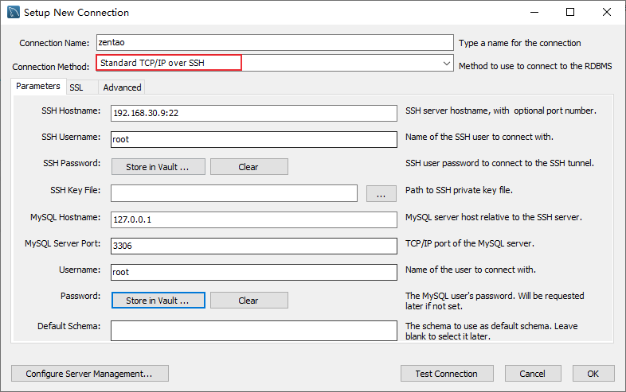
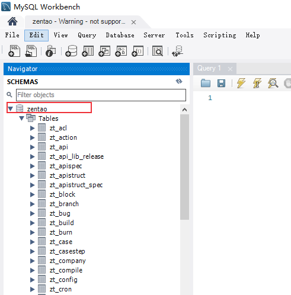
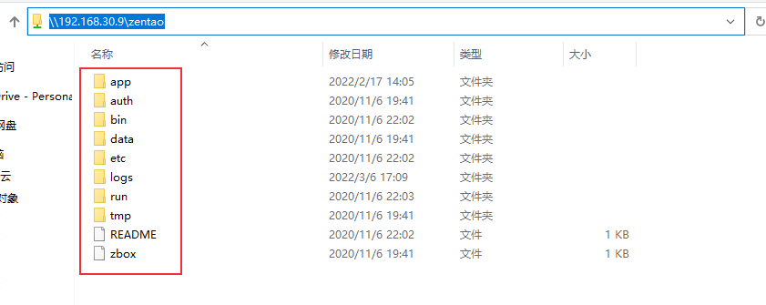
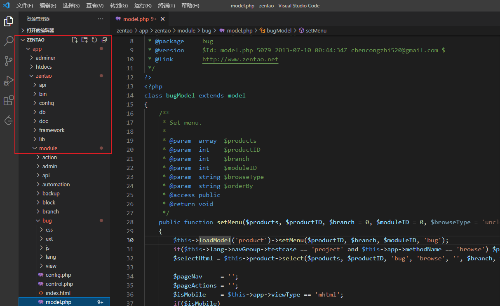

# 禅道二次开发（一）：开发环境配置
禅道是一个开源的项目管理软件，作为测试人员最常用的功能就是用例管理和bug管理。目前的禅道开源版可能无法满足业务需求，可以基于禅道进行二次开发。先来介绍下如何配置禅道开发环境。

<!--more-->


## 前言

禅道项目管理软件主要使用PHP语言，是基于zentaoPHP框架进行开发的。要对禅道进行二次开发需要对PHP语言、zentaoPHP框架、前端ZUI框架、MySQL数据库、HTML、JavaScript等有一定的了解。后续我会陆续发布一些禅道二次开发的相关笔记，文章不会对这些基础进行过多介绍，关于禅道二次开发的相关资料可滑到文章末尾查看，都是禅道官方提供的资料，介绍的比较详细。

下面介绍我是如何配置禅道开发环境的。

## 禅道环境部署

在Windows中部署PHP环境可以使用XAMPP，它是一个Apache发行版，其中包含了MariaDB、PHP和Perl。下载地址：

- https://www.apachefriends.org/index.html
- https://www.apachefriends.org/zh_cn/download.html

由于我们的禅道部署在Linux系统上，我选择在Linux上部署环境。Linux也可以使用XAMPP部署，我觉得太麻烦就没有使用它，而是直接在Linux上安装禅道，因为禅道安装包内置了apache、php、mysql这些应用程序，不需要再单独安装部署。直接在禅道目录中进行二次开发就可以了。

### 禅道安装

在linux中使用禅道一键安装包安装禅道，下载地址：https://www.zentao.net/download.html ，我下载的是[禅道16.4版本](https://www.zentao.net/dynamic/zentaopms16.4-80496.html)。

**1、将禅道一键安装包解压到`/opt`目录下**

```bash
$ sudo tar -zxvf  ZenTaoPMS.16.4.zbox_64.tar.gz -C /opt
```

解压完成后可以查看PHP的版本：
```bash
$  /opt/zbox/bin/php -v
PHP 7.2.33 (cli) (built: Jul 14 2021 12:01:31) ( ZTS )
Copyright (c) 1997-2018 The PHP Group
Zend Engine v3.2.0, Copyright (c) 1998-2018 Zend Technologies
    with the ionCube PHP Loader + ionCube24 v10.4.4, Copyright (c) 2002-2020, by ionCube Ltd.
    with Zend OPcache v7.2.33, Copyright (c) 1999-2018, by Zend Technologies
```

**2、设置Apache和MySQL的端口号**

可以使用 `/opt/zbox/zbox -h` 命令查看帮助信息：

```bash
$ /opt/zbox/zbox -h
Usage: zbox.php {start|stop|restart|status}

Options:
    -h --help Show help.
    -ap --aport Apache port, default 80.
    -mp --mport Mysql port, default 3306.

```

设置端口：

```bash
$ /opt/zbox/zbox -ap 8080 -mp 3306
```

其中 `-ap` 参数设置Apache端口，`-mp` 参数设置Mysql端口。

**3、关闭防火墙**

查看防⽕火墙状态 

```sh
$ systemctl status firewalld
$ systemctl status firewalld.service
```

停⽌止firewall

```sh
$ systemctl stop firewalld.service
```

禁止firewall开机启动

```sh
$ systemctl disable firewalld.service 
```

关闭selinux：`vi /etc/selinux/config`，注释掉 `SELINUX=enforcing`，添加 `SELINUX=disabled`

**4、启动禅道**

```bash
$ /opt/zbox/zbox start
Start Apache success
Start Mysql success
```

停止禅道命令：
```bash
$ /opt/zbox/zbox stop
```

重启：

```bash
$ /opt/zbox/zbox restart
```

可以设置一下开机自动启动，把 `/opt/zbox/zbox restart` 命令添加`/etc/rc.d/rc.local` 文件，并添加执行权限：

```bash
$ chmod +x /etc/rc.d/rc.local
```

禅道启动成功后，浏览器访问：http://192.168.30.9:8080/ ，其中192.168.30.9为我的服务器地址，8080为apache端口。



禅道默认管理员帐号是 admin，密码 123456。登录后需要修改登录密码：




### 禅道升级

如果禅道使用linux一键安装包安装，可按照以下步骤升级：

1、下载新版本的源码包 ZenTaoPMS.16.4.zip

2、解压缩后得到zentaopms文件夹，将zentaopms/下面的所有文件复制到 `/opt/zbox/app/zentao/` 下面，覆盖同名文件：

```bash
$ unzip ZenTaoPMS.16.4.zip
$ sudo cp -rf zentaopms/* /opt/zbox/app/zentao/
````

3、访问 `http:/192.168.30.9:8080/zentao/upgrade.php`，按照页面提示进行升级。


## 连接数据库

下面介绍使用Mysql Workbench客户端工具来连接数禅道据库，其它数据库管理工具类似。

1、先添加一个数据库管理用户，设置密码

```bash
$ ./opt/zbox/auth/adduser.sh
This tool is used to add user to access adminer
Account: root
Password: Adding password for user root
```

2、打开Mysql Workbench客户端工具，新建连接

先用SSH通道连接上服务器，再连接禅道数据库



3、连接数据库



这样就可以对禅道数据库进行操作了。

命令行连接和导入数据库方法：

- 登录数据库：`/opt/zbox/bin/mysql -u root -P 3306 -p`

- 导入数据库：`/opt/zbox/bin/mysql -u root -P 3306 -p zentao < zentao.sql`


## 配置linux和windows文件共享

为了方便开发，我选择在Windows上使用vscode编辑器进行开发。我的解决方案是使用samba来配置linux和windows的文件共享。安装方法可参考[使用samba实现linux和windows文件共享](https://blog.csdn.net/u010698107/article/details/119850227)。

`vi /etc/samba/smb.conf` ：

```bash
[global]
        workgroup = ZENTAO
        security = user

        passdb backend = tdbsam

        printing = cups
[zentao]
        comment = ZENTAO Projects
        path = /opt/zbox
        public = yes
        writable = yes
        browseable = yes
        guest ok = yes
        read only = no

```

设置用户名和密码：`smbpasswd -a root`

```bash
$ smbpasswd -a root
New SMB password:
Retype new SMB password:
Added user root.

```

启动 *smb.service* 和 *nmb.service*两个服务

```bash
systemctl start smb.service
systemctl start nmb.service
```

设置开机启动

```bash
systemctl enable smb.service
systemctl enable nmb.service
```

windows访问地址 [\\\192.168.30.9\zentao](\\192.168.168.226\zentao)




## Vscode 配置PHP开发环境

如果要在Windows中编写PHP脚本，需要配置一下settings.json文件，配置PHP执行文件php.exe的路径。

点击VSCode的 文件 -> 首选项 -> 设置，搜索php


点击setting.json，添加配置：

```bash
"php.validate.executablePath": "D:/xampp/php/php.exe",
```

安装插件PHP Debug用于PHP调试，如果是禅道二次开发可以不用配置它，修改代码后刷新禅道页面，会看到修改后的效果。

另外推荐安装PHP Intelephense插件，可用于方法跳转。

接下来可以在Vscode中打开共享的zentao文件夹：



为了方便开发建议对zentao目录进行版本管理。


## 参考资料

1. 禅道官网：[https://www.zentao.net/](https://www.zentao.net/) 
2. 禅道下载：https://www.zentao.net/download
3. 禅道安装教程：https://www.zentao.net/book/zentaopmshelp/90.html
4. 禅道升级：https://www.zentao.net/book/zentaopmshelp/41.html
2. 禅道二次开发讲解：https://www.zentao.net/publicclass/80237.html
2. 二次开发机制：https://www.zentao.net/book/zentaopmshelp/225.html

