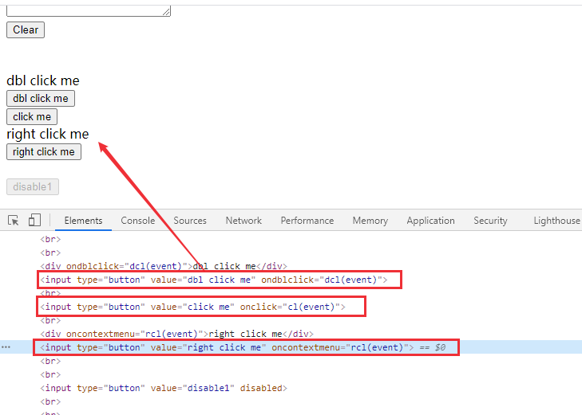
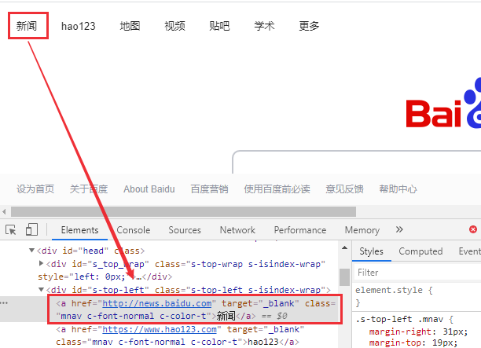
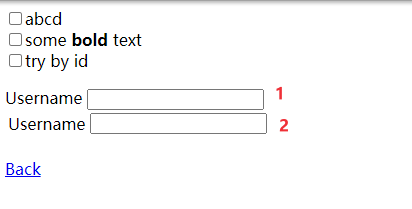
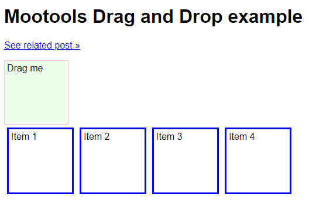

# Selenium ActionChains、TouchAction方法
ActionChains和TouchAction可以用来模拟点击、双击、滑动等事件。ActionChains用于执行PC端的鼠标移动、按键、拖拽等事件；TouchActions用法与ActionChains类似，可以用来模拟PC和移动端的点击、滑动、拖拽等手势操作。

ActionChains和TouchAction都是将动作存储在队列中，然后执行perform()方法，按队列顺序执行动作。

<!--more-->

## ActionChains

有两种执行方式

链式：
```python
ActionChains(driver).move_to_element(element).click(element).perform()
```
分布式：
```python
actions=ActionChains(driver) 
actions.move_to_element(element) 
actions.click(element) 
actions.perform()
```
### 例一：点击，右键，双击操作

测试页面：http://sahitest.com/demo/clicks.htm



python代码：

```python
self.driver.get("http://sahitest.com/demo/clicks.htm") 
click = self.driver.find_element_by_xpath("//*[@value='click me']") 
doubleclick = self.driver.find_element_by_xpath("//*[@value='dbl click me']") 
rightclick = self.driver.find_element_by_xpath("//*[@value='right click me']") 
action= ActionChains(self.driver) 
action.click(element_click) 
action.context_click(element_rightclick) 
action.double_click(element_doubleclick) 
action. perform()
```


### 例二：移动鼠标到某个元素上

将鼠标移动到“新闻”后进行点击



python代码：

```python
self.driver.get("http://www.baidu.com") 
ele = self.driver.find_element_by_link_text("新闻") 
action = ActionChains(self.driver) 
action.move_to_element(ele) 
action.click() 
action.perform()
```
### 例三：通过像素坐标点击页面

使用move_by_offset()方法实现点击页面，像素坐标可以使用截图工具来获取。

python代码：
```python
ActionChains(self.driver).move_by_offset(x, y).click().perform() #左键点击
ActionChains(self.driver).move_by_offset(x, y).context_click().perform() #右键点击
```
### 例四：模拟键盘输入

模拟键盘输入可以使用win32api模块，也可以用 selenium的WebElement对象的send_keys()方法来实现：
```python
element = self.driver.find_element_by_id(element) element.send_keys(**"test"**) element.send_keys(Keys.BACK_SPACE) assert element.get_attribute("value") == "tes"
```
ActionChains类也可以模拟键盘输入：
```python
Action = ActionChains(driver) action.send_keys(Keys.BACK_SPACE) # 回退 
action.key_down(Keys.CONTROL).send_keys('a').key_up(Keys.CONTROL) # CTRL+A 
action.perform() # 执行
```
测试页面：http://sahitest.com/demo/label.htm


在文本框1中输入内容，然后将文本框1的内容复制粘贴到文本框2

```python
self.driver.get("http://sahitest.com/demo/label.htm") 
ele1 = self.driver.find_element_by_xpath("/htmL/body/label[1]/input") 
ele2 = self.driver.find_element_by_xpath("/html/body/label[2]/table/tbody/tr/td[2]/input") 
ele1.click() 
action= ActionChains(self.driver) 
action.send_keys("testing").pause(1) 
action.send_keys(Keys.SPACE).pause(1) # 空格 
action.send_keys("1").pause(1) 
action.send_keys(Keys.BACK_SPACE) #回退 
action.key_down(Keys.CONTROL).send_keys('a').key_up(Keys.CONTROL) #CTRL+A 
action.key_down(Keys.CONTROL).send_keys('c').key_up(Keys.CONTROL) #CTRL+C 
action.key_down(Keys.CONTROL,ele2).send_keys('v').key_up(Keys.CONTROL) #CTRL+V 
action.send_keys(Keys.BACK_SPACE).perform()
```


### 例五：拖拽

测试页面：http://sahitest.com/demo/dragDropMooTools.htm


python代码
```python
self.driver.get("http://sahitest.com/demo/dragDropMooTools.htm") 
drag_ele = self.driver.find_element_by_id("dragger") 
Item1 = self.driver.find_element_by_xpath("/htmL/body/div[2]") 
Item2 = self.driver.find_element_by_xpath("/html/body/div[3]") 
Item3 = self.driver.find_element_by_xpath("/html/body/div[4]") 
action= ActionChains(self.driver) 
action.drag_and_drop(drag_ele, Item1).pause(1) # 方法1 
action.click_and_hold(drag_ele).release(Item2).pause(1)# 方法2 
action.click_and_hold(drag_ele).move_to_element(Item3).release()# 方法3 
action.perform()
```
## TouchAction

ActionChains无法操作H5页面，TouchAction可以对H5页面进行操作，实现点击，滑动，拖拽，模拟手势等各种操作。

### 手势控制方法

- double_tap 双击

- flick 滑动

- flick_element 从某个元素位置开始滑动

- long_press 长按

- move 手势移动指定偏移

- Perform 执行

- release 释放手势

- scroll 点击并滚动

- scroll_from_element 从某个元素位置开始手势点击并滚动(向下滑动为负数,向上滑动为正数)

- flick_element——从某个元素位置开始手势滑动(负数：向上滑动，正数：向下滑动)

- tap 在指定元素上点击

- tap_and_hold 在指定元素上点击但不释放

  

### 例一：点击、滑动

百度搜索关键字，tap方法点击百度一下，滑动到底部，点击下一页

python代码：
```python
self.driver.get("http://www.baidu.com") 
input = self.driver.find_element_by_id("kw") 
search = self.driver.find_element_by_id("su") 
input.send_keys("test") 
action = TouchActions(self.driver) 
action.tap(search) 
action.perform() 
action.scroll_from_element(input, 0, 10000).perform() 
next = self.driver.find_element_by_link_text("下一页 >") 
next.click()
```
## 小结

ActionChains和TouchAction实现了鼠标和键盘的模拟输入，更详细的介绍可以参考官方文档 https://selenium-python.readthedocs.io/api.html。