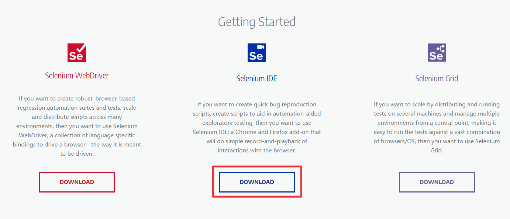
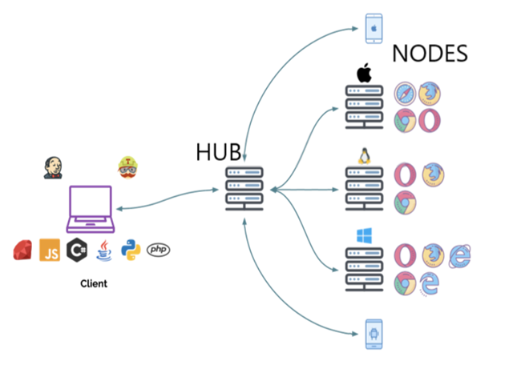
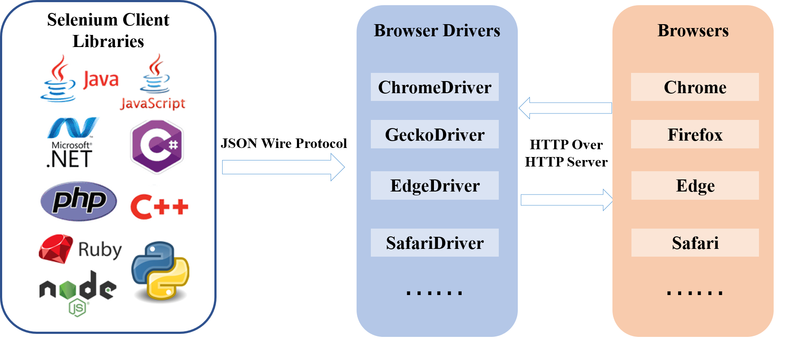

# Selenium Webdriver 架构
<!--more-->
## Selenium简介
[Selenium](https://www.selenium.dev/)是用于浏览器的自动化测试工具，与浏览器进行交互，实现对web应用的自动化测试，Selenium包括Selenium IDE, Selenium Webdriver 和 Selenium Grid三个工具。

Selenium IDE (Integrated Development Environment)是一个浏览器插件，提供脚本录制、脚本生成和回放功能，初次使用selenium的新手可以用它来做一些简单的测试，

Selenium Webdriver 是一个浏览器自动化框架，接受脚本命令并发送到浏览器（通过浏览器驱动来实现），支持多种语言（包括Java, Ruby, Python, PHP, JavaScript, C#等）和多种浏览器，并且支持windows，Linux，macOS等操作系统。

Selenium Grid实现在多个机器上并行运行 selenium，也就是同时在多个机器上执行测试，并且可以是不同的浏览器和操作系统（跨平台）。

下面详细介绍一下Selenium Webdriver 架构。

## Selenium Webdriver 架构
Selenium Webdriver API实现脚本语言与浏览器之间的通信，Selenium Webdriver 架构包括四个基本组件:
* Selenium Language Bindings/Selenium Client Library：Selenium语言绑定/客户端库
* JSON Wire Protocol：JSON有线协议
* Browser Driver：浏览器驱动
* Browser：浏览器

Selenium支持多种语言，包括Ruby、Java、Python、C#、JavaScript、GO、Haskell、JavaScript、Perl、PHP、R和Dart。可参考网站：[https://www.selenium.dev/downloads/#client-drivers](https://www.selenium.dev/downloads/#client-drivers) 。执行测试用例时，selenium 代码将被转换为JSON格式，发送给浏览器驱动。

JSON(JavaScript Object Notation)是一种用于在Web上交换数据的开放标准。JSON有线协议是一种REST API ，基于HTTP协议实现selenium客户端与remote server（浏览器驱动的HTTP服务器）的交互，浏览器驱动（HTTP server）接收到命令（HTTP requests）后，将请求发送到对应的浏览器上执行，并返回HTTP响应。如果是POST请求，将在浏览器上执行相应的操作；如果发送的是GET请求，浏览器将发送HTTP响应，发送到浏览器驱动，然后浏览器驱动使用JSON有线协议将响应发送到客户端。

不同的浏览器对应各自的驱动程序，驱动下载和使用方法可参考官方文档：[https://www.selenium.dev/documentation/en/webdriver/driver_requirements/](https://www.selenium.dev/documentation/en/webdriver/driver_requirements/) ，或者参考文章[Selenium多浏览器测试](https://blog.csdn.net/u010698107/article/details/111415829)。
