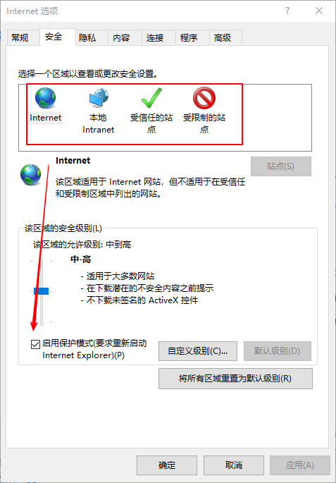

# Selenium 不同浏览器测试
在浏览器的兼容性测试中，会测试产品在不同浏览器上的兼容性，比较主流的浏览器有IE、Firefox、Chrome，Opera，Safari等。还有其它如360、QQ、遨游、百度等浏览器都是基于IE或者chrome内核，或者IE+Chrome双内核开发，在测试这类浏览器时可以调用对应内核驱动。

不同的浏览器需要对应的驱动程序，这样selenium才能与浏览器进行通信。在启动WebDriver之前可以指定驱动的绝对位置，但还是建议将驱动添加到环境变量中，这样代码更易于维护，容易移植。
<!--more-->
下面介绍selenium对几种浏览器的远程控制方法：

## Chrome浏览器

### 1. 下载驱动

首先查看浏览器版本号，根据浏览器的版本号去下载对应的 chromedriver，Chrome浏览器版本与对应的驱动参考：https://sites.google.com/a/chromium.org/chromedriver/downloads

驱动下载地址：https://chromedriver.storage.googleapis.com/index.html

解压并将驱动添加到环境变量中

### 2. python代码实现

```python
from selenium.webdriver import Chrome
browser_locale = 'fr-FR'
options = Options()
options.add_argument("--lang={}".format(browser_locale)) # 设置浏览器语言
self.driver = webdriver.Chrome(chrome_options=options)
self.driver.get('https://www.baidu.com')
```


## Firefox-火狐浏览器

### 1. 下载驱动

浏览器版本、驱动geckodriver版本、Selenium版本对应关系参考：[https://firefox-source-docs.mozilla.org/testing/geckodriver/Support.html](https://firefox-source-docs.mozilla.org/testing/geckodriver/Support.html)

浏览器下载地址：[http://ftp.mozilla.org/pub/firefox/releases/](http://ftp.mozilla.org/pub/firefox/releases/)
驱动下载地址：[https://github.com/mozilla/geckodriver/releases](https://github.com/mozilla/geckodriver/releases)
### 2. python代码

```python
from selenium.webdriver import Firefox
self.driver = webdriver.Firefox()
self.driver.get('https://www.baidu.com')
```


## IE浏览器

### 1. 下载驱动

下载IEDriverServer.exe  ：http://selenium-release.storage.googleapis.com/index.html

IE浏览器下载：[https://support.microsoft.com/zh-cn/topic/%E4%B8%8B%E8%BD%BD-internet-explorer-11-%E8%84%B1%E6%9C%BA%E5%AE%89%E8%A3%85%E7%A8%8B%E5%BA%8F-99d492a1-3a62-077b-c476-cf028aff9a7f](https://support.microsoft.com/zh-cn/topic/下载-internet-explorer-11-脱机安装程序-99d492a1-3a62-077b-c476-cf028aff9a7f)

注意：设置internet选项>安全 这4个选项全勾选或者不勾选，不然无法驱动IE浏览器。


### 2. python代码
```python
from selenium.webdriver import Ie 
self.driver = webdriver.Ie() 
self.driver.get('https://www.baidu.com')
```
## Edge浏览器

### 1. 下载驱动

Edge浏览器版本与edgedriver驱动版本对应关系参考：https://developer.microsoft.com/en-us/microsoft-edge/tools/webdriver/

edgedriver驱动下载地址：https://msedgewebdriverstorage.z22.web.core.windows.net/

### 2. python代码

```python
from selenium.webdriver import Edge 
self.driver = Edge()
self.driver.get('https://www.baidu.com')
```

## Opera浏览器-欧朋浏览器

### 1. 下载驱动

Opera浏览器版本与OperaDriver驱动版本对应关系参考：https://github.com/operasoftware/operachromiumdriver/releases

Opera浏览器历史版本下载地址：https://get.geo.opera.com/pub/opera/desktop/

### 2. python代码

```python
from selenium.webdriver import Opera 
self.driver = Opera()
self.driver.get('https://www.baidu.com')
```

## 其它浏览器

### 360极速浏览器

360极速浏览器采用chrome内核，可以使用对应版本的chromedriver

```python
option=webdriver.ChromeOptions()
option.binary_location=r'D:/software/360Chrome/Chrome/Application/360chrome.exe'
self.driver=webdriver.Chrome(options=option)
self.driver.get('https://www.baidu.com')
```

binary_location为360极速浏览器安装路径下的可执行文件360chrome.exe的路径

### 2345浏览器

2345浏览器是基于IE+Chrome双内核开发，可以使用chromedriver来驱动它：

```python
option=webdriver.ChromeOptions()
option.binary_location=r'C:/Program Files (x86)/2345Soft/2345Explorer/2345Explorer.exe'
self.driver=webdriver.Chrome(options=option)
self.driver.get('https://www.baidu.com')
```

其它基于chrome内核的浏览器也可以使用这种方法来驱动，基于IE内核开发的浏览器还没办法控制，如果各位看官有好的方法，欢迎后台留言！