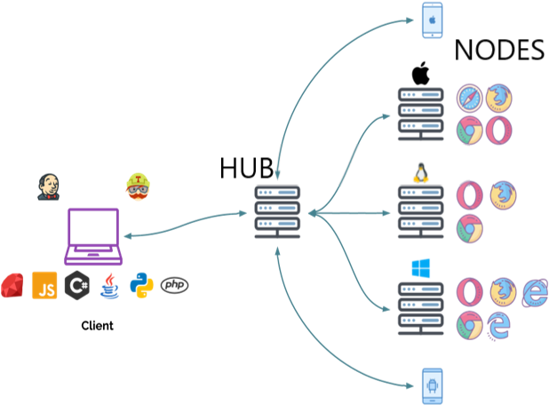
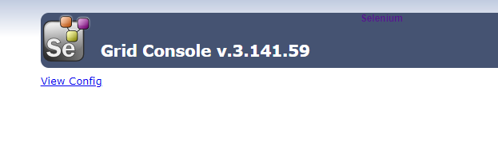
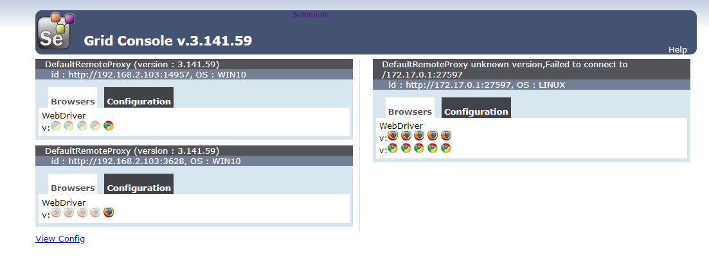

# Selenium Grid：在多个主机上并行执行自动化脚本
Selenium Grid是selenium提供的一个分布式测试工具，将自动化脚本发布到多个物理机或者虚拟机（跨平台、跨浏览器）上执行，通过一个中心节点来控制多个设备，也就是在中心节点（hub）上运行测试，在其它节点（node）上执行，实现selenium的并行执行。除了可以在多个设备上运行测试脚本以外，也可以实现多浏览器兼容性测试。它本身不提供多线程并发执行，需要结合多进程技术实现并行执行用例。
<!--more-->


## Selenium Grid架构
Selenium Grid由hub节点和若干个node代理节点组成

<center><font size="2">https://www.selenium.dev/docs/site/en/grid/components_of_a_grid/</font></center>

hub作为管理节点，用来管理各个代理节点的注册和状态信息，并且接收远程客户端代码请求调用，然后把请求的命令再转发给代理代点来执行。每个Selenium Grid仅包含一个hub，hub连接多个节点（node），node就是浏览器所在的位置，注册到hub，接收hub的请求并执行测试。

## Selenium Grid使用
注意hub主机和远程主机需要安装java环境和selenium框架。
### 1. 下载
下载Selenium Server，下载地址：[https://www.selenium.dev/downloads/](https://www.selenium.dev/downloads/)


### 2. 启动hub
windows打开命令终端，输入如下命令：
```sh
$ java -jar selenium-server-standalone-3.141.59.jar -role hub
21:07:10.738 INFO [GridLauncherV3.parse] - Selenium server version: 3.141.59, revision: e82be7d358
21:07:10.844 INFO [GridLauncherV3.lambda$buildLaunchers$5] - Launching Selenium Grid hub on port 4444
2021-04-06 21:07:11.265:INFO::main: Logging initialized @987ms to org.seleniumhq.jetty9.util.log.StdErrLog
21:07:12.104 INFO [Hub.start] - Selenium Grid hub is up and running
21:07:12.108 INFO [Hub.start] - Nodes should register to http://192.168.2.103:4444/grid/register/
21:07:12.108 INFO [Hub.start] - Clients should connect to http://192.168.2.103:4444/wd/hub
```
默认情况下，启动4444端口，可以使用`-port`设置启动端口。

也可以浏览器打开[http://localhost:4444/grid/console](http://localhost:4444/grid/console)， 查看hub是否启动成功:

根据打印的日志可以看到主机的IP地址为192.168.2.103，node需要注册到地址http://192.168.2.103:4444/grid/register/

### 3. 启动node
先编写配置文件chrome_node.json，参考[https://github.com/SeleniumHQ/selenium/blob/selenium-3.141.59/java/server/src/org/openqa/grid/common/defaults/DefaultNodeWebDriver.json](https://github.com/SeleniumHQ/selenium/blob/selenium-3.141.59/java/server/src/org/openqa/grid/common/defaults/DefaultNodeWebDriver.json)
```json
{
  "capabilities":
  [
    {
      "browserName": "chrome",
      "maxInstances": 5,
      "seleniumProtocol": "WebDriver"
    }

  ],
  "proxy": "org.openqa.grid.selenium.proxy.DefaultRemoteProxy",
  "maxSession": 5,
  "port": -1,
  "register": true,
  "registerCycle": 5000,
  "hub": "http://localhost:4444",
  "nodeStatusCheckTimeout": 5000,
  "nodePolling": 5000,
  "role": "node",
  "unregisterIfStillDownAfter": 60000,
  "downPollingLimit": 2,
  "debug": false,
  "servlets" : [],
  "withoutServlets": [],
  "custom": {}
}
```
配置文件firefox_node.json
```json
{
  "capabilities":
  [
    {
      "browserName": "firefox",
      "maxInstances": 5,
      "seleniumProtocol": "WebDriver"
    }

  ],
  "proxy": "org.openqa.grid.selenium.proxy.DefaultRemoteProxy",
  "maxSession": 5,
  "port": -1,
  "register": true,
  "registerCycle": 5000,
  "hub": "http://localhost:4444",
  "nodeStatusCheckTimeout": 5000,
  "nodePolling": 5000,
  "role": "node",
  "unregisterIfStillDownAfter": 60000,
  "downPollingLimit": 2,
  "debug": false,
  "servlets" : [],
  "withoutServlets": [],
  "custom": {}
}
```

在本机启动一个node，将节点注册到http://192.168.2.103:4444/grid/register ，新打开一个命令终端，启动chrome节点，输入如下命令：
```sh
$ java -Dwebdriver.chrome.driver=D:\\testing_tools\\chromedriver89\\chromedriver.exe -jar selenium-server-standalone-3.141.59.jar -role node -nodeConfig chrome_node.json
```

启动一个firefox节点：
```sh
$ java -Dwebdriver.gecko.driver=D:\\testing_tools\\firefoxdriver\\geckodriver.exe -jar selenium-server-standalone-3.141.59.jar -role node -nodeConfig firefox_node.json
```

也可以其它设备上（比如虚拟机，注意hub主机与远程node主机之间可以相互ping通）上启动一个node：
```sh
$ java -jar selenium-server-standalone-3.141.59.jar -role node -hub http://192.168.2.103:4444/grid/register
```
刷新浏览器：[http://localhost:4444/grid/console](http://localhost:4444/grid/console)

发现三个节点注册成功！

### 4. 示例脚本
#### 串行执行
```python
from selenium.webdriver import Remote
from selenium.webdriver import DesiredCapabilities

@pytest.mark.parametrize("node", ["firefox","chrome"])
def test_grid(self,node):
    if node == "firefox":
        capability = DesiredCapabilities.FIREFOX.copy()
    elif node == "chrome":
        capability = DesiredCapabilities.CHROME.copy()

    self.driver = Remote(command_executor="http://localhost:4444/wd/hub",
                    desired_capabilities=capability)
    self.driver.get("https://www.baidu.com/")
```
pytest执行：
```python
pytest test_grid.py::TestGrid::test_grid
```

#### 并行执行
采用多线程分布并行执行，以下示例脚本执行环境为在hub节点主机（windows）上启动了firefox和chrome两个节点。
```python
#!/usr/bin/python3
#-*-coding:utf-8-*-

import threading
import time

import pytest
from selenium import webdriver
from selenium.webdriver import DesiredCapabilities
from selenium.webdriver import Remote
from selenium.webdriver.common.by import By

class TestGrid:
    def node_drivers(self,node):
        if node == "firefox":
            capability = DesiredCapabilities.FIREFOX.copy()
            driver_firefox = Remote(command_executor="http://localhost:4444/wd/hub", desired_capabilities=capability)
            self.test_baidu(driver_firefox)
        elif node == "chrome":
            capability = DesiredCapabilities.CHROME.copy()
            driver_chrome = Remote(command_executor="http://localhost:4444/wd/hub",
                                         desired_capabilities=capability)
            self.test_qq(driver_chrome)

    def test_baidu(self,driver):

        driver.get("https://www.baidu.com/")
        ele = driver.find_element(By.ID, 'kw')
        ele.send_keys("test")
        time.sleep(2)
        driver.find_element(By.ID, 'su').click()
        time.sleep(2)

    def test_qq(self,driver):

        driver.get("https://www.qq.com/")
        ele = driver.find_element(By.ID, 'sougouTxt')
        ele.send_keys("qq")
        time.sleep(2)
        driver.find_element(By.ID, 'searchBtn').click()
        time.sleep(2)


    def test_parallel(self):
        node_list = ["firefox","chrome"]
        thread_list = []
        for browser in node_list:
            t = threading.Thread(target=self.node_drivers, args=(browser,))
            thread_list.append(t)

        for t in thread_list:
            t.start()

        for t in thread_list:
            t.join()
```
pytest执行：
```python
pytest test_grid.py::TestGrid::test_parallel
```
对于hub主机上的不同浏览器，command_executor可以直接设置hub的地址，grid会根据浏览器名称来找到节点。

另外，也可以在同一个主机上启动多个相同浏览器的节点，下面在hub节点主机（windows）上启动两个节点，都使用chrome浏览器。
```python
#!/usr/bin/python3
#-*-coding:utf-8-*-

import threading
import time

import pytest
from selenium import webdriver
from selenium.webdriver import DesiredCapabilities
from selenium.webdriver import Remote
from selenium.webdriver.common.by import By

class TestGrid:
    def setup(self):
        self.nodes = {"node1":"http://192.168.2.103:9984/wd/hub","node2":"http://192.168.2.103:1537/wd/hub"}

    def node_drivers(self,node):

        capability = DesiredCapabilities.CHROME.copy()
        if node == "node1":
            driver_node1 = Remote(command_executor=self.nodes[node], desired_capabilities=capability)
            self.test_baidu(driver_node1)
        elif node == "node2":
            driver_node2 = Remote(command_executor=self.nodes[node],
                                         desired_capabilities=capability)
            self.test_qq(driver_node2)

    def test_parallel(self):
        node_list = ["node1","node2"]
        thread_list = []
        for browser in node_list:
            t = threading.Thread(target=self.node_drivers, args=(browser,))
            thread_list.append(t)

        for t in thread_list:
            t.start()

        for t in thread_list:
            t.join()

```

pytest执行：
```python
pytest test_grid.py::TestGrid::test_parallel
```

由于节点都在同一台主机上，节点IP地址相同，启用的端口号不同。端口号可以在启动节点的时候使用`-port`参数指定，或者在节点的json配置文件中指定，如果不指定端口，需要在节点的json配置文件中设置` "port": -1`，这样会随机指定端口，然后你可以在拉起节点的日志中查看端口号，或者在管理页面[http://localhost:4444/grid/console](http://localhost:4444/grid/console) 中查看。

## 参考资料

1. [https://www.selenium.dev/docs/site/en/grid/](https://www.selenium.dev/docs/site/en/grid/)
2. [https://github.com/SeleniumHQ/selenium](https://github.com/SeleniumHQ/selenium)
3. [https://github.com/SeleniumHQ/selenium/wiki/Grid2](https://github.com/SeleniumHQ/selenium/wiki/Grid2)


