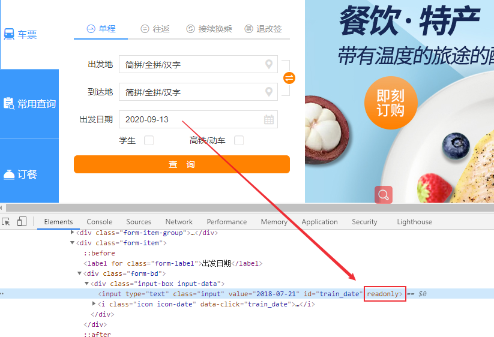

# selenium 执行JavaScript脚本
JavaScript是运行在客户端（浏览器）和服务器端的脚本语言，允许将静态网页转换为交互式网页。可以通过 Python Selenium WebDriver 执行 JavaScript 语句，在Web页面中进行js交互。那么js能做的事，Selenium应该大部分也能做。WebDriver是模拟终端用户的交互，所以就不能点击不可见的元素，有时可见元素也不能点击。在这些情况下，我们就可以通过WebDriver 执行JavaScript来点击或者执行页面元素。本文将介绍如何使用**WebDriver执行**JavaScript语句。
<!--more-->
## Web元素定位及操作

使用execute_script() 执行 JavaScript 代码，有两种方法实现元素操作

### 方法1：文档级别操作

直接使用JavaScript实现元素定位和动作执行，主要方法有：

```python
document.getElementById
document.getElementsByClassName
document.getElementsByName
document.getElementsByTagName
document.getElementsByTagNameNS
```

测试示例：

1. 打开百度一下
2. 输入框输入”test“
3. 点击百度一下

python代码：

```python
def test_baidu(self):
    self.driver.get("http://www.baidu.com")
    self.driver.execute_script('document.getElementById("kw").value = "test"')
    time.sleep(2)
    self.driver.execute_script('document.getElementById("su").click()')
    time.sleep(2)
```

在执行过程中，WebDriver 将 JavaScript 语句注入到浏览器中，然后脚本将执行。这个注入 JavaScript 有自己的名称空间，不会干扰实际网页中的 JavaScript运行。

### 方法2：元素级别操作

可以先使用WebDriver获取想要操作的元素，然后使用JavaScript执行操作。

```python
input_ele = driver.find_element_by_id("su") 
driver.execute_script("arguments[0].click();", input_ele)
```

python代码：

```python
def test_baidu2(self):
    self.driver.get("http://www.baidu.com")
    input_ele = self.driver.find_element_by_id("kw")
    self.driver.execute_script("arguments[0].value = 'test';", input_ele)
    time.sleep(2)
    baidu_ele = self.driver.find_element_by_id("su")
    self.driver.execute_script("arguments[0].click();", baidu_ele)
    time.sleep(2)
```

可以在语句中使用多个 JavaScript动作：

```python
username = driver.find_element_by_xpath("//*[@id='username']")
password = driver.find_element_by_xpath("//*[@id='password']")
driver.execute_script("arguments[0].value = 'admin';arguments[1].value = 'admin';", username, password)
```

## 获取返回值

可以返回JavaScript的执行结果：

```python
driver.execute_script("return document.getElementById('kw').value")
driver.execute_script("return document.title;")  # 返回网页标题
```

## 滑动

在[Selenium ActionChains、TouchAction方法](https://blog.csdn.net/u010698107/article/details/111414932)中介绍了TouchAction类中scroll_from_element()也可以滑动页面。

### 滑动到浏览器底部

```python
document.documentElement.scrollTop=10000
window.scrollTo(0, document.body.scrollHeight)
```

### 滑动到浏览器顶部

```python
document.documentElement.scrollTop=0
window.scrollTo(document.body.scrollHeight,0)
```

## 更改元素属性

大部分时间控件都是 readonly属性，需要手动去选择对应的时间。自动化测试中，可以使用JavaScript代码取消readonly属性。

测试页面：https://www.12306.cn/index/


测试步骤：

1. 打开测试页面
2. 修改出发日期
3. 断言日期是否修改成功

python测试代码：

```python
def test_datettime(self):
    self.driver.get("https://www.12306.cn/index/")
    # 取消readonly属性
    self.driver.execute_script("dat=document.getElementById('train_date'); dat.removeAttribute('readonly')")   
    self.driver.execute_script("document.getElementById('train_date').value='2020-10-01'")
    time.sleep(3)
    now_time = self.driver.execute_script("return document.getElementById('train_date').value")
    assert '2020-10-01' == now_time
```

## 小结

 Selenium WebDriver 执行 JavaScript代码是一个非常强大的功能，可以实现WebElement 接口所有功能，甚至更多的功能。比如在web性能测试中可以调用Web API接口window.performance来测试Web性能。