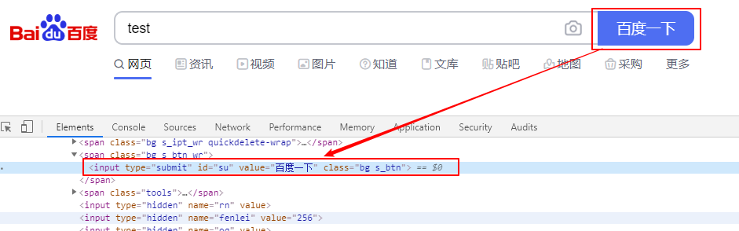
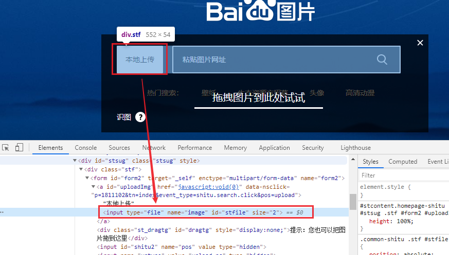
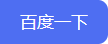

# selenium 元素操作

我们定位到Web页面元素之后，可以对元素进行一系列的操作，实现跟页面的交互。包括点击、文本输入、元素属性获取等。常用的方法列举如下：

| 方法                       | 描述                                                         |
| -------------------------- | ------------------------------------------------------------ |
| **click**()                | 点击元素                                                     |
| **send_keys**(**value*)    | 用于向EditText(可编辑文本控件)输入文本；还可以用于输入文件（如百度图片搜索输入图片） |
| **get_attribute**(*name*)  | 获取元素属性                                                 |
| **is_selected**()          | 元素是否被选择，一般用于判断checkbox 或者 radio 控件状态     |
| **screenshot**(*filename*) | 截取元素                                                     |

<!--more-->

## 点击、输入文本

1. 打开 [**https://www.baidu.com/**](https://www.baidu.com/)
2. **搜索框输入“test”**
3. 点击“百度一下”
4. 关闭网页



python代码：

```python
self.driver.find_element_by_id("kw").send_keys("test")
self.driver.find_element_by_id("su").click()
```

## 文件上传

input标签可以直接使用`send_keys(文件地址)`上传文件

打开百度图片搜索，输入图片地址



python代码：

```python
self.driver.get("https://image.baidu.com/")
self.driver.find_element_by_xpath("//*[@id='sttb']/img[1]").click()
self.driver.find_element_by_id("stfile").send_keys(u"D:/TestingDemo/img/图片.png")
```

## get_attribute()

获取元素属性

比如获取“**百度一下**”这个button的属性：type、id、value、class

python代码：

```python
baidu = self.driver.find_element_by_id("su")
baidu.get_attribute("type")
baidu.get_attribute("id")
baidu.get_attribute("value")
baidu.get_attribute("class")
```

## is_selected()

在勾选单选框（radio）和复选框（checkbox）的时候，如果已经被选中，再次点击就会反选了，所以在点击之前需要判断一下是否已经选中。可以使用is_selected()方法来判断是否被选中

python代码：

```python
def checkbox_switch(self,switch="ON"):
    self.driver = webdriver.Chrome()
    sw = self.driver.find_element_by_id('id_of_checkbox').is_selected()
    flag = False
    if switch == "ON":
        flag = True
        if sw^flag:
            self.driver.find_element_by_id('id_of_checkbox').click()
            self.driver.quit()
```

## screenshot()

截取元素

python代码：

```python
self.driver = webdriver.Chrome()
self.driver.get("https://www.baidu.com")
element = self.driver.find_element_by_id("su")  # 百度一下的按钮
element.screenshot('D:\\baidu.png')
```

结果图baidu.png


当然也可以保存整个页面窗口截图

- **get_screenshot_as_base64**()
- **get_screenshot_as_file**(*filename*)
- **get_screenshot_as_png**()
- **save_screenshot**(*filename*)

```python
self.driver.save_screenshot('baidu.png')
```

## 其他常用方法

```python
#关闭selenium打开的所有窗口
driver.quit()
# 仅关闭当前窗口
driver.close()
# 前进
driver.forward()
# 后退
driver.back()
# 刷新
driver.refresh()
# 头名字
driver.title
# 获取cookie
driver.get_cookies()
# 返回当前页面url
driver.current_url
```
控件操作
```python
# 清空输入框数据
element.clear()  
# 获取文本的值
element.text
# 表单提交
element.submit()
```


