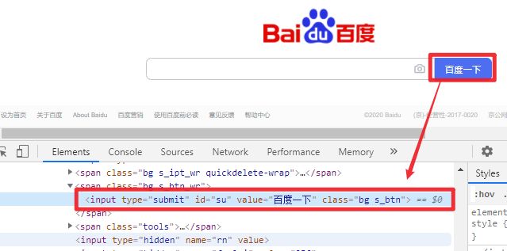

# xpath & CSS Selector定位
## Xpath 和 CSS Selector简介
### CSS Selector

CSS Selector和Xpath都可以用来表示XML文档中的位置。CSS (Cascading Style Sheets)是一种样式表语言，是所有浏览器内置的，用于描述以HTML或XML编写的文档的外观和样式。CSS Selector用于选择样式化的元素，所以理论上前端人员可以定位 DOM 节点并设置样式，那么对于测试人员这些元素也可以定位到。
<!--more-->
### XPath

XPath是XML路径语言，是一种查询语言，使用路径表达式浏览XML文档中的元素和属性。XPath标准语法如下：

**Xpath=//tagname[@attribute='value']**

- \// : 选择当前节点
- Tagname: 节点标签名
- @: 选择属性
- Attribute: 节点属性名
- Value: 属性值

XPath有绝对定位和相对定位两种，绝对定位使用绝对路径，缺点是路径太长，只要一个节点变动就无法定位。以单斜杠（/）开始，表示从根节点开始选择元素。下面是页面https://www.baidu.com/上“百度一下”按钮的绝对路径：

```
/html/body/div[1]/div[1]/div[5]/div[1]/div/form/span[2]/input
```



相对路径以双斜杠（//)开始，可以从HTML文档的任何位置开始，“百度一下”按钮的相对路径可以表示如下

```
//input[@id="su"]
```


### Xpath VS. CSS Selector

CSS Selector和Xpath几乎可以定位到所有Web元素（HTML和XML文档元素，Android应用的层级结构使用xml编写），它们的主要差异包括：

1. XPath通过遍历的方式从XML文档中选择节点，CSS Selector是一种匹配模式定位，因此CSS Selector比 XPath 执行效率更高。
2. Xpath可以通过文本来定位，而CSS Selector不能；
3. Xpath可以通过子节点来定位父节点，CSS Selector是前向的，不能利用子节点定位父节点。
4. CSS Selector语法相比Xpath更加简洁

## Xpath 和 CSS Selector元素定位

接下来对比一下这两种方法的语法差异，节点的定义我们规定如下：


### 儿子元素定位

xpath使用‘/’，CSS Selector使用‘>’

|      | Xpath                                    | CSS Selector        |
| ---- | ---------------------------------------- | ------------------- |
| 语法 | //element/element                      | element>element |
| 示例 | //div/a                                  | div > a             |
| 描述 | 选择父元素为 \<div> 元素的所有 \<a> 元素。 |                     |

还可以使用XPath Axes（轴）**child** 来定位子元素

XPATH:

```python
//div/child::*   # 选择父元素为 <div> 元素的所有儿子元素
//div/child::a  # 选择父元素为 <div> 元素的所有<a>元素
```

CSS Selector:

```python
div > a:nth-child(2) # 选择父元素为 <div> 元素的第二个<a>元素
div > a:nth-last-child(2) # 选择父元素为 <div> 元素的倒数第二个<a>元素
div > a:last-child # 选择父元素为 <div> 元素的最后一个<a>元素
div > a:first-child # 选择父元素为 <div> 元素的第一个<a>元素
```


### 子孙元素定位

xpath使用‘//’，CSS Selector使用空格

|          | **Xpath**                            | **CSS Selector**  |
| -------- | ------------------------------------ | ----------------- |
| **语法** | //element//element                 | element element |
| **示例** | //div//a                             | div a             |
| **描述** | 选择 \<div> 元素内部的所有 \<a> 元素。 |                   |

还可以使用XPath Axes（轴）**descendant** 来定位子孙元素

XPATH:

```python
//div/descendant::*   # 选择祖先元素为 <div> 元素的所有子孙元素
//div/descendant::a  # 选择祖先元素为 <div> 元素的所有<a>元素     
```

CSS Selector使用空格定位子孙元素后进行选择:

```python
div a:nth-child(2) # 选择祖先元素为 <div> 元素的第二个<a>元素
div a:nth-last-child(2) # 选择祖先元素为 <div> 元素的倒数第二个<a>元素
div a:last-child # 选择祖先元素为 <div> 元素的最后一个<a>元素
div a:first-child # 选择祖先元素为 <div> 元素的第一个<a>元素
```


### 邻居节点定位

在同一个父节点下，定位下一个相邻节点

|          | **Xpath**                                  | **CSS Selector**    |
| -------- | ------------------------------------------ | ------------------- |
| **语法** | //element/following-sibling::element     | element + element |
| **示例** | //div/following-sibling::a                 | div + a             |
| **描述** | 选择紧接在 \<div> 元素之后的所有 \<p> 元素。 |                     |

Xpath可以定位当前节点前面的邻居节点，CSS Selector不能

```python
//*element/preceding-sibling::element
```

### 父元素、祖先元素定位

CSS Selector是前向的，不能利用子节点定位父节点

| 方法     | 描述                                                         |
| -------- | ------------------------------------------------------------ |
| ..       | 一个点”.“表示选取当前节点，两个点”..“表示选取当前节点的父节点。 |
| ancestor | 当前节点祖先元素（父、祖父...）                              |
| parent   | 当前节点的父节点                                             |

### Id定位

|          | **Xpath**                   | **CSS Selector** |
| -------- | --------------------------- | ---------------- |
| **语法** | //\*[@id='example']        | #example       |
| **示例** | //\*[@id='uesrname']       | #uesrname      |
| **描述** | 选择id='uesrname'的元素。 |                  |

### Class定位

|          | **Xpath**                      | **CSS Selector** |
| -------- | ------------------------------ | ---------------- |
| **语法** | //\*[@class='example']        | .example       |
| **示例** | //\*[@class='uesrname']       | .uesrname      |
| **描述** | 选择class='uesrname'的元素。 |                  |

### 属性值定位

没有Id和Class的情况下，可以使用其它属性值定位，比如name、type等。

|          | **Xpath**                           | **CSS Selector**  |
| -------- | ----------------------------------- | ----------------- |
| **语法** | //\*[@attribute='value']           | [attribute=value] |
| **示例** | //\*[@name='uesrname']            | [name='username'] |
| **描述** | 选择属性值*name='uesrname'的*元素。 |                   |

xpath可以使用 ‘and’ 或者 ‘or’ 连接两个属性：

XPATH：

```python
//input[@name='login'and @type='submit']
```

CSS Selector：

```python
input[name='login'][type='submit']
```

CSS Selector可以进行子字符串匹配进行定位:

^= 匹配前缀

```python
[id^='id_prefix_'] # id前缀为‘id_prefix_’的元素
```

$= 匹配后缀

```python
[id$='_id_sufix'] # id后缀为‘_id_sufix’的元素
```

*= 包含某个字符串

```python
[id*='id_pattern'] # id包含‘id_pattern’的元素
```

### Xpath Contains()方法

Contains()方法允许通过部分文本来定位查找元素，CSS Selector不支持这种用法。

```python
Xpath = //*[contains(@type,'partial_text')]
Xpath = //*[contains(@name,'partial_text')]
Xpath = //*[contains(@class,'partial_text')]
Xpath = //*[contains(@id,'partial_text')]
Xpath = //*[contains(text(),'partial_text')]
Xpath = //*[contains(@href,'partial_text')]
```


### Xpath Starts-with()方法

查找属性值以特定文本开始的元素

```python
Xpath = //*[starts-with(@type,'start_text')]
Xpath = //*[starts-with(@name,'start_text')]
Xpath = //*[starts-with(@class,'start_text')]
Xpath = //*[starts-with(@id,'start_text')]
Xpath = //*[starts-with(text(),'start_text')]
Xpath = //*[starts-with(@href,'start_text')]
```

### Xpath Text()方法

Text()方法基于web元素文本来进行定位

```python
Xpath = //*[text()='text_value']   
```

## 实例

### 定位第n个元素
如果某个XPath表达式可以定位到多个元素标签，可以通过`(xpath表达式)[index]` 定位第`index`个元素，index索引从`1`开始。


## 点击百度页面 hao123 
```python
self.driver.get("https://www.baidu.com/")
self.driver.find_element_by_xpath('(//*[@id="s-top-left"]/a)[2]').click()
```

## 子孙元素定位

百度一下”text“，点击**”资讯“**


Xpath：

```python
//*[@id="s_tab"]/descendant::a[1]
//*[@id="s_tab"]/child::*[1]/a[1]
```

CSS selector：

```python
#s_tab a:nth-child(2)
#s_tab a:nth-last-child(9)
```

python测试代码：

```python
def test_css(self):
    self.driver.get("https://www.baidu.com/")
    self.driver.find_element_by_id("kw").send_keys("test")        
    self.driver.find_element_by_id("su").click()        
    # element = self.driver.find_element_by_css_selector("#s_tab a:nth-child(2)")
    # element = self.driver.find_element_by_css_selector('#s_tab a:nth-last-child(9)')
    element = self.driver.find_element_by_xpath('//*[@id="s_tab"]/descendant::a[1]')        
    element.click()
    sleep(2)
```

### 邻居节点定位

点击**”资讯“**下一个邻居节点**”视频“**

xpath

```python
//*[@id="s_tab"]/descendant::a[1]/following-sibling::a[1]
//*[@id="s_tab"]/child::*[1]/a[1]/following-sibling::a[1]
```

CSS selector：

```python
#s_tab a:nth-child(2) + a
#s_tab a:nth-last-child(9) + a
```

python测试代码：
```python
def test_css2(self):   
    self.driver.get("https://www.baidu.com/")
    self.driver.find_element_by_id("kw").send_keys("test")
    self.driver.find_element_by_id("su").click()   
    # element = self.driver.find_element_by_css_selector('#s_tab a:nth-child(2) + a')   
    element = self.driver.find_element_by_xpath('//*@id="s_tab"]/descendant::a[1]/following-sibling::a[1]')   
    element.click()   
    sleep(2)
```


### Xpath Contains()、Starts-with()、Text()定位

测试页面：http://sahitest.com/demo/linkTest.htm

点击”[linkByContent](http://sahitest.com/demo/linkByContent.htm)“


xpath语法：

```python
//*[contains(@href,"Content")]
//*[starts-with(@href,"linkByC")]
//*[contains(text(),"Content")]
//*[text()="linkByContent"]
```

python测试代码：

```python
def test_css2(self):
    self.driver.get("http://sahitest.com/demo/linkTest.htm")
    # element = self.driver.find_element_by_xpath('//*[contains(@href,"Content")]')
    # element = self.driver.find_element_by_xpath('//*[starts-with(@href,"linkByC")]')
    # element = self.driver.find_element_by_xpath('//*[contains(text(),"Content")]')
    element = self.driver.find_element_by_xpath('//*[text()="linkByContent"]')
    element.click()
```


## 小结

Xpath几乎可以定位到所有Web元素，CSS Selector效率更高，且代码简洁，但有些元素可能无法定位，特别是需要通过子元素来定位的父元素，或者需要通过文本定位的元素。

在实际使用中，按照自己的实际情况来选择即可，CSS Selector理论上执行效率更高，但他们的性能差异不是很大，在几毫秒或者几十毫秒级别。这两种定位方法除了本文介绍的以外，还有更多其它高级语法，可以参考官方文档。