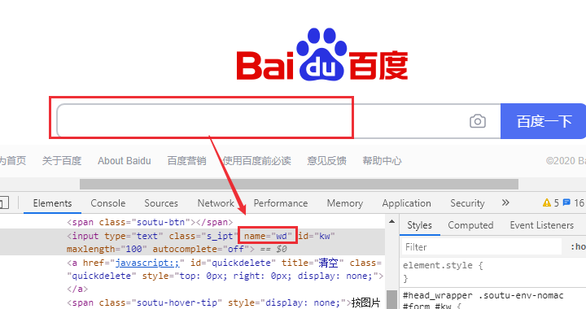
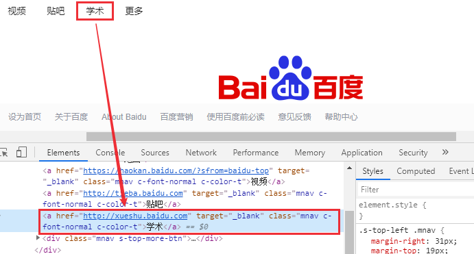
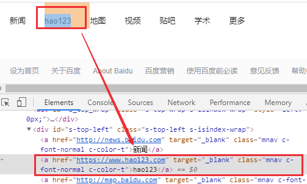
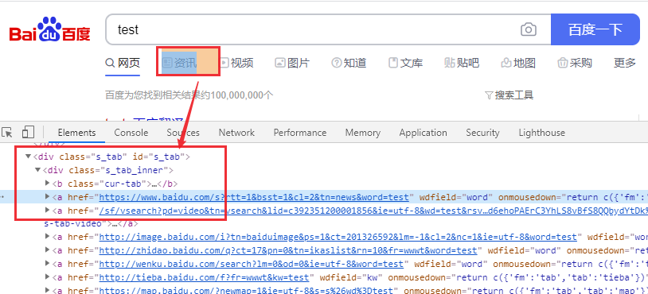
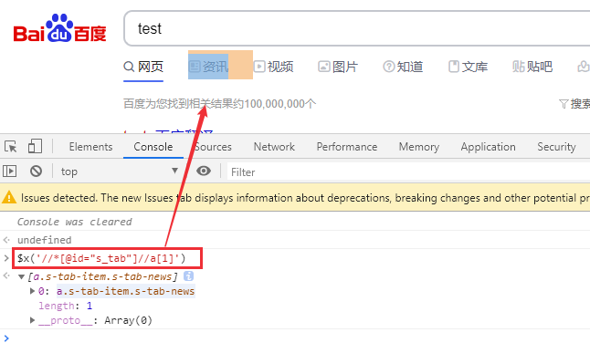
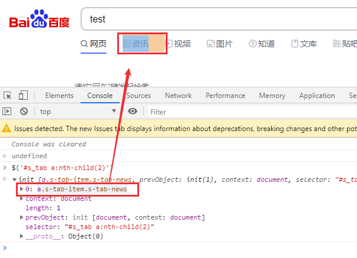

# Web元素定位方法

Selenium是用于Web应用测试的自动化测试框架，可以实现跨浏览器和跨平台的Web自动化测试。Selenium通过使用WebDriver API来控制web浏览器，每个浏览器都都有一个特定的WebDriver 驱动，处理与Selenium和浏览器之间的通信。

<!--more-->

实现Web页面自动化控制的先决条件是定位到正确的Web页面元素，WebDriver提供了8种不同的Web元素定位方法：

| Locator           | Description                                              |
| :---------------- | :------------------------------------------------------- |
| id                | ID属性，最常用的定位方法，每个元素的id应该是唯一的       |
| css selector      | CSS 选择器                                               |
| xpath             | xpath表达式定位元素                                      |
| name              | NAME属性，与id定位类似                                   |
| link text         | 仅用于超链接文本                                         |
| partial link text | 使用方法和link text相同，partial link 只截取部分文字即可 |
| tag name          | 通过HTML标签名定位                                       |
| class name        | 使用类名定位，不能使用复合类名                           |

## ID定位


python代码：
```python
element = self.driver.find_element_by_id("kw") element = self.driver.find_element(By.ID,"kw").send_keys("test")
```

## NAME定位



python代码：
```python
element = self.driver.find_element_by_name("wd")
```
## Link Text定位



python代码：
```python
element = self.driver.find_element_by_link_text("学术")
```
## Partial Link Text定位

使用部分文本来定位

直接使用“123”来定位：



python代码：
```python
element = self.driver.find_element_by_partial_link_text(**"123"**)
```
## Xpath定位

XPath 使用路径表达式来选取 XML 文档中的节点或节点集。具体语法参考：https://www.w3school.com.cn/xpath/xpath_syntax.asp

比如我们定位**“资讯”：**



可以在console中输入JS代码：`$x('//*[@id="s_tab"]//a[1]')`

这样就可以找到资讯对应的元素：


python代码：
```python
element = self.driver.find_element_by_xpath('//*[@id="s_tab"]//a[1]')
```
## CSS Selector定位

CSS选择器是一种字符串模式，基于HTML标签，id，类和属性的组合来标识元素。

具体语法参见：https://www.runoob.com/cssref/css-selectors.html

我们依然定位**“资讯”：**

在console中输入：`$('#s_tab a:nth-child(2)')`



python代码：
```python
element = self.driver.find_element_by_css_selector("#s_tab a:nth-child(2)")
```
## 完整测试代码

```python
#!/usr/bin/python3
# -*-coding:utf-8-*-

from time import sleep
import pytest
from selenium import webdriver
from selenium.webdriver.common.by import By

class TestLocator():
    def setup(self):
        self.driver = webdriver.Chrome()
        self.driver.implicitly_wait(5)
        # self.driver.maximize_window()

    def teardown(self):
        self.driver.quit()

    def test_id(self):
        self.driver.get("https://www.baidu.com/")
        element = self.driver.find_element_by_id("kw")
        element.send_keys("test")
        # self.driver.find_element(By.ID,"kw").send_keys("test")
        assert element.get_attribute("value") == "test"

    def test_name(self):
        element = self.driver.find_element_by_name("wd")
        element.send_keys("test")
        assert element.get_attribute("value") == "test"

    def test_linktext(self):
        self.driver.get("https://www.baidu.com/")
        element = self.driver.find_element_by_link_text("学术")
        element.click()
        sleep(5)

    def test_partial_link_text(self):
        self.driver.get("https://www.baidu.com/")
        element = self.driver.find_element_by_partial_link_text("123")
        element.click()
        sleep(5)

    def test_xpath(self):
        self.driver.get("https://www.baidu.com/")
        self.driver.find_element_by_id("kw").send_keys("test")
        sleep(2)
        self.driver.find_element_by_id("su").click()
        sleep(2)
        element = self.driver.find_element_by_xpath('//*[@id="s_tab"]//a[1]')
        element.click()
        sleep(10)

    def test_css(self):
        self.driver.get("https://www.baidu.com/")
        self.driver.find_element_by_id("kw").send_keys("test")
        sleep(2)
        self.driver.find_element_by_id("su").click()
        sleep(2)
        element = self.driver.find_element_by_css_selector("#s_tab a:nth-child(2)")
        element.click()

if __name__ == '__main__':
    pytest.main()
```


## 小结

在工作中比较常用的是ID和NAME定位，用起来比较方便。但很多情况下没有ID或者ID是动态变化的（比如使用Extjs生成的web页面），需要用到CSS Selector和Xpath来定位。

Xpath是一种XML路径语言，定位时采用遍历页面的方式，基本上能定位到所有web元素。CSS Selector 是一种样式表语言，查找 HTML DOM 中的元素。理论上CSS Selector比Xpath效率更高，个人感觉没有显著差异。其它差异还包括：

1. Xpath可以通过文本来定位，而CSS Selector不能。
2. Xpath可以通过子节点来定位父节点，CSS Selector是前向的，不能利用子节点定位父节点。
3. CSS Selector语法相比Xpath更加简洁