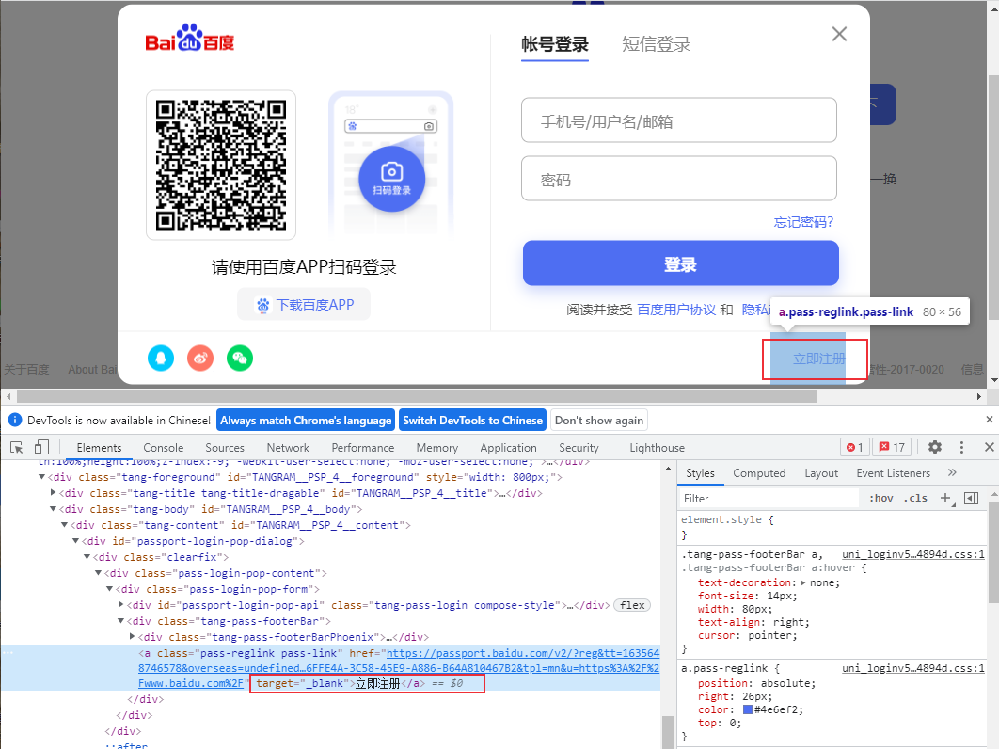
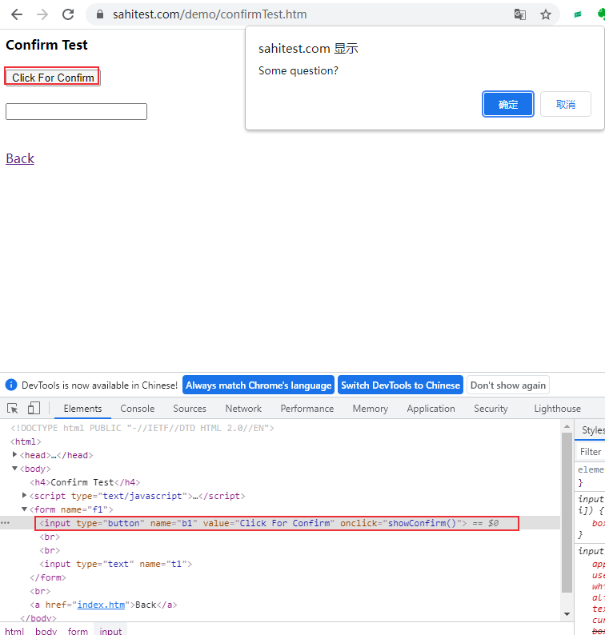

# Web自动化测试之playwright：pages、popup、dialog和frame处理


本文介绍如何使用playwright来处理新页面、frame以及对话框。


## 新页面窗口

获取浏览器上下文产生的新页面，也就是通过 `target="_blank"` 链接打开的新窗口。

```python
with context.expect_page() as new_page_info:
    page.click('a[target="_blank"]') 
new_page = new_page_info.value
new_page.wait_for_load_state()
```

点击【立即注册】会打开一个新的页面：



下面代码实现打开百度，点击登录，进入注册界面

```python
from time import sleep

from playwright.sync_api import sync_playwright

class TestDemo():
    def setup(self):
        playwright = sync_playwright().start()
        self.browser = playwright.chromium.launch(headless=False)
        self.context = self.browser.new_context()
        self.page = self.context.new_page()

    def teardown(self):
        self.browser.close()

    def test_click(self):
        self.page.goto("http://www.baidu.com")

        self.page.click('id=s-top-loginbtn')

        with self.context.expect_page() as new_page_info:
            self.page.click('"立即注册"') # Opens a new tab
        register_page = new_page_info.value

        register_page.wait_for_load_state()
        print(register_page.title())
        # 注册用户名密码
        register_page.fill("id=TANGRAM__PSP_4__userName", "username")
        register_page.fill("id=TANGRAM__PSP_4__phone", "12345678")
        register_page.close()
        sleep(2)

        # 登录用户名密码
        self.page.fill("id=TANGRAM__PSP_11__userName", "username")
        self.page.fill("id=TANGRAM__PSP_11__password", "pwd")
        sleep(2)
```

playwright不像selenium那样在有头模式下可以切换窗口，它默认是无头模式的，直接对对应的页面对象进行操作就可以了。

selenium窗口切换参考 [Selenium switch_to方法](https://blog.csdn.net/u010698107/article/details/111415665)

## 弹框处理
页面中的弹框（popup）是很常见的，处理方法和打开新页面类似：
```python
with page.expect_popup() as popup_info:
    page.click("#open")
popup = popup_info.value

popup.wait_for_load_state()
print(popup.title())
```

## 对话框处理
常见对话框包括alert(), confirm(), prompt()等，默认情况下，Playwright会取消对话框，可以通过在触发对话框之前注册一个对话框句柄：
```python
page.on("dialog", lambda dialog: dialog.accept())
page.click("button")
```

dialog测试地址：[https://sahitest.com/demo/confirmTest.htm](https://sahitest.com/demo/confirmTest.htm)




```python
def test_dialog(self):
    self.page.goto("https://sahitest.com/demo/confirmTest.htm")
    self.page.click('[name="b1"]') # 默认取消对话框

    # 接受对话框
    self.page.on("dialog", lambda dialog: dialog.accept())
    self.page.click('[name="b1"]')
    sleep(5)
```

## frame切换
获取frame方法如下：
```python
# 通过frame的name属性
frame = page.frame('frame-login')
# 通过frame的URL
frame = page.frame(url=r'.*domain.*')
# 通过选择器selector
frame_element_handle = page.query_selector('.frame-class')
frame = frame_element_handle.content_frame()
```


**参考：**

1. [https://playwright.dev/python/docs/frames](https://playwright.dev/python/docs/frames)
2. [https://playwright.dev/python/docs/dialogs](https://playwright.dev/python/docs/dialogs)


