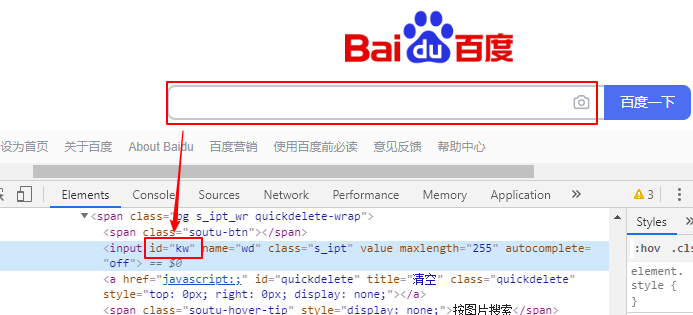
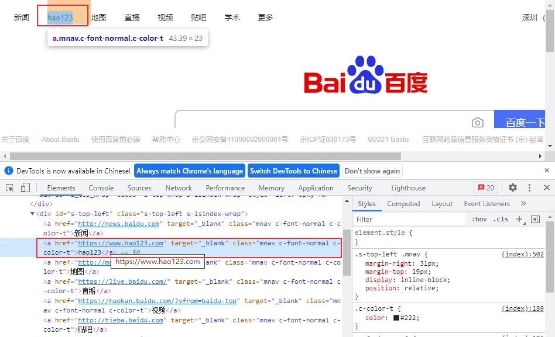
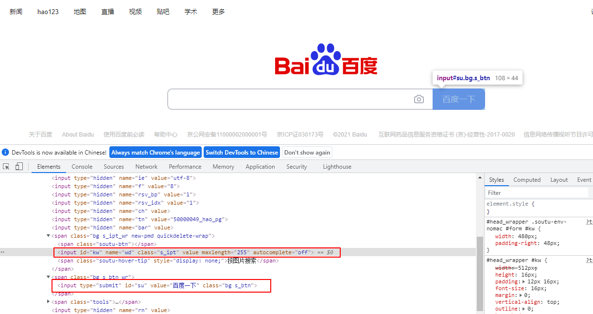

# Web自动化测试之playwright：Web元素定位
要对web页面进行控制，首先需要定位到页面对应的元素，和Selenium一样，playwright也支持多种元素定位方法，下面来介绍它支持的元素选择器。


playwright主要的选择器:

| Locator           | Description                                              |
| :---------------- | :------------------------------------------------------- |
| text                | 文本值       |
| css selector      | CSS 选择器                                               |
| xpath             | xpath表达式                                      |
| React selector              | React选择器                                   |
| Vue selector         | Vue 选择器                                       |
| id, data-testid, data-test-id, data-test | 属性值，只支持这4种属性。其它属性需要通过css方式 |

可以和Selenium对比来看：[Selenium Web元素定位方法](https://blog.csdn.net/u010698107/article/details/111414583) 。

其中Vue selector和React selector目前还是实验性的功能，这里不做更多介绍。

## Text 定位
通过文本值定位


点击【学术】：
```python
page.click('text="学术"')
# 或者
page.click('"学术"')
```

## 属性值定位
只支持id, data-testid, data-test-id, data-test这4种属性值，其它属性需要使用css表达式。



```python
page.fill("id=kw", "test")
page.click("id=su")
```
其它属性值定位：
```python
page.fill('css=[id="kw"]', "test")
page.fill('css=[class="s_ipt"]', "test")
page.fill('css=[name="wd"]', "test")
# 也可以简化为
page.fill('[id="kw"]', "test")
page.fill('[class="s_ipt"]', "test")
page.fill('[name="wd"]', "test")
```

## xpath定位

xpath 定位语法介绍可参考：[Web自动化测试：xpath & CSS Selector定位](https://blog.csdn.net/u010698107/article/details/111415888) 。


使用xpath定位上图中的【资讯】：
```python
page.click('//*[@id="s_tab"]//a[2]')
```

## css selector 定位
### CSS常规用法

css selector 定位语法介绍可参考：[Web自动化测试：xpath & CSS Selector定位](https://blog.csdn.net/u010698107/article/details/111415888) 。


点击【资讯】：
```python
page.click("#s_tab a:nth-child(2) + a")
```

### 定位可见元素

```python
page.click("button:visible")
page.click("button >> visible=true")
```

### 伪类：`:has() `
父元素包含某个子元素



```python
page.click("#s-top-left:has(a) > a:nth-child(2)")
```

### 伪类：`:is() `
选择其中任何一个元素，点击【新闻】

```python
page.click(':is(a:has-text("新闻"), a:has-text("News"))')
```
## 通过页面布局定位元素

Playwright可以通过页面布局来定位元素，下面来定位输入框右边的【百度一下】


```python
page.click('input:right-of(#kw)')
```

主要包括以下5种用法：

- `:right-of(inner > selector)` - 匹配 inner selector的任意右边元素
- `:left-of(inner > selector)` - 匹配inner selector左边元素
- `:above(inner > selector)` - 匹配inner selector上面的元素
- `:below(inner > selector)` - 匹配inner selector下面的元素
- `:near(inner > selector)` - 匹配inner selector附近 ( 50 pixels以内) 的元素。

## 组合定位
文本定位方法可以和css、xpath等方法组合

```python
page.click('css=[class="bg s_btn"] >> text=百度一下')
page.click('#s-top-left:has(a) >> text=hao123')
page.click('//*[@id="s_tab"]//a >> text=资讯')

```

## 定位第n个元素：`:nth-match()`
如果定位到多个元素需要选择其中某一个，可以使用`:nth-match()`，索引从1开始。


点击【hao123】:
```python
page.click(':nth-match(#s-top-left > a, 2)') # 点击匹配到的第2个元素
```
注意：和 `:nth-child()` 不同之处在于，`:nth-match()`匹配的元素可以不是邻居关系。


## 完整测试代码

```python
from time import sleep

from playwright.sync_api import sync_playwright

class TestLocator():
    def setup(self):
        playwright = sync_playwright().start()
        self.browser = playwright.chromium.launch(headless=False)
        self.context = self.browser.new_context()
        self.page = self.context.new_page()

    def teardown(self):
        self.browser.close()

    def test_text(self):
        self.page.goto("https://www.baidu.com/")
        # self.page.click("text=学术")
        self.page.click('"学术"')
        sleep(5)

    def test_id(self):
        self.page.goto("https://www.baidu.com/")
        # self.page.fill("id=kw", "test")
        # self.page.fill('css=[id="kw"]', "test")
        # self.page.fill('css=[class="s_ipt"]', "test")
        self.page.fill('[class="s_ipt"]', "test")
        # self.page.fill('css=[name="wd"]', "test")
        # self.page.click('css=[class="bg s_btn"] >> text=百度一下')
        self.page.click("id=su")
        sleep(5)

    def test_xpath(self):
        self.page.goto("https://www.baidu.com/")
        self.page.fill("id=kw", "test")
        self.page.click("id=su")
        sleep(2)
        self.page.click('//*[@id="s_tab"]//a[2]')
        # self.page.click('//*[@id="s_tab"]//a >> text=资讯')
        sleep(5)

    def test_css_selector(self):
        self.page.goto("https://www.baidu.com/")
        self.page.fill("id=kw", "test")
        self.page.click("id=su")
        sleep(2)
        self.page.click("#s_tab a:nth-child(2) + a")
        sleep(5)

    def test_css_has(self):
        self.page.goto("https://www.baidu.com/")
        self.page.click('#s-top-left:has(a) > a:nth-child(2)')
        # self.page.click('#s-top-left:has(a) >> text=hao123')
        sleep(5)

    def test_css_is(self):
        self.page.goto("https://www.baidu.com/")
        sleep(2)
        self.page.click(':is(a:has-text("新闻"), a:has-text("News"))')
        sleep(5)

    def test_layout(self):
        self.page.goto("https://www.baidu.com/")
        sleep(2)
        self.page.fill("id=kw", "test")
        self.page.click('input:right-of(#kw)')
        sleep(5)

    def test_nth_march(self):
        self.page.goto("https://www.baidu.com/")
        sleep(2)
        self.page.click(':nth-match(#s-top-left > a, 2)')
        sleep(5)
```


## 总结
playwright和Selenium的元素定位方法有相似之处，因为都是对相同的WEB页面元素进行定位，所以差别不大，区别在于它们的定位方式，Selenium对每种选择器提供了对应的方法，而playwright只需要写定位表达式就可以了，不需要指定具体方法。从这一点来看，playwright是非常方便的。

