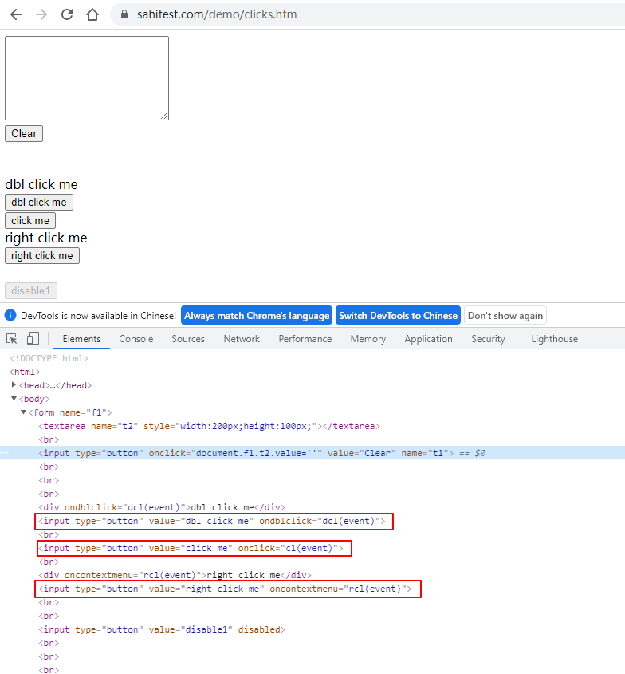
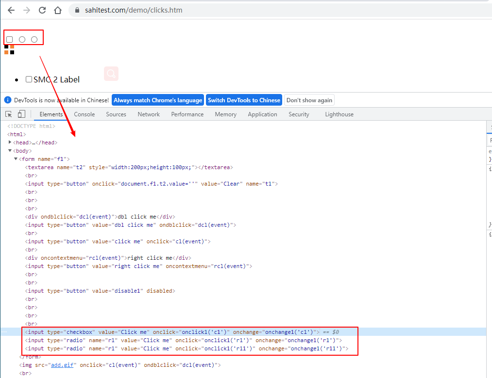
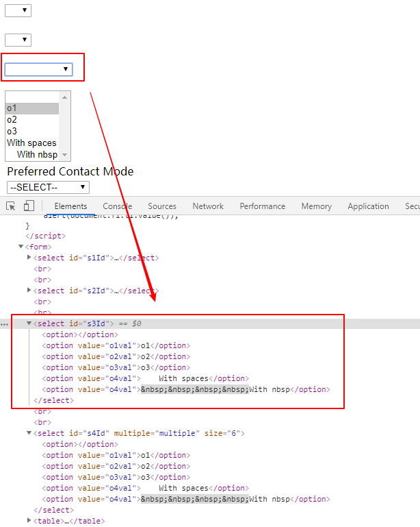
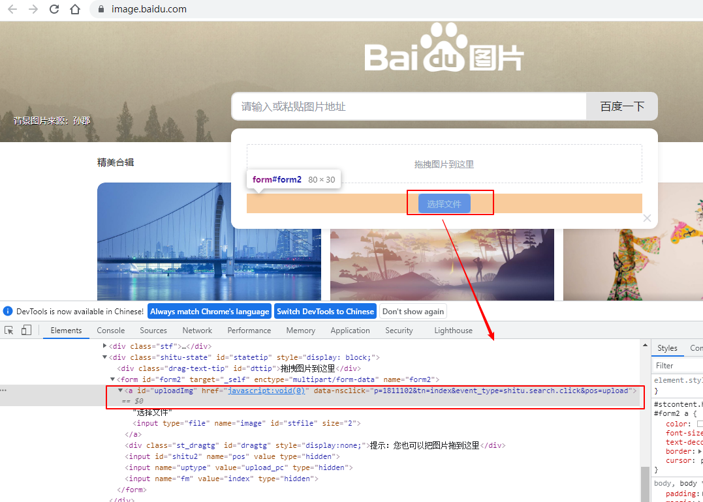

# Web自动化测试之playwright：Web元素操作
定位到元素后就可以对其进行某些操作，比如输入文本，点击，获取属性等，本文来介绍playwright提供的元素操作方法。

<!--more-->

## 文本输入
文本输入使用 `fill`方法：

```python
page.fill("id=kw", "test")
```

## 模拟键盘输入
1、一个字符一个字符的输入，模拟真实的键盘输入

- `page.type("id=kw", "playwright")`
- `page.type("id=kw", "playwright", delay=100)`: 每个字符延迟100ms输入

2、模拟按键
支持各种键盘事件，比如Tab、Delete、Enter、PageDown、PageUp、F1 - F12、0-9、A-Z等
- `page.press("id=kw", '@')` :  模拟键盘输入 `@` 符号
- `page.press("id=kw", 'Control+A')`：Control+A
- `page.press('id=kw', 'Enter')`：点击回车

测试百度搜索：
```python
def test_press(self):
    self.page.goto("https://www.baidu.com/")
    self.page.type("id=kw", "playwright", delay=100)
    self.page.press("id=kw", '@')
    self.page.press("id=kw", 'Control+A')
    self.page.press("id=kw", 'Delete')
    self.page.press("id=kw", "Control+Z")
    self.page.press('id=kw', 'Enter')
    sleep(5)
```


## 点击
包括以下几种鼠标操作方法：

- 左键点击：`page.click("id=su")`
- 点击元素左上角：`page.click('id=su', position={'x': 0, 'y': 0})`
- Shift + click：`page.click("id=su", modifiers=['Shift'])`
- 强制点击：`page.click("id=su", force=True)`
- 右键点击：`page.click("id=su", button='right')`
- 双击：`page.dblclick("id=su")`
- 悬停在元素上：`page.hover('id=su')`

测试下面的页面，测试页面地址：[https://sahitest.com/demo/clicks.htm](https://sahitest.com/demo/clicks.htm)


```python
from time import sleep

from playwright.sync_api import sync_playwright

class TestInput():
    def setup(self):
        playwright = sync_playwright().start()
        self.browser = playwright.chromium.launch(headless=False)
        self.context = self.browser.new_context()
        self.page = self.context.new_page()

    def teardown(self):
        self.browser.close()

    def test_click(self):
        self.page.goto("https://sahitest.com/demo/clicks.htm")
        self.page.click('"click me"')
        self.page.dblclick('"dbl click me"')
        self.page.click('"right click me"', button='right')
        self.page.click('"right click me"', modifiers=["Shift"])
        self.page.hover('"Clear"')
        self.page.hover('"Clear"')
        self.page.click('"Clear"', position={'x': 0, 'y': 0})
        sleep(5)
```
## Checkbox、Radio操作
使用 `check` 和 `uncheck` 来勾选或者取消勾选 Checkbox 和 Radio 。

- 勾选：`page.check('#agree')`
- 取消勾选：`page.uncheck('#agree')`
- 判断是否勾选：`page.is_checked('#agree')`

测试页面地址：[https://sahitest.com/demo/clicks.htm](https://sahitest.com/demo/clicks.htm)


```python
def test_checkbox_radio(self):
    self.page.goto("https://sahitest.com/demo/clicks.htm")

    # checkbox
    self.page.click('[type="checkbox"][value="Click me"]') # 点击checkbox
    self.page.check('[type="checkbox"][value="Click me"]') # 勾选checkbox

    assert self.page.is_checked('[type="checkbox"][value="Click me"]') is True
    self.page.uncheck('[type="checkbox"][value="Click me"]') # 取消勾选checkbox

    # radio
    self.page.check(':nth-match([type="radio"], 1)') # 勾选radio
    sleep(2)
    self.page.click(':nth-match([type="radio"], 2)') # 点击radio
    sleep(5)
```

## select选项
使用 `select_option()` 方法对 `<select>` 元素进行操作：

- `page.select_option('select#colors', 'blue')` ：单选，通过 value 值进行选择
- `page.select_option('select#colors', label='Blue')`：单选，通过 label 值进行选择
- `page.select_option('select#colors', vaule=['red', 'green', 'blue'])`：多选，通过 value 值进行选择
- `page.select_option('select#colors', label=['Red', 'Green', 'Blue'])`：多选，通过 label 值进行选择

测试页面地址：[http://sahitest.com/demo/selectTest.htm](http://sahitest.com/demo/selectTest.htm)



```python
def test_select(self):
    self.page.goto("http://sahitest.com/demo/selectTest.htm")
    self.page.select_option('select#s3Id', 'o1val') # 单选，通过value选择
    self.page.select_option('select#s3Id', label='o2') # 单选，通过label选择
    self.page.select_option('select#s4Id', value=['o1val','o2val','o3val'])
    self.page.select_option('select#s4Id', label=['o1','o2','o3'])
    sleep(5)
```
## 上传文件
使用 `set_input_files` 方法来上传文件：

- `page.set_input_files('input#upload', 'myfile.pdf')`：上传单个文件
- `page.set_input_files('input#upload', ['file1.txt', 'file2.txt'])`：上传多个文件
- `page.set_input_files('input#upload', [])`：移除选择的文件

上传图片：



```python
def test_upload_files(self):
	self.page.goto("https://image.baidu.com/")
	self.page.click("id=sttb")
	self.page.click("id=uploadImg")
	self.page.set_input_files('id=stfile', 'd://test.jpg')
	sleep(5)
```

## 截图

1、截取当前页面

```python
page.goto("https://www.baidu.com/")
# 方法1
page.screenshot(path="screenshot1.png")
# 方法2
page.screenshot(path="screenshot2.png", full_page=True)
# 方法3:
screenshot_bytes = self.page.screenshot()
open("screenshot3.png", "wb").write(screenshot_bytes)
```

2、截取指定元素

截取【百度一下】

```python
element_handle = self.page.query_selector("id=su")
element_handle.screenshot(path="baidu.png")
```

## 获取、判断元素属性及状态

1、读取属性：`get_attribute(selector, attr_name)`

断言【百度一下】的type属性：

```python
attr_value = self.page.get_attribute("id=su", "type")
assert attr_value == "submit"
```

2、元素是否可见：`is_visible(selector)`

```python
visible = self.page.is_visible("id=su")
assert visible
```

3、元素是否可用：`is_enabled(selector)`

```python
enabled = self.page.is_enabled("id=su")
assert enabled
```

4、是否勾选：`page.is_checked(selector)`

```python
assert page.is_checked(selector) is True
```

5、inner text判断

百度一下首页【hao123】

```python
text = page.inner_text('#s-top-left:has(a) > a:nth-child(2)')
assert text == "hao123"
```

6、文本内容判断

```python
content = page.text_content('#s-top-left:has(a) > a:nth-child(2)')
assert content == "hao123"
```


**参考：**

1. [https://playwright.dev/python/docs/input](https://playwright.dev/python/docs/input)
2. [https://playwright.dev/python/docs/screenshots](https://playwright.dev/python/docs/screenshots)


